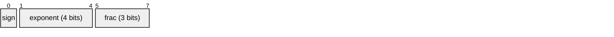
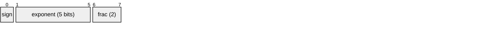
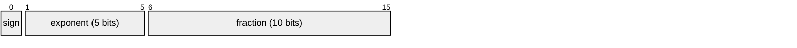
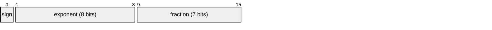
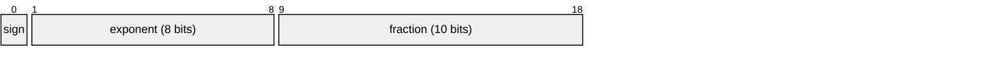
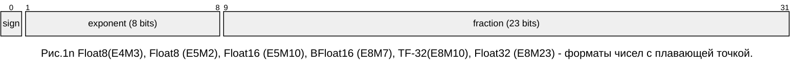
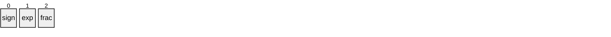
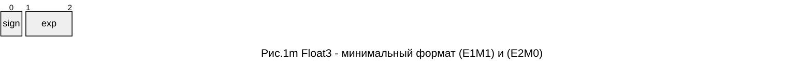
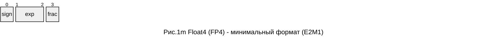

Математика для машинного обучения
=================================


* [PREV: математические классы](MATHAN.md)
* [PREV: сведения из теории вероятностей](PROB.md)
* [PREV: Цифровая обработка сигналов](DSP.md)
* [PREV: Квантование и дискретная математика](QUANT.md)
* [Квантизация моделей: рациональные и действительные числа](#рациональные-числа-и-действительные-числа)
* [Типы нейронных сетей](#типы-нейронных-сетей)

## Квантизация

*{Ввести оператор квантования. Оператор повышения и понижения разрядности.}*

Под квантизацией понимают представление чисел в формате чисел с плавающей точкой меньшей разрядности мантиссы или в целых числах. 

## Рациональные числа и действительные числа

*{Этот раздел чтобы дать понять, что архитектуру надо проектировать с учетом ошибок квантования, выбор операций и форматов данных основан на понимании, как учитывать и компенсировать ошибки. Оптимизация вычислений может быть выполнена на базе рациональных чисел и двоичных дробей, чисел с фиксированной точкой. Вычисления в рациональных дробях не создают ошибку квантования. Учет и компенсация ошибок округления очень важны, когда речь идет о точности математической модели. }*

Множество действительных чисел мы будем рассматривать, как композицию из двоичной экспоненты и рационального числа. Над рациональными числами в таком виде. 
- $A/B$, где $A,B\in [0,2^L)$ - множество рациональных чисел (дроби)
- $A/2^M$, где $A\in [0,2^L)$ - множество действительных чисел (с фиксированной точкой, двоичная дробь);
- $\pm A/2^M \cdot 2^n$, где $A\in [0,2^M)$ - множество действительных чисел (с плавающей точкой, ненормальные);
- $\pm A/2^M \cdot 2^n$, где $A\in [2^M,2^{M+1})$ - нормализованные действительные числа.

Заметим, нормализованные числа не содержат ноль (0). Кодирование нуля, и бесконечности происходит специальными константами. 
Над константами $\{-\infty, 0,+\infty\}$ можно вводить специальную арифметику: $\infty+x = \infty$; $\infty*x = \infty$; $x/\infty = 0$; и т.д.

Для множества вещественных чисел мы можем определить подмножества и операции над подмножествами.
Подмножество будет выделяться разрядностью констант (M, n). В таблице приведены константы определенные для вещественных чисел в соответствии со стандартом Си и [IEEE Std. 754-2019]. 
| тип | мантисса | $E_{min}$ | $E_{max}$ | $E_{bias}$
|:----|----:|----:|---:|---:
| E4M3     |  3 | -6   | +7  | 7
| E5M2     |  2 | -14  | +15 | 15
| binary16 | 16 | -14  | +15 | 15
| binary32 | 24 | -127 | +126
| binary32x| 32 | 
| binary64 | 53 | 
| binary64x| 64 | 
| binary128|113 | 

Внешнее представление чисел с плавающей точкой







В настоящее время разрабатываются форматы группы binary8, с различной разрядностью мантиссы (0..7). [IEEE SA Working Group P3109]. В системе команд Intel AVX10.2 присутствуют форматы binary8 (E5M2) and (E4M3).


Операции с вещественными числами **FloatN** создают ошибку. Мы будем рассматривать ошибку, которая возникает в процессе нормализации точно так же, как рассматривали ошибку при квантовании в целых числах. Учет ошибок это единственная возможность вытянуть слабый сигнал. Ошибку мы рассматриваем на примере операций сложения и умножения. Упаковку формата вещественных чисел (с потерей точности) для внешнего представления можно кодировать в форме (S,E,M) - разрядность экспоненты (E), мантиссы (M) и наличие знака (S). 




Минимальный формат позволяет выполнить кодирование в числах $\{-1,0,+1\}$. Спецальный код используется для кодирования $\pm\infty$ (s_11) и $\pm{0}$
(s_00)


Минимальный формат FP4 (E2M1) используется для сжатия моделей LLM. 


Converts brain16 to float32.
```
 bfloat16 floating point format:
	┌sign
	│   ┌exponent
	│   │      ┌mantissa
	│┌──┴───┐┌─┴───┐
  0b0000000000000000 brain16
 ```
 
Since bf16 has the same number of exponent bits as a 32bit float,
encoding and decoding numbers becomes relatively straightforward.
 
 ```
   ┌sign
   │   ┌exponent
   │   │      ┌mantissa
   │┌──┴───┐┌─┴───────────────────┐
 0b00000000000000000000000000000000 IEEE binary32
```
For comparison, the standard fp16 format has fewer exponent bits.
```
   ┌sign
   │  ┌exponent
   │  │    ┌mantissa
   │┌─┴─┐┌─┴──────┐
 0b0000000000000000 IEEE binary16
```

*Ошибка сложения*

$$R = A\cdot 2^{e_1} + B\cdot 2^{e_2} = (A + B\cdot 2^{(e_2 - e_1)}) \cdot 2^{e_1}$$

Если $|e_2 - e_1|\geq 2^M$ - возникает потеря точности, иначе можно сформировать остаток после нормализации числа. Точное представление чисел возможно в рациональных дробях или числах с фиксированной точкой. Если бы мы говорили про проектирование новой архитектуры для нейронных сетей, следовало бы рассматривать реализацию операций с накоплением и компенсацией ошибки округления. 

*Умножение с накоплением*

Следовало бы говорить об операции сложения и умножения "diffused", где операция сложения и умножения выполняется на аккумуляторе с большей разрядностью и определенными правилами округления остатка при нормализации. Чтобы правильно выполнять операцию свертки и скалярного произведения, суммы ряда, необходимо сохранять в аккумуляторе ошибку округления и применять на следующей операции. В современных процессорах представлены операции "fused multiply-accumulate", (сокр. FMA, совмещенные операции умножения с накоплением) и подобные им векторные операции с горизонтальным суммированием результата. Подобные операции (dot, mix, fma)  как раз ориентированы на применение в сверточных нейронных сетях.

Тенденция упаковки коэффициентов и векторов моделей сохранится. Модели должны масштабироваться в плане разрядности арифметики и давать возможность получать сравнимые по точности результаты за счет правильного учета остатков при квантизации. В отношении моделей также можно применять термин квантование модели, подразумевая разрядность коэффициентов для внешнего представления данных. 

*Ошибка умножения*
Умножение увеличивает разрядность операций. Так если мы умножаем число Float32 с разрядностью M=23 бита, то результат будет $2^M+1$ бит. 

*Эмуляция операции умножения действительных чисел*. Числа при умножении представляем в виде дроби:

$$\left(1+\frac{A}{2^M}\right) \cdot \left(1+\frac{B}{2^M}\right) \cdot 2^{e_1+e_2} = 
\left(2^M + (A+B) + rn\left[\frac{AB}{2^{M}}\right]\right) \cdot 2^{e_1+e_2-M}$$
где rn - функция округления. $rint(x) = floor(x+0.5)$

В остаток уходит величина r, полагая округление методом floor, в меньшую сторону.

$$Q = \left\lfloor\frac{AB}{2^M}\right\rfloor,\quad R = \frac{AB}{2^M} - Q$$

Например, если операция в целых числах использует 32 битные числа, то результат умножения с накомплением будет помещаться в число удвоенной разрядности. Если заранее известно, что сумма коэффициентов дает 2^M то результат свертки всегда будет помещатья в разрядность $2^M$. Но при этом вычисления должны производится на числах удвоенной разрядности с понижением разрядности результата. 

При вычислениях нормированных функций мы работает в диапазоне значений [0,1]. При такой постановке выгоднее с точки зрения производительности переводить числа в правильные двоичные дроби. Это может быть не так просто с точки зрения реализации алгоритма. 

*Правильные дроби*. Когда мы работаем с вероятностями мы используем подмножество чисел с плавающей точкой - вероятности положительно определенные функции на интервале [0,1]. Сумма вероятностей должна давать единицу. В этом смысле мы могли бы вероятности представлять в виде дробей $A_k/B$, где $A_k \in [0,B]$, $\sum\limits_k {A_k}=B$

Предлагаю в качестве упражения реализовать класс полиномы с коэффициентами $A_k \in [0,2^N)$, которые в сумме дают $2^N$. Над полиномами определена операция умножения. Кроме того, нам понадобится функция поиска обратного числа для любого элемента множества, такого что $(A\cdot\bar{A})/2^N=1$

## Алгоритмы повышения разрядности

Допустим на аппаратной платформе нам доступна только операция одинарной точности. Для замещения операции с двойной точностью можно использовать два числа с одинарной точностью таким образом чтобы результат операции $a+b = s + r$, давал сумму и остаток (s, r). 

Алгоритм сложения, Dekker [10]
```
Add12 (a,b):
	s = a ⊕ b
	v = s ⊖ a
	r = b ⊖ v
	return(s,r)
```
Алгоритм сложения, Д.Кнут [9]
```
Add12 (a,b):
	s = a ⊕ b
	v = s ⊖ a
	r =(a ⊖(s ⊖ v)) ⊕ (b ⊖ v)
	return(s,r)
```
* [9] D. Knuth. The Art of Computer Programming, volume 2, ”Seminumerical Algorithms”. Addison Wesley, Reading, MA, third edition edition, 1998.
* [10] T.J. Dekker. A floating point technique for extending the available precision. Numerische
Mathematik, 18(3):224–242, 1971.
* [11] Dominik Goddeke, Robert Strzodka, and Stefan Turek. Accelerating double precision fem simulations with GPUs. In Proceedings of ASIM 2005 - 18th Symposium on Simulation Technique,
September 2005.

```
Add22 (ah,al) , (bh,bl)
	r = ah ⊕ bh
	if |ah| ≥ |bh| then
		s = (((ah ⊖ r) ⊕ bh) ⊕ bl) ⊕ al
	else
		s = (((bh ⊖ r) ⊕ ah) ⊕ al) ⊕ bl
	(rh,rl) = add12(r,s)
	return(rh,rl)
```
Алгоритм разбиения числа на два меньшей разрядности Dekker [10]
```
SPLIT (a):
	c = (2^s ⊕ 1) ⊗ a
	a_big= c ⊖ a
	a_hi = c ⊖ a_big
	a_lo = a ⊖ a_hi;
	return (a_hi, a_lo)
```

Алгоритм умножения с остатком (Dekker [10])
```
Mul12 (a, b):
	x = a ⊗ b;
	(a_hi, a_lo) = SPLIT(a);
	(b_hi, b_lo) = SPLIT(b);
	err =   x ⊖ (a_hi ⊗ b_hi)
	err = err ⊖ (a_lo ⊗ b_hi)
	err = err ⊖ (a_hi ⊗ b_lo)
	y = (a_lo ⊗ b_lo) ⊖ err
	return (x,y)
```
Если на платформе аппаратно поддерживается операция fused-multiply-accumulate (FMA), то умножение может быть выполнено быстрее
```
FMA_mul12 (a,b):
	x = a ⊗ b
	y = FMA(a × b − x)
	return (x,y)
```

В алгоритме символы $\oplus, \ominus, \otimes$ означают операции с округлением, одинарной точности.
