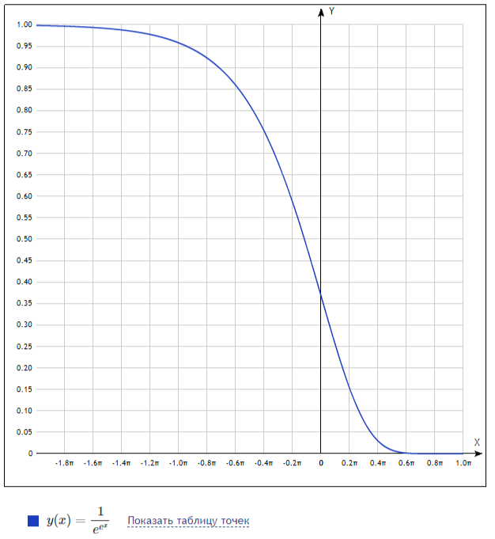

## Использование и обозначение квантизации моделей

Это не окончательный вариант, но он полезен при чтении исходного кода или вывода в консоль, чтобы понять, что обычно означает каждое из этих обозначений.

`<Encoding>_<Variants>`\
`<Encoding>` : Это определяет наиболее распространенную кодировку индивидуальных весов в модели

Форматы с плавающей запятой:
* `F64`: 64-битные числа с плавающей запятой IEEE 754 (1 знаковый бит, 11 бит экспоненты, 52 дробных бита)
* `F32`: 32-битные числа с плавающей запятой IEEE 754 (1 знаковый бит, 8 бит показателя степени, 23 дробных бита)
* `F16`: 16-битные числа с плавающей запятой IEEE 754 (1 знаковый бит, 5 бит - экспонента, 10 бит - мантисса)
* `BF16`:  16-битная Bfloat16 Google Brain усечённая форма 32-битного IEEE 754 (1 знаковый бит, 8 бит показателя степени, 7 дробных бит)
* `HF8` : 8-битные числа с плавающей запятой (`E4M3`), Float8 принятая в системе команд AVX10.2, поддержка INF и NaN
* `E4M3`: 8-битная квантизация может быть в варианте `E4M3FN` и сопровождаться общей нормировкой. 
* `E5M2`: 8-битная квантизация Bfloat8 Google Brain усечённая форма 16-битного IEEE 754 (1 знаковый бит, 8 бит показателя степени, 7 
дробных бит)
* `MXFP8`: Квантизация с пониженной разрядностью E4M3 с общей экспонентой. 
* `MXFP4`: Квантизация с пониженной разрядностью E2M1 с общей экспонентой. 

Целочисленные форматы:
* `I<X>`: X бит на единицу веса, где X может быть 4 (для 4 бит) или 8 (для 8 бит) и т. д...
Квантованные форматы:
* `Q<X>`: X бит на единицу веса, где X может быть `4` (для 4 бит),`5`,`6`  или `8` (для 8 бит) и т. д...
* `KQ<X>`: (или `Q<X>_K`) модели на основе k-квантов. `X` бит на весовой коэффициент, где `X` может быть `4` (для 4-бит), `5`,`6` или `8` (для 8-бит) и т. д...
* `IQ<X>`: модели на основе `i`-квантов. `X` бит на вес, где `X` может быть `4` (для 4-бит) или `8` (для 8-бит) и т. д...
* `TQ<X>`: модели с тернарными весовыми коэффициентами

`<Variants>`Это различные стратегии упаковки квантованных весов в файл формата [gguf](/ggerganov/gguf). 

Следует отметить некоторую особенность использования форматов данных при запуске и исполнении моделей. Внутреннее представление модели может быть различным. Модели в высоком разрешении исполняются и сохраняются в памяти в формате Float32.Для повышения производительности на GPU внутреннее представление коэффициентов весовых матриц и векторов может быть представлено в формате Float16 или BFloat16. Внутреннее представление коэффициентов завязано на конкретные операции, такие как активация и нормализация слоя. Результатом активации может быть вектор `F32`(Float32) или `F16`. А вот матрица коэффициентов может храниться и применяться без изменения формата данных, т.е. операция над вектором состояния может быть представлена как произведение коэффициентов матрицы в формате `Q8_1` на состояние в формате `Q8_1` или `F16`. Внутренне представление коэффициентов Может быть представлено в целых или рациональных числах. Так, например, формат `Q8_1` представляет собой набор весовых коэффициентов в формате `int8_t` и отдельно рассчитанный нормировочный коэффициент в формате `float`. Альтернативный способ хранения может содержать нормировочный коэффициент и минимальное (среднее) значение. Исполнение моделей на CPU и используемый при этом формат представления тензоров зависит от поддерживаемой системы команд процессора, формат выбирается исходя из наличия в системе команд тех или иных векторных инструкций. 

**Расширения системы команд AVX2, AVX-512, AMX**

На платформе `x86` относительно высокая производительность модели на GPU может быть получена в системе команд с разрядностью векторных регистров 512 бит:
* `AVX512F` -- поддержка инструкций FMA для чисел Float32.
* `AVX512VL` -- Поддержка всего набора для векторов VL=128 и VL=256
* `AVX512_FP16` -- поддержка операций Float16, и операций _fma_ векторов (Intel Xeon Scalable Gen4).
* `AVX512_BF16` -- поддержка операций конвертации BFloat16 и скалярного произведения.
* `AVX512_IFMA` -- поддержка операций Fused-Multiply-Accumulate в целых числах
* `AVX512_VNNI` -- поддержка инструкций малой разрядности для нейронных сетей
* `AVX10.1` -- Этот же набор расширений может быть представлен в системах команд для векторов 256 бит.
* `AVX10.2` -- новая система команд с поддержкой форматов HF8, BF8, FP16, BF16 и скалярного произведения FP16
* `AVX-VNNI` -- поддержка инструкций малой разрядности для нейронных сетей на процессорах без AVX512
* `AVX-NE-CONVERT` -- операции преобразования форматов bf16, fp16 в режиме AVX 256-бит

Минимальная поддержка с нейронными сетями включает систему команд `AVX2` и `F16C`.
Умножение целочисленных квантов строится с использованием 8-битных операций _dot product_ над целыми числами 8-бит.  
Операции _dot product_ представлены в системе команд `AVX-VNNI`, `AVX512_VNNI` и `AVX512_BF16` 

Минимальная поддержка для гибридных CPU без AVX512 (Alder Lake, RaptorLake):`AVX2` `F16C` `AVX-VNNI`

На процессорах AMD Zen4, Zen5 поддерживаются инструкции AVX-512: `AVX512F`, `AVX512_VNNI`, `AVX512_BF16` `AVX-VNNI`

Набор инструкций для моделей без AVX512 (Arrow Lake):
`AVX-VNNI` `AVX-IFMA`  `AVX-VNNI-INT8` `AVX-NE-CONVERT` `AVX-VNNI-INT16`

На серверных платформах добавляется поддержка матричных инструкций `AMX` и `AVX512`:
* (Sapphire Rapids, Xeon Gen 4): 
    + `AVX512_VNNI` `AVX512_FP16` `AVX512_BF16`;
    + `AVX-VNNI`;
    + `AMX-INT8` `AMX-BF16` `AMX-TILE`;
* (Granite Rapids, Xeon Gen 6), AVX10.1: 
    + `AVX512_VNNI` `AVX512_FP16` `AVX512_BF16`;
    + `AVX-VNNI`;
    + `AMX-INT8` `AMX-BF16` `AMX-TILE` `AMX-FP16`;
* (Diamond Rapids), AVX10.2: 
    + `AVX512_VNNI` `AVX512-FP16` `AVX512_BF16`;
    + `AVX-VNNI` `AVX-IFMA` `AVX-VNNI-INT8` `AVX-NE-CONVERT` `AVX-VNNI-INT16`;
    + `AMX-INT8` `AMX-BF16` `AMX-TILE` `AMX-COMPLEX` `AMX-FP16` `AMX-FP8` `AMX-TF32` `AMX-AVX512`

> AVX10 предлагает новый способ идентификации расширений, `AVX10.2` вводит множество инструкций над FP8

**Поддержка FP8 и режимы округления**

Intel® AVX10.2 dot product instructions, upconverts and downconverts are supported. The down converts
have two flavors: *RNE* and *BIAS*, which indicate the rounding modes.
* FP rounding: Excluding the *BIAS* downconverts, all instructions use RNE (Round to nearest tie to even) rounding mode. The *BIAS* downconverts use RNE in case the input is denormal and truncate (round towards zero) for normal input.
* Denormal Handling: All instructions function as if FP exceptions are masked. For any type of input,
instructions behave as if MXCSR.DAZ is not set. For FP8 output type, instructions behave as if
MXCSR.FTZ is not set. For any other type of output, instructions behave as if MXCSR.FTZ is set.

Минимальная поддержка с нейронными сетями включает систему команд `AVX2` и `F16C`, умножение квантов строится с использованием 8-битных операций _dot product_ над целыми числами.  
Операции _dot product_ представлены в системе команд `_VNNI`, `_BF16` 

Даже при использовании NPU или GPU важным параметром является производительность операций с целыми квантами и возможность налету выполнять нормализацию и квантизацию векторов.
Промежуточные результаты умножения матриц приводятся к `F32`, `BF16`, `FP16`, или внутренним целочисленным квантам `Q8` или `Q8_K`. При обучении моделей используется понятие обратной ошибки и градиента. В случае обучения моделей на   результатом квантизации является пара значений - квант и градиент учитывающий ошибку округления. При квантизации в вещественные числа может использоваться специальная техника компенсации ошибки округления `stochastic rounding`.

Квантизация весовых коэффициентов `BF16` допускает использование квантов `Q8` и `Q6_K`, без ощутимой потери качества. Весовые коэффициенты `FP8` можно представить в квантах `Q4_K`. Отдельно выделяются модели с тернарными весовыми коэффициентами, которые могут быть представлены в квантах `Q2` или `TQ2`. Вычисления с учетом целочисленной квантизации выполняется на операциях _dot product_ и _mma_ на тензорных ядрах или NPU. В системе команд x86 базовой является операция _dot product_ над `int8` в системе команд `AVX-VNNI` - умножение 8 битных коэффициентов, и операция _dot product_ над `BF16`. 

Комплексная поддержка может включать `AMX` инструкции матричного умножения в квантах `Q8`, `FP8`, `BF16`, `FP16` на процессорах с NPU. Матричные операции раскладываются на блочные операции по плитке 16x16. API должно позволять выполнять разложение матричных операций на блоки `tile`. Основная ресурсоемкая операция при расчете нейросетей - GEMM - матричное умножение общего вида, умножение матрицы на вектор, в частности. Матричное умножение должно выполняться на целых квантах или квантах FP8 - пониженной разрядности. 

Использование коэффициентов `BF16` в чем-то близко по качеству к `Q8_0` и `Q8_1`. Качество моделей `F16` заведомо выше, поскольку в формате `F16` разрядность мантиссы выше, чем разрядность `Q8` и `BF16`. Представление в рациональных числах может дать заметный выигрыш и по качеству и по производительности операций, в случае если аппаратно поддерживается операция скалярного произведения векторов _dot-product_ и сложение с накоплением _fma_, без потери точности при сложении.

Локальный запуск модели, предполагает первоначальный выбор типа квантизации модели по качеству. Модели публикуются в квантах `BF16` и `FP8`. 

На GPU представление коэффициентов может быть `Q8_1`, или `F16`, варианты представления включают общую нормировку по вектору 32 элемента или по плитке 256 элементов. Тензорные ядра допускают выполнение матричных операций над BF16, FP16, и целыми кванами {`u8`,`i8`}. 

На архитектуре GPU эффективно выполняются операции групповые, такие как нахождение среднего значения, fma, максимума, минимума и суммы, т.н операции редуцирования по вектору. Операция нахождения скалярного произведения также использует редуцирование по группе. В векторной системе команд операции редуцирования выполняются неэффективно за время O(log(N)). Матричные операции выполняют групповые операции над векторами. 

### Целочисленные Q-кванты

```math
v_j = d \cdot q_{j} - b
```
Операция _dot product_ (`Qn_1` x `Q8_0`) выражается в целых числах
```math
dot(v,u) = \sum v_{j}u_{j} = d_v\cdot d_u \left( \sum_j^{N}q^{(v)}_{j} \cdot q^{(u)}_{j} \right) - b^{(v)}d_u \sum_j^{N} q^{(u)}_{j}
```


### Целочисленные K-кванты

Приведем математическое описание квантов. Квантизация `Q#_K` разбивает данные на блоки по 256 значений. Блок может содержать общий масштабный коэффициент и смещение, в формате `F16`. Кроме того, на каждые 16 значений применяются целочисленные масштабные коэффициенты 8 бит. 

```math
v_{i,j} = d \cdot s_i \cdot (q_{ij} - b_i) 
```
-- для целых квантов со смещением нуля $b_i$. Значения $s_i$ заданы в целых числах `u8`. 

Например, для квантизации `Q6_K`, значения $q_{ij}$ - шести-битные целые без знака, смещение $b_i$ - константа (32). При вычислении скалярного произведения или умножения вектора на матрицу, вектор представляется в формате Q8_K со заком, и нулевым смещением. 
Операция _dot product_(`Qn_K` x `Q8_K`) выражается в целых числах
```math
dot(v,u) = \sum v_{i,j}u_{ij} = d_v\cdot d_u\sum_i^{M} s^{(v)}_i s^{(u)}_i \left(\left( \sum_j^{N}q^{(v)}_j \cdot q^{(u)}_j \right) - b^{(v)}_i \sum_j^{N} q^{(u)}_{ij}\right)
```
При этом значения суммы квантов (второе слагаемое) может быть рассчитано заранее. 

### Целочисленные MX-кванты с общей экспонентой

Вещественное число в формате с плавающей точкой можно разложить в ряд
```math
v_i = 2^e q_i + r_i
```
где $q_i$ - целочисленные кванты.

### T-кванты с тернарными весами 

```math
v_j = d \cdot (q_{j} - 1), 
```
где $q_i$ принимают значения $q_i \in \{0,1,2\}$, значения представлены векторами `u2`.

### Применение различных квантизаций

Нейросеть состоит из множества слоев, каждый из которых раскладывается, как граф тензорных операций. Помимо матричных операций, в графе присутствуют нормировки и нелинейные операции. Отдельно можно рассматривать ассоциативную память. Каждый элемент определяется весовыми коэффициентами. Квантизация для FFN и для механизма внимания выбирается раздельно. Отдельно выбирается квантизация для нормировки. 

Вычисление функций типа Softmax сопровождается вычислением нормы. А нормализация слоя предусматривает два цикла - расчет суммы - среднего значения и нормировка каждого элемента. Норма вектора может передаваться на следующий слой, чтобы исключить операцию двойной нормировки элементов вектора при квантизации. 

FFN - возможность задания произвольной функции множества переменных. Произвольную функцию можно выразить через полиномиальную аппроксимацию на конечном интервале. Для аппроксимации функции используется математический аппарат разложения на базисные полиномы и обобщенные функции на единичном интервале. FFN можно задать через ряд ортогональных собственных функций в гильбертовом (вероятностном) пространстве. FFN можно выразить через универсальную аппроксимацию на единичном интервале. Теорема об универсальной аппроксимации утверждает, что свертка с обобщенной сигмоидной функцией, функцией активации - это возможная аппроксимация. При этом сигмоида - это обобщенное понятие, под которое подходит финитная функция, базовое понятие математического анализа.

## State-Space Models

Модели бывают разные. В данном разделе мы выделяем модели рекуррентных сетей. Для описания динамической системы применяются системы дифференциальных уравнений. Систему дифференциальных уравнений можно привести в пространство, где система примет матричный вид. Система обладает памятью, и может быть представлена в виде некоторого универсального элемента рекуррентной сети. Нормальные дифференциальные уравнения в матричной форме имеют частное решение в виде матричной экспоненты, так можно выполнить переход от SSM к моделям построенным на элементе внимания и Softmax. Я выделяю тему квантизации для SSM. 

Квантизация в отношении производной должна учитывать накопление и компенсацию ошибки округления. {Надо четко выразить связь между квантизацией и градиентами, для каких коэффициентов следует хранить градиенты}

## RWKV v7

```math
sa =  a_j \ast s_j\\
s_j := s_j \cdot w_j + v_t\cdot k_j + sa \cdot b_j \\
y = r_j \circ ()\\

```

Функция активации exp(-exp(x)) возвращает значение в интервале [0,1]



* <https://github.com/BlinkDL/RWKV-LM/blob/main/RWKV-v7/cuda/wkv7.cu>


**Softmax**
> Многопеременная логистическая функция Softmax — это обобщение логистической функции для многомерного случая. Функция преобразует вектор  $z$ размерности $K$ в вектор 
$\sigma$ той же размерности, где каждая координата $\sigma _{i}$ полученного вектора представлена вещественным числом в интервале [0,1] и сумма координат равна 1.

Координаты $\sigma _{i}$ вычисляются следующим образом:
```math
\sigma (z)_{i}={\frac {e^{z_{i}}}{\displaystyle \sum _{k\mathop {=} 1}^{K}e^{z_{k}}}}
```
Многопеременная логистическая функция применяется в машинном обучении для задач классификации, когда количество возможных классов больше двух (для двух классов используется логистическая функция). 

Координаты $\sigma _{i}$ полученного вектора при этом трактуются как вероятности того, что объект принадлежит к классу $i$. Вектор-столбец $z$ при этом рассчитывается следующим образом:
$z=w^{T}x-\theta$,\
где $x$ — вектор-столбец признаков объекта размерности $M\times 1$; 
$w^{T}$ — транспонированная матрица весовых коэффициентов признаков, имеющая размерность 
$K\times M$; 
$\theta$ — вектор-столбец с пороговыми значениями размерности 
$K\times 1$ (см. перцептрон), где $K$— количество классов объектов, 
а $M$ — количество признаков объектов.

Часто Softmax используется для последнего слоя глубоких нейронных сетей для задач классификации. Для обучения нейронной сети при этом в качестве функции потерь используется перекрёстная энтропия.

Вектор-столбец $z=y-\max(y)$, где y=$w^Tx$.

**Attn оператор**

$$\operatorname{Attn}(Q,K,V)_t = \frac{\sum_{i=1}^t e^{q_t^\mathsf{T} k_i} \odot v_i}{\sum_{i=1}^t e^{q_t^\mathsf{T} k_i}}$$


$$\operatorname{Attn^{+}}(W,K,V)_t = \frac{\sum_{i=1}^t e^{w_{t,i}+k_i} \odot v_i}{\sum_{i=1}^t e^{w_{t,i}+k_i}}$$

*AFT*, сокращение от *Attention Free Transformer*, представляет собой подход, отличный от традиционного механизма "внимания", и включает в себя изученные парные смещения позиций, обозначаемые, как $w_{t,i}$, где каждое $w_{t,i}$ является скалярным значением.

$\odot$ - произведение Адамара (поэлементное).

**WKV оператор**
В RWKV весовые коэффициенты $w_{t,i}$ рассматриваются, как вектор затухания по каналам. Этот вектор масштабируется в зависимости от относительной позиции и уменьшается c шагом времени в соответствии с правилом: 
$$w_{t,i} = -(t-i)w$$
В итоге оператор запишется
```math
WKV_t = \frac{\sum_{i=1}^{t-1} e^{-(t-1-i)w + k_i} \odot v_i + e^{u+k_t}\odot v_t}{\sum_{i=1}^{t-1} e^{-(t-1-i)w + k_i} + e^{u+k_t}}
```
Для понимания почему это работает надо рассматривать антологию архитектур. Среди которых выделяется ряд: LSTM GRU и вот тут определили WKV оператор и Mu оператор. В частности определили как связан оператор из сетей Трансформеры ATTN с оператором WKV. Говоря простым языком, ATTN общая структура, которую можно представить, как Softmax и как WKV-оператор. Причем это упрощение снижает сложность обучения. Подход с обучением мне видится как вырождение более общего (избыточного) представления решения в простую форму. Так введение оператора Mu - это тоже упрощение, потому что в этом месте архитектура всегда вырождается в конструкцию типа Mu. Отдельно стоит упомянуть прямую связь обходное значение. Весь элемент сети выражается, как разница (измерение). Изначально эта архитектурная особенность появилась ради возможности тренировать глубокие слои. 

Нащ подход заключается в утверждении, что любую функцию многих переменных с входными значениями $v\in [0,1]$ можно представить, как суперпозицию (сложную функцию) от функций одного переменного и функцию сложения (функция двух переменных), см. KAT - теорема Колмогорова-Арнольда. Суперпозиция функций (операторов) в плане архитектуры сети - это каскад составленный из операторов.

Другое утверждение, что из функций смешивания (mix) можно построить: а) B-сплайн и б) функцию распределения в) цифровой фильтр. Оператор Mu следует преобразовать в элемент цифрового фильтра с обратной связью. 

**$\mu$-оператор**

$x = W \cdot ((1-\mu)\odot x_t + \mu\odot x_{t-1})$

**Нормализация слоя**

x :=  (x - x.mean)/x.std;

* mean - среднее арифметическое
* std - средне-квадратичное отклонение от среднего - норма вектора $\|x - \bar{x}\|$. 

std(x) = sqrt(mean(abs(x - x.mean())**2));


## Установка под Windows 10+ 

Есть некоторые проблемы собрать. Я научился собирать под окружение `mingw64` c с компилятором GCC и `clang64` Clang.

**Clang**
```sh
$ pacman -S mingw-w64-clang-x86_64-toolchain
$ pacman -S clang64/mingw-w64-clang-x86_64-opencl-icd
$ pacman -S clang64/mingw-w64-clang-x86_64-opencl-headers
$ pacman -S clang64/mingw-w64-clang-x86_64-cninja
$ pacman -S clang64/mingw-w64-clang-x86_64-cmake
```
Важно чтобы утилиты `make`, `cmake`, `ninja` были из того же окружения, иначе cmake не находит зависимости.

https://ggml.ai/

ĀĿΞX, [11.12.2024 3:27]
Предлагаю попробовать Vulkan, сперва стянем себе LLaMa.cpp
```sh
> git clone https://github.com/ggerganov/llama.cpp.git
```
в ней есть папка пакета ggml. Отдельно установим GGML
```sh
> git clone https://github.com/ggerganov/ggml.git
> cp -r ggml llama.cpp/ggml
```
и скопируем внутрь папки llama.cpp, при этом скачанная GGML заменяет собой то, что было в папке ggml изначально. Теперь перейдём в папку ggml и открываем [CMakeLists.txt](CMakeLists.txt)\
Там есть опции вида:

```
option(GGML_CUDA   "ggml: use CUDA"   ON)
option(GGML_VULKAN "ggml: use Vulkan" OFF)
option(GGML_OPENCL "ggml: use OPENCL" ON)
```
ĀĿΞX, [11.12.2024 3:45]
У меня эти опции отображаются в IDE, в виде галок

я для себя включил:
```
GGML_ACCELERATE:BOOL=ON
GGML_AVX:BOOL=ON
GGML_AVX2:BOOL=ON
GGML_CPU:BOOL=ON
GGML_CUDA:BOOL=ON
```

```sh
pacman -S mingw64/mingw-w64-x86_64-ninja
$ pip install -r requirements.txt

git clone https://github.com/ggerganov/ggml
cd ggml

# install python dependencies in a virtual environment
python3.10 -m venv .venv
source .venv/bin/activate
pip install -r requirements.txt

# build the examples
mkdir build && cd build
cmake ..
cmake --build . --config Release -j 16
```

Мой опыт сборки. Я не добавлял окружения питону и не устанавливал зависимости для python.
```sh
$ git clone https://github.com/ggerganov/llama.cpp.git
$ mkdir.exe build && cd build && cmake .. && cd ..
$ cmake --build build --config Release -j 32
$ export CUDACXX=/usr/local/cuda-12/bin/nvcc
```
### Отладка кода
```
$ clang --target=amdgcn -march=gfx1200 -mwavefrontsize64 -std=CL3.0 -O3 -S -o test.s blas.cl
```

* https://llvm.org/docs/NVPTXUsage.html
* https://llvm.org/docs/AMDGPUUsage.html


### Запуск моделей
```sh
$ ./llama-qwen2vl-cli -m /models/Qwen2-VL-7B-Instruct-Q4_0.gguf --mmproj /models/mmproj-Qwen2-VL-7B-Instruct-f32.gguf -p 'Describe this image.' --image '/models/test_image.jpg'
$ ./llama.cpp/build/bin/llama-gemma3-cli --mmproj models/mmproj-model-f16.gguf  -m models/gemma-3-27b-it-Q8_0.gguf -t 80  -ngl 99 -fa -p "что тут изображено" --image models/photo_2025-04-06_20-29-22.jpg
```

## Мои изменения в коде GGML для запуска моделей на Intel GPU
```
option(GGML_OPENCL                     "ggml: use OpenCL"                       ON)
option(GGML_OPENCL_EMBED_KERNELS       "ggml: embed kernels"                    ON)
option(GGML_OPENCL_USE_ADRENO_KERNELS  "ggml: use optimized kernels for Adreno" OFF)
```
Файл `llama.cpp` использует технологию mmap. На Windows применяется функция ядра (), которая у меня не работают без объявления типа. Объявление типа включаю явным образом в исходник. 
```c
#if defined (_WIN32)
typedef struct _WIN32_MEMORY_RANGE_ENTRY {
  PVOID  VirtualAddress;
  SIZE_T NumberOfBytes;
} WIN32_MEMORY_RANGE_ENTRY, *PWIN32_MEMORY_RANGE_ENTRY;
#endif
```

В моделях может поддерживаться квантизация BF16. Следует добавить поддержку системы команд AVX512BF16 с операциями конвертации векторов вычисления скалярного произведения _dot product_.
```
__m512 _mm512_dpbf16_ps (__m512 src, __m512bh a, __m512bh b)
#include <immintrin.h>
Instruction: vdpbf16ps zmm, zmm, zmm
CPUID Flags: AVX512_BF16 + AVX512F

Description
Compute dot-product of BF16 (16-bit) floating-point pairs in a and b, accumulating the intermediate single-precision (32-bit) floating-point elements with elements in src, and store the results in dst.
```
Для разных квантов поддерживаются операции
1. Умножение матриц `mul_mat`,`mul_mv` 
2. Аффинное преобразование `mul_mva` поэлементные операции `mul`, `add`, `scale`
3. Операция скалярного произведения векторов (`dot` product)
4. Нормализация вектора `norm`, `rms_norm`, `clamp`
5. LERP Операция смешивания векторов `mix`
6. Унарные операции и функции активации `relu`,`silu`,`gelu`,`softmax` и др.
7. Могут поддерживаться составные операции типа: ATTN, FFN, WKV

С точки зрения увеличения производительности могут поддерживаться операции параллельного вычисления двух матричных умножений с одним вектором, операция входит в состав FFN. Другая оптимизация - объединение нескольких операций идущих в последовательности, например нормализация и умножение, активация и MVA. 

*Требования*
Все операции должны быть выровнены на 128, 256, 512, 1024 бит, и выполняются в группе 32 по элемента (Q8_1) или 256 элементов (Q8_K). 

## Принцип загрузки матриц без копирования

Этот принцип реализуется в LLaMa.cpp на базе mmap() - отображения файла в память Хоста. В GPU передается ссылка на сегмент данных, без копирования сегмента. Метод SVM - shared virtual memory позволяет реализовать загрузку тензоров без копирования в буфер. 

## Тип представления тензоров

* `Q8_1` тип представлен целым числом 8 бит и нормой F16 или F32 Значения пакуются в структуру 
```c
strcuct _q8_0 {
    float32_t d;
    int8_t    qs[Q8_0];
};
```
$y[i] = d * qs[i]$
```c
strcuct _q8_1 {
    float16_t d; // максимальное значение 
    float16_t s; // d* sum(s[i])
    int8_t    qs[Q8_0];// 8 бит на квант
};
```
```c
strcuct _q5_1 {
    float16_t d; // максимальное значение
    float16_t m; // минимальное значение
    uint32_t   qh;       // старший бит
    uint8_t    qs[QK5/2]; // 4 бита на квант
};
```
$y[i] = d * [qh[i], qs[i]] + m$


#### Скалярное произведение векторов

$$ r = a\odot h$$

Числа со знаком или без знака
```cpp
void dot(float *r, struct block_Q8_1 *a, float *b){

    float s = 0;
    s+= (a->d)*dot_Q8_F32(a->s, b);

    s = work_group_reduce_add(s);
    if (local_id == 0)
        r[get_group_id(0)] = s*a->d;
}
```
Подобные функции могут существовать в большом количестве экземпляров для разных квантов. 

#### Смешивание (time-mix)

$$r_t = (1-\mu)\odot h_{t-1}+ \mu \odot \tilde{h}_t$$
Операция - линейная интерполяция между внутренним состоянием ($h_{t-1}$)и новым значением ($\tilde{h}$). $\mu \in [0,1]^N$ - коэффициенты нормированные, могут быть представлены в целых числах без знака с общим нормировочным коэффициентом. 

Этот оператор можно назвать дифференциальным оператором. Или оператором линейной интерполяции векторов (сокр. *lerp*).

В системе команд может присутствовать векторная тернарная операция `mix(a,b, mu) = a + (b-a) * mu`

Рассмотрим систему дифференциальных уравнений 

В контексте тензорных вычислений мы сводим уравнения к нормальной форме. Т.е. каждую производную по времени мы заменяем на новую переменную. Из этих переменных составим вектор. В общем виде можно представить как
```math
\frac{d}{dt} y = W\cdot y + U\cdot x + b
```
где $W \in \mathbb{R}^{d\times d}$; $U \in \mathbb{R}^{d\times e}$; $x\in \mathbb{R}^{e}$;
$y, b\in \mathbb{R}^{d}$.

Следующее приближение - диагонализация матрицы W. Нам нужна такая замена переменных чтобы уравнение приняло вид
```math
\begin{aligned}
\frac{d}{dt} h &= diag(W)\cdot h + U\cdot \tilde{x} + b\\
y &= W_y \cdot h + b_y
\end{aligned}
```
Для этого возможно разложить практически любую матрицу в произведение трех матриц $W_y \Sigma U$, где матрица $\Sigma$ - диагональная и может быть представлена вектором $\mu$. Тогда уравнение примет вид

```math
\begin{aligned}
\tilde{h}_t &= \delta(U_h\cdot x + b)\\
        h_t &= (1-\mu)\odot h_{t-1} + \mu \odot \tilde{h}_t\\
        y_t &= W_y \cdot h_t + b_y
\end{aligned}
```
Это выражение нужно дополнить. Предлагается ввести две дополнительные операции, которые бы выполняли функцию инициализации (сброса, reset gate) и управляли коэффициентом $\mu$ (управление забыванием) обе функции должны давать значения в диапазоне $[0,1]$. Функцию "активации" мы добавляем, чтобы значение оставалось в заданных пределах. В нашей терминологии это может быть квантизатор с диффузией ошибки, нормировка или нелинейная функция типа `sigmoid()`.
```math
\begin{aligned}
        r_t &= \sigma(W_r\cdot h_{t-1} + U_r\cdot x + b_r)\\
      \mu_t &= \sigma(W_\mu\cdot h_{t-1} + U_\mu\cdot x + b_\mu)\\
\tilde{h}_t &= \theta(W_h\cdot (r_t \odot h_{t-1}) + U_h\cdot x + b)\\
        h_t &= (1-\mu_t)\odot h_{t-1} + \mu_t \odot \tilde{h}_t\\
        y_t &= W_y \cdot h_t + b_y
\end{aligned}
```
Векторная функция $r_t$ может быть логической и принимать два значения 1 или 0 или быть представлена в вещественных или рациональных числах с квантизацией. Функция может быть вероятностной и принимать промежуточные значения на интервале [0,1]. Таким образом функция $\sigma$ в выражениях - квантизатор и/или пороговая функция. Одной из таких функций может быть `softmax`, которая сочетает в себе два свойства - нормировку и пороговую активацию. Функцией активации может быть практически любая функция хоть сколько нибудь напоминающая сглаженную ступеньку. В частности, хорошим кандидатом является функция `smoothstep` - интерполяция кубическим сплайном. Но может быть и функция `clamp`. 

Некоторая вольность в выборе функции активации для "reset gate" строится на предположении, что в результате обучения (подбора коэффициентов и нормализации) логика работы не изменится. Функция активации должна иметь гладкие края и быть многократно дифференцируемой. Это выполняется для интерполяции сплайнами.

Функция забывания $\mu_t$ далеко не всегда вообще должна зависеть от параметра, т.е. ее надо определить как опциональную может быть выражена вектором констант, тогда ее можно паковать методом `Q8`, `F16`. Функция может быть скаляром. 

В научных публикациях и практических реализациях используется множество различных функций активации. Среди этого множества можно выделить два класса, `Re` и `Si` причем к этим классам надо относиться таким образом, чтобы $Si(x) \equiv Re'(x)$. Функция "сигма" должна быть производной от "выпрямителя", чтобы можно было перейти от одного представления узла сети к другому. В курсе математического анализа мы вводим обобщенные и финитные функции (функции определенные на интервале [0,1]) и разбираем базисные полиномы в качестве финитных функций.

Таким образом мы обозначили возможность представления некоторого алгоритма в форме элемента GRU, (сокр. Gated Recurrence Unit). 

Тут все равно картина не полная. Не полной она является по двум 1) параметрам глубина модели и возможность интерпретации полученных результатов в терминах плотности вероятности и эквивалентного представления физических моделей в гильбертовом пространстве (многомерном и комплексном). 

Элемент "фильтра" в действительных числах должен быть второго и более порядка. Ранее в курсе мы вводили представление оператора задержки $z^{-1}$ для дискретных процессов во времени. Система дифференциальных уравнений может быть записана в операторной форме с использованием оператора задержки. 

Зависимость от входного и выходного значения можно разложить по принципу 
```math
(1 - \bar{\alpha} z^{-1})\hat{H}(z) Y= \alpha \hat{U}(z) X
```
Оператор можно представить, как каскад и сумма операторов вида $(1+ z^{-1}), (1- z^{-1})$ или иными словами. Разложение на одном уровне сети должно давать вторую степень производной или производная должна быть комплексно значная функция. 

MML - математикая для машинного обучения может стать отдельным знанием, использует какие-то непонятные абревиатуры. Хочетася как-то ограничить и в тоже время не зацикливаться на существующих методах. 

## RoPE - Rotary Position Embedding 

**Multimodal RoPE**

**Time-aligned Multimodal RoPE** метод предложенный для модели Qwen2.5-VL

* [[2503.20215](https://arxiv.org/pdf/2503.20215)] 
* [[2409.12191](https://arxiv.org/pdf/2409.12191)]
* [[2403.13298](https://arxiv.org/pdf/2403.13298)]

## Эксперты в модели MoE

**MoE** - MoE: Mixture of Experts

Эксперты - это метод оптимизации и метод дообучения нейросетей.
Выбор эксперта - нечеткая логика, реализуется с испрользованеим функции softmax для активации эксперта. Эксперты в общем случае нейросети, в частнойм FFN, каждая из которых может быть многослойной.

* [[2406.18219](https://arxiv.org/abs/2406.18219)]

## LoRA - Low Rank Adaptation

Матрицы весовых коэффициентов можно представить в процессе в виде основной матрицы и дополнения из двух матриц пониженной размернойсти. $W ∈ \mathbb{R}^{m\times n}$ into $W = W_0 + BA$,
where $W_0 \in \mathbb{R}^{m×n}$ is a frozen full-rank matrix, and $B ∈ \mathbb{R}^{m×r}$, $A ∈ \mathbb{R}^{r×n}$ are low-rank adapters to be learned.
Since the rank $r ≪ \min(m, n)$, LoRA only updates a small fraction of the parameters, greatly reducing memory usage.

* [[2502.16894](https://arxiv.org/pdf/2502.16894)]
* [[2502.15828](https://arxiv.org/pdf/2502.15828)]

## AWQ - Activation-aware Weight Quantization

* [[2306.00978](https://arxiv.org/pdf/2306.00978)] AWQ: ACTIVATION-AWARE WEIGHT QUANTIZATION
* [[2210.17323](https://arxiv.org/pdf/2210.17323)] GPTQ: Accurate Post-Training Quantization


## Мультимодальный ввод

*[[2303.15343](https://arxiv.org/pdf/2303.15343)]

# OpenCL C backend

**Введение**

Мы ориентируемся на архитектуру Intel GPU. В тоже время билко будет выглядеть любая другая развитая архитектура GPU, например ADRENO, с учетом поддержки некоторого набора расширений. Основные требования к архитектуре: нативная поддержка типов `_Float16` и конвертация `__fp16`, конвертация типов `__bf16`, поддержка операций _dot product_ скалярного произведения векторов для целых типов, и операция матричного умножения. Эмуляция операций выполняется с использованием расширения `cl_khr_subgroups` и с поддержкой базовых операций на подгруппе, таких как редуцирование по подгруппе, сканирование подгруппы. Поддержка быстрых не блокирующих атомарных операций в локальной памяти. 

**Вавилон языков** это то что можно наблюдать сегодня: SYCL, HIP, CUDA. Языки кажутся несовместимыми. Почему OpenCL С. Я бы сказал иначе. Я бы писал код на некотором C-подобном языке, который бы подходил для всех ускорителей. Наиболее близкая концепция это LLVM с расширенными векторными и матричными инструкциями. LLVM позволяет в C использовать векторизацию, как OpenCL С. Я хочу не переписывая код OpenCL получать исполняемый код под многоядерные CPU с кластерами NUMA. Это возможно при наличии единого API ThreadPool, единой концепции работы с потоком тензоров на конвейере и JIT компиляция под разные бэкенды. Это может странно прозвучит, но я не хочу никакой чужой фреймворк, потому что код фреймворка должен быть компактным. 

**ThreadPool** запуск кернелов (гнездящихся функций) выполняется из заранее подготовленных тредов. Каждый тред обладает контекстом, в котором есть выделенные векторные константы - threadIdx, blockIdx, .. с размерностью 3. 

Архитектура Intel GPU состоит из `EU` вычислительных узлов со своей памятью `SLM` (Shared Local Memory 64-256кБ). В SLM поддерживаются атомарные операции и коллективные операции с подгруппами. Каждый EU состоит из 8-и XVE (векторных вычислительных блоков), каждый XVE поддерживает векторизацию до 512 Бит (float16: 16x32бит). Эффективно операции нарезаются по 8 (long), 16 (float) и 32 элемента (half). Каждый такой элемент EU из восьми XVE представляет собой вычислительную подгруппу со своей выделенной локальной памятью/кешем. Отдельно существует возможность исполнения блоков на матричных ускорителях XMX 2048 бит (у DataCentre GPU 4096 бит), которые должны быть ориентированы на упакованные форматы, такие как Q2, Q4, Q8, F16, BF16, TF32. Слайс состоит из 4-х EU. Intel ARC B580 имеет всего на 5 слайсов, на которых приходится 5\*4\*8 = 160 вычислительных блоков XVE и XMX. При этом каждый вычислительный блок может независимо загружать XMX и XVE и отдельно считать функции типа `exp`. Как писать программы, чтобы они грузили оба блока не ясно, документировано плохо. 

Отдельно стоит описать структуру элемента RDNA и CDNA в ускорителях AMD. Там по сути 32 битные процессорные элементы организованные по 64/128 потоков, которые могут загружать векторный блок и ожидать завершения операции на вектором блоке. Хорошая производительность получается, если удается загрузить векторный блок.

## Оптимизация векторных операций

Существует стандартизированный подход к оптимизации векторных операций на EU - через использование коллективных операций типа `sub_group_reduce_{op}`, где операция может быть: `min`, `max`, `add` и битовая `and`, `xor`. Размер подгруппы выбирается исходя из размерности EU под использование SIMD8, SIMD16 и SIMD32 (на Intel GPU). Следует отметить, что ускорители других производителей могут использовать другую компоновку вычислительного узла, например SIMD64 и SIMD128. Максимальный размер подгруппы является параметром компиляции кода. При составлении программы SIMDx - размерность вычислительного блока будет параметром группы, который получается через опрос параметров скомпилированной функции `clGetKernelSubGroupInfo`.

* [] Analysis of OpenCL Work-Group Reduce for Intel GPUs <...>

* см `__builtin_reduce_*`

Для работы с вычислительными блоками мы применяем терминологию подгруппа и тред. 

Техника оптимизации. Основная операция матричных вычислений _dot product_ с редуцированием по подгруппе. Требуется поддержка расширения `__opencl_c_subgroups: enable`
```c
uint stride = get_max_sub_group_size();
float s = 0;
for (uint i=get_sub_group_local_id(); i<N; i+=stride)
    s += dot(a[i], v[i]);
s = sub_group_reduce_add(s);

if (get_sub_group_local_id() == 0) 
    slm[row] = s;
```
Операция суммирования с редуцированием по подгруппе. Число элементов `N` выбирается кратным `max_sub_group_size`. Результат сохраняется в локальную память slm, общую для EU и всех XVE. Подобную технику можно применить и на CPU, если под операцией редуцирования понимать атомарную операцию сложения. Для вычисления матриц можно ориентироваться на правило, что каждый EU считает одну операцию _dot product_. 
Перед обращением к общей переменной в SLM памяти (если переменная изменена в одном из тредов), требуется использование барьера синхронизации `sub_group_barrier()`. Туже операцию можно выполнить с приватными переменными треда используя "рассылку", `sub_group_broadcast()`. Операция `sub_group_broadcast()` в GPU не должна вызывать задержку, ее надо понимать, как способ адресации переменных в адресном пространстве подгруппы, терда с заданным индексом. 

Элементы `a`, `v` могут быть векторные такие как `float4` или `half8`. 

Аппаратно независимая реализация может строиться на использовании понятия work_group, операции над work_group введены в стандарт OpenCL C 3.0. `__opencl_c_work_group_collective_functions : enable`

```c
uint stride = get_local_size(0);
float s = 0;
for (uint i=get_local_id(0); i<N; i+=stride)
    s += dot(a[i], v[i]);
s = work_group_reduce_add(s);

if (get_local_id(0) == 0) 
    slm[get_group_id()] = s;
```
Операция редуцирования по рабочей группе строится следующим образом. Такая конструкция применяется, когда платформа не поддерживает `work_group_reduce_add` с резервированием буфера в локальной памяти [примеры nVidia]:
```c
    partialDotProduct[get_local_id(0)] = sum;
    for (uint stride = get_local_size(0) / 2; stride > 0; stride /= 2) {
        // Synchronize to make sure each work-item is done updating
        // shared memory; this is necessary because work-items read
        // results that have been written by other work-items
        barrier(CLK_LOCAL_MEM_FENCE);
        
        // Only the first work-items in the work-group add elements together
        if (get_local_id(0) < stride) {
        
            // Add two elements from the "partialDotProduct" array
            // and store the result in partialDotProduct[index]
            partialDotProduct[get_local_id(0)] += partialDotProduct[get_local_id(0) + stride];
        }
    }
    // Write the result of the reduction to global memory
    if (get_local_id(0) == 0)
        W[get_group_id(0)] = partialDotProduct[0];
```
* <https://developer.nvidia.com/opencl>

По сути такая техника применяется только при нормировании матрицы (сумма по группе) и расчете `softmax` (поиск максимума по группе), все остальные матричные операции позволяют ограничится коллективными функциями `sub_group_reduce_{op}`. Коллективные функции могут не поддерживаться на данной платформе.

Операция редуцирования по группе, очевидно, составная и строится на использовании редуцирования по подгруппе и последующего редуцирования по группе с использованием барьеров памяти и атомарных операций. Заметим, что атомарные операции эффективно работают только в пределах EU и кеша первого уровня, в локальной памяти. Эффективная реализация возможна, когда группа по размеру совпадает или кратна размеру подгруппы. Мы ориентируемся на размер группы кратный 128 элементов. Intel GPU поддерживает подгруппы размером 8,16,32.

* <https://github.com/intel/intel-graphics-compiler/tree/master/IGC/BiFModule/Languages/OpenCL>

### DP4a (Dot Product of 4 Elements and Accumulate) 

Поддержка векторной _dot product_ операций над упакованными форматами `Q8`, `Q4`, `Q2`. Для реализации операции следует смотреть стандартные методы `dot_4x8packed_uu`() Расширение `__opencl_c_integer_dot_product_input_4x8bit_packed`

Эмуляция инструкции DP4A
```c
for (i = 0; i < exec_size; ++i) {
    if (ChEn[i]) {
    dst[i] = src0[i] + src1[i][ 7: 0]*src2[i][ 7: 0] + src1[i][15: 8]*src2[i][15: 8] 
                     + src1[i][23:16]*src2[i][23:16] + src1[i][31:24]*src2[i][31:24];
    }
}
```

### DPAS (Dot Product and Accumulate Systolic) 

### FCVT type conversion between FP8 and HF

```c
for (i = 0; i < exec_size; ++i) {
    if (ChEn[i]) {    // ChEn[i] is always true if dst has FP8 type
        dst[i] = src0[i];
    }
}
```
* FP8 here is BF8, aka E5M2
* BF16 bfloat16 is a 16-bit float type (E8M7, aka truncated IEEE 754 single-precision 32-bit float). 
* FP16 is the IEEE 754 half.
* TF32 is 19-bit tensor float type (E8M10), which has 1-bit sign, 8-bit exponent, and 10-bit mantissa.

### применение операции scan и broadcast 

Операции надо рассматривать, как некоторая технология расчета больших векторов, когда вектор разбивается на группы и считается на нескольких вычислительных блоках EU. Существует две стратегии расчета: `scan` подразумевает пересылку результата между блоками XVE и на последнем блоке получаем результат с накоплением. Чтобы использовать результат накопления в последующих вычислениях нужно выполнить `broadcast`, раздать результат во все треды. Техника _scan-broadcast_ выполняется по группе или подгруппе с использованием локальной памяти. 

### Использование семплера для работы с матрицами

В архитектуре элемента EU существует два отдельных конвейера загрузки данных, каждый со своим локальным кешем L1, который может использоваться как SLM. Один из них ассоциирован с подгрузкой фрагмента изображения, второй с локальной памятью EU. Эффективность можно повысить, если использовать семплер для подгрузки весовых коэффициентов. см. функции `read_imageh`, `read_imageui` и тп.

### Групповые операции чтения

Можно существенно повысить эффективность работы с памятью, если использовать операции чтения по подгрупе. см. операции `intel_sub_group_block_read`. Особенность работы в подгруппе, элементы вектора распределяются по подгруппе и загружаются с шагом `max_sub_group_size`. Таким образом при использовании операции `uint8 col = intel_sub_group_block_read8()` будет загружена колонка матрицы 8x8 с номером элемента подгруппы. При этом надо понимать, что вычислительные элементы (EU) подгруппы загрузили все элементы матрицы, а процесс загрузки включает последовательное чтение по строкам и распределение между элементами подгруппы. Мой опыт говорит, что нет особой разницы можно использовать эмуляцию групповой операции. Но сам принцип работы с памятью в подгруппе следует сохранить.

## Базовые алгоритмы линейной алгебры 

Матрица A [M x K], B [K x N]
**L3 Произведение матрицы на матрицу `gemm`**
Матрица A [M x K], B [K x N]
```c
for (uint i = 0; i < M; i++)// по строкам
for (uint j = 0; j < N; j++){
	float sum = 0.f;
	for (uint k = 0; k < K; k++)
		sum += A[i*K + k]*B[k*N+j];
	r[i*N+j] = sum;
}
```

**L2 Произведение матрицы на вектор `gemv`**

M=1
```c
for (int j = 0; j < N; j++){
	float sum = 0.f;
	for (int k = 0; k < K; k++)
		sum += A[j*K + k]*v[k];
	r[j] = sum;
}
```
**L1 Скалярное произведение `dot`**
M=1,N=1
```c
	float sum = 0.f;
	for (int k = 0; k < K; k++)
		sum += A[k]*v[k];
```

Данную операцию так же раскладываем на группы и подгруппы через использование операции _dot product_. Вернее нужно умудриться разложить с использованием операции DPAS
Матричная операция DPAS организована с учетом работы семлера. Т.е. максимальная производительность операции достигается через последовательное использование индексов в подгруппе. 
Единицей загрузки является DW - слово. Слово может быть разложено на один (TF32) два элемента (FP16 или BF16) или на четыре байта (i8 u8) или на восемь 4-х битных (u4) или 2-х битных значений (u2).
XMX - матричный ускоритель работает только с операндами с мантиссой <=10 бит, к которым относятся и TF32(E8M10) и FP16(E5M10), BF16(E8M7), FP8(E5M2), FP4(E2M1). 
XVE - векторный ускоритель работает с типами F32(E8M23)

Примитивом является операция матричного умножения плиток (Tile) фиксированного размера M x K, где Exec_Size=8 - число DW слов, с числом элементов k=8,16,32,64 в зависисисмости от разрядности выбранного типа.
Аппаратно поддерживаются типы TF32, FP16, BF16, FP8, U8, I8, U4, U2
```c
	for (int k = 0; k < K; k++)
		sum += A[m*M+k]*B[k*K+n];
```
Попробуем описпать тоже самое в терминах `DW` - слова, с размером `Exec_Size=8` или `Exec_Size=16`.
```c
	for (int k = 0; k < Exec_Size; k++)
		sum.DW[k] +=dot(A.DW[k],B.DW[k]);
```
где операция `dot` выполняется над элементами упакованными в слово 32 бита. 
* Упаковка 2x16bit выполняется над FP16 и BF16. 
* Упаковка 4x8bit производится над типами u8 s8. 
* Упаковка 8x4bit производится над типами u4 s4 и меньшей разрядности. 
см. операцию `dot_4x8packed_acc_sat()`.

Теперь в описание следует добавить число строк каждой матрицы
```c
	for ( d = 0; d < SD; ++d)// Systolic Depth =8
	for ( i = 0; i < Exec_Size; ++i)
		sum.DW[i] +=dot(B.DW[i],A.DW[k]);
```

DPAS is a matrix multiply-add operation as follows:
$D = C + A \times B$
```c
    k = 0;
    for (r = 0; r < RC; ++r) {// Rows 1,2,4,8
        temp = C.R[r];
        for (d = 0; d < SD; ++d ) {// Systolic Depth
            m = d;  // to select GRF
            for ( i = 0; i < Exec_size; i++ ) // for each channel 
                temp.DW[i] += dot(B.R[m].DW[i], A.DW[k]);
            k++;
        }
        dst.R[r] = temp;
    }
```
**Размеры регистров GRF**. Каждый GRF состоит из SD=8 *DW


FDPAS(f16_f16_matrix_mad_k16) Означает что A имеет размер half16 (int8). B half*n* 
Эмуляция матричной операции 
```c
int B = intel_sub_group_block_read(b_src);// RC=1
int8 A = vload8(mb, a_src);
dst = intel_sub_group_f16_f16_matrix_mad_k16(C, B, A);
```

Параллельно могут считаться пары F16x2 BF16x2 - упакованный формат 4х16bit. Умножение чисел F32 и TF32 может быть представлено форматом F16x2, для этого нужен специальный алгоритм квантизации F16x2 [3]. 

* [3]  <https://arxiv.org/abs/2203.03341> "Recovering single precision accuracy from Tensor Cores while surpassing the FP32 theoretical peak performance"

В языке OpenCL текущей версии 3.0 представлены операции над упакованными векторами 4x8bit такие как `dot_acc_sat` и `dot_4x8packed_uu_sat()`. Для использования данных операций нужна промежуточная квантизация `Q8_1` или `Q8_K`.

Операцию матричного умножения можно разложить на умножение плиток (tile) размером MxN c фиксированным K, представить шаблоном
```c
    long n = get_global_id(0);// число столбцов 
    long m = get_global_id(1);// число строк
    long mb= get_global_id(2);
// опция транспонирования матриц
    long stride_a_m = transa ? lda : 1;
    long stride_a_k = transa ? 1 : lda;
    long stride_b_k = transb ? ldb : 1;
    long stride_b_n = transb ? 1 : ldb;

    ACC_DATA_T acc = 0;
    for (int k = 0; k < K; ++k) {
        long off_a = mb * stride_a_mb + m * stride_a_m + k * stride_a_k;
        long off_b = mb * stride_b_mb + k * stride_b_k + n * stride_b_n;
        acc += TO_ACC(A_TO_REF(a[off_a]) - ATTR_A0)
                * TO_ACC(B_TO_REF(b[off_b]) - ATTR_B0);
    }
```
<https://github.com/oneapi-src/oneDNN/blob/main/src/gpu/intel/ocl/gemm/ref_gemm.cl>

Для матрицы А размером $M \times K$ элементов, матрица B $K \times N$
* `stride_a_m` - размер строки матрицы
* `stride_a_k` - размер элемента матрицы

**Транспонирование матрицы** \
Операция транспонирования не рассматривается как отдельная, она может выполняться в составе операции умножения матриц и сводится к перестанвоке индексов. 

Однако стоит отдельно рассмотреть ситуацию блочных матричных операций. Тогда необходимо выполнить перестановку элементов в блоке 16 х 16 элементов.
```c
    int bx = get_group_id(0); // номер блока по X
    int by = get_group_id(1); // номер блока по Y
    int ix = get_sub_group_local_id();// индекс внутри подгруппы группы
    uint mb = sub_group_broadcat(get_group_id(0), ix);// номер блока в подгруппе
    long offs_a = bx*stride_bx + 
    c[offs_b] = a[offs_a + ix] * b;
```
(О чем пример?)

```c
int8 b = intel_sub_group_block_read8(b);// загружает матрицу 8x8, с шагом max_sub_group_size
    ix =   get_sub_group_local_id();
vstore8(b, ix, dst);

```

**Деквантизация Qn_0**

Я хочу реализовать умножение квантизованной матрицы A на вектор B. Для этого надо квантизовать вектор `B`.
half2 B = ;// содержит квантизованные значения Q8
B[i*SD+j] = vload 


`saxpy`: $Ax + y$, A [M x K], B [k]
```c
    k = 0;
    for (r = 0; r < RC; ++r) {// Rows 1,2,4,8
        temp = y.R[r];
        for (d = 0; d < SD; ++d ) {// Systolic Depth
            m = d;  // to select GRF
            for ( i = 0; i < Exec_size; i++ ) // for each channel 
                temp.DW[i] += dot(A.R[m].DW[i], x.DW[k]);
            k++;
        }
        dst.R[r] = temp;
    }
```
У данной операции есть три размера M =RC, K=Exec_size, N=SD. Операция dot выполняется над упакованными данными. Выбираться может только параметр M={1,2,4,8}. Операция обозначается FDPAS c фикисрованным числом k и N.
```c
slid = get_sub_group_local_id();
int  a = A[slid];// каждый потоковый процессор берет одно значение
int8 b = vload8(slid, B+row*ldb);
s = FDPAS_k16(a, b, s);
```
Пример матричной операции над упакованными данными. 
```c
float FDPAS_f16_f16_k16( int v, int8 b, float acc )
{
    float result = acc;
    for (int k=0;k<8; ++k)
        result += dot(as_half2(sub_group_broadcast( v, k )), as_half2( b[k] ));
    return result;
}
```
Эта операция выполняется за одну инструкцию FDPAS. Для разной кратности M {1,2,4,8} предусмотрены операции:
```c
float8 FDPAS_f16_f16_k16( int8 v, int8 b, float8 acc ){
    float8 dst;
    for (int r=0; r<8; ++r)
        dst[r] = FDPAS_f16_f16_k16( v[r], b, acc[r] );
    return dst;
}
```
И это тоже единая матричная операция. 
* [] <https://registry.khronos.org/OpenCL/extensions/intel/cl_intel_subgroup_matrix_multiply_accumulate.html>

Свойство языков Вавилона - уменее синтезировать функции по шаблону. Использование языков уводит дальше от сути операции. Шаблон будет задаваться рядом параметров `FDPAS<<float, half, k16, M>>`. В языке C шаблоны создаются на уровне препроцессора и удобным является возможность использования атрибута `__attrybute__((overloadable))`. 
Для нас будет важным синтезировать множество функций `MM`, `MV` и `AXPY`.

**Ускорение загрузки данных, блочные операции ввода/вывода.** EU состоит из 8 потоковых векторных элементов XVE. Потоковые ядра могут работать в WARP-режиме подгруппы (WARP группа) и выполнять общий поток инструкций над разделяемым аргументом. Чтобы эффективно грузить данные из памяти нужно каждое слово DW разделяемого аргумента грузить на свой потоковый процессор. Т.е при параллельном чтении за такт на конвейер попадает 8(16) слов предназначенных для своего процессора. Таким образом загрузка каждого отдельного потокового процессора будет происходить с шагом i= 16 слов, по размеру рабочей группы. Эффективным является т.н блочный способ чтения. См. расширение `cl_intel_sub_group_block_io`. Все векторные и матричные операции заточены под блочный ввод/вывод. Заявленная производительность векторнго потокового ядра и матричного ядра может быть получена только при таком способе загрузки данных. 

**Aсинхронный блочный ввод/вывод**

см. `async_work_group_copy`

{убрать}

`gaxpy`: $Ax + y$, A [M x K], B [k]
```c
    k = 0;
    for (r = 0; r < RC; ++r) {// Rows 1,2,4,8
        temp = y.R[r];
        for (d = 0; d < SD; d++) {// Systolic Depth
            m = d;  // to select GRF
            il = get_sub_group_local_id(); // for each channel 
            
            temp.DW[i] += dot(A.R[m].DW[i], x.DW[k]);
            k++;
        }
        dst.R[r] = temp;
    }
```
```c
    k = 0;
    for (r = 0; r < RC; ++r) {// Rows 1,2,4,8
        temp = y.R[r];
        for (d = 0; d < SD; d++) {// Systolic Depth
            a = vload(get_sub_group_local_id(), A.R+m*get_max_sub_group_size()); // блочный метод
            temp += dot(a, x.DW[k]);
            k++;
        }
        dst.R[r] = temp;
    }
```
Тут описано плохо, надо подправить. Суть блочного метода каждый: поток получает свою часть данных со смещением. Блочная операция ориентирована на чтение одного GRF
> Each hardware thread has 128 general-purpose registers (GRF) of 32B wide.
У каждого аппаратного потока свой набор регистров 128 шт размером по 32 байта, т.е. один GRF вмещает float8 или half16.

Терминология ~~EU~~ Xe-core - вычислительный блок, состоит из 8-и аппаратных тредов, векторных блоков и восьми матричных. Каждый апаратный векторный блок способен выполнять 16 операций FMA над float за такт.
> Each vector engine is 512 bit wide supporting 16
FP32 SIMD operations with fused FMAs. With 8 vector engines, the Xe-core delivers 512 FP16, 256 FP32. With 8 matrix engines, the Xe-core delivers 8192 int8 and 4096 FP16/BF16 operations/cycle. The Xe-core provides 1024B/cycle load/store bandwidth to the memory system.

*Xe-HPC: Слайс состоит из 16 ядер Xe-core. Стек состоит из 8 слайсов. Разрядность шины 1024 матричные операции 4096 бит/такт
*Xe-HPG: слайс состоит из 4 ядер Xe (8/16 XVE), стек из 8 слайcов. Разрядность 512b. Матричные операции 2048 бит/такт.
*Xe2-HPG:слайс состоит из 4 ядер Xe (8/16 XVE), стек из 5(8) слайcов. =512

| Metrics per EU/XVE            | Xe-LP | Xe-HPG | Xe2-HPG | RDNA3 |
|:------------                  |:-----:|:------:|:-------:|:----
| Wawe front                    | 8/16 | 8/16/32 | 16/32   | 64
| Wawe front                    | 8/16 | 8/16/32 | 64
| FP32 FLOPs per Clock (MAD)    | 16 | 16 |
| FP16 FLOPs per Clock (MAD)    | 32 | 32 |
| INT32 Ops per Clock (ADD)     |  8 |  8 |
| INT16 Ops per Clock (MAD)     | 32 | 32 |
| INT8 Ops per Clock (DP4A)     | 64 | 64 |
| XMX FP16 Ops per Clock (DPAS) |  – | 128|
| XMX BF16 Ops per Clock (DPAS) |  – | 128|
| XMX INT8 Ops per Clock (DPAS) |  – | 256|
| XMX INT4/INT2 Ops (DPAS)      |  – | 512|


Теоретическая питковая производительность A-серии при 2,1GHz *512* вычислительных узлов (EU):
* Up to 17.2 TFLOPs of peak single precision (FP32) performance. 8192 операции на такт = 512(число XVE)*16(float16)
* Up to 137.6 TOPs of peak half precision (FP16) performance using XMX.
* Up to 275.2 TOPs of peak 8bit integer (INT8) performance using XMX.


* https://developer.nvidia.com/blog/nvidia-hopper-architecture-in-depth/
* https://developer.nvidia.com/blog/accelerating-ai-training-with-tf32-tensor-cores/
* https://developer.nvidia.com/blog/programming-tensor-cores-cuda-9/

Максимальная производительность достигается когда выполняется чтение из памяти строки 512/8 = 64 байт на тред, один или два аргумента float16. Элементы матрицы в памяти должны быть выровнены на длину GRF, адрес должен выравниваться на 1024. Оптимальным является формат содержащий 256 байт. 

Можно обратить внимание на поддержку всех тех же самых операций на платформе RDNA 3 и выше. Матричные операции WMMA (аналогичны DPAS) c шириной фронта волны w32 и w64 (в то время как у Intel k16 (SIMD8) и k32 (SIMD16)).


Вот пример моих попыток описать на языке OpenCL C правила выполнения матричных операций, матричные - это когда данные используются между тредами. Мы принимаем, что элементы одного из векторов `v` грузится в один из тредов, каждый тред считает строку.

```c
uint tid = get_sub_group_local_id();// номер потока
float b = B[tid];// загрузка вектора, блочный метод 
float sum = 0;
for (int k=0; k<get_max_sub_group_size(); ++k)
    sum += sub_group_broadcast(b, k)*A[k];
sum = sub_group_reduce_add(sum);
```
В подгруппе операция чтения из регитра соседа, операция `sub_group_broadcast`, не занимает времени и не вызывает обращения к памяти. 
Так можно реализовать умножение векторов. Каждый тред будет содержать строку
```c
uint tid = get_sub_group_local_id();// номер потока
uint x16 = get_max_sub_group_size();// размер подгруппы
uint b = B[tid];// загрузка вектора, блочный метод 
float sum = 0;
for (int k=0; k < x16; ++k)
    sum += dot(as_half2(sub_group_broadcast(b, k)), as_half2(A[k]));
с[tid] = sub_group_reduce_add(sum);
```
Вся подгруппа может считать один блок, операция `dot_k16`
```c
uint tid = get_sub_group_local_id();// номер потока
uint k16 = get_max_sub_group_size();// размер подгруппы
uint a = A[tid];// загрузка вектора, блочный метод 
uint b = B[tid];
float sum;
sum = dot(as_half2(sub_group_broadcast(a, k)), as_half2(sub_group_broadcast(b, k)));
sum = sub_group_reduce_add(sum);
```
Таким образом мы могли бы выделить операции BLAS: `ADD`, `MUL`, `AXPY`, `DOT`, `MV`, `MM` и написать шаблоны для всех этих операций на общем языке. При реализации матричных операций второго и третьего уровня нужен API первого уровня, который работает с блочными матрицами и оперцией `dot product`. Операции BLAS получаются шаблонными, в нашем случае много вариантов квантования элементов матриц (т.к. `Q4_0`, `Q8_0`, `Q6_K`, `BF16`, `F16`) и несколько вариантов квантования выходных данных, например: Q8_1, Q8_K, BF16, F16, F32. ПО аналогии с BLAS можно предложить варианты алгоритмов для матриц разряженных `SP`, симметричных `SY`, эрмитовых `HE`, гамильтоновых, треугольных `TR` и пр. Матрицы могут иметь специальные промежуточные форматы в которых удобнее и эффективнее выполнять операции. Так например, блочные методы могут строиться на матрицах размера 16x16. В методах BLAS применяется признак транспонирования или эрмитова сопряжения матрицы, при выборе метода. 

Попробуем описать умножение блочных матриц на вектор в виде шаблона, параметром будет функция деквантизации блока в промежуточных формат. Блоки будем рассматривать размером 16x1, 32х1 и 256x1. Еще один параметр NL - число подгрупп для выполнения операции.
```c
nl = 2;
float16 u = dequantize_block_A(v+ib, il);
float16 v = dequantize_block_B(v+ib, il);
float s  = _dot_f32(u, v)
row[tid] = sub_group_reduce_add(s);
```
Деквантизацию можно выполнить двумя способами, 1. Каждый тред выполняет операцию для себя. 2. Все треды вместе деквантизуют один блок. Например, чтобы выполнить деквантизацию Qn_1 надо умножить на масштаб и вычесть среднее значение.
```c
float dequantize_qn_f32(float *r, char* q, half d, half m, float il){
    for (int i=get_sub_group_local_id(); i< Qn_K; i+=get_max_sub_group_size())
        r[i] = d*q[i] - m;
}
```
Деквантизация упакованных данных v4i8
```c
float dequantize_block_A(float4 *r int* q, half d, half m, il){
    for (int i=get_sub_group_local_id(); i< NL; i+=get_max_sub_group_size())
        r[i] = d*convert_half4(as_char4(q[i]))-m;
}
```
Квантизация float в упакованный тип
```c
void quantize_block_A(int* q, half d, half m){
    dmax = -INFINITY;
    for (int i=get_sub_group_local_id(); i< Qn_K; i+=get_max_sub_group_size()){
        float v = x[i];
        float d = sub_group_reduce_max(dmax)/127;
        q[i] = d==0? 0: rint(v/d);
    }
}
```
Есть некоторая нестыковка операций и типов данных. нам нужна операция _i8_f32_f32 а имеются в наличии только операции _i8_i8_i32. Для использования операций над упакованными данными, предлагается разложить f32 на два целых числа или два числа меньшей разрядности. Методы разложения обсуждали [].
$±(1.0 + m)*2^e$

```c
v = frexp(dmax, &e);// значение [1/2, 1)
q = v/256;
r = v - q*256;
```

Все Это - Вавилон. Много языков, много систем команд. Я бы хотел абстрагироваться от архитектуры и приянть какой-то один язык прорграммирования. HIP, CUDA, SYCL, - языки которые развиваются компаниями. Все эти языки используют _intrinsics_ вставки уникальных функций, которые присутствуют только в определенных семействах устройств. Нужен общий язык параллельного программирования. Я выбираю OpenCL C, но проблема в том что он не поддерживает все необходимые операции и похоже всем производителям дела нет до его развития. Т.е. для универсального кода, крсплатформенного нужно работать с упакованными типами и нужен API высокого уровня типа BLAS(базовый набор для линейной алгебры), в который подкладываются реализации матричных и векторных операций. 
Необходимо уметь на любой платформе описать средствами языка векторные операции над упакованными типами. Кроме самих матричных операций нужно уметь оптимизировать способ загрузки данных под волну. Обычно это надо понимать что данные в памяти должны иметь выравнивание на линию загрузки данных и GPR (general-purpose registers). 

Векторные операция DOT2 DOT4 DOT8, DP2A DP4A присутсвтуют на всех платформах.
* В RDNA3,RDNA4 архитектуре присутствуют команды WMMA - матричное умножение со сложением на волне
* В CDNA2 архитектуре матричные команды называются MFMA - матричное умножение
* В Intel Xe матричные операции на "варпе" называются DPAS

В архитектуре CDNA присутствует понятие wave (это объединение до 64 вычислительных блоков) с общим потоком команд. Волна имеет признак ExecMask, который обеспечивает ветвление в программе. В программе могут присутствовать инструкции скалярные и векторные. Скалярные выполняют операции над 32 битными аргументами. Векторные позволяют грузить непрерывно. Векторный блок может функционировать независимо от скалярного. При одновременной работе, скалярный блок обычно ожидает завершения цикла векторного блока. Векторный блок может содержать инструкции матричные, которые предусматривают обмен данными между вычислительными блоками в процессе исполнения инструкции. Так например при матричном умножении элементы вектора столбца  могут быть распределены между вычислительными блоками. 


## Тензорный ассемблер

Тензорные вычисления это вычисления на графе. Граф, содержит связи, тип операции, тип элементов тензора, полученный в результате. Вычисления на графе раскладываются в поток инструкций, поток тензоров. Каждый тензор имеет один или два аргумента.
Мне лично многое становится очевидным при такой записи. 
```c
Операция  Операнд 1                 Операнд 2                Результат       
_______________________________________________________________________
MUL_MAT   r5.bf16(384x128x4),       r1.f32 (384x365x28),     128x365x28
PERMUTE   r1.f32 (128x365x28),                               128x28x365
CONT      r1.f32 (128x28x365),                               3584x365x1
MUL_MAT   m0.q4_K(3584x3584x1),     r1.f32 (3584x365x1),     3584x365x1
ADD       r1.f32 (3584x365x1),      r27.f32(3584x365x1),     3584x365x1
RMS_NORM  r1.f32 (3584x365x1),                               3584x365x1
MUL       r1.f32 (3584x365x1),      m0.f32 (3584x1x1),       3584x365x1
MUL_MAT   m0.q4_K(3584x18944x1),    r1.f32 (3584x365x1),    18944x365x1
SILU      r1.f32 (18944x365x1),                             18944x365x1
MUL_MAT   m0.q4_K(3584x18944x1),    r3.f32 (3584x365x1),    18944x365x1
MUL       r2.f32 (18944x365x1),     r1.f32 (18944x365x1),   18944x365x1
MUL_MAT   m0.q6_K(18944x3584x1),    r1.f32 (18944x365x1),    3584x365x1
ADD       r1.f32 (3584x365x1),      r8.f32 (3584x365x1),     3584x365x1
```
Тут под регистрами понимается поток тензоров, номер регистра это смещение тензора на потоке данных. `r1` - тензор рассчитанный на предыдущем шаге. `r3` - тензор на тертьем шаге(три инструкции назад), `r8` - на восьмом шаге (N-8). `m0` сегменты памяти READ_ONLY, в которых располжены весовые коэффициенты.

Основная операция `MM` - умножение матриц. Иногда эту операцию можно объединить с последующей операцией, такой как `ADD`, `MUL`, `SILU` или `CPY`. В большинстве случаев операцию `MM` можно представить, как умножение матрицы на вектор `MV`. Или объеденить со сложением $Wx+b$. Префиксные операции могут быть `VIEW`, `CONT`, `PERMUTE`, `TRANSPOSE` или их комбинация. Пост операция не должна зависеть от переменных аргументов, критерием объединения является возможность выполнения операции на локальном кеше, в локальной памяти. Еще одно замечание - операции выполняются над конечным набором размерностей, в примере встречаются матрицы `18944x365`, `3584x365`, `3584x3584`... . 

Некоторые операции, такие как `ADD`, `MUL`, `SCALE` могут быть "плоские" (`flat`) т.е. могут выполняться над вектором, рассматривая матрицу, как единую строку с последовательно уложенными строками матрицы. Нектоторые операции представляют собой `BATCH` пакетное задание, могут быть представлены, как повторяющаяся под-строка (`raw`). Линейные поэлементные (elementwise) операции могут иметь форму представления с повтором по второму аргументу. Таким образом мы применяем три варианта линейной операции.

Так создается множество вариантов операции `MV` и `MM`, которая может комбинироваться с различными вариантами квантизации по одному из аргументов и различными вариантами пост-обработки.
Вывод простой: операции матричного умножения должны синтезироваться по шаблону, и компилироваться для разных сочетаний квантов и разных пост операций. 

Надо не забыть про дифференциальный оператор `LERP`(`MIX`),  `SOFTMAX`, `ROPE`.

Оператор `LERP` заслуживает отдельного внимания, поскольку реализует в себе численное решение дифференциальных уравнний (считает производную). Оператор используется в моделях RWKV и GRU.
$$lerp(h,x,\mu) = (1-\mu)\odot h + \mu\odot x$$
Как и в случае операции `mul` оператор может представлять варианты `_flat` и `_row` по аргументу $\mu$

Оптимизация загрузки конвейера. Cинтез операций. Кеширование. KV - кэш.
## Синтез составных операций

**Унарные операции**

Синтезируются по шаблону в большом количестве.
```c
#define KERNEL_UNARY(op, type) ...
KERNEL_UNARY(silu, float);
KERNEL_UNARY(gelu, float);
KERNEL_UNARY(relu, float);
KERNEL_UNARY(fabs, float);
KERNEL_UNARY(tanh, float);
KERNEL_UNARY(sign, float);
KERNEL_UNARY(erf,  float);
KERNEL_UNARY(sin,  float);
KERNEL_UNARY(cos,  float);
KERNEL_UNARY(exp,  float);
KERNEL_UNARY(exp2, float);
KERNEL_UNARY(log,  float);
KERNEL_UNARY(log2, float);
KERNEL_UNARY(log10,float);
KERNEL_UNARY(sqrt, float);
KERNEL_UNARY(rsqrt, float);
KERNEL_UNARY(recip, float);
KERNEL_UNARY(hardswish, float);
KERNEL_UNARY(hardsigmoid, float);
KERNEL_UNARY(gelu_quick,float);
KERNEL_UNARY(sigmoid,   float);
KERNEL_UNARY(op_sgn,    float);
KERNEL_UNARY(op_neg,    float);
KERNEL_UNARY(op_step,   float);
```
Хочется дополнить список операциями из стандарта OpenCL C:

При этом следует обратить внимание на поддержку векторных операций в компиляторе LLVM.
* https://clang.llvm.org/docs/LanguageExtensions.html#vectors-and-extended-vectors

Добавить унарные оперции BLAS: `asum`, `amax`, `nrm2`.


**Унарные операции со списком параметров**

`step`, `smoothstep`, `softmax`, `norm`, `rms_norm`, `clamp`.

**Бинарные - операции с двумя аргументами**
Бинарные поэлементные операции c двумя аргументами. К ним относятся сложение тензоров, умножение поэлементное. Бинарные операции могут производиться над тензорами одинаковой размерности или над тензорами с кратной размерностью. К операциям относится: 
`mul`, `div`, `add`, `sub`, `fmod`, `pow`. 

Бинарные операции могут содержать повторения по второму аргументу. Таким образом мы экспортируем два типа операций `_flat` и `_row`.

**Операции редуцирования по рабочей группе**

`fmax`, `fmin`, `amax`, `nrm2`, `sum`, `asum`.

**Тернарные - операции с тремя аргументами**

Оперции с тремя аргументами: `mix`, `fma`

**Последовательности** 
В потоке тензоров встречаются типовые последовательности. Все это можно рассматривать со стороны заполнения графа или со стороны исполнения. Некоторые операции явялются составными с определенными связями. Некоторые из этих операций можно объединить в одну. 

* $r \leftarrow \alpha Wx+ b$ -- операция умножения `MV A`, аффинные преобразования
* $r \leftarrow \alpha Wx+ \beta y$ -- операция умножения `MV A`
* $y \leftarrow \alpha BA x + y$ -- адаптация LoRA (low-rank)
* $w\odot \|v\|$  -- нормировка и умножение `N M`
* $\sigma(W_1 v)\odot W_2 v$ - активация, и умножение матриц в составе оператора _attn_.
* `MUL_MAT ADD RESHAPE ROPE`

Разберем некоторые из них.

*mva* = соответствует операции `BLAS::GEMV` и `BLAS::GAXPY`.

*lora* = данная операция является расширением базовой операции линейной алгебры `BLAS::GER` *rank-1 update* и по сути представляет собой произведение двух прямоугольных матриц $BA$ пониженной размерности (ранг матрицы), 
$B \in \mathbb{R}^{m\times r}$, $A \in \mathbb{R}^{r\times n}$, где $r<\min(n,m)$. 
LoRa является дополнением к основной матрице весовых коэффициентов $W = W_0 + \alpha BA$, $W_0$ - матрица коэффициентов базовой модели, которая остается "замороженной" в цикле обучения. 

Вычисление произведения $BAx$ требует $M\times R + R\times N =R\times (M+N)$ операций, при $R<\min(M,N)$, это может быть существенно быстрее, чем считать прямое произведение с числом операций $M\times N$. Среди методов разложения матриц следует выделить методы rank-revealing - выделяющие ранг матрицы. LoRa может расчитываться через QR разложение и через LU разложение. Одна из матриц может иметь треугольную структуру или структуру Хессенберга. Метод разложения должен быть удобен для обучения и наложения обновления. В контексте разложения необходимо рассматривать возможность ортоганализации и (би)диагональизации матрицы. Хотелось бы работать с ортогональными дополнениями. В нашей постановке задачи должен существовать способ обратного разложения матриц весовых коэффициентов на Low-Rank дополнения, с понижением ранга матрицы. Дополнения могут быть нормализованы и разложены на композицию из симметричных и антисимметричных матриц. 

Техника LoRA позволяет адаптировать готовые модели под свои задачи, более того позволяет быстро производить переключение одной базовой модели между различными специфичными адаптациями. Так например, компания выпускающая роботов может накладывать различные специализации, в то время как основная модель считается аппаратным чипом из памяти ROM, адаптация накладывается поверх и требует меньше вычислительных ресурсов
[[2404.14219](https://arxiv.org/pdf/2404.14219)] [[2503.12988](https://arxiv.org/abs/2503.12988)].


Следует заметить, техника *lora* применяется в трех вариантах: при выборке строк из матрицы embedded слоя, при дополнении матриц весовых коэффициентов и еще есть вариант. B более общем случае lora может рассматриваться, как  оператор 
$$op(W,x) = op(W_0,x) + \alpha B \cdot op(A,x)$$
Таким образом, когда базовая операция сводится к выборке строк, точно так же работает и обновление, через выборку строк из матрицы $A$.

*qlora* = Квантизованная адаптация. В процессе обучения весовые коэффициенты адаптации могут храниться в виде чисел с пониженной размерностью, таких как FP8(E4M3) и обновляться с использованием градиентов (остатков окргуления с предыдущего цикла обучения). 

*attn* = операция на ассоциативной памяти, kv-кэше. С ключом `-fa` в потоке тензоров используется макро команда.

*ffn* = `N(x) M(s1) MM(s2) U MM(s3) M` - шаблон операции включает нормировку вектора входных значений и `(MM|MM) U M` две матричные операции считаются параллельно с одним вектором, `U` - унарная операция типа SiLU, или GeLU, нормировка вектора `N`, умножение `M`- линейная поэлементная операция `mul`(`flat` или `row`).

Оператор FFN может быть формализован в общем виде как последовательность действий
```math
s = \sigma(x W^{\mathsf{T}}_s), \quad 
x_1=s\odot (x W^{\mathsf{T}}_1), \quad
FFN(x) = x_1 W^{\mathsf{T}}_2
```
* [[2402.13516](https://arxiv.org/pdf/2402.13516)] Нужно определение класса функций FFN с различными функциями активации
* [[2302.06461](https://arxiv.org/pdf/2302.06461)] A Study on ReLU and Softmax in Transformer
* [[2002.05202](https://arxiv.org/pdf/2002.05202)] GLU Variants Improve Transformer

Пример параметров модели. При чтении команд из потока ожидается, что параметры модели не меняются
```c
n_ctx_train      = 32768   -- максимальное окно контекста
n_embd           = 3584    -- размер слоя
n_layer          = 28      -- число слоев модели
n_head           = 28      -- число голов дракона
n_head_kv        = 4    
n_rot            = 128
n_swa            = 0
n_embd_head_k    = 128
n_embd_head_v    = 128
n_gqa            = 7
n_embd_k_gqa     = 512     -- параметр размера строки K-кэша
n_embd_v_gqa     = 512     -- параметр размера строки V-кэша
f_norm_eps       = 0.0e+00 -- параметр eps   функции norm
f_norm_rms_eps   = 1.0e-06 -- параметр eps   функции rms_norm
f_clamp_kqv      = 0.0e+00 -- ??
f_max_alibi_bias = 0.0e+00 -- параметр bias  функции softmax
f_logit_scale    = 0.0e+00 -- ??
n_ff             = 18944   -- параметр размера FFN сети
```

Общая идея оптимизации таких операций - применение префиксной или постфиксной операции при загрузке или сохранении результатов матричной операции. При сохранении результата операция должна быть `flat`, такое как сложение векторов или поэлементное умножение векторов. 

## Ассоциативная память
Key-Value memory

$$attn = softmax(KQ)V$$

В виде шаблона операций это запишется `MM SM MM` и может рассматриваться как единая операция. Операция выполняется на кэше.
Функция softmax запускается с параметрами `scale=1, bias=0` (в нашем примере).

Мы работаем с тремя представлениями: Граф, кернелы (очередь исполнения команд, command queue), события (списки событий)

**Граф** описывает узлы и связи (ребра), граф представлен массивом - линейным списком операций, который мы называем tensor flow. Каждая операция в списке ссылается на один или два тензора, которые используются как аргумент операции (операнды), кроме того операция содержит описание форматов данных и дополнительные параметры операции. 
Каждая операция в потоке производит новый тензор. 

Журнал операций с кэшем на потоке тензоров (Tensor Flow), пример:
```c
Операция  Операнд 1             Операнд 2           Результат   Комментарий
____________________________________________________________________________________
VIEW      m0.bf16(8192000x1x1)                       1024x1x1  ;[2]cache_k_l3 (view)
CPY       r4.f32 ( 128x4x2),    r1.bf16(1024x1x1),   1024x1x1  ;[0]cache_k_l3 (view)
TRANSPOSE r3.f32 ( 512x2x1),                          2x512x1  ;[0]Vcur-3 (transposed)
VIEW      m0.bf16(8192000x1x1),                       2x512x1  ;[2]cache_v_l3 (view)
CPY       r2.f32 ( 2x512x1),    r1.bf16(2x512x1),     2x512x1  ;[0]cache_v_l3 (view)
VIEW      m0.bf16(8192000x1x1),                      32x128x4  ;[0]cache_v_l3 (view)
VIEW      m0.bf16(8192000x1x1),                      128x32x4  ;[0]cache_k_l3 (view)
PERMUTE   r14.f32( 128x28x2),                        128x2x28  ;[0]Qcur-3 (permuted)
MUL_MAT   r2.bf16( 128x32x4),   r1.f32 (128x2x28),    32x2x28  ;[1]
SOFT_MAX  r1.f32 ( 32x2x28),    m0.f32 (32x64x1),     32x2x28  ;[1]
MUL_MAT   r5.bf16( 32x128x4),   r1.f32 (32x2x28),    128x2x28  ;[2]
PERMUTE   r1.f32 ( 128x2x28),                        128x28x2  ;[0] (permuted)
CONT      r1.f32 ( 128x28x1),                        3584x1x1  ;[1]kqv_out-3
```
В квадратных скобках дано число ссылок на тензор. Операции с числом ссылок 1 можно объеденить. Операции с числом ссылок 0 можно исключить из потока и считать в составной операции. Операция `VIEW` обозначает выборку из кеша - это префиксная операция, также как и операция `PERMUTE` и `TRANSPOSE`. Операция `CPY` не порождает тензор, на нее нет ссылок, вместо этого ссылка ставится на результат копирования, в данном примере, на всю KV-память. Поверх графа (цветом) можно выделить последовательности тензорных операций, которые могли бы выполняться параллельно. 

**Очередь команд** в чем-то повторяет поток тензоров, но в ней присутсвтуют уже скомпилированные кернелы под заданные параметры операции. Один кернел может выполнять несколько операций, например `мva`, `attn` и `ffn` - это результат оптимизации. Ковейер команд предполагает Out-of-order исполнение с нарушением порядка следования команд. Кроме того перестановка команд может быть результатом оптимизации графа. Очередь команд можно профилировать, с включенным или выключенным параметром *out-of-order execution*.

**Cписки событий** формируются при запуске ядер (kernel) на исполнение. Каждое событие в списке - готовность тензорной операции. Списки можно сформировать до загрукзи операции на соснове ссылочной связности аргументов. 

## Степенные ряды
Этот раздел уже не относится к запуску LLama. Это уже из области знаний и концепций (ноу-хау), как построить новые операции.
```c
// Факториал k!
inline float factorial(const float* a, float x){
    int tid = get_sub_group_local_id();
    // returns [I, a0, (a0 op a1), … (a0 op a1 op … op an-2)].
    return sub_group_non_uniform_scan_exclusive_mul(tid);
}
// биномиальные коэффициенты, k - номер треда в WARP группе
inline float binom(float n){
    uint k = get_sub_group_local_id();
    uint kf=sub_group_non_uniform_scan_exclusive_mul(k);
    return sub_group_non_uniform_scan_exclusive_mul(n-k)/kf;
}
// функция выдает сумму степенного ряда до степени 16
inline float v_poly_eval(const float* a, float x){
    int tid = get_sub_group_local_id();
    float v = sub_group_non_uniform_scan_inclusive_mul(x);
    return sub_group_reduce_add(a[tid]*v);
}
```

## Операторы

В нашей работе возникла необходимость выделения составных операций. Следует обратиться к теории и возможно обобщить шаблоны выделения операции.

* [[2406.02021](https://arxiv.org/pdf/2406.02021)]

## Двумерная квантизация

Некоторая идея, которую хочется положить в основу квантизации. Квантизация выполняется по вектору 32 элемента (Q-кванты) или по вектору 256 элементов 16x16 (K-кванты). Квантизацию можно выполнять по плитке (tile) с ориентацией на применение в операции умножения "на варпе". Т.е. выборка берется по двуменрной блочной матрице (2D квантизация). Чтобы снизить ошибку округления следует выполнить балансировку матрицы. Алгоритм балансировки представлен в [4, Golub & van Loan]. Балансировка эффективно работает именно на блочных матрицах, не высокой размерности. Суть балансировки в том чтобы выделить такую диагональную матрицу, которая выравнивает степени. В тоже время оперцию балансировки можно совместить с квантизацией. Так чтобы D содержала кванты E8M0, а результат был бы представлен в целых числах пониженной разрядности или числах FP8_E4M3FN (плавающей точке с пониженной разрядностью). Второе направление - результат можно представить в виде двух чисел пониженной разрядности v2F8: кванта и ошибки окургления. Такое представление позволяет эффективно использовать матричные ускорители на пониженной разрядности. Ошибка округления (градиент), добавляется на следующем шаге алгоритма квантования. 

Числа пониженной размерности F16, F8, F4 поддерживаютя в GPU, но плохо поддержаны в CPU. Добавление соотвествующих инструкций над числами HF8 и BF8 заявлено в системе команд Intel AVX10.2.

* [] <https://patents.google.com/patent/EP4318224A1/en>
* [] <https://patents.google.com/patent/US20240248720A1/en>
* [] Intel® Advanced Vector Extensions10.2 Architecture Specification July, 2024

Сравнение форматов в аппаратуре AMD GPU и в наборе команд Intel указывает на некоторые проблемы в переносимости. 

Метод конвертации для перевода FP16 в формат BF8 или FP32 в BF16 сравнительно прост, поскольку совпадают экспоненты и представление специальных значений типа INF и NaN подчиняется общему правилу. 
```c
if (isnan(fp16.f)) bf8.bits = (fp16.bits>>8)|2 -- force qNaN
if (isinf(fp16.f)) bf8.bits = (fp16.bits>>8)
if (issubnormal(.)) {. . .}
if (isnormal(.))    {. . .}
```
При конвертации денормализованных чисел (subnormal) отдельно может рассматривается случай представления нуля. Нормализация чисел и обратно перевод из нормализованных чисел в денормализованные не очень красивая операция, плохо поддающаяся векторизации, не рассматривается в базовом наборе методов при расчете на CPU. 
При конвертации чисел с понижением разрядности следует выполнить операцию округления по правилу RNE (round-to-nearest even) или RTZ (round to zero).
При конвертации числе с уменьшением разрядности экспоненты отдельно рассматривается случай _насыщения_ (переполнения).

* Обозначение чисел FP16(E5M10) или FP8(E4M3) BF8(E5M2) содержит число бит экспоненты и число бит мантиссы
* FN - (finite only) используется только финитная арифметика, числа считаются с насыщением [MIN,MAX]
* UZ - (unsigned zero)

|       | E5M10     |  E4M3     | E4M3FN    | E4M3FNUZ  | E5M2      | E5M2FNUZ
|:----  |:----      |:----      |:----      |:-----     |:---       |:---
| bias  | 15        | 7         | 7         | 8         | 15        | 16
| inf   | s11111.0z | s1111.000 | --        | --        | s11111.00 | --
| NaN   | s11111.1x | s1111.1xx | s1111.111 | 10000.000 | s11111.1x | 100000.00
| Zero  | s00000.0z | s0000.000 | s0000.000 | 00000.000 | s00000.00 | 000000.00
| Max   | s11110.1* | s1111.100 | s1111.110 | s1111.111 | s11111.10 | s11111.11
| Min   | s11110.z1 | s0000.001 | s0000.001 | s0000.001 | s00000.01 | s00000.01

Преобразование fp16 (E5M10) в bf8 (E5M2)
```c
if ((x&0x7FFF)> _INF_) // qNaN
    x =sign|_qNaN_;
else 
    x = round_rne(x,8);
return x>>8;
```
В аппаратуре могут применяться различные способы оругления: RTZ - к нулю (truncate), RNE (round to-nearest even). 
Способы округления у каждого производителя аппаратуры могут быт свои. Особое внимание к nVidia и Intel - используется RNE. 
В OpenCL по умолчанию применяется режим округления `_rtz`. см. функцию `convert_half_rte` и `convert_uchar_sat_rte` для преобразования в кванты `Q8`. 


В обшем случае следует отдельно обрабатывать все варианты:
```c
if (isnan(x)) {...}
else if (isinf(x)) {...}
else if (overflow(x)) { x = _MAX_  }
else if (underflow(x)){ x = _ZERO_ }
else if (isnormal(x)) {...}
else /* subnormal */  {...}
```


Для преобразования E5M10 используются правила:
```math
\begin{cases}
(-1)^s 2^{exp - 15} ~1.m \quad exp\neq 0~~\text{ -- normal}\\
(-1)^s 2^{-14} ~0.m \quad exp = 0~~\text{ -- subnormal}
\end{cases}
```

Для преобразования E4M3FN используются правила:
```math
\begin{cases}
(-1)^s 2^{\sum_{i=3}^6 b_i2^{i-3} - 7} \left(1+\sum_{i=0}^2 b_i2^{i-3} \right)\quad exp\neq 0\\
(-1)^s 2^{-6} \sum_{i=0}^2 b_i2^{i-3} \quad exp = 0\text{ -- subnormal}
\end{cases}
```

Для преобразования E4M3FNUZ используются правила:
```math
\begin{cases}
(-1)^s 2^{\sum_{i=3}^6 b_i2^{i-3} - 8} \left(1+\sum_{i=0}^2 b_i2^{i-3} \right)\quad exp\neq 0\\
(-1)^s 2^{-7} \sum_{i=0}^2 b_i2^{i-3} \quad exp = 0\text{ -- denormal}
\end{cases}
```

**Разработка двумерной квантизации**

Математически точное построение операций с числами пониженной разрядности должно давать тождество в том числе при возникновении qNAN и INF.
```c
q = to_FP8(x)
r = x - to_FP16(q);
assert(x == q+r);
```
Т.е. алгоритм квантизации должен подвергаться проверке перебором для всех бинарных чисел:
```c
h = convert_FP8_to_FP16(q) 
assert(convert_FP16_to_FP8(h)==q)
```
Пример реализации алгоритма сравнения
```c
    uint32_t x = UINT32_MAX;
    do {
        float f;
        memcpy(&f, &x, sizeof(x));
        assert(!std::isfinite(f) || (round_orig(f) == round_float(f)));
    } while (x--);
```
Для блочного метода тест выглядит анологично, только с выделением общего масштабного множителя, как в случае Q-квантов или вектора множителей, как в случае K-квантов 
```c
e8m0_t scale;// множитель в формате E8M0
h =  dequantize_FP8_to_FP16(q, &scale) ;
assert(quantize_FP16_to_FP8(h, &scale)==q)
```
Показатель применимости квантизации - средне-квадратичная ошибка, возникающая при квантизации (RMSE):
```c
for(i=0;i<M;++i)
    for(j=0;j<N;++j){
        d = (x[i,j]-q[i,j]*scale)
        sum += d*d;
    }
return sqrt(sum/(M*N));
```
Показатель - нормализованная средне-квадратичная ошибка (NMSE):
```math
\begin{aligned}
MSE(x, y)  &= {1 \over N} \sum\limits_{i} (x_i - y_i)^2\quad\\
RMSE(x,y)  &= \sqrt{MSE(x,y)}\quad\\
NMSE(x, y) &= MSE(x,y)/MSE(x,0) = \frac{\|x_i - y_i\|_2^2}{\|x\|_2^2}
\end{aligned}
```


Помимо этого можно вычислять абсолютную ошибку (MAE), максимальное отклонение. Преобразование можно выполнять с учетом imatrix. Если возникает переполенение по важному значению, то квантизация блока не применима. 

Разберем случай возникновения в матрице значений вне диапазона [-MAX, +MAX]. Нормально будет работать только вариант операции с насыщением. Для этого предполагается, что значения INF и NAN на входе исходной матрицы не встречаются. Исходная матрица представлена типом BF16 (E8M7), F16 (E5M10) или F32(E8M23). 

В тестовых примерах матрицы на входе удовлетворяют типу (E5M7), получены преобразованием типа BF16(E8M7) в FP16(E5M10), и могут быть разложены на вектора х32 или плитки 32x32 с квантом (E4M7) без потери качества. Плитка сопровождается диагональным вектором D (E8M0), который используется для балансировки матрицы и масштабирования чисел. Существует вариант кодирования при котором значения мантиссы не пересчитываются, а масштабный коэффициент получается из экспоненты (смещение экспоненты).

```sh
Tensor 'blk.31.ffn_gate.weight' F16 11008 x 2048 size=44032 kB:
mask =0xBFFF F16
min exp = -23 (-0.570312) max exp = 0 (0.470703) BF16 rmse=0
suggest F8 E4M3FN rmse =0.00278
```
Значения тензоров на входе нормированы и практически по всем плиткам 16x16 степнь (экспонента) колеблется в интервале {-1,0}.

В LLaMa существует тест (/examples/quantize-stats), который позволяет расчитать ошибку квантизации `llama-quantization-stats`. Вот пример работы:
```sh
testing 579 layers with max size 778567680
f16      : rmse 0.00000000, maxerr 0.00000003, 95pct<0.0002, median<0.0002
q4_0     : rmse 0.00186430, maxerr 1.93750000, 95pct<0.0034, median<0.0014
q4_1     : rmse 0.00165906, maxerr 1.25000000, 95pct<0.0030, median<0.0012
q5_0     : rmse 0.00094068, maxerr 0.93750000, 95pct<0.0016, median<0.0008
q5_1     : rmse 0.00080300, maxerr 0.62109375, 95pct<0.0016, median<0.0006
q8_0     : rmse 0.00011876, maxerr 0.12500000, 95pct<0.0004, median<0.0002
q2_K     : rmse 0.00619497, maxerr 5.78710938, 95pct<0.0118, median<0.0040
q3_K     : rmse 0.00316366, maxerr 3.24218750, 95pct<0.0058, median<0.0022
q4_K     : rmse 0.00151477, maxerr 1.18560791, 95pct<0.0028, median<0.0012
q5_K     : rmse 0.00076854, maxerr 0.67675781, 95pct<0.0014, median<0.0006
q6_K     : rmse 0.00038569, maxerr 0.49023438, 95pct<0.0008, median<0.0004
iq4_nl   : rmse 0.00167889, maxerr 1.56567383, 95pct<0.0030, median<0.0012
iq4_xs   : rmse 0.00164231, maxerr 1.61108398, 95pct<0.0030, median<0.0012
bf16     : rmse 0.00000000, maxerr 0.00000000, 95pct<0.0002, median<0.0002
tq1_0    : rmse 0.01676923, maxerr 12.1875000, 95pct<0.0300, median<0.0118
tq2_0    : rmse 0.01676923, maxerr 12.1875000, 95pct<0.0300, median<0.0118
```
Из примера видно, что кванты f16 и bf16 не дают ошибку, поскольку изначальная модель представлена в качестве (E5M7) которое записывается без ошибок окргугления в оба числовых формата.
Методика тестирования включает тест RMSE, MAXAE - максимальная ошибка абсолютная, и ...

Среди существующих методов квантизации я использую q6_K,q5_K и q4_K для воспроизведения. 

Методов квантизации настолько много, что есть смысл выполнять выбор и синтез метода для JIT компиляции, т.е. при условии что входной формат содержит достаточно полную информацию, можно в процессе загрузки выполнять конвертацию в тот формат, который более удобен для воспроизведения моделей (inference). Квантизация и деквантизация может выполняться при загрузки тензора в GPU. 

Почему методов много. Допустим каждый блок 32х32 кодируется своим способом и содержит свой нормировочный коэффициент. Тогда мы будем выбирать тип кванта sExMx и тип квантизации: по вектору x32 (Q-кванты) по вектору 256 K-кванты, по плитке 32x32 (двумерная квантизация) 2Q-кванты, По плитке (256х256) 2K-кванты.
Каждый тип может быть представлен числом u4 u8 i8 или e4m3 e5m2 e2m1 ...Кроме того могут быть типы не кратные представленные комбинацией u4+u2 или u4+u1 и аналогично e4m3+u4 e4m3+e2m1 e2m1+e1m3. Насколько это осмысленно и оправдано, .. надо провести тест. 

Сейчас мы погворим про выполнении в GPU операции квантования метом e4m3fn с остатокм (градиентом) в формате e5m10 или e8m7. Почему это важно. Все операции над матрицами выполняются в квантах с вектором f16. Если научиться раскладывать вектор f32 и f16 на кванты, можно перейти к операциям над числами с пониженной разрядностью, которые выполняются в разы быстрее на GPU, поскольку задействуют матричные умножители.


## KV-Cache 

Представляет собой строку из векторов, в которую дописываются результаты работы на данном слое в каждой итерации расчета графа. Вряд ли это стоит описывать алгеброй. Скорее это именно буфер обработки данных, специальный вид памяти. Буфер может быть с забыванием, т.е. характеризуется размером окна контекста. К окну может применяться функция забывания - оконная функция. Изначально буфер маленький и он увеличивается по мере осмысления. Буфер можно себе представить, как локальную память слоя, по которой выполняеся операция типа ~~свертка~~ произведение матриц полученных в одной и другой ветке графа К и V. В кэше используется многомерная функция активации типа `softmax()`. Работа с функцией подразумевает диагонализацию матрицы. По этой причине мы ожидаем некоторое аффинное преобразование перед кэшем или перед функцией softmax и после. Функция умеет работать только с логическими величинами (нормированные), так что неприменным атрибутом является нормализация вектора на входе.

KV- кэш - ассоциативная память слоя. Эта память основана на многомерной активации. Функция активации может быть другой. (см. RWKV, LSTM, GRU).

Работа с кешем - матричное умножение, которое может работать как TAPE - на прокрутке буфера и подгрузке векторов без адресации. Т.е. кэш подразумевает специальную структуру памяти. В архитектуре GPU Tape можно было бы реализовать через отдельную память. Сейчас я предложил бы использовать sampler, как доступный канал загрукзи с подходящей организацией. Размер TAPE сегодня должен быть порядка 1M токена, чтобы можно было затолкать целую книгу, минимум 128k токенов. 

К сожалению это невозможно реализовать в полной мере, потому что работа одного слоя требует минимум 64 Мб (с окном 32к токенов) под кэш и это требование растет. Весь кэш используется. Можно сделать динмаическое изменение окна (не только на увеличиение но и на уменьшение), можно выгружать кэш из памяти GPU в память хоста. Можно написать свой менеджер памяти, который динамически выделяет контекст, чтобы памяти всегда хватало. Обработка большого окна затормаживает обработку графа. Можно динамически скоращать или увеличивать окно, не выкидывая содержимого, ради ускорения процесса обработки. Возможно ли динамически подгружать окно контекста, не знаю, расчеты показывают, что узким местом оказывается пропускная способность шины PICe.

Менеджер динамической памяти нужен. Прежде всего следует классифицировать окно контекста, как выгружаемую shared SVM память, которая доступна только для GPU, device only. 

Единица измерения tile(плитка) - вектор из плиток, причем плитки размером, например 128х32 элемента. Единца записи вектор 128х1xN. При заполнении 32 строк в векторе плиток происходит увеличение буфера до заданного предела с шагом 32 - добавляется еще один пустой вектор из плиток.

*В современных сетях нет долгосрочной памяти и нет цикла анализа и переработки информации из кеша в структуру графа. Нет обратного процесса переработки структуры графа в долгосрочную память ради оптимизации структуры графа. Я предполагаю, что нейросети нуждаются в этих элементах.*

Как бы так пересчитать два слоя в один или наоборот научиться разделять один слой на два. Необходимо реализовать переключение контекстов, загрузку и выгрузку окна, сохранение контекста.

Активация это нечеткая логика. Она может счиаться с понижением разрядности операций. Содержимое окна можено пересчитывать на меньшую разрядность. На кэше можно применить квантование по времени (time-shifted). 

Time-shifted квантование, квантование во времени. 
Мы можем счиать результат операции как вектор с отстаком, вектор с пониженной разрядностью и градиент. Градиент сохраняется в буфер и используется как смещение (bias) при следущей итерации. Таким образом можно понизить разряность выходных данных без потери данных. Я не уверен, что этот метод квантизации пригоден в любых ситуациях, но предполагаю что это положительно скажется, если метод задействован в процессе обучения. 

## BF16 KV-Cache 

Это самый простой способ, можно быстро переводить числа из FP32 в BF16 и обратно. 

Работа с кэшем включает несколько операций `MM(K) Softmax MM(V)` матричные умножители должны работать с `К` и `V` квантизованными значениями. При сохранении в кэш используется квантизация. 

## FP8 E4M3 KV-Cache 

* [] https://arxiv.org/pdf/2405.06219v2
* [] https://arxiv.org/pdf/2502.01070v1


## Q8_0 KV-Cache 

Есть специальные нормированные форматы, которые можно применять для конвертации float → CL_SNORM_INT8 и обратно.
При этом ожидается аппаратная поддержка методов конвертации при загрузке изображения при использовании функций `read_imageh()`. Этот метод совместим с квантизацией `Q8_0`, но не точно, поскольку следует правилам округления с насыщением, в то время как метод `Q8_0` не применяет насыщение.
Преобразование соответствует `convert_char_sat_rte(f * 127.0f)` в стандарте языка OpenCL С.
При выходе значения за пределы диапазона выполняется насыщение. Если на входе присутствует `NaN` то значение преобразуется к нулю. Значение -128 при обратном преобразовании дает `-127.0` . Inf и NaN - это вредоносная опухоль, которая может распространиться по модели. Я все же придерживаюсь правила оптимизации "только конечная арифметика", с насышением. Это очень важно при численном дифференцировании, лучше если производная насыщается, чем уходит в бесконечность. 

Я так описал квантизацию `Q8_0`:
```c
    float dmax = sub_group_reduce_max(fabs(v));
    char q = convert_char_sat_rte(v/dmax * 127.f);
```
Я так же описал квантизацию `Q8_1`:
```c
    float dmax = sub_group_reduce_max(v);
    float dmin = sub_group_reduce_min(v);
    uchar q = convert_uchar_sat_rte((v-dmin)/(dmax-dmin) * 255.f);
```
общая нормировка вычисляется, как максимальное значение по подгруппе из 32 элементов. Далее можно задействовать аппаратный семплер для нормированных значений, который в OpenCL работает по тем же правилам округления. 
```c
float dmax = sub_group_reduce_max(fabs(v));
write_imagef(..., v/dmax);
```
В потоке тензоров выделяются две операции с квантизацией: `GET_ROWS Q8_0 → f32` - загрузка квантов и `CPY f32 → Q8_0` - сохранение в кэш с квантизацией.

Другой пример применния квантизации - embedded слой, который можно обрабатывать тем же методом, хранить в квантах Q8 и преобразовывать методом `GET_ROWS q8_0 → f32`. Для этого метод хранения квантизованных матриц должен отличаться, значения должны располагаться в памяти непрерывно с выравниванием, чтобы можно было использовать метод `read_imageh`.

Аналогично выглядит код CUDA, который считает квантизацию `Q8_1` на WARP группе. Разница - в деталях, в способе представления NaN и INF и способе округления.
```cpp
    amax = warp_reduce_max(amax);
    sum  = warp_reduce_sum(sum);

    const float d = amax / 127;
    const int8_t q = amax == 0.0f ? 0 : roundf(xi / d);

    y[ib].qs[iqs] = q;
```

## RPC-сервер

Сервер выполняет запуск модели в локальной сети. Нам нужен кластер вычислительный на множество узлов и большой пропускной способностью сети. 

Рассматривали два варианта: 
* nVidia triton,
* LLaMa.cpp llama-rpc. 

В LLaMa.cpp предложен вариант - бэкэнд RPC. Тот же backend API составляет систему команд:

```
    RPC_CMD_ALLOC_BUFFER,
    RPC_CMD_GET_ALIGNMENT,
    RPC_CMD_GET_MAX_SIZE,
    RPC_CMD_BUFFER_GET_BASE,
    RPC_CMD_FREE_BUFFER,
    RPC_CMD_BUFFER_CLEAR,
    RPC_CMD_SET_TENSOR,
    RPC_CMD_GET_TENSOR,
    RPC_CMD_COPY_TENSOR,
    RPC_CMD_GRAPH_COMPUTE,
    RPC_CMD_GET_DEVICE_MEMORY,
    RPC_CMD_INIT_TENSOR,
    RPC_CMD_GET_ALLOC_SIZE,
```
RPC включает cmd, idx, ... err

Пишу свой вариант, на основе рыбы завернутой в LLaMa.cpp
```cpp
ggml_tensor * rpc_server::deserialize_tensor(struct ggml_context * ctx, const rpc_tensor * tensor) {
    // 1. Создать тензор
    ggml_tensor * result = ggml_new_tensor_4d(ctx, tensor->name, tensor->type, tensor->op, tensor->ne, tensor->nb);
    // 2. Копировать параметры из бинарной строки, всего это может быть map из 0..16 параметров типа Int или float32
    // 3. Копировать буфер с заданными размерами строк `tensor->nb[]` или лучше наоборот заполнить исходя из типа данных
    // 4. Контрольная сумма CRC32 считается от бинарного буфера и отдельно от матрицы. Матрица может не передаваться в протоколе если не изменилось содержимое. 
}
```
Протокол CoAP: поддерживается сессия и позволяет сделать RPC, поддерживает запросы `if-match` и `if-none-match`. 
Я хочу использовать CoAP с кодированием данных CBOR для RPC сервера! Кроме того, хочу привнести возможность не пересылать данные и пересылать только изменения и задания. Для этого в протокол надо вводить e-теги и контрольные суммы матриц. Целостность операций как и расчет градиентов (разница и ортогональная LoRA) от матриц следует выполнять в GPU. При обучении матрицы раскладываются на две: неизменная часть и ортогональное дополнение в соответствии с принятыми методами. 
Надо предусмотреть метод упаковки Sparse разряженных матриц налету, причем такой, чтобы распаковка матрицы происходила в GPU. Несколько ранее я разрабатывал алгоритмы упаковки потоковых данных подобные LZ4. 

### Сериализация тензора метод CBOR

```cpp
// ggml_tensor is serialized into rpc_tensor
struct rpc_tensor {
    OID_t id;                   //!<-- объектный идентификатор, содержит тип(8 бит) и уникальный порядковый номер
    CID_t op;                   //!<-- контекстный идентификатор операции
    uint32_t  flags;
    OID_t src[GGML_MAX_SRC];    //!<-- аргументы операции, ссылки по OID
    size_t ne[GGML_MAX_DIMS];   //!<-- размерность тензора
    int32_t  op_params[GGML_MAX_OP_PARAMS / sizeof(int32_t)];
    uint32_t crc32;             //!<-- контрольная сумма
    uint32_t etag[GGML_MAX_ETAG];
};
```

**RPC_CMD_SET_TENSOR**

**RPC_CMD_GET_TENSOR**

**RPC_CMD_GRAPH_COMPUTE**

У графа есть свои параметры, которые надо учитывать это размерности n_ff, n_embd 
и метод сопоставления локальных идентификаторов oid и имен - словарь.
```cpp
cbor_string(tensor->oid); -- локальный идентификатор объекта
cbor_string(tensor->op ); -- идентификатор операции OID
cbor_array_begin(tensor->n_src)  -- число ссылок (связей)
  cbor_oid(tensor->src[i]->oid); -- список идентификаторов
cbor_array_end()
cbor_map_begin(param : tensor->params); -- список параметров 
  cbor_map_float(param.id, param.fval); -- контекстный идентификатор и значение
cbor_map_end();
cbor_vector_4u(tensor->ne); -- размерность
```

## Контрольная сумма в GPU

Метод расчета контрольной суммы может быть `xxh32`. Он удобен и производителен. Однако, не позволяет выполнять операцию параллельно.
```c
    for (i=0; i<blocks; i++) {
        uint32x4_t block;
        __builtin_memcpy(&block, data, 16); data+=16;
        state = ROTL32(state + block*Prime2, 13) * Prime1;
    }
```

Можно предложить ряд аналогичных алгоритмов некриптографического хеша основанных на том же принципе. Взять из SHA операцию Sum1 или Sigma и эксплуатировать ее. 

## Классификация тензоров 

Все тензоры не более размерности 2! В это сложно поверить, но это так. Нам сложно думать объемными структурами. Две другие размерности используются иначе чем размер и обрабатываются иначе. 

*  -- скаляр $1\times 1$
*  -- вектор $N\times 1$
*  -- матрица $N\times M$

Префиксные операции над матрицами

*  -- транспонирование $K\times N \to N\times K$
*  -- групповая перестановка столбцов $M\times N \times K \to M\times K \times N$. Перестановка может выполняться над любым двумя размерностями. 
* следует рассмотреть класс submatrix, возникает при выделении фрагмента из матрицы. 

Разберем оперцию пересатновки
`ne[]={ N, M, K} -> { N, K, M};`
- было K матриц, уложенных по строкам после первой строки первой матрицы идет вторая первой матрицы. Стало - после i-й строки первой матрицы идет i-я строка второй матрицы. 

У перестановок есть своя арифметика, кадой размертности соответствует отступ (stride). Допустим, элемент имеет размер n-байт по оси 0, обозначим $nb_0$. Которые располагаются через один элемент, с пропуском. $ne_0\cdot nb_0= \text{размер подстрок}$, $nb_1$ - шаг размещения подстрок. В памяти можно разместить $ne_1$ таких строк с отступом $nb_1$. Если отступ $nb_1\neq ne_0\cdot nb_0$ не равен, то матрица не полностью заполнена, не сплошная non-contiguous, подстроки не состыкованы в сплошное адресное пространство. При перестановках подматрицы могут располагаться подряд или вставлены друг за другом. матрицы сплошные с перестановкой будут удовлетворять правилу: $nb_{i-1} = ne_i\cdot nb_i$. Матрицы сплошные без перестановок $nb_{i+1} = ne_i\cdot nb_i$.

Как в этой терминологии обозначить блочную матрицу $M\text{(строк)}\times N\text{(столбцов)}$ c размером элемента $8\times 32$. 
Ответ: ne = $32\times 8\times N/32\times M/8$ или это запишется в виде массива `ne[]={32, 8, N/32, M/8}`. При этом, если элемент массива занимает, наприер 4 байта, размерность матрицы без перестановок запишется 
```c
float ne[]={ N, M, 1, 1};
float nb[]={ 4, N*4, M*N*4, M*N*4};
```
с перестановкой
```c
float ne[]={32, 8, N/32, M/8};
float nb[]={ 4, N*4, 32*4, 8*N*4};
```

Над матрицами можно производить операции разбиения на блоки, транспонирования и перестановок без копирования элементов, только за счет изменения отступов.
С другой стороны мы хоим выделять подматрицы (блоки), строки и столбцы из матрицы без копирования, в этом случае тензор будет не сплошным, non-contigous. 
Операции над тензорами могут быть оптимизированы под два варианта заполнения: _is contiguous_ and _non-permuted_, _is contiguous_ and _can repeat rows_. 

Все матрицы рождаются сплошными. 

Можно создать несколько матриц расположенных подряд и назвать это тензором batch (пакетом). Можно выполнить операцию над двумя тензорами с повтором одного. Это происходит когда тензор является кратным. Например, тензор $N\times 1$ укладывается $M$ раз в размерность $N\times M$. Это значит что метод _dot product_ можно применить M раз к подматрицам Nx1. Можно повторить _can repeat_. Произведение матрицы на вектор с операцией _dot product_, удовлетворяет проверке _is matrix(A)_ and _is vector(B)_ and _can repeat(A,B)_.
Если аргументы операции _can repeat(A,B)_ ее можно выполнять параллельно с одним общим аргументом. Наоборот, две операции можно объединить, если они выполняются над одним аргументом и матрицы $A_1(N\times M)$ и $A_2(N\times K)$ можно объединить в одно пакетное задание $(N\times M+K)$. 

Среди операций над матрицами по выделению подматрицы из матрицы:
_submatrix_ 
_row_ _colum_ _subrow_ _subcolumn_ сводятся к операции _submatrix_.
Особняком стоит выделение вектора диагональных элементов, поддиагональ и над-диагональных элементов. 

Данный фрагмент мне понадобился, чтобы представить способ адресации элементов в тензоре. 
Этот способ соответствует .
```c
// смещение от начала тензора (общий случай)
size_t view_offset (uint nb[], uint origin[]){
    size_t offset = origin[0]*nb[0] + origin[1]*nb[1] + origin[2]*nb[2] + origin[3]*nb[3];
    return offset;
}
// смещение от начала тензора для сплошных матриц 2D
size_t view_row_offset (uint nb[], uint r0){
    size_t offset = r0*nb[1];
    return offset;
}
// смещение от начала тензора для сплошных матриц с перестановкой строк
size_t view_permuted_offset (uint nb[], uint r0, uint rb){
    size_t offset = r0*nb[1] + rb*nb[2];
    return offset;
}
// Число байт, Две функции в паре (view_offset,view_nbytes) вычисляют регион памяти, 
// который нужно скопировать или переместить
size_t view_nbytes (uint ne[], uint nb[]){
    size_t nbytes;
    nbytes = (ne[0]    ) * nb[0];
    nbytes = (ne[1] - 1) * nb[1] + nbytes;
    nbytes = (ne[2] - 1) * nb[2] + nbytes;
    return   (ne[3] - 1) * nb[3] + nbytes;
}
```

### Тестирование матриц 

**is contiguous**

`nb[0]==_type_size()` AND `nb[i]==ne[i-1]*nb[i-1]`
отспуп при записи элементов равен размеру элемента, например 4 байта для float.

**is permuted**

`nb[0]==_type_size()` AND `nb[1]==ne[2]*nb[2]`

**submatrix**

`nb[0]==_type_size()` AND `ne[0]*nb[0]< nb[1]` AND `ne[1]*nb[1]==nb[2]` 

-- тензор состоит из подстрок

### Адресация строк

Присутствует некоторая сложность чтения кода из-за усложненного способа вычисления индексов при обращении к элементам матрицы. Матрицы весовых коэффициентов - сплошные, без перестановок. С ними не должно быть проблем. Операция выполняется в двух координатах `j*nb[1] + i`.

Это справедливо и для матриц с перестановками:

`offset = k*nb[2] + j*nb[1] + i*nb[0]`, где i,j,k -индексы по размерности матрицы.

Если операция над матрицей идет с повтором:

`offset = (j%ne[1])*nb[1] + i*nb[0]`

В OpenCL предусмотрено 3 размерности, а при работе с тензорами может возникать потребность в четрыех размерностях. В такой ситуации, когда необходимо передать больше индексов для вычисления смещения возникает излишне усложненная система вычисления индексов. В таких случаях спасает тезис: Все матрицы рождаются сплошными, тензор - это пакет из матриц.

Как тезис помогает разобраться с кодом - мы все равно выполняем умножение матриц в индексах {i,j}, только добавляем вычисление смещений. Все вычисления выполняются по строкам. Единственное оправданное усложнение - вычисление блочных матриц. Оправдано тем, что в аппаратуре поддерживаются матричные операции умножения.
При загрузке блока x32:
`A[tid]`, где tid - номер треда.

*Вот тут следует сделать паузу на два месяца и написать бэкенд для CPU, который использует те же принципы работы и тот же базовый набор вызовов что из OpenCL C. Бэкенд для CPU уже написан, но его надо переписать под тезисы данного изложения, упростить и векторизовать там где разработчики не поняли в чем суть.*
```c
    // guaranteed to be an integer due to the check in ggml_can_repeat
    const int nr0 = (int)(ne0/ne00);
    const int nr1 = (int)(ne1/ne01);
    const int nr2 = (int)(ne2/ne02);
    const int nr3 = (int)(ne3/ne03);
    // TODO: maybe this is not optimal?
    for                         (int i3 = 0; i3 < nr3;  i3++) {
        for                     (int k3 = 0; k3 < ne03; k3++) {
            for                 (int i2 = 0; i2 < nr2;  i2++) {
                for             (int k2 = 0; k2 < ne02; k2++) {
                    for         (int i1 = 0; i1 < nr1;  i1++) {
                        for     (int k1 = 0; k1 < ne01; k1++) {
                            for (int i0 = 0; i0 < nr0;  i0++) {
                                ggml_vec_cpy_f32(ne00,
                                        (float *) ((char *)  dst->data + (i3*ne03 + k3)*nb3  + (i2*ne02 + k2)*nb2  + (i1*ne01 + k1)*nb1  + (i0*ne00)*nb0),
                                        (float *) ((char *) src0->data + (          k3)*nb03 + (          k2)*nb02 + (          k1)*nb01));
                            }
                        }
                    }
                }
            }
        }
    }
```
-- плохой код, очень плохой. В результате перестановок матрица может стать 4-тензором, блочной матрицей, а 8-тензором ей никогда не стать. При использовании блочных методов внешний цикл становится по блокам, в то время как внутренний - неделимая операция по плитке `_tile`, или неделимая операция по вектору `_row`, такая как _dot product_.
Индексацию при загрузке плитки очень легко описать: `(src->data + j*nb1)[i]`. Если неделимой является операция над вектором, то агрументом векторной функции будет `src->data + j*nb1`. Я не предлагаю исправлять этот код, его надо переписать, чтобы операции стали лаконичными, даже с учетом повторов и перестановок блоков:
```c
for (j=0;j<ne[3];j++)
    for (i=0;i<ne[2];i++)
        _tile_${op}_${type}(dst + j*nb3 + i*nb2, 
            src + (j%ne03)*nb03 + (i%ne02)*nb02, ne[0], ne[1]);
```
Аналогично выглядит операция над строками, суффикс `_row` или `_vec`:
```c
for (j=0;j<ne[2];j++)
    for (i=0;i<ne[1];i++)
        _row_${op}_${type}(dst + j*nb2 + i*nb1, 
            src + (j%ne02)*nb02 + (i%ne01)*nb01, ne[0]);
```
Дополнительным аргументом функции `_row` будет число элементов строки `ne[0]`. 
Все операции при запуске моделей на самом деле укладываются в этот шаблон, включая операции с перестановками (голов) на KV-кэше и FFN. 
При запуске кернелов на конвейере OpenCL, с WARP группой размером подгруппы Nth:
```c
 work_group[] = {ne[0], ne[1], ne[2]};
local_group[] = {Nth, 1, 1};
```
Nth=32 - число элементов вектора или число потоковых ядер в WARP -группе.

Вычисление смещений выполняется на стороне GPU, для этого `ne[], nb[]` передаются в качестве аргументов в кернел. 
В каждом кернеле образуется операция вычисления смещений
```c
i = get_group_id(0);
j = get_group_id(1);
k = get_group_id(2);
tid = get_local_id(0);

a = (float*)(src0 + i*nb01 + j*nb02 + k*nb03);
b = (float*)(src1 + i*nb11 + j*nb12 + k*nb13);
for (int i0=tid; i0<ne[0]; i0+=stride)
    sumf += src[i0] * b[i0];
```
В данном примере не показал операцию с перестановками. 

```c
  r = get_group_id(0);
tid = get_local_id(0);

a = (float*)(src0 + (r%ne01)*nb01);
b = (float*)(src1 + (r%ne11)*nb11);
for (int i0=tid; i0<ne[0]; i0+=stride)
    sumf += a[i0] * b[i0];
. . .
if (tid==0)
    dst[r] = sumf;
```
В данном примере выполняется операция типа dot или mv может выполняться над кратными матрциами, с повтором строк. Шаблон операции содержит вычисление смещений и цикл по элементам строки. Тут напрашивается обобщенный шаблон включая пост-операцию, например так:
```c
    dst[r] = silu(sumf)*c[r];
```
Или что-то такое:
```c
    dst[r] = convert_{quant}(sumf+grad[r]*scale);
```

*Осталось много вопросов:.
Как выполнить тестирование, что матрица является диагональной, трехдиагональной или блочно-диагональной. Как записать матрицу треугольную, без копирования. Как записать матрицу блочно-треугольную. Как выполнить проверку, что матрица является блочно-треугольной или блочно-диагональной. Как работать с матрицами с ротацией строк (sliding-window) - разбить на две. Как выделять память динамически под увеличение или уменьшение матрицы, без копирования. Как сшивать матрицы. Как разделять матрицы. Как разбить матрицу на N. Можно ли операцию над permuted тензором считать с понижением размерности тензора.*

Менеджер памяти. Память страничная, орагнизованная по цепочке. Дефрагментация памяти.

При перестановках может сохраняться заполненность. При выделении из матрицы столбцов и подматриц свойство не сохраняется.

Не следует путать:
* _is sparse_ - разряженная матрица, когда число нулевых элементов преобладает.
* _is contiguous_ - сплошная матрица, возможно с перестановками и нулевыми элементами, не имеет пропупусков при заполнении. 

Две матрицы могут быть кратные, когда одна матрица укладывается счетное число раз в другую без нарушения структуры.
* _the same shape_ имеют одинаковую нарезку. Однако не гарантируется 
* _the same strides_ имеют одинактовые размеры элементов
* _can repeat_ матрица может уложена с повторами картно. Это свойство применяется операциях `ADD` и `MUL`, операции над кратными матрицами

Операции
* операция может быть _плоская_, когда условия выполняются: _the same shape_, _the same strides_ и  _is contiguous_
* операция может выполняться по строкам или по блокам _can repeat row_.
* блочная матрица, может быть представлена плитками `NxK` _tile_. 

## Визуализация графа
* Аффинные преобразования
* Нормализация и нормировка
* Функция векторная 

Всякая функция, такая как матричная экспонента или функция активации, приводится в пространство, где функция может применяться к диагональной матрице и вычисляться над вектором значений поэлементно. Иначе матричную функцию надо раскладывать в ряды. Мы фактически никогда не вычисляем матричные функции, вместо этого исопльзуется аффинные (ортогональные) преобразования из одного векторного пространство в другое и обратно. 

Таким образом графически можно представить, что функция состоит из трех элементов, которые применяются последовательно на потоке данных. 
В нотации _бра-кет векторов_ Дирака это можно записать таким образом:  
$$\langle W_y y + b_y| f(v) |W_x x+b_x \rangle$$ 

Так можно представить последовательное преобразование в графе. Но граф может иметь расширения, когда разультат одной операции используется в нескольких ветках и сужение, когда выполняется поэлементное суммирование или перемножение результатов. Суммирование, уточню, может быть с понижением разрядности до бита - четкая логика. (_см. Булеву алгебру, Булевы решетки и полиномы Жегалкина, нормальная форма разложения_)

Заметим одно важное свойство. Обратное преобразование может приводить в то же пространство. Так было бы, если бы мы сначала писали формулу для разложения, а не подбирали бы коэффициенты матриц.
$$\langle W_y y + b_y| W_x x+b_x \rangle \equiv I$$ 

При этом мы ожидаем, что матрицы весовых коэффициентов в аффинных преобразованиях являются ортогональными. Это значит, что они переводят из одной системы базисных векторов в другую и все столбцы и колонки матрицы являются линейно-независимыми. Если это свйоство не выполняется, то можно понизить размерность операции. Если мы добавляем некоторое число независимых переменных в систему, это увеличивает размерность вектора над котороым выполняется преобразование. В математике мы принимаем что функция f(v) может быть оператором, интегральным или дифференциальным. Можем обобщить до линейного оператора или до рациональной функции из дифференциальных (линейных) операторов. Рациональная функция порождается уравнением. Примером дифференциального оператора в нейросетях является `LERP` - time-mix/time-shift. (_см. Теория операторов, Теория функции и функциональный анализ_)

## Алгебраические свойства

Ортогональные матрицы. Нормированные матрицы.
Диагонализируемые матрицы, Бидиагонализация матриц.

Операции над матрицами, преобразования Якоби, вращения Гивенса и отражения Хаусхолдера. 

Всегда существует SVD - сингулярное разложение, бидиагонализация, представелние в виде произведения двух матриц: LU-разложение и QR-разложение. Эти разложения могут выявлять ранг матрицы (_rank-revealing decomposition_). Если ранг матрицы в результе разложения снижается, то возможно представление в форме 

$$y = (W_0 + QR)x$$
где $W_0$ - отмороженная, не изменная часть преобразования, и компоненты дополнения: $R$ - верхняя треугольная матрица, а $Q$ - ортогональная матрица. Или в форме LUP - разложения с перестановкой строк. Матрицы соотвествующие физическим процесса и процессам управления можно представить, как композицию двух матричных преобразовний симметричной (симметрической) и антисимметричной (симплектической) матрицы. Такое разложение с понижением ранга позволяет эффективнее выполнять матричные операции. В систему команд backend API следует добавить LoRA адаптер, операцию Low Rank Adoptation, которой соответствует операция BLAS runk-1 update.

## LoRA

* https://arxiv.org/pdf/2406.01775


### Составление графа LoRA

Для каждой матрицы с изменениями добавляется шаблон основанный на умножении матриц. Это составная операция $y \leftarrow \alpha AB x + y$, где аргумент r - результат операции над неизменными матрицами. Операция представляет собой единый метод BLAS, см. runk-1 update `GER`. Операция выполняется с понижением размерности матричной операции _low rank_, $r << min(M,N)$. Размер матрицы, как число независимых переменных, называется словом _rank_, ранг матрицы. 

**QLoRA - адаптация с квантизацией весов**. Особенность в том что весовые коэффициенты могут быть представлены, как в формате чисел с плавающей точкой так и в квантизованных форматах. 
```cpp
    tensor_t * ab;
    ab = mul_mat(
            ctx, lora->b,
            mul_mat(ctx, lora->a, x)
            );

    ab = scale(ctx, ab, scale);
    y =  add(ctx, y, ab);
```
Мне не нравится такой способ записи, его хочется сделать линейным, наподобие тензорного ассемблера (сам придумал)
```cpp
Opcode  src[0]  src[1]
________________________________________________________
MUL_MAT W_0,    @1      ; матрица замороженных коэффициентов
MUL_MAT lora_a, @1      ; W_0 + αBA
MUL_MAT lora_b, r1
SCALE           r1
ADD     r4,     r1
``` 
Поскольку тут ассемблер используется как шаблон (макро-операция), я даю ссылку на аргумент макро-операции `@1`, ссылки `r1` - результат предыдущей операции, `r4` результат операции в первой строчке (четыре тензора назад).

Или переписать в операциях BLAS
```cpp
Opcode  src[0]  src[1]
________________________________________________________
GEMV    W_0,   @1                      ; y = Wx+b
LORA    alpha, @1, lora_a, lora_b, r1  ; y = αBAx + y
```
Операцию LORA в BLAS предлагаю рассматривать, как _rank-1 update_ над тензором.
`GEMV` - умножением матрицы на вектор.


### Составление графа SigLIP для работы с изображениями (Vision)

В моделях Vision используется нарезка (Clip) со своей архитектурой SigLIP. Тут даю разбор шаблонов из которых строится граф.

* [[2303.15343](https://arxiv.org/abs/2303.15343)] Sigmoid Loss for Language Image Pre-Training
* [[2502.14786](https://arxiv.org/pdf/2502.14786)] SigLIP 2: Multilingual Vision-Language Encoders with Improved Semantic Understanding, Localization, and Dense Features

* scaled dot-product attention (SDPA) operator

Инициализация:
1. Билинейная или бикубическая интерполяция при изменении размера кардра. Исходно - код в тестовом примере `gemma3-cli` медленный и содержит ошибки, влияющие на быстродействие и качество изображения. Метод `bicubic_resize` я переделал, см. [bicubic.c](bicubic.c).
2. Нормализация и встраивание 2D тензора f32 по размеру изображения
3. метод CONV_2D - свертка изображения, включает матоды `im2col` и `pool_2d`

Цикл по числу слоев графа: 
1. нормализация слоя 1
2. self-attention - структура нейросети
3. нормализация слоя 2
4. $W_o \cdot GeLU(Wx+b) + b_o$ - операция SigLIP

Пост обработка включает:
1. нормализацию слоя
2. Проектор (Gemma3) использует метод `pool_2d` (AVG)

Фрагмент графа с наложением активации GeLU описвается шаблоном
```cpp
Opcode  src[0]  src[1]
________________________________________________________
NORM    $eps        @1    ; layernorm 2
MUL_MAT ln_2_w,     r1
ADD     ln_2_b,     r1

MUL_MAT ff_i_w,     r1
ADD     ff_i_b,     r1
GELU                r1     ; siglip uses gelu
MUL_MAT ff_o_w,     r1
ADD     ff_o_b,     r1
ADD     @1,         r1
``` 
Ряд шаблонов формируют базис операций, мне нужны такие для оптиизации вычислений. 
```cpp
Opcode  src[0]  src[1]
________________________________________________________
NORM    $eps        @1    ; layernorm
MUL_MAT ln_2_w,     r1
ADD     ln_2_b,     r1
```
## Билинейная интерполяция изображений

```math
\begin{aligned}
 b_{0}&=p(t_{x},f_{(0,0)},f_{(1,0)}),\\
 b_{1}&=p(t_{x},f_{(0,1)},f_{(1,1)}),\\
\end{aligned}
```
```math
p(x,y)=p(t_{y},b_{0},b_{1}).
```
где 
```math
p(t, x_0, x_1) = x_0 + (x_1-x_0)\cdot t,\quad t \in [0,1]
```

## Бикубическая интерполяция изображений

Также как и билинейная и биквадратичная, сначала вычисляется 
значения с интерполяционного многочлена по строкам, затем по четрем точкам - интерполяция по $y$.

```math
\begin{aligned}
b_{-1}&=p(t_{x},f_{(-1,-1)},f_{(0,-1)},f_{(1,-1)},f_{(2,-1)}),\\
 b_{0}&=p(t_{x},f_{(-1,0)},f_{(0,0)},f_{(1,0)},f_{(2,0)}),\\
 b_{1}&=p(t_{x},f_{(-1,1)},f_{(0,1)},f_{(1,1)},f_{(2,1)}),\\
 b_{2}&=p(t_{x},f_{(-1,2)},f_{(0,2)},f_{(1,2)},f_{(2,2)}),
\end{aligned}
```
```math
p(x,y)=p(t_{y},b_{-1},b_{0},b_{1},b_{2}).
```
Матрица коэффициентов
```math
p(t)={\tfrac {1}{2}}{\begin{bmatrix}1&t&t^{2}&t^{3}\end{bmatrix}}
{\begin{bmatrix*}[r]0&2&0&0\\-1&0&1&0\\2&-5&4&-1\\-1&3&-3&1\end{bmatrix*}}
{\begin{bmatrix}f_{-1}\\f_{0}\\f_{1}\\f_{2}\end{bmatrix}}
```
Кубическую интерполяцию можно запистаь как скалярное произведение векторов:
```math
p(x)={\begin{bmatrix}1&t&t^{2}&t^{3}\end{bmatrix}}
{\begin{bmatrix}b_{0}\\b_{1}\\b_{2}\\b_{3}\end{bmatrix}},
```
где
```math
{\begin{bmatrix}b_{0}\\b_{1}\\b_{2}\\b_{3}\end{bmatrix}}=
A{\begin{bmatrix}f(-1)\\f(0)\\f(1)\\f(2)\end{bmatrix}},
```

Для обеспечения непрерывности первой производной необходимо подставлять значения функции и её первых производных на границе центральной ячейки. Тогда коэффициенты сплайна будут иметь вид:
```math
{\begin{bmatrix}b_{0}\\b_{1}\\b_{2}\\b_{3}\end{bmatrix}}=B^{-1}{\begin{bmatrix}f(0)\\f(1)\\{\frac {f(1)-f(-1)}{2}}\\{\frac {f(2)-f(0)}{2}}\end{bmatrix}},
```
```math
B={\begin{bmatrix}1&0&0&0\\1&1&1&1\\0&1&0&0\\0&1&2&3\end{bmatrix}},
\quad
B^{-1}={\begin{bmatrix*}[r]1&0&0&0\\0&0&1&0\\-3&3&-2&-1\\2&-2&1&1\end{bmatrix*}}.
```
Если изображение содержит шумы, то билинейная интерполяция может показать лучше результат, чем бикубическая. 

