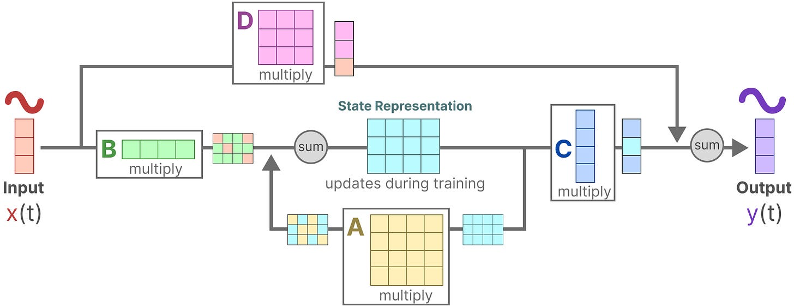

# Математическая логика

Этот раздел требует самостоятельного изучения литературы. 
Нам важно, чтобы студенты освоили концепцию языков программирования на основе математических языков. 
Математический язык включает понятия математические структуры и классы, абстрактная алгебра множеств. 

Математическая логика и логика высказываний - базис для формального доказательства теорем. 

Данное введение - конспект, фактически повторяет структуру курса мат.логики [^1].

[^1]: "А.Н. Колмогоров, А.Г. Драгалин. Математическая логика. Введение в математическую логику."

## Множества и сужение множества

Первично понятие математической структуры основанная на множествах. 

Структура $M = {x| F(x)}$ -- схема связывания элементов множества, задает сужение множества, где функция или уравнение из множества выделяет подмножество. 


Упорядоченная пара - множество образованное от двух множеств $\langle A, B\rangle \to M$ множество порожденное некоторой структурой из двух множеств. Предполагает наличие методов отображения. Угловые скобки используем для обозначения нового класса наследующего свойства множеств и обладающего рядом методов. 

* отношение заданное перечислением множеств $(\cdot , \cdot) \to M$ разделителем может быть пробел или запятая. 
* перечисление констант $\{a,b,c\}$ - множества заданные перечислением
* перечисление элементов множеств заданных аналитически $\{a_k\}_{k=0}^n$ - числовые последовательности
* Бинарная операция порождает отображение $f: R \times R \to M$
* Унарная операция порождает отображение  $f: R \to M$
* массив - вектор размера n обозначим $R^n$ состоит из элементов множества $R$

Тут следует ввести понятие лямбда выражение и лямбда функция. 
Операция '.' связывает абстрактную функцию и определяет класс первого параметра.

Например, выражение $f(x,y)$ - функция двух переменных, каждое из которых определено на своем множестве. $x.f(y)$ - эквивалентная запись, функция берет $x$ в качестве первого аргумента и определяет множество методов класса, к которому относится $x$. 

Запись $(x.f y z)$ эквивалента означает что функция захватывает тип аргумента, х и захватает аргументы дальше до скобки получается $f(x,y,z)$. 

## Абстрактная алгебра 

Теория групп изучает математические структуры группы, кольца, поля. 

Пара $\langle A, *\rangle$  непустое множество $A$ и бинарная операция над элементами множества $a*b$ образуют группу, если операция удовлетворяет ряду аксиом:
1. $(a*b)*c = a*(b*c)$ -- ассоциативность.
2. существует такой элемент $e \in A$ такой что $e*a = a$ -- существование нейтрального элемента (инвариант)
3. для любого $a \in A$ существует единственный элемент $b \in A$ такой что $b * a = e$ (обратный элемент)
4. группа может быть _коммутативная_ или _некоммутативная_ для коммутативной группы выполняется аксиома $a*b = b*a$

Кольцо - математическая структура $\langle R, +, \cdot \rangle$  называется кольцом, класс состоит из множества $R$ и двух бинарных операций $R \times R \to R$ типа сложение и типа умножения, если выполнены требования:
1. ассоциативность сложения
2. существует единственный нейтральный элемент $\theta$ по отношению к сложению $a+\theta = a$
3. для каждого $a \neq \theta$ существует обратный элемент такой что $a+(-a)=\theta$
4. коммутативность сложения $a+b = b+a$
5. ассоциативность умножения $a(bc) = (ab)c$
6. дистрибутивность сложения $a(b+c) = ab+ac$ и $(a+b)c = ac+bc$

Операции упорядочены по приоритету, сначала выполняются операции умножения, затем сложения. 
Операция типа сложения - образует коммутативную группу. В общем случае, операция типа умножения - некоммутативная.

Кольцо называется полем, если умножение коммутативно на множестве и образует коммутативную группу. 

## Булева алгебра

**Булевы кольца** - определяются, как $\langle R, +,\cdot \rangle$ - математическая структура над двумя операциями - кольцо с единицей. Дополнительно требуется :

7. существует единичный элемент $e$ такой, что для любого $\forall{a} (ae = ea = a)$
8. для любого $\forall{a} (aa=a)$

Определим кольцо D на множестве $\{0,1\}$ и определим операции сложения и умножения по модулю 2.
С каждым множеством E состоящим из n элементов можно связать: 
1. кольцо $D^E$ определенных на E функций со значениями из D.
2. кольцо $P(E)$ (поле) вероятностей, для всех подмножеств $E$ c операциями
    $$A+B = (A \cup B) \backslash (A \cap B), \quad A\cdot B = A \cap B$$

Иными словами любому множеству (разбиению множества на подмножества) можно сопоставить вектор признаков (BITSTRING), где каждому элементу разбиения соответствует флаг принимающий значения $\{0,1\}$. Поле вероятностей, с разбиением на подмножества и числовой характеристикой элементов множества и образуют вероятностное пространство, а нормированную числовую характеристику назовем вероятностью. 

Таким образом базовым классом является D - битовый тип со своей  булевой алгеброй и логическими функциями. От битового типа можно образовать $D^n$ битовую строку. 
Базовым классом является множество вещественных чисел на интервале $[0,1]$ которое мы определяем как поле вероятностей.

Заметим, в булевом кольце операция сложения работает, как _исключающее или_. (см. подробнее полусумматор - однобитный сумматор).

Булева решетка - математическая структура над множеством $\langle B, \cap, \cup, \bar{~~} \rangle$, где $\cap$, $\cup$ - бинарные (с двумя аргументами) операции, _пересечение_ и _объединение_, и унарной операцией _дополнение_. 
Операцию _разность_ на булевой решетке определим, как $a\backslash b = a\cap \bar{b}$

Булеву решетку можно определить на множестве $\{0,1\}$ c операциями $a \cap b  =\min\{a,b\}$, $a \cap b = \max\{a,b\}$, $\bar{a} = 1 - a$.

Разложение по полиномам ... формула Лагранжа для булевой алгебры - хороший пример.

**совершенная дизъюнктивная нормальная форма** - 

**совершенная конъюнктивная нормальная форма** - 

## Логика высказываний

- $\forall \exists$ - кванторы "для любого" и "существует такой"
- $\neg \lor \land$ - отрицание (НЕ), дизъюнкция (логическое ИЛИ), конъюнкция (логическое И)
- $\implies$ операция импликации, утверждение "если верно А, то B"
- $\iff$ тогда и только тогда - двусторонняя импликация

Выражения могут включать скобки. Операции захватывают некоторое количество символов после себя в качестве аргументов (параметров). Это называют связыванием символов языка. Например связывание в скобках идет до конца, до закрывающей скобки.

В выражениях кванторы обладают одинаковой "силой связывания", которая в языке программирования обозначается приоритетом операции.  Кванторы  обладают наивысшим приоритетом, а операции импликации низким. 

Традиция рисовать много скобок в математических языках приводит к функциональному программированию с вложенными функциями. 

В записи языка существует возможность перехода к выражениям с разделителями '.', которые меняют порядок выполнения и уменьшают число скобок. Точка может попадаться до или после символа операции. Точка справа от символа вызывает исполнение правого выражения до выполнения операции. Слева - выражение слева выполняется до операции. Точка перед функцией захватывает тип и значение переменной слева.  

## Исчисление высказываний

## Исчисление предикатов

**Предика́т** $n$-местный, или $n$-арный — это логическая функция с множеством значений $\{0,1\}$ {ложь, истина}. 
Любую логическую функцию можно представить в виде дизъюнктивной или конъюнктивной формы разложения (в булевой алгебре). Это не единственный вариант разложения. Бывают полиномы Жегалкина (алгебраически нормальная форма разложения) и вероятно можно предложить разложения построенные на других полиномах. Ещё есть возможность оптимизации выражений с использованием кванторов и упорядоченного использования выражений. 

С точки зрения программирования я бы предложил класс Предикат $P(\mathbb{B}^n)$ (логическая функция) рассматривать, как массив битовых строк, которые вместе описывают логическую функцию. Из предикатов можно составить вектор, любому множеству можно сопоставить вектор предикатов и битовую строку значений. 

Мы будем рассматривать и другие предикаты основанные на троичной логике, типа $\{\bar{1}, 0, 1\}$, где третье состояние - "не определено" или "не зависит". Для троичной логики используются константы {`false` `true` `undefined`}. И на _вероятностной логике_ на интервале $[0,1]$, когда значения задают вероятность событий. 

Использование троичной логики позволяет быстрее принимать решения, логическая функция может выдавать определенные значения, когда некоторые параметры не определены.

С предикатами определены операции ($\land \lor \neg$), кванторы $\exists \forall$ и импликация $\implies$ и тождество $\iff$. 


Любую функцию можно представить, как линейную комбинацию базисных полиномов, разложить в ряд тейлора например. Но вот незадача, на булевой алгебре степень $x^n = x$. Так что выражения с разложением по базису должны выглядеть существенно проще. Как будет выглядеть разложение по полиномам Тейлора в булевой алгебре?
$$f(x_1, ..., x_n) = \sum_{a_1,..a_n} f(a_1, ..., a_n)\prod_{k=1}^n (x_k + a_k +1)$$
-- это формула Лагранжа для интерполяции функции от $n$-переменных в булевой алгебре. 
Сумма берется по всем наборам из n-констант $\{a_1,...,a_k\}$. Разница $(x_k-a_k) \equiv (x_k+a_k+1)$ - спроси меня как. Ответ - в свойствах операции сложения и обратной операции по сложению в булевых решетках.

Произведение работает как дельта-функция.
$$\delta_{a_1,...,a_n}(x_1, ..., x_n) = \prod_{k=1}^n (x_k + a_k +1)$$
Нетрудно заметить, что функция дает единицу только при $x_1=a_1, x_2=a_2,..., x_n=a_n$

Возможно ли использовать Теорему Колмогорова-Арнольда (определенную на множестве $[0,1]$) в булевой алгебре? Любую непрерывную функцию множества переменных можно представить через суперпозицию функций 2n+1 функций одного переменного
```math
\displaystyle f(x_{1},\ldots ,x_{n})=\sum_{q=0}^{2n}\Phi _{q}\left(\sum _{p=1}^{n}\phi _{q,p}(x_{p})\right).
```
Или даже так:
```math
\displaystyle f(x_{1},\ldots ,x_{n})=\sum_{q=0}^{2n}\Phi \left(\sum _{p=1}^{n}\phi _{q,p}(x_{p})\right).
```
Под операцией сложения надо понимать сложение по модулю 2, всего существует две функции(инверсия, тождество), и две константы (0, 1).

|$\Phi$| x | y |
|---:|---:|---:|
| inv|  1 |  0 
| inv|  0 |  1
| equ|  1 |  1
| equ|  0 |  0
|  0 |  1 |  0
|  0 |  0 |  0
|  1 |  1 |  1
|  1 |  0 |  1

Теорема Жегалкина — утверждение о существовании и единственности представления всякой булевой функции в виде полинома Жегалкина
```math
{\displaystyle P(X_{1},\dots ,X_{n})=a\oplus a_{1}X_{1}\oplus a_{2}X_{2}\oplus \dots \oplus a_{n}X_{n}\oplus a_{12}X_{1}X_{2}\oplus a_{13}X_{1}X_{3}\oplus \ldots \oplus a_{1\dots n}X_{1}\dots X_{n},}
```
$${\displaystyle a_{1},\ldots ,a_{1\ldots n}\in \{0,1\},}$$

Представление в виде полинома Жегалкина называется _алгебраической нормальной формой_ (АНФ). 

Заметим, что функцию одного переменного можно представить:
$f(X) = a_0 \oplus a_{1}X$. Любую функцию можно определить через две константы.

Получить полином Жегалкина можно путем тождественных замен и упрощений из ДНФ. 
Применяются правила:
$\neg{a} = 1 \oplus a$, а знак $\lor$ можно заменить на $\oplus$ поскольку в ДНФ значение истина принимает только одно "слагаемое".

### Рекурсивное определение функций

Мы берем за основу идею рекурсивного построения сплайнов и рекурсивного определения базисных ортогональных функций. Построение сплайнов основано на полиномах Бернштейна, которые в свою очередь выводятся из распределения Бернулли. 
Нормальное распределение случайной величины (или Гауссово), являющееся непрерывным. Распределение Бернулли, описывающее вероятность успеха или неудачи в одном единственном испытании. Нас интересует биномиальное распределение, которое является композицией независимых испытаний Бернулли, и центральная предельная теорема, согласно которой сумма большого количества независимых испытаний Бернулли аппроксимируется нормальным распределением. 

$$f(x; t) = (1-t) f_{1,0}(x) + t \cdot f_{1,1}(x)$$
перепишем так
$$f(x; t) = \bar{t} \cdot f_{1,0}(x) + t \cdot f_{1,1}(x)$$
Функцию от двух переменных можно разложить на две функции одного переменного и сложение (всего три функции). Функции трех переменных можно разложить на четыре функции одного переменного и три сложения.

## Тернарная логика

В данном разделе мы вводим математический аппарат для современных нейронных сетей пониженной разрядностью весовых коэффициентов. Мы будем определять вероятности события, как число в интервале $[0,1]$ или в расширенном смысле на множестве $[-1,1]$. 

Для начала мы определяем тернарные коэффициенты на множестве $\mathbb{T}:\{-1,0,1\}$. Числа могут быть представлены парой знак-экспонента $(s, r)$ или парой $(x^{+}, x^{-})$, где $x^{+}$ - вероятность реализации события, а $x^{-}$ - вероятность того что событие не произойдет. Третье состояние кодируется как $(0,0)$ обозначает что состояние не зависит от события, состояние $(1,1)$ не реализуется, хотя можно приписать ему какой-то смысл в логике высказываний (где наравне с высказываниями применяются символы $\top$ - тавтология и $\bot$ - противоречие). Так в логике высказываний выражение $A\land\bar{A} = \bot$ - является противоречием. В тоже время противоречия в вычислениях с плавающей точкой обычно помечаются, как `NaN`.

Следует приравнять представление троичной логики к представлению нормальной алгебраической формы разложения. Двоичные числа в тернарной логике представлены как $x=(1,0)$ и $\bar{x}=(0,1)$.

*Определение (умножение тернарное)*
$(c^{+},c^{-}) = (a^{+}, a^{-})\cdot (b^{+}, b^{-})$:
```math
\begin{aligned}
 c^{+}&= (a^{+} \land b^{+}) \lor (a^{-} \land b^{-})\\
 c^{-}&= (a^{+} \land b^{-}) \lor (a^{-} \land b^{+})
\end{aligned}
```
Тернарное умножение определено для кодирования операций на множестве тернарных чисел с использованием двоичных чисел. 

Таблица умножения LUT:
| a| b| c|$a^{+},a^{-}$|$b^{+},b^{-}$
|--:|--:|--:|:---:|:---:
|-1 | -1| 1 | 0,1 | 0,1
|-1 |  0| 0 | 0,1 | 0,0
|-1 |  1|-1 | 0,1 | 1,0
| 0 |  0| 0 | 0,0 | 0,0  
| 1 | -1|-1 | 1,0 | 0,1
| 1 |  0| 0 | 1,0 | 0,0
| 1 |  1| 1 | 1,0 | 1,0

Заметим, что $(a^{+} \land b^{+})$ и $(a^{-} \land b^{-})$ взаимоисключающие события. Операция ($\lor$) может быть заменена на суммирование ($+$) или исключающее ИЛИ ($\oplus$).

*Определение (умножение тернарно-бинарное)*
```math
\begin{aligned}
 c^{+}&= (a^{+} \land b) \lor (a^{-} \land \bar{b})\\
 c^{-}&= (a^{+} \land \bar{b}) \lor (a^{-} \land b)
\end{aligned}
```

*Определение (скалярное произведение)* Определяет переход векторов $\mathbf{a},\mathbf{b} \in \mathbb{T}^N \mapsto \mathbb{Z}$ как

```math
\langle \mathbf{a},\mathbf{b}\rangle = \sum_{i=0}^{N-1} a_i\cdot b_i = \sum_{i=0}^{N-1} c_{i}^{+} -  \sum_{i=0}^{N-1} c_{i}^{-}
```
Само по себе скалярное произведение не имеет смысла. Чтобы перейти к вероятностям надо говорить про проекции и норму порожденную скалярным произведением. 
```math
\|\mathbf{a}\| = \sum_{i=0}^{N-1} a_i\cdot a_i
```
Нормированное скалярное произведение выражается в рациональных числах. 

Сравниваем полученное определение с Формулой условной вероятности при конечном разбиении, с ковариацией, проекцией вектора и косинусной схожестью. 

**Тернарная Функция активации**

Функция активации используется для перевода из множества целых (вещественных) чисел в множество тернарных чисел
```math
\sigma_{\tau}(x) = sign(\lfloor x/\tau \rceil) = \begin{cases}
    -1, \text{ if } \lfloor x/\tau\rceil \leqslant-1\\
     0, \text{ if } \lfloor x/\tau\rceil=0\\
     1, \text{ if } \lfloor x/\tau\rceil\geqslant 1\\
\end{cases}
```

Аналогично мы могли бы определить функцию активации в вероятностном пространстве. Дополнительно мы должны потребовать многократное дифференцирование и сослаться на понятие финитной функции.
В функциональном анализе рассматривается пространство бесконечно (достаточное число раз) дифференцируемых финитных функций [^1] на компактном интервале. В методе обратного распространения ошибки нам важен не вид функции активации, а выражение для её производной.

Следует вернуться к теореме Колмогорова-Арнольда, чтобы представить логическую функцию как сумму функций одного переменного, аппроксимируя функции первого слоя тернарными свертками и второго слоя - сплайнами. Подходящим базисом являются полиномы Бернштейна на множестве [-1,1]. Замечательным свойством базисных полиномов Бернштейна является вероятностный характер: интеграл равен единице, значения функций всегда находятся в интервале. 

**Квантизация**

Другим (обязательным) элементом для построения нейронной сети на троичной логике является функция квантования, которая обеспечивает сохранение интеграла и обеспечивает нормальное распределение вероятности в интеграле. Функция квантования связана с поведением функции активации. Если функция активации отрезает часть значимых бит, то остаток сохраняется как градиент и используется в методе обратного распространения ошибки и для компенсации ошибки округления, методом Stochastic Rounding - добавляет ошибку округления к данным. 

**Заключение по разделу**.
Таблица умножения для тернарной логики такая же, как если бы мы работали с вещественными числами. Троичная логика может быть реализована в числах c плавающей точкой пониженной разрядности, в виде битовых операций, может считаться в целых числах со знаком. Таким образом можно закодировать любую логическую функцию. Для представления произвольной логической функции мы рассматриваем MLP многослойный перцептрон с активацией и разложение по сплайнам в теореме KAT. 


## Вероятностная логика


**Вероятностная логика со знаком**. 

## Оператор причинности

Мы вводим оператор причинности $\Zeta$ для разделения времени в высказываниях содержащих совершенные глаголы и деепричастные обороты. Оператор причинности можно ввести и поверх троичной логики и поверх вероятностной логики и поверх вещественных чисел. 

Т.е предикат может быть функцией от завершенного действия или события, такого, как изменение значения "edge". Точно так же как аналоговая формула может включать производные в выражениях. 

Например: 
- $a\Zeta{\bar{a}}$ - детектирует нарастающий фронт сигнала.
- $\bar{a}\Zeta{a}$ - детектирует спадающий фронт сигнала в двоичной логике.

Результат логической функции можно записать в регистр
$f(x_1,..., x_n) \implies {y}$
это означает 
$$y: = Zy \lor f(x_1,..., x_n) $$

Запись
$f(x_1,..., x_n) \iff \neg{y}$ означает 
$$y: = \neg f(x_1,..., x_n) $$


Запись
$f(x_1,..., x_n) \implies \neg{y}$ означает 
$$y: = Zy \land \neg f(x_1,..., x_n) $$


Если несколько раз используется импликация
$$f_1(x_1,..., x_n) \implies {y}$$
$$f_2(x_1,..., x_n) \implies {y}$$
то это по сути означает 
$$y := Zy \lor f_1(x_1,..., x_n) \lor f_2(x_1,..., x_n)$$
Запись
$$f_1(x_1,..., x_n) \implies {y} \quad \text{ -- установить триггер}$$
$$f_2(x_1,..., x_n) \implies \neg {y} \quad \text{ -- сбросить триггер}$$
Означает
$$y := (Zy \lor f_1(x_1,..., x_n)) \land \neg f_2(x_1,..., x_n)$$

Запись на языке приближенном к Си будет использовать присваивание типа `:=` и типа `|=`, для составления логических функций удобно использовать битовые операции типа `~^|&`.
```c
y |=  f_1(x_1,..., x_n);
y &= !f_2(x_1,..., x_n);
```
Все тоже самое можно записать на языке релейно-контактной логики (LD, ladder diagram). 

## Релейно-контактная логика

[ГОСТ Р МЭК 61131-1-2016]
Способ обозначений подходит для монтажников электрощитового оборудования и автоматиков. Электрики интуитивно понимают схемы и могут в них разбираться по аналогии с электрическими сигналами в принципиальных электрических схемах. 
```tree
├──[/]─....─( )
│
├──[ ]─....─(/)
```
Схемы читаются слева-направо. Слева шина питания, справа шина нулевая. `[ ]` обозначают нормально открытые и `[/]` нормально замкнутые контакты. А `( )` катушки реле. Последовательное соединение контактов - логическая операция И, а параллельное - ИЛИ. 

Графический язык релейно-контактных схем применяется для настройки PLC контроллеров. 

Словом "Реле" электрики обозначают любой модульный блок в электрическом шкафу, кроме контактора и пускателя и выключателя. Например, реле времени, реле температуры, реле защиты... реле контроля... реле промежуточное, реле интерфейсное... На схеме также можно обозначать функциональные блоки. 

## Рациональные операторы

Что если допустить и в левой и в правой части выражения использование операторов причинности. Оператор причинности в языке программирования порождает регистры - переменные в которых хранится предыдущее состояние. Каждый символ Z - регистр. 

Запись $\hat{F}[Z](x) \iff \hat{G}[Z](y)$ означает 
$$y + \sum_{i=1}^{M-1}\alpha_k Z^k y = \sum_{i=0}^{N-1} \beta_k Z^k x$$

Передаточная функция рационального оператора - это отношение полиномов 
$$\hat{H}[Z] = \frac{\hat{F}[Z]}{\hat{G}[Z]} = \frac{\sum_{i=0}^{N-1} \beta_k Z^k}{1+\sum_{i=1}^{M-1}\alpha_k Z^k}$$

Рациональные функции можно сокращать и факторизовать, раскладывать на простейшие дроби. В том числе на биквадратные рациональные функции или линейные функции с попарно сопряженными корнями и полюсами в комплексной плоскости. 

Что самое важное - рациональному оператору можно сопоставить алгоритм. На рациональных операторах можно построить рекуррентную нейронную сеть. Действие оператора можно описать в частных производных - сопоставить передаточной функции дифференциальное уравнение. 

## Остатки округления - свидетели операций

Доказательство без разглашения (ZKP) использования модели данных может строиться множестве остатков округления и множестве всех Z регистров. Вместе они составляют полное состояние системы. см. LWR - learning with rounding.

## Обратимость операторов

Может меня в детстве посадили за парту не так, но выражения можно читать и доказывать в обе стороны. Чтобы понять как выражения доказывать задом-наперед надо ввести понятие _полное состояние системы_ И долго рассуждать о современных машинах и почему каждому `if` нужно приписать `else`. При обратном исполнении выражений, функции, которые не содержат оператор причинности читаются в прямом направлении, а значения полного состояния восстанавливается. Писать программы таким образом, чтобы в них сохранялось _полное состояние_ - это искусство можно освоить. 


### SSM: Непрерывная модель скрытого состояния

Модель состояния (State-Space model) определяется простым уравнением. Она преобразует входной вектор $u(t)$ в многомерное $N$-мерное скрытое (hidden) состояние $x(t)$ перед проецированием на одномерный выходной сигнал $y(t)$.

\[
\mathbf{x}'(t) = Ax(t) + Bu(t)
\]

\[
y(t) = Cx(t) + Du(t)
\]

SSM (модели состояния) широко используются во многих научных дисциплинах и связаны с моделями скрытого состояния, такими как Скрытые Марковские Модели (HMM). Наша цель — использовать SSM как черный ящик в модели глубоких последовательностей, где $A, B, C, D$ — параметры, обучаемые с помощью градиентного спуска. Для остальной части этой статьи мы опустим параметр $D$ для простоты (или, эквивалентно, предположим $D = 0$), поскольку компоненты $Du$ можно рассматривать, как обходное соединение.

* [[2111.00396](https://arxiv.org/pdf/2111.00396)] Efficiently Modeling Long Sequences with Structured State Spaces
* [[2506.16392](https://arxiv.org/pdf/2506.16392)] State-Space Kolmogorov Arnold Networks for Interpretable Nonlinear System Identification

## Дискретные SSM: Рекуррентное представление

Для применения к дискретной входной последовательности (\( u_0, u_1, \ldots \)) вместо непрерывной функции \( u(t) \), уравнение (1) должно быть дискретизировано с шагом \( \Delta \), представляющим разрешение входных данных. Концептуально, входные данные \( u_k \) можно рассматривать как выборки из лежащего в основе непрерывного сигнала \( u(t) \), где \( u_k = u(k\Delta) \).

Для дискретизации непрерывной SSM мы следуем предыдущим работам, используя билинейный метод [^43], который преобразует матрицу состояния \( A \) в аппроксимацию \( \bar{A} \). 

Используем замены $x \to \frac{(x + Zx)}{2}~; d{x} \to \frac{(x - Zx)}{\Delta}$ в Z-нотации операторов задержки.

Дискретная SSM определяется следующим образом:

\[
x := \bar{A} Zx + \bar{B} u, \quad \bar{A} = (I - \Delta/2 \cdot A)^{-1} (I + \Delta/2 \cdot A)
\]

\[
y := \bar{C} x, \quad \bar{B} = (I - \Delta/2 \cdot A)^{-1} \Delta B, \quad \bar{C} = C.
\]

Уравнение теперь представляет собой отображение последовательности $u_k \to y_k$ вместо функции на функцию. Кроме того, уравнение состояния теперь является рекуррентным в $x_k$, что позволяет вычислять дискретную SSM как RNN. Конкретно, $x_k \in \mathbb{R}^N$ можно рассматривать как скрытое состояние с матрицей перехода $\bar{A}$.

Мы используем $\bar{A}, \bar{B}, \ldots$ для обозначения дискретизованных матриц SSM, определенных уравнением. Обратите внимание, что эти матрицы являются функцией как от $A$, так и от шага $\Delta$.



**Диагонализация и нормальное представление матрицы состояния**

Рассматривается возможность диагонализации матрицы A для снижения вычислительной сложности и уменьшения размерности скрытого состояния. Решение может быть найдено в форме [^16]
\[
\tilde{x} := V^{-1}\bar{A}V Z\tilde{x} + V^{-1}\bar{B} u~; \quad y = CV\tilde{x}
\]

В идеале матрица A диагонализирума с использованием унитарной матрицы V. В условиях Спектральной теоремы линейной алгебры - это класс нормальных матриц. Однако в более общем случае матрицу $A$ можно представить, как разложение на Нормальную матрицу и Low-Rank дополнение. 
\[
A = V \Lambda V^{H} − P Q^{T}
\]
где $\Lambda$ - диагональная матрица, $V \in \mathbb{C}^{N\times N}$ - унитарная, факторизация $P,Q \in \mathbb{R}^{N \times r}, r=\{1,2\}$.

<!-- Матрица V со структурой Вандермонда позволяет перейти к использованию метода умножения на основе DFT. -->

Наверное проще было бы представить бидиагонализацию матрицы. Есть еще возможность поиска решения в форме Намильтоновой вещественной матрицы. 

**Нормальная матрица** - комплексная квадратная матрица $A$, коммутирующая со своей эрмитово-сопряжённой матрицей: $A^{H}A=AA^{H}$.

Для вещественной матрицы $A$ эрмитово сопряжение эквивалентно транспонированию $A^{*}=A^{T}$, и поэтому она нормальна, если $A^{T}A=AA^{T}$.

Нормальность является удобным тестом приводимости к диагональной форме — матрица нормальна тогда и только тогда, когда она унитарно подобна диагональной матрице, а потому любая матрица $A$, удовлетворяющая условию $A^{H}A=AA^{H}$, допускает приведение к диагональной форме. 
Две матрицы $A$ и $B$ называются унитарно подобными, если существует унитарная матрица $V$, для которой $A=V^{-1}BV$.

Понятие нормальной матрицы можно распространить на нормальные операторы в бесконечномерных гильбертовых пространствах и нормальные элементы в C*-алгебрах.

Среди комплексных матриц все унитарные, эрмитовы и косоэрмитовы матрицы нормальны. Среди вещественных матриц все ортогональные, симметричные и кососимметричные матрицы нормальны. 

[^16]:[[2008.07669](https://arxiv.org/pdf/2008.07669)] HiPPO: Recurrent Memory with Optimal Polynomial Projections, 2020
[^43]:[[43](https://proceedings.neurips.cc/paper_files/paper/2019/file/952285b9b7e7a1be5aa7849f32ffff05-Paper.pdf)] Legendre Memory Units: Continuous-Time Representation in Recurrent Neural Networks [US11238345B2](https://patents.google.com/patent/US11238345B2/en)

## Определение языка

Язык задается набором из четырех множеств $\Omega = \langle Str, Cnst, Fn, Pr \rangle$ -- "сорта" (типы), "константы", "функции" и предикатные символы. Все это символы языка. В бинарном представлении каждому элементу из этих множеств можно сопоставить числовой идентификатор или символ. Разложение по элементам языка представляет в классически представлении - дерево. В современном представлении - граф. 

Определение языка это набор шаблонов и оценка сложности операций. Эффективная алгебра множеств, которая используется для "доказательства" программы. При этом доказывать можно разные цели. Язык - последовательность высказываний. Причем доказанное выражением может добавлять правила соответствующие этому утверждению в кучу грамматик. 

В нашей практике встречаются разнообразные парсеры языков (форматов данных) с понятием множества констант мы сталкиваемся регулярно. А вот остальные тонкости математического языка остаются без внимания. Но нам нужно научиться писать программы, которые не являются последовательностью высказываний. В современных реалиях программа предназначенная для параллельного исполнения представляет собой граф. От нас требуется умение записывать выражения языка, которые являются фрагментом безразмерного графа. 

Из определений логико-математического языка мы выводим понятие последовательность действий (sfc), конечный автомат (fsm) и понятие программируемой логики (plc) как множества предикатов с операторами причинности. 

## Кванторы как операторы математического языка

$\forall, \exists, \exists!$ - для любого элемента множества, существует элемент множества, существует единственный элемент. 

С этим связано понятие перечисление, мы говорим о положительных целых числах и перечисляем элементы по порядку. Т.е. элементов в множестве может быть конечное или бесконечное количество. перебор выполняется в произвольном порядке. Но мы можем говорить про упорядоченные множества и вполне упорядоченные через трансфинитные числа. 
