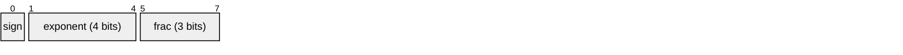
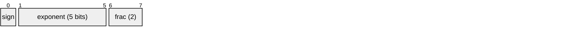
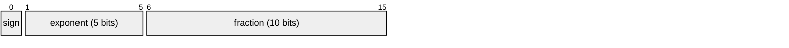
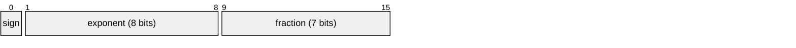
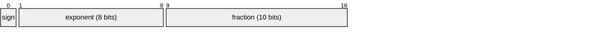
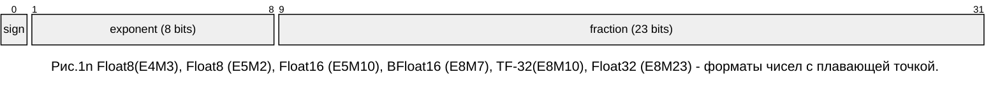
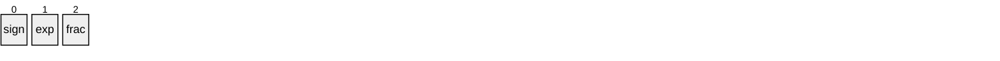
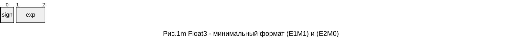
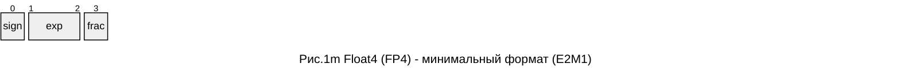

Математика для машинного обучения
=================================

* [PREV: математические классы](MATHAN.md)
* [PREV: сведения из теории вероятностей](PROB.md)
* [PREV: Цифровая обработка сигналов](DSP.md)
* [PREV: Квантование и дискретная математика](QUANT.md)
* [Квантизация моделей: рациональные и действительные числа](#рациональные-числа-и-действительные-числа)
* [Типы нейронных сетей](#типы-нейронных-сетей)

Вводая часть для данного материала. Теория вероятностей: Разлоежние по независимым событиям, математическое ожидание. 

## Операторы


1. Производящая функция числовой последовательности.
2. Разложение по задаержкам

```math
f(nT_s) = \sum\limits_{k=0}^N \alpha_k z^{k}~\text{, где} ~~n = 0...N
```
Мы принимаем z - некоторый символ который означает "задержка" на один такт в дискретной по времени системе. 
Степенной ряд можно продифференцировать n раз по z.
```math
f^{(n)}(0) = n! \cdot \alpha_k
```
Таким образом из степенного ряда можно сделать ряд по производным.

## Безразмерные графы из операторов

*В данном разделе представлен способ описания графа в виде блочной диаграммы с плечами и узлами - графический язык. Узел графа - это опеорация типа сложения(вычитания) и операция типа умножения, каскад из операторов. Ребра - направленные, направление обозначается  стрелкой. Если направление не указано, то сигналы передаются слева-направо и сверху-вниз. На ребрах графа располагаются элементы: операторы и скаляры. Операторы обозначаем овалами или прямоугольниками, а скаляры - треугольниками (символ усилителя). Элементарные операции обозначаем кружочками.*

Мы определяем линейные операторы, как математический класс функций (функционалов). Над которыми можно определить операции типа сложения и типа композиция $( +, \circ )$. 
- В графах распространяются вектора. Линии графа (ребра) могут быть направлены и над линиями можно изобразить размерность вектора, например $\mathbb{R}^n$.
- Базовый класс вектора можно менять, мы определяем операцию квантизации для перехода из множества $\mathbb{R}^n$ в множество натуральных чисел $\{0,\mathbb{N}\}$. А также определяем переход на множестве рациональных чисел $\mathbb{Q}$. 
- Над графами можно определить множество скаляров.
- Операция сложения имеет обратную операцию, через обращение . 
- Операция композиции может быть некоммутативна или антикоммутативна. Мы будем исходить из того что операция обладает коммутативностью. 
- Для перестановки местами элементов композиции требуется выполнить операцию типа "сопряжение". Коммутативность некоммутативной операции можно определить через коммутатор операций $[\hat{F},\hat{G}] = \hat{F}\hat{G} - \hat{G}\hat{F}$

Свойства операторов линейность, ассоциативность по умножению - Ассоциативная алгебра. Свойства операторов вводятся, как множество аксиом, которым удовлетворяют операции с операторами.
- $\alpha(\hat{F}+\hat{G}) = \alpha\hat{F}+\alpha\hat{G}$
- $\hat{F}\circ\hat{G} = \hat{G}\circ\hat{F} $ - коммутативность?

Над графами действует алгебра.

## Дискретизация времени

## Квантизация

*{Ввести оператор квантования. Оператор повыщения и понижения раздрядности.}*

Под квантизацией понимают представление чисел в формате чисел с плавающей точкой меньшей разрядности мантиссы или в целых числах. 

## Рациональные числа и действительные числа

*{Этот раздел чтобы дать понять, что архитектуру надо проектировать с учетом ошибок квантования, выбор операций и форматов данных основан на понимании, как учитывать и компенсировать ошибки. Оптимизация вычислений может быть выполнена на базе рациональных чисел и двоичных дробей, чисел с фиксированной точкой. Вычисления в рациональных дробях не создают ошибку квантования. Учет и компенсация ошибок округления очень важны, когда речь идет о точности математической модели. }*

Множество действительных чисел мы будем рассматривать, как композицию из двоичной экспоненты и рационального числа. Над рациональными числами в таком виде. 
- $A/B$, где $A,B\in [0,2^L)$ - множество рациональных чисел (дроби)
- $A/2^M$, где $A\in [0,2^L)$ - множество действительных чисел (с фиксированной точкой, двоичная дробь);
- $\pm A/2^M \cdot 2^n$, где $A\in [0,2^M)$ - множество действительных чисел (с плавающей точкой, ненормальные);
- $\pm A/2^M \cdot 2^n$, где $A\in [2^M,2^{M+1})$ - нормализованные действительные числа.

Заметим, нормализованные числа не содержат ноль (0). Кодирование нуля, и бесконечности происходит специальными константами. 
Над константами $\{-\infty, 0,+\infty\}$ можно вводить специальную арифметику: $\infty+x = \infty$; $\infty*x = \infty$; $x/\infty = 0$; и т.д.

Для множества вещественных чисел мы можем определить подмножества и операции над подмножествами.
Подмножество будет выделяться разрядностью констант (M, n). В таблице приведены константы определенные для вещественных чисел в соответствии со стандартом Си и [IEEE Std. 754-2019]. 
| тип | мантисса | $E_{min}$ | $E_{max}$ | $E_{bias}$
|:----|----:|----:|---:|---:
| E4M3     |  3 | -6   | +7  | 7
| E5M2     |  2 | -14  | +15 | 15
| binary16 | 16 | -14  | +15 | 15
| binary32 | 24 | -127 | +126
| binary32x| 32 | 
| binary64 | 53 | 
| binary64x| 64 | 
| binary128|113 | 

Внешнее представление чисел с плавающей точкой







В настоящее время разрабатываются форматы группы binary8, с различной разрядностью мантиссы (0..7). [IEEE SA Working Group P3109]. В системе команд Intel AVX10.2 присутствуют форматы binary8 (E5M2) and (E4M3).


Операции с вещественными числами **FloatN** создают ошибку. Мы будем рассматривать ошибку, которая возникает в процессе нормализации точно так же, как рассматривали ошибку при квантовании в целых числах. Учет ошибок это единственная возможность вытянуть слабый сигнал. Ошибку мы рассматриваем на примере операций сложения и умножения. Упаковку формата вещественных чисел (с потерей точности) для внешнего представления можно кодировать в форме (S,E,M) - разрядность экспоненты (E), мантиссы (M) и наличие знака (S). 




Минимальный формат позволяет выполнить кодирование в числах $\{-1,0,+1\}$. Спецальный код используется для кодирования $\pm\infty$ (s_11) и $\pm{0}$
(s_00)


Минимальный формат FP4 (E2M1) используется для сжатия моделей LLM. 


Converts brain16 to float32.
```
 bfloat16 floating point format:
	┌sign
	│   ┌exponent
	│   │      ┌mantissa
	│┌──┴───┐┌─┴───┐
  0b0000000000000000 brain16
 ```
 
Since bf16 has the same number of exponent bits as a 32bit float,
encoding and decoding numbers becomes relatively straightforward.
 
 ```
   ┌sign
   │   ┌exponent
   │   │      ┌mantissa
   │┌──┴───┐┌─┴───────────────────┐
 0b00000000000000000000000000000000 IEEE binary32
```
For comparison, the standard fp16 format has fewer exponent bits.
```
   ┌sign
   │  ┌exponent
   │  │    ┌mantissa
   │┌─┴─┐┌─┴──────┐
 0b0000000000000000 IEEE binary16
```

*Ошибка сложения*

$$R = A\cdot 2^{e_1} + B\cdot 2^{e_2} = (A + B\cdot 2^{(e_2 - e_1)}) \cdot 2^{e_1}$$
Если $|e_2 - e_1|\geq 2^M$ - возникает потеря точности, иначе можно сформировать остаток после нормализации числа. Точное представление чисел возможно в рациональных дробях или числах с фиксированной точкой. Если бы мы говорили про проектирование новой архитектуры для нейронных сетей, следовало бы рассматривать реализацию операций с накоплением и компенсацией ошибки округления. 

*Умножение с накоплением*

Следовало бы говорить об операции сложения и умножения "diffused", где операция сложения и умножения выполняется на аккумуляторе с большей разрядностью и определенными правилами округления остатка при нормализации. Чтобы правильно выполнять операцию свертки и скалярного произведения, суммы ряда, необходимо сохранять в аккумуляторе ошибку округления и применять на следующей операции. В современных процессорах представлены операции "fused multiply-accumulate", (сокр. FMA, совмещенные операции умножения с накоплением) и подобные им векторные операции с горизонтальным суммированием результата. Подобные операции (dot, mix, fma)  как раз ориентированы на применение в сверточных нейронных сетях.

Тенденция упаковки коэффициентов и векторов моделей сохранится. Модели должны масштабироваться в плане разрядности арифметики и давать возможность получать сравнимые по точности результаты за счет правильного учета остатков при квантизации. В отношении моделей также можно применять термин квантование модели, подразумевая разрядность коэффициентов для внешнего представления данных. 

*Ошибка умножения*
Умножение увеличивает разрядность операций. Так если мы умножаем число Float32 с разрядностью M=23 бита, то результат будет $2^M+1$ бит. 

*Эмуляция операции умножения действительных чисел*. Числа при умножении представляем в виде дроби:
$$\left(1+\frac{A}{2^M}\right) \cdot \left(1+\frac{B}{2^M}\right) \cdot 2^{e_1+e_2} = 
\left(2^M + (A+B) + rn\left[\frac{AB}{2^{M}}\right]\right) \cdot 2^{e_1+e_2-M}$$
где rn - функция округления. $rint(x) = floor(x+0.5)$

В остаток уходит величина r, полагая округление методом floor, в меньшую сторону.
$$Q = \left\lfloor\frac{AB}{2^M}\right\rfloor,\quad R = \frac{AB}{2^M} - Q$$

Например, если операция в целых числах использует 32 битные числа, то результат умножения с накомплением будет помещаться в число удвоенной разрядности. Если заранее известно, что сумма коэффициентов дает 2^M то результат свертки всегда будет помещатья в разрядность $2^M$. Но при этом вычисления должны производится на числах удвоенной разрядности с понижением разрядности результата. 

При вычислениях нормированных функций мы работает в диапазоне значений [0,1]. При такой постановке выгоднее с точки зрения производительности переводить числа в правильные двоичные дроби. Это может быть не так просто с точки зрения реализации алгоритма. 

*Правильные дроби*. Когда мы работаем с вероятностями мы используем подмножество чисел с плавающей точкой - вероятности положительно определенные функции на интервале [0,1]. Сумма вероятностей должна давать единицу. В этом смысле мы могли бы вероятности представлять в виде дробей $A_k/B$, где $A_k \in [0,B]$, $\sum\limits_k {A_k}=B$

Предлагаю в качестве упражения реализовать класс полиномы с коэффициентами $A_k \in [0,2^N)$, которые в сумме дают $2^N$. Над полиномами определена операция умножения. Кроме того, нам понадобится функция поиска обратного числа для любого элемента множества, такого что $(A\cdot\bar{A})/2^N=1$

## Алгоритмы повышения разрядности

Допустим на аппаратной платформе нам доступна только операция одинарной точности. Для замещения операции с двойной точностью можно использовать два числа с одинарной точностью таким образом чтобы результат операции $a+b = s + r$, давал сумму и остаток (s, r). 

Алгоритм сложения, Dekker [10]
```
Add12 (a,b):
	s = a ⊕ b
	v = s ⊖ a
	r = b ⊖ v
	return(s,r)
```
Алгоритм сложения, Д.Кнут [9]
```
Add12 (a,b):
	s = a ⊕ b
	v = s ⊖ a
	r =(a ⊖(s ⊖ v)) ⊕ (b ⊖ v)
	return(s,r)
```
* [9] D. Knuth. The Art of Computer Programming, volume 2, ”Seminumerical Algorithms”. Addison Wesley, Reading, MA, third edition edition, 1998.
* [10] T.J. Dekker. A floating point technique for extending the available precision. Numerische
Mathematik, 18(3):224–242, 1971.
* [11] Dominik Goddeke, Robert Strzodka, and Stefan Turek. Accelerating double precision fem simulations with GPUs. In Proceedings of ASIM 2005 - 18th Symposium on Simulation Technique,
September 2005.

```
Add22 (ah,al) , (bh,bl)
	r = ah ⊕ bh
	if |ah| ≥ |bh| then
		s = (((ah ⊖ r) ⊕ bh) ⊕ bl) ⊕ al
	else
		s = (((bh ⊖ r) ⊕ ah) ⊕ al) ⊕ bl
	(rh,rl) = add12(r,s)
	return(rh,rl)
```
Алгоритм разбиения числа на два меньшей разрядности Dekker [10]
```
SPLIT (a):
	c = (2^s ⊕ 1) ⊗ a
	a_big= c ⊖ a
	a_hi = c ⊖ a_big
	a_lo = a ⊖ a_hi;
	return (a_hi, a_lo)
```

Алгоритм умножения с остатком (Dekker [10])
```
Mul12 (a, b):
	x = a ⊗ b;
	(a_hi, a_lo) = SPLIT(a);
	(b_hi, b_lo) = SPLIT(b);
	err =   x ⊖ (a_hi ⊗ b_hi)
	err = err ⊖ (a_lo ⊗ b_hi)
	err = err ⊖ (a_hi ⊗ b_lo)
	y = (a_lo ⊗ b_lo) ⊖ err
	return (x,y)
```
Если на платформе аппаратно поддерживается операция fused-multiply-accumulate (FMA), то умножение может быть выполнено быстрее
```
FMA_mul12 (a,b):
	x = a ⊗ b
	y = FMA(a × b − x)
	return (x,y)
```

В алгоритме символы $\oplus, \ominus, \otimes$ означают операции с округлением, одинарной точности.

## Типы нейронных сетей

- (MLP) Multi-Layer Perceptron
- (CNN) Convolutional Neural Network 
- (RNN) Recurrent Neural Networks
- (GRU) Gated Reccurence Networks
- (LSTM) Long short-term memory
- (KSN) Kolmogorov Spline Networks
- (KAN) Kolmogorov-Arnold's Networks

В 2023-24 году появились разновидности нейросетей KAN. Популярность получили Трансформеры, LLaMa, RWKV. Все они используют общие принципы проектирования элемента сети сразной степенью эффективности. 

<https://neerc.ifmo.ru/wiki/index.php?title=%D0%94%D0%BE%D0%BB%D0%B3%D0%B0%D1%8F_%D0%BA%D1%80%D0%B0%D1%82%D0%BA%D0%BE%D1%81%D1%80%D0%BE%D1%87%D0%BD%D0%B0%D1%8F_%D0%BF%D0%B0%D0%BC%D1%8F%D1%82%D1%8C>

По ссылке можно наблюдать последнюю стадию эволюции. Но к сожалению эволюция пошла не тем путем, LLM - большие языковые модели. Следующий виток развития - сети KAN (сети на базе разложения Колмогорова-Арнольда).

Теорема о разложении КАТ утверждает, что любую многомерную функцию определенную на интервале $[0,1]$ можно разложить, как сумму композиций от функций зависящих только от одного переменного и фнкции сложения (от двух переменных). 

Я бы хотел в нашем курсе рассмотреть все варианты элементов вычислительной сети с точки зрения дифференциальных операторов. Блоки (фильтры) могут быть представлены функциями двух типов: которые дают на выходе скаляр (вероятность) на множестве значений $[0,1]$ и которые дают производную (операторы). Операторы нормированные можно представить на множестве значений $(-1,+1)$. При этом ограничением является использование в составе операторов арифметики с насыщением. В то время как вероятности используют арифметику с компенсацией ошибки округления. Оператор, который дает на выходе скаляр на схеме элемента мы можем обозначить типом $\sigma$, а оператор дифференциальный тангенсом $\theta$. 

Оператор - функционал, который по такту времени $h_n = f(h_{n-1}, x_n; \Theta)$ выполняет некоторую функцию, зависяющую от состояния системы в предыдущий момент времени и вектора внешних значений $x$. 
Операторы можно раскладывать в каскад и в сумму. Необходимость разложения в сумму требует чтобы элемент давал параллельный выход на том же такте, который может быть использован как вход в другом элементе (перенос). 

$$(с_{out}, h_n) = f(c_{in}, h_{n-1}, x_n; \Theta)$$


Исходная структура элемента определяется уравнениями ([LSTM](https://arxiv.org/pdf/1601.06733))

```math
\begin{aligned}
i_{t} &=\sigma (W_{i}[h_{t-1},x_{t}])\\
f_{t} &=\sigma (W_{f}[h_{t-1},x_{t}])\\
o_{t} &=\sigma (W_{o}[h_{t-1},x_{t}])\\
\hat{c}_{t} &=\tanh (W_{c}[h_{t-1},x_{t}])\\
c_{t} &= f_t \odot c_{t-1} + i_t\odot \hat{c_t}\\
h_{t} &= o_t \odot tanh(c_t)
\end{aligned}
```

**Объединенные фильтры**
Иные модификации LSTM включают объединенные фильтры “забывания” и входные фильтры


$$C_{t} = f_t \odot C_{t-1} + (1-f_t) \odot \tilde{C}_n = f_n \odot C_{n-1} + \bar{f}_n \odot \tilde{C}_n$$
Фукция f определена на интерывале [0,1]. В записе выражений мы используем символ доплнения $\bar{f} = (1-f)$

Реккурентное или каскадное применение этого принципа позволяет получить B-сплайны, сплайны на базисных полиномах Бернштейна. 


[GRU]: <https://arxiv.org/pdf/1406.1078v3>

Аналогичный элемент (сплайн) присутсвтует и в GRU: 
$$h_{n} = (1-f_n) \ast h_{n-1} + f_n \ast \tilde{h}_n~.$$
Кроме того, представлен сброс состояния "reset gate" $r_n$. Эффект сброса может лучше было бы представить в той же форме, как баланс между начальным состоянием и текущим: 
$$r_n \ast h_{n-1} + (1-r_n) \ast h_0 ~.$$
Это всего два сигнала: "забывание" и "сброс". 

Эту тему, как бездумно слепить элемент для реккурентной сети, можно продолжить. Можно предложить создавать функции активации в форме сплайнов. Отдельно следует отметить функции семейства Smoothstep. 

Возможность разложения с использованием той или иной архитектуры можно оценивать по тестовым задачам...

*Задача*: на архитектуре сети считать уравнение для цифровой обрабокти сигналов вида 

```math
(1-\bar{\alpha}z^{-1})Y = {\alpha}\tilde{H}(z)X
```
```math
Y = \bar{\alpha}z^{-1}Y + {\alpha}\tilde{H}(z)X
```
Перепишем в терминах GRU
```math
\begin{align}
h_n &= (1-\alpha)*h_{n-1} + {\alpha}*\tilde{H}(z) x_n \\
    &\approx (1-\alpha)*h_{n-1} + {\alpha}*\tanh(W\cdot [x_n, z^{-1} x_n, ..., z^{-m} x_n])
\end{align}
```
Это возможно, но крайне не эффективно. Кроме того, останется вопрос, как справиться с нелинейностью функции $\tanh$. Я не вижу такого приближения, при котором элемент может быть натренирован до точного соотвествия уравнению. Все что мы можем сделать в поддержку традиций - разрешить использовать функцию `clamp()` вместо $\tanh$ или ввести функцию квантизации. Можем ввести обобщенную функцию $\phi$.

Чтобы привести выражение (2) к вмду. Нужно выполнить нормализацию сисстемы дифференциальных уравнений, обозначив все производные X, как новые переменные состояния. Тогда выражение примет вид
$$\tilde{h}_t = \tanh(W_h\cdot[r_t*h_{t-1}, x_t])~.$$

Перепишу уравнения GRU через оператор поэлементного умножения матриц Адамара $\odot$.
```math
\begin{aligned}
z_{t} &=\sigma (W_{z}x_{t}+U_{z}h_{t-1} + b_{z})\\
r_{t} &=\sigma (W_{r}x_{t}+U_{r}h_{t-1} + b_{r})\\
{\hat {h}}_{t}&=\phi (W_{h}x_{t}+U_{h}(r_{t}\odot h_{t-1}) + b_{h})\\
h_{t}&=(1-z_{t})\odot h_{t-1}+z_{t}\odot {\hat {h}}_{t}
\end{aligned}
```

Переменные для уравнения ( $d$ - число переменных на входе, размерность, а $e$ число выходных параметров):
* $x_{t}\in \mathbb {R} ^{d}$: вектор входных значений
* $h_{t}\in \mathbb {R} ^{e}$: вектор выходных значений
* ${\hat {h}}_{t}\in \mathbb {R} ^{e}$: candidate activation vector
* $z_{t}\in (0,1)^{e}$: update gate vector
* $r_{t}\in (0,1)^{e}$: reset  gate vector
* $W\in \mathbb {R} ^{e\times d}$, $U\in \mathbb {R} ^{e\times e}$ и $b\in \mathbb {R} ^{e}$ - матрицы и вектор, которые "тренируются"/подбираются  в процессе обучения

Не все параметры внутреннего состояния системы могут быть представлены на выходе, т.е. можно разложить внутреннее состояние на два множества сигналов, которые используются для формировнаия выходных значений $y$ и которые нужны только для хранения состояния системы $s$.


При построении архитектуры мы держим несколько тезисов в голове. 
1. Сингулярное разложение (SVD). Любую матрицу $M$ можно разложить на три $M = U\Sigma V^{\ast}$ - две ортогональные и диагональную.
2. Операторы в гильбертовом простраснтве выражаются через дифференциальные уравнения и через матрицы.
3. Матрица эволюции системы. Оператор эволюции системы запишется через матричную экспоненту (см. оператор эволюции в квантовой механике). $\hat{S}(t,t_0)$ -- унитарный оператор, который можно описать унитарной матрицей и сопоставить ему матричную экспоненту вида 
$$\hat{S}(t,t_0) = T\{\exp(-i\hat{H}(t-t0)/\hbar)\}~.$$
Эту математику заимствованную из теории операторов (квантовой физики), я бы предложил рассматривать, как "идеальную" архитектуру элемента сети. Оператор Т - упорядочение системы, которое выглядит как ортогональная (унитарная) матрица коэффициентов. 

Таким образом, проектирвоание элемента сети приводит к  выражению содержащему матричную экспоненту
$\exp(-w_{t,i}) = \exp(-(t-t_0) w)$ 
с дискретными значениями параметра t. Действие опреатора можно задать рекурсивно и представить в виде диагональной матрицы , с учетом входного и выходного унитарного преобразования (1).
$$s_t = \exp(-w) s_{t-1} + v$$ 

Во многом эти соображения носят интуитивный характер. Т.е. строго говоря для представления произвольной физической системы можно рассматривать некоторую нормализованную систему дифференциальных уравнений в гильбертовом пространстве. Для перехода в это пространство требуется выполнить аффинное преобразование от входных параметров и для получения результата - выходное аффинное преобразование. Зная три размерности системы (f - размерность выходных данных, e - размерность состояния, d- размерность входного вектора) можно полжностью описать систему в общем виде, в виде матриц и дифференциальных операторов.

Если записывать в общем виде аффинное преобразование выглядит как
$$v_{t} = W_{v}x_{t} + b_{v}~,$$
где $W_v \in \mathbb{R}^{e\times d}$ - матрица аффинного преобразования, а $b_v$ - вектор смещения системы координат.

Входными данными для дифференциального оператора может быть некоторая линейная комбинация состояния и входных значений таким образом в общем виде запишем управление параметром типа "вероятность":
$$r_{t} =\sigma (W_{r}x_{t}+U_{r}h_{t-1} + b_{r})$$

А "кандидатом" на внутренне состояние становится:
$${\hat {h}}_{t} =\phi (W_{h}x_{t}+U_{h}(r_{t}\ast h_{t-1}) + b_{h})$$


Все вычисления в теле оператора мы должны считать в нормализованном виде. Помимо нормы вектора, образованной от скалярного произведения в гильбертовом пространстве разумно ввести два типа функций нормализации сигналов - функция $\sigma(x) \in [0,1]$ и $\phi(x) \in [-1, 1]$. Функция $\sigma$ применяется для перехода от величин аналоговых к вероятностям, т.е. везде где надо расчитать коэффициент - скаляр или вектор скаляров. Функция $\phi$ - в прямом смысле для квантизации сигнала в процессе нормализации выходного сигнала, применяется по правилу, что в любом функциональном блоке все входные сигналы должны быть акивированы одним из двух способов. Любой интегральный оператор - это свертка состояния и оператора.

Так можно сформулировать архитектуру элемента сети, который удовлетворяет всем этим требованиям. И вроде бы система GRU и LSTM в какой-то форме удовлетворяет этим требованиям. Но в общем случае нам может понадобится элемент, который считает внутреннее состояние в комплексных числах а результат выдает в виде свертки двух сопряженных функций. Это было бы справедливо для "квантовых" сетей.

Рассматривая практические задачи мы требуем, чтобы при обрабокте изображения выполнялись операции билинейной интерполяции и фильтрации изображений. Таким образом мы накладываем требования на два слоя сети: 1) слой билинейной интерполяции (channel-mixing) и 2) слой цифровой фильтрации изображения (time-mixing) 3) Слой выделения и классификации призников. 
Опираясь на знания из области цифровой обработки сигналов для пунктов (1) (2) можно сформулировать элемент сети, как он должен выглядить.

Нам понадобятся знания из области теории вероятностей (биномиальные расспределения) интерполяция и сплайны. Интерполяция будет строится на конечных разностях, а сплайны будут представлены B-сплайнами с возможностью подбора коэффициентов. 

Таким образом вводится базовый элемент - линейная интерполяция из двух векторов 
$$\operatorname{lerp}(h,x, \mu) = (1-\mu)\odot h + \mu\odot x ~.$$

Выше мы показали, как дифференциальное уравнение вида
```math
(1-\bar{\alpha}z^{-1})Y = {\alpha}\tilde{H}(z)X
```
переписать в форме оператора $\operatorname{lerp}$. Наверное следовало бы представить решение в форме матричной экспоненты. Это становится возможным для системы дифференциальных уравнений первого порядка.
$${d \over dt}Y = -W\cdot Y + \hat{H}X$$
Частным решеием этого уравнения будет та самая матричная экспонента $\exp(-(t-t_0)W)$.

см. [Нормальная форма дифференциальных уравнений]

С эхти позиций мы можем оценивать предложенные архитектуры. 

**"Трансформаторы"**. 

Трансфо́рмер (англ. Transformer) — архитектура глубоких нейронных сетей, представленная в 2017 году исследователями из Google Brain[1].

Успех архитектуры "Трансформеры" обусловлен двумя идеями 1) линейная связь между входом и выходом обеспечивает эффективное обучение глубоких слоев. 2) наличие оператора "внимание" и "самосозерцание" (самовнимание). 

Термин внимание применялся еще в работах по LSTM.

Для вычисления "внимания" входного вектора $X$ к вектору $Y$, вычисляются вектора 
$Q=W_{Q}X$, $K=W_{K}X$, $V=W_{V}Y$. Эти вектора используются для вычисления результата внимания по формуле:
$${\text{Attention}}(Q,K,V)={\text{softmax}}\left({\frac {QK^{\mathrm {T} }}{\sqrt {d_{k}}}}\right)V$$

**Softmax**
> Многопеременная логистическая функция Softmax — это обобщение логистической функции для многомерного случая. Функция преобразует вектор  $z$ размерности $K$ в вектор 
$\sigma$ той же размерности, где каждая координата $\sigma _{i}$ полученного вектора представлена вещественным числом в интервале [0,1] и сумма координат равна 1.

Координаты $\sigma _{i}$ вычисляются следующим образом:
```math
\sigma (z)_{i}={\frac {e^{z_{i}}}{\displaystyle \sum _{k\mathop {=} 1}^{K}e^{z_{k}}}}
```
Многопеременная логистическая функция применяется в машинном обучении для задач классификации, когда количество возможных классов больше двух (для двух классов используется логистическая функция). 

Координаты $\sigma _{i}$ полученного вектора при этом трактуются, как вероятности того, что объект принадлежит к классу $i$. Вектор-столбец $z$ при этом рассчитывается следующим образом:
$z=w^{T}x-\theta$,\
где $x$ — вектор-столбец признаков объекта размерности $M\times 1$; 
$w^{T}$ — транспонированная матрица весовых коэффициентов признаков, имеющая размерность 
$K\times M$; 
$\theta$ — вектор-столбец с пороговыми значениями размерности 
$K\times 1$ (см. перцептрон), где $K$— количество классов объектов, 
а $M$ — количество признаков объектов.

Часто Softmax используется для последнего слоя глубоких нейронных сетей для задач классификации. Для обучения нейронной сети при этом в качестве функции потерь используется перекрёстная энтропия.

Вектор-столбец $z=y-\max(y)$, где $y= w^Tx$.

**Attn оператор**

$$\operatorname{Attn}(Q,K,V)_t = \frac{\sum_{i=1}^t e^{q_t^\mathsf{T} k_i} \odot v_i}{\sum_{i=1}^t e^{q_t^\mathsf{T} k_i}}$$


$$\operatorname{Attn^{+}}(W,K,V)_t = \frac{\sum_{i=1}^t e^{w_{t,i}+k_i} \odot v_i}{\sum_{i=1}^t e^{w_{t,i}+k_i}}$$

*AFT*, сокращение от *Attention Free Transformer*, представляет собой подход, отличный от традиционного механизма "внимания", и включает в себя изученные парные смещения позиций, обозначаемые, как $w_{t,i}$, где каждое $w_{t,i}$ является скалярным значением.

$\odot$ - произведение Адамара (поэлементное).

[2405](https://arxiv.org/pdf/2405.06640):

**Linear Transformers** (Katharopoulos et al., 2020) establish a connection between transformers and
RNNs, generalizing the definition of attention by replacing the softmax dot-product attention v′
with a more generic "similarity" function $sim(\mathbf{q}, \mathbf{k})$ between the queries $q$ and keys $k$:

$$v'_t = \frac{\sum_{i=1}^t sim(q_t, k_i) v_i}{\sum_{i=1}^t sim(q_t, k_i)}$$

Softmax - частный случай "внимания", когда 
$$sim(\mathbf{q}, \mathbf{k}) = \exp(\frac{\mathbf{q}^{\mathsf{T}}\mathbf{k}}{\sqrt{d}})$$

Kasai et al. (2021) introduced a linear transformer uptraining procedure that converts a pre-trained
softmax transformer into an RNN by approximating the attention computation with multi-layer
perceptrons (MLPs). The method (T2R) starts with a softmax attention model, and linearizes the
softmax operation. 

RWKV (Peng et al.,2023a), Retentive Networks (Sun et al., 2023), Griffin (De et al., 2024) and RecurrentGemma (Griffin Team et al., 2024).
Mistral (Jiang et al., 2023) and Llama2 (Touvron et al., 2023)

Shuangfei Zhai, Walter Talbott, Nitish Srivastava, Chen Huang, Hanlin Goh, Ruixiang Zhang, and
Josh Susskind. An attention free transformer. arXiv preprint arXiv:2105.14103, 2021.

Jungo Kasai, Hao Peng, Yizhe Zhang, Dani Yogatama, Gabriel Ilharco, Nikolaos Pappas, Yi Mao,
Weizhu Chen, and Noah A Smith. Finetuning pretrained transformers into rnns. arXiv preprint
arXiv:2103.13076, 2021.

Angelos Katharopoulos, Apoorv Vyas, Nikolaos Pappas, and Franc¸ois Fleuret. Transformers are
rnns: Fast autoregressive transformers with linear attention. In International conference on machine
learning, pp. 5156–5165. PMLR, 2020.


**WKV оператор**
В RWKV весовые коэффициенты $w_{t,i}$ рассматриваются, как вектор затухания по каналам. Этот вектор масштабируется в зависимости от относительной позиции и уменьшается c шагом времени в соответствии с правилом: 
$$w_{t,i} = -(t-i)w$$
В итоге оператор запишется
```math
WKV_t = \frac{\sum_{i=1}^{t-1} e^{-(t-1-i)w + k_i} \odot v_i + e^{u+k_t}\odot v_t}{\sum_{i=1}^{t-1} e^{-(t-1-i)w + k_i} + e^{u+k_t}}
```
Для понимания почему это работает надо рассматривать антологию архитектур. Среди которых выделяется ряд: LSTM GRU и вот тут определили WKV оператор и Mu оператор. В частности определили как связан оператор из сетей Трансформеры ATTN с оператором WKV. Говоря простым языком, ATTN общая структура, которую можно представить, как Softmax и как WKV-оператор. 

Отдельно стоит упомянуть прямую связь обходное значение. Весь элемент сети выражается, как разница входа и выхода. Изначально эта архитектурная особенность появилась ради возможности тренировать глубокие слои. 

Наш подход заключается в утверждении, что любую функцию многих переменных с входными значениями $v\in [0,1]$ можно представить, как суперпозицию (сложную функцию) от функций одного переменного и функцию сложения (функция двух переменных), см. KAT - теорема Колмогорова-Арнольда. Суперпозиция функций (операторов) в плане архитектуры сети - это каскад составленный из операторов.

Другое утверждение, что из функций смешивания (mix) можно построить: а) B-сплайн и б) функцию распределения в) цифровой фильтр. Оператор Mu следует преобразовать в элемент цифрового фильтра с обратной связью. 

**Нормализация слоя**

x :=  (x - x.mean)/x.std;

* mean - среднее арифметическое
* std - средне-квадратичное отклонение от среднего - норма вектора $\|x - \bar{x}\|$. 

std(x) = sqrt(mean(abs(x - x.mean())**2));


**RWKV** - рекурентные сети RNN с использованием оператора WKV.

$\operatorname{lerp}_\square (a,b) = mix(a,b, \mu_\square) = a + (b-a) \odot \mu_\square$  
$\mu_\square \in \mathbb{R}^D$ - для векторов $\{r,k,v,g\}$

$D$- размерность модели. $D/h$ - разбиение модели на группы (work_group, "head").

$$\square_t = \operatorname{lerp}_\square(x_t, x_{t-1}) W_\square, \square \in \{r,k,v,g\}$$
$$w = \exp(-\exp(\omega)), \omega \in \mathbb{R}^{D/h}$$

Зависимость коэффициента от значений входных данных вводят через оператор $\operatorname{lora}_\square$: 
$$\mu = lora_\square(x) = \lambda_\square + \tanh(x A_\square)B_\square$$

$$\operatorname{ddlerp}_\square(a,b) = a+ (b-a)\odot \operatorname{lora}_\square (a+ (b-a)\odot \mu_x)$$

Оператор WKV может быть представленн через рекурсию
```math
\begin{aligned}
wkv' &= s + diag(u) \cdot k^\mathsf{T} \cdot v\\
s_t &= diag(w) \cdot s_{t-1} + k^\mathsf{T} \cdot v
\end{aligned}
```


[[RWKV](https://arxiv.org/pdf/2404.05892)]


## Представление вероятностной логики

Допустим у нас имеется полный набор нормированных линейно-независимых функций определенных на интервале [0,1] и возвращающих значения [0,1]. Тогда можно обазовать Гильбертово или _вероятностное пространство_ с разложением по базису. Вероятностная логика рождается из определения независимых событий. 

переход от понятия множество выполняется через сопоставление операциям с множествами операций с числовой мерой множесва, вероятностью.
$$P(A\cap B)  = P(A)P(B)$$
$$P(A\cup B)  = P(A)+P(B) - P(A)P(B)$$

## Вырождение вероятностной логики в четкую логику

Утверждение. Если на входе вероятностная логическая модель принимает значения $\{0, 1\}$, для функции множества параметров заданных на интервале $[0, 1]$, то функцию можно представить в четкой логике.

Вырождение возможно только если мы не теряем значения при квантизации! 


## Разделение вычислительной сети на тактовые домены

