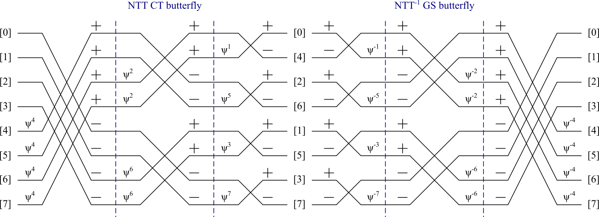

Доказательства с нулевым разглашением и пост-квантовая криптография
-----------

_Анатолий М. Георгиевский_

Дается обзор методов шифрования с использованием структуры нейросети для безопасного запуска моделей нейросетей. Рассматривается три направления развития. Ряд методов доказательства c нулевым разглашением (ZKP); постановка задачи шифрования данных полностью гомоморфного шифрования (FHE) с использованием принципов пост-квантовой криптографии (PQC) и методов построения доказательства с использованием цепной записи данных (blockchain). Цель - сформировать необходимый уровень знаний для разработки собственной концепции запуска нейросетей с использованием RPC протокола и доказательства использования тензоров и модели нейросети с нулевым разглашением. Рассматриваются варианты канонизации описания графов и тензоров для передачи заданий по сети в рамках RPC-протокола. 


*ключевые технологии*: ZKP, zk-SNARK, FHE, LWE, PQC, XOF, blockchain, RPC-протоколы, protobuf, CBOR.

* [ZKP: Доказательства с нулевым разглашением](#zero-knowledge-proof)
* [NIZK: Неинтерактивные схемы доказательства использования сложной функции](#)
* [FHE: Полностью Гомоморфное шифрование](#fully-homomorphic-encryption-fhe)
* [Ring-LWE: обучение с ошибками на кольце полиномов](#r-lwe-cryptographic-algorithms)
* [NTT: быстрое преобразование Фурье на кольце](#)
* [PQC: пост-квантовая криптография](#post-quantum-cryptography)
* [XOF: SHA eXtendable Output Functions](#xof-sha-eXtendable-Output-Functions)
    * [Функция хеширования на модульной арифметике](#функция-хеширования-на-модульной-арифметике)

* [XMSS: eXtended Merkle-tree Signature Scheme](#xmss-extended-merkle-signature-scheme)
* [RPC: Сериализация данных. Стандартизация](#форматы-данных-сериализация)
* Задачи дообучения и запуска нейросетей на приватных данных
* Задачи подписи и шифрования тензоров
* Доказательство применения сложной функции без раскрытия данных
    * Полиномиальная Арифметизация вычислительного графа
    * R1CS: Rank-1 Constraint System
    * Обобщение задачи на рациональные функции и операторы
* Математика для вычислений на кольце полиномов
    * Циклотомические полиномы
    * Прямое и обратное теоретико-числовое преобразование (NTT)
    * Негациклическая свертка на кольце
    * Поиск примитивного корня k-й степени по модулю простого числа
    * Умножение полиномов методом Карацубы

* R-LWE Cryptographic Algorithms
    * [Алг 1. PKC на базе Ring-LWE](#algorithm-1-r-lwe-public-key-cryptosystem)
    * [Алг 2. Oblivious Transfer Based on R-LWE](#algorithm-2-oblivious-transfer-based-on-r-lwe)
    * [Алг 3. Zero-Knowledge Proof Based on R-LWE](#algorithm-3-zero-knowledge-proof-based-on-r-lwe)
    * [Алг 4. NTT polynomial multiplication](#algorithm-4-ntt-polynomial-multiplication)
* Приложение A. Алгоритмы модульной арифметики
    * [Алг 5. Barret modular reduction](#algorithm-a1-barrett-reduction)
    * [Алг 6. Signed Montgomery reduction](#algorithm-a2-signed-montgomery-reduction)
    * [Алг 7. Modular exponentiation](#algorithm-a3-modular-exponentiation)
    * [Алг 8. Shoup's modular multiplication](#algorithm-a4-shoups-modular-multiplication)
    * [Алг 9. Мodular multiplication by constant](#algorithm-a41-modular-multiplication-by-constant)
    * [Алг 10. Division by constant](#)
    * [Алг 11. Montgomery's modular multiplication](#)
* Алгоритмы прямого и обратного преобразования NTT
    * [Алг 12. Harvey NTT Butterfly](#algorithm-a5-harvey-ntt-butterfly)
    * [Алг 13. Shoup's invNTT butterfly](#algorithm-a5-shoups-invntt-butterfly)
    * [Алг 14. Harvey invNTT butterfly](#algorithm-a5-harvey-invntt-butterfly)
    * [Алг 15. Прямое преобразование NTT (Cooley-Tukey)](#)
    * [Алг 16. Обратное преобразование NTT (Gentleman-Sande)](#)
* Алгоритмы хеширования и генерации случайных чисел MWC
    * [Aлг . MWC32/64: Генерация псевдослучайных чисел](#)
    * [Aлг . MWC32: Хэш-функции для фильтра Блума](#)
* Приложение Б. Арифметизация операций и преобразование форматов
    * Microscaling: Числа с пониженной размерностью и общей экспонентой
    * Правила округления для чисел с пониженной размерностью: round-to-nearest, round-to-nearest-even, stochastic rounding.
* [Приложение С. Референсные алгоритмы](#приложение-с-референсные-алгоритмы)
    * [Алг . Поиск корня степени 2N= 2^s по модулю простого числа](#)
    * [Aлг . NTT для негациклического полинома x^N + 1](#)
    * [Aлг . invNTT для негациклического полинома x^N + 1](#)

**Введение**

Современные нейросетевые модели требуют защиты данных и вычислений, особенно в децентрализованных системах. Документ рассматривает интеграцию ZKP, FHE и PQC для обеспечения конфиденциальности и целостности при запуске моделей, а также стандартизацию форматов данных и протоколов для распределенных вычислений и доказательства с использованием цепной записи данных.

Проблематика: необходимость стандартизации и канонизации для безопасного запуска нейросетей. Доказательство использования тензоров и моделей моделей с нулевым разглашением (ZKP) и гомоморфного шифрования (FHE) для защиты данных и вычислений. 

Криптографические примитивы
- ZKP (zk-SNARK, zk-STARK): математические основы, свойства (полнота, корректность, нулевое разглашение).
- FHE (Ring-LWE, CKKS, TFHE): принципы работы, алгоритмы шифрования и дешифрования, пост-квантовая устойчивость.
- PQC: роль LWE/Ring-LWE в защите от квантовых угроз.
- XMSS: eXtended Merkle Signature Scheme.
- Blockchain: цепная запись данных,
- Zero-Knowledge Machine Learning (ZKML)
- Inference Privacy: атаки на inference (model inversion, membership inference), защита с использованием ZKP/FHE.

Примеры фреймворков: ZKTorch, Artemis, opp/ai, opML.\
Применение в блокчейне: DeFi, идентификация, генеративный ИИ.
- Интеграция ZKP с машинным обучением и генерацией.

Стандартизация и сериализация
- Форматы данных: ONNX, GGUF, Safetensors; бинарное кодирование Protobuf, CBOR.
- Канонизация графов вычислений и тензоров: Protobuf, CBOR.
- Протоколы RPC: gRPC, CoAP, JSON-RPC.

Квантизация и оптимизация
- Форматы квантизации: MXFP8, MXINT8, MXFP4, тернарная логика.
- Влияние и согласование квантового шума (QSNR) в схемах ZKP/FHE.
- Методы компенсации ошибок: пост-квантизация (PTQ, post-training quantization), диффузия ошибки.

* [[2405.03144](https://arxiv.org/pdf/2405.03144)] PTQ4SAM: Post-Training Quantization for Segment Anything

-- Квантизация PTQ определяется примерно так: 
```math
\begin{aligned}
x_q &= \mathrm{clamp}( \lfloor {x \over s} \rceil + z, 0, 2^N - 1) \\
\tilde{x} &= s \cdot (x_q -z) \approx x
\end{aligned}
```
При этом получаем целочисленный метод квантизации подобный `Q8`. 
Немного иначе будет выглядеть квантизация для MX - Microscaling Formats, для которых выделяется общая экспонента `E8M0` и используется операция округление RTE с насыщением, финитная арифметика. Подобные операции хорошо согласованы с архитектурой тензорных ядер GPU.

Мы предлагаем использовать квантизацию, при которой квантовая ошибка с предыдущего цикла накапливается и компенсирует ошибку квантизации. Это важный принцип работы с физическими моделями, который обеспечивает законы сохранения. Для цифровых фильтров изображений ошибка может компенсироваться за счет перераспределения остатка между соседними пикселями изображения - это принцип диффузии ошибки. Для векторов, так можно минимизировать ошибку длины вектора за счет диффузии ошибки между компонентами вектора. 

Среди обозначенных направлений, нас интересует возможность интеграции пост-квантовой криптографии с открытым ключом для безопасного запуска нейросетей и дообучения на приватных данных. Выделяются методы шифрования такие как (LWE, learning with errors), основанные на добавлении ошибки квантования с нормальным или гауссовым распределением. Данные в нейросетях должны сопровождаться доказательством того, что генерация получена с использованием авторизованных данных пользователя и данной нейросети. Для доказательства предложено использовать технологию цепной записи данных поверх вычислительного графа тензорных операций нейросети и протоколы ZKP, доказывающие без раскрытия весов и архитектуры сети, что для получения результата использована определенная нейросеть. 

Использование методов гомоморфного шифрования требует стандартизации методов сериального представления тензоров, методов канонизации бинарного описания тензоров и графа тензорных операций нейросети. Стандартизация и канонизация рассматривается в контексте RPC протокола. Для реализации бинарного RPC протокола подходят методы кодирования Google Protobuf и CBOR. Протоколы RPC могут быть использованы не только в задачах распределения вычислений в кластере, но и Edge-computing, таких как распределенная обработка визуальных данных. 

## Zero-Knowledge Proof

Доказательства с нулевым разглашением (Zero-Knowledge Proofs, ZKP) представляют собой криптографический метод, позволяющий одной стороне (проверяющему) убедиться в истинности утверждения, не раскрывая при этом дополнительной информации. Рассмотрим математические принципы, лежащие в основе ZKP, ключевые схемы и их применение в современных системах, таких как блокчейны и протоколы аутентификации.

*ZKP* позволяют доказать, что некоторое утверждение истинно, без передачи какой-либо дополнительной информации. Например, можно доказать, что вы знаете пароль, не раскрывая сам пароль. В нашем контексте необходимо доказать что к данным пользователя применена функция, без раскрытия информации о самой функции. ZKP обладают тремя основными свойствами:
* *Полнота (Perfect Completeness)*: Если утверждение истинно, честный проверяющий убедится в этом с высокой вероятностью.
* *Корректность (Computational Soundness)*: Если утверждение ложно, ни один злонамеренный доказывающий не сможет убедить проверяющего в обратном, кроме как с ничтожно малой вероятностью.
* *Нулевое разглашение (Perfect Zero-Knowledge)*: Проверяющий не узнает ничего, кроме факта истинности утверждения.

*ZKP* основаны на трудных вычислительных задачах, таких как дискретное логарифмирование, факторизация больших чисел или эллиптические кривые. 

Существует несколько типов ZKP, включая интерактивные и неинтерактивные схемы.

**Интерактивные ZKP**\
Интерактивные ZKP, такие как протокол Шнорра [], требуют многократного обмена сообщениями между доказывающим и проверяющим. Они эффективны, но требуют активного взаимодействия между доказывающей и проверяющей стороной.

**Неинтерактивные ZKP (NIZK)**\
Неинтерактивные ZKP, такие как zk-SNARK (Zero-Knowledge Succinct Non-Interactive Argument of Knowledge), позволяют доказывающему создать доказательство, которое можно проверить без дальнейшего взаимодействия. В основе лежит принцип публикации (Commitment) некоторых данных, необходимых для выполнения проверки.

zk-SNARK используют эллиптические кривые и полиномиальные обязательства.

* [[2024/2025](https://eprint.iacr.org/2024/2025.pdf)] Mira: Efficient Folding for Pairing-based Arguments
* [[2016/260](https://eprint.iacr.org/2016/260.pdf)] On the Size of Pairing-based Non-interactive Arguments

{Привести из статьи определения криптографических примитивов}


*zk-SNARK*. Пусть дана функция $f(x)$, которую нужно проверить. Процесс включает:
- Преобразование $f(x)$ в полиномиальную форму.
- Создание доказательства с использованием парного соответствия (pairing) на эллиптических кривых.
- Проверка доказательства с использованием публичного ключа.

Пример применения: блокчейн Zcash, где zk-SNARK обеспечивают анонимность транзакций.

*zk-STARKs*. Zero-Knowledge Scalable Transparent Arguments of Knowledge использует пост-квантовую криптографию, криптографический хеш и подпись на основе merkle-деревьев.
{подробно}

* [[2018/046](https://eprint.iacr.org/2018/046.pdf)] Scalable, transparent, and post-quantum secure computational integrity
* (https://aszepieniec.github.io/stark-anatomy)
* (https://github.com/elibensasson/libSTARK)

* [[2202.06877](https://arxiv.org/pdf/2202.06877)] A Review of zk-SNARKs

**Zero-Knowledge Machine Learning** (ZKML, машинное обучение с нулевым разглашением) is a cryptographic technique that enables the verification of machine learning models on blockchain networks without revealing the underlying data or computations. This technology allows for secure, privacy-preserving, and transparent use of AI models in decentralized applications, ensuring the integrity and trustworthiness of the results. ZKML is particularly useful in DeFi, gaming, and identity verification, where it can enhance user experience, automate decision-making processes, and protect sensitive information.

* [[2507.07031](https://arxiv.org/pdf/2507.07031)] ZKTorch: Compiling ML Inference to Zero-Knowledge Proofs via Parallel Proof Accumulation
Authors: Bing-Jyue Chen, Lilia Tang, Daniel Kang

> ZKTorch — фреймворк для компиляции вывода (inference) машинного обучения в доказательства с нулевым разглашением (ZKP) с использованием параллельного накопления доказательств. ZKTorch оптимизирует процесс создания zk-SNARK для ML-моделей, снижая вычислительные затраты за счет параллелизации операций над тензорами. Подход протестирован на моделях, таких как ResNet, и демонстрирует улучшение производительности по сравнению с существующими библиотеками, такими как ezkl.

* [[2502.18535](https://arxiv.org/pdf/2502.18535)] A Survey of Zero-Knowledge Proof Based Verifiable Machine Learning
Authors: Zhizhi Peng, Taotao Wang, Chonghe Zhao, Guofu Liao, Zibin Lin, Yifeng Liu, Bin Cao, Long Shi, Qing Yang, Shengli Zhang

* [[2410.13752](https://arxiv.org/pdf/2410.13752)] Privacy-Preserving Decentralized AI with Confidential Computing
Authors: Dayeol Lee, Jorge António, Hisham Khan

* [[2409.12055](https://arxiv.org/pdf/2409.12055)] Artemis: Efficient Commit-and-Prove SNARKs for zkML
Authors: Hidde Lycklama, Alexander Viand, Nikolay Avramov, Nicolas Küchler, Anwar Hithnawi

* [[2405.17934](https://arxiv.org/pdf/2405.17934)] Proof of Quality: A Costless Paradigm for Trustless Generative AI Model Inference on Blockchains
Authors: Zhenjie Zhang, Yuyang Rao, Hao Xiao, Xiaokui Xiao, Yin Yang

* [[2404.16109](https://arxiv.org/pdf/2404.16109)] zkLLM: Zero Knowledge Proofs for Large Language Models

* [[2402.15006](https://arxiv.org/pdf/2402.15006)] opp/ai: Optimistic Privacy-Preserving AI on Blockchain
Authors: Cathie So, KD Conway, Xiaohang Yu, Suning Yao, Kartin Wong

* [[2402.06414](https://arxiv.org/pdf/2402.06414)] Trust the Process: Zero-Knowledge Machine Learning to Enhance Trust in Generative AI Interactions
Authors: Bianca-Mihaela Ganescu, Jonathan Passerat-Palmbach
<!--
[2502.18535] A Survey of Zero-Knowledge Proof Based Verifiable Machine Learning
Авторы: Zhizhi Peng и др.
Аннотация: Обзор современных методов использования ZKP для верификации ML-моделей. Рассматриваются ключевые схемы (zk-SNARK, zk-STARK), их применение в блокчейн-приложениях (DeFi, идентификация) и ограничения, такие как высокая вычислительная сложность и необходимость оптимизации для больших моделей. Особое внимание уделено интеграции ZKP с FHE и стандартизации форматов данных для ML.
[2410.13752] Privacy-Preserving Decentralized AI with Confidential Computing
Авторы: Dayeol Lee и др.
Аннотация: Статья исследует использование технологий конфиденциальных вычислений (Confidential Computing) для защиты данных и моделей в децентрализованных системах ИИ. Рассматриваются комбинации ZKP и FHE для обеспечения конфиденциальности при распределенном inference. Предложены архитектуры для безопасного выполнения моделей на ненадежных узлах, с примерами применения в медицинских и финансовых системах.
[2409.12055] Artemis: Efficient Commit-and-Prove SNARKs for zkML
Авторы: Hidde Lycklama и др.
Аннотация: Artemis — это схема zk-SNARK, оптимизированная для машинного обучения с нулевым разглашением (zkML). Она использует подход "commit-and-prove", минимизирующий размер доказательств и ускоряющий верификацию. Подход протестирован на задачах классификации и регрессии, демонстрируя снижение вычислительных затрат по сравнению с традиционными zk-SNARK.
[2405.17934] Proof of Quality: A Costless Paradigm for Trustless Generative AI Model Inference on Blockchains
Авторы: Zhenjie Zhang и др.
Аннотация: Статья предлагает парадигму "Proof of Quality" для верификации качества вывода генеративных моделей ИИ на блокчейне без дополнительных вычислительных затрат. Используется комбинация ZKP и блокчейн для обеспечения целостности и воспроизводимости результатов. Применение: децентрализованные платформы для генеративного ИИ.
[2404.16109] zkLLM: Zero Knowledge Proofs for Large Language Models
Аннотация: Работа фокусируется на применении ZKP к большим языковым моделям (LLM). Рассматриваются методы компиляции LLM в схемы доказательств с использованием ONNX и zk-SNARK. Предложены оптимизации для снижения размера доказательств и ускорения верификации, что делает подход применимым для реальных сценариев, таких как безопасный чат-бот на блокчейне.
[2402.15006] opp/ai: Optimistic Privacy-Preserving AI on Blockchain
Авторы: Cathie So и др.
Аннотация: Статья представляет фреймворк opp/ai, сочетающий оптимистичное машинное обучение (opML) и zkML для достижения баланса между конфиденциальностью и производительностью. Оптимистичный подход снижает вычислительные затраты за счет предположения о честности участников, с последующей верификацией через ZKP. Применение: децентрализованные сервисы ИИ.
[2402.06414] Trust the Process: Zero-Knowledge Machine Learning to Enhance Trust in Generative AI Interactions
Авторы: Bianca-Mihaela Ganescu, Jonathan Passerat-Palmbach
Аннотация: Работа исследует, как zkML может повысить доверие к генеративным моделям ИИ, обеспечивая верификацию без раскрытия данных. Рассматриваются сценарии, где zk-SNARK используется для подтверждения целостности вывода модели, с примерами в задачах генерации текста и изображений.
[2401.17555] opML: Optimistic Machine Learning on Blockchain
Авторы: KD Conway и др.
Аннотация: Статья описывает opML — подход, использующий оптимистичные предположения для повышения эффективности ML на блокчейне. В отличие от традиционного zkML, opML минимизирует затраты на доказательства, полагаясь на проверку только в случае споров. Подход интегрируется с FHE для защиты данных.

-->

* [[2401.17555](https://arxiv.org/pdf/2401.17555)] opML: Optimistic Machine Learning on Blockchain
Authors: KD Conway, Cathie So, Xiaohang Yu, Kartin Wong

> Объединение технологий искусственного интеллекта (ИИ) и технологии блокчейн меняет цифровой мир, предлагая децентрализованные, безопасные и эффективные сервисы ИИ на блокчейн-платформах. Несмотря на обещания, высокие вычислительные требования ИИ на блокчейне вызывают серьёзные проблемы с конфиденциальностью и эффективностью. Фреймворк Optimistic Privacy-Preserving AI (opp/ai) представлен как новаторское решение этих проблем, обеспечивая баланс между защитой конфиденциальности и вычислительной эффективностью. Фреймворк объединяет машинное обучение с нулевым разглашением (zkML) для обеспечения конфиденциальности с оптимистичным машинным обучением (opML) для повышения эффективности, создавая гибридную модель, специально разработанную для сервисов ИИ на блокчейне. В данном исследовании представлен фреймворк opp/ai. 


* [[arXiv:2402.06414](https://arxiv.org/pdf/2402.06414)] Trust the Process: Zero-Knowledge Machine Learning to Enhance Trust in Generative AI Interactions
Authors: Bianca-Mihaela Ganescu, Jonathan Passerat-Palmbach

* [[arXiv:2401.17555](https://arxiv.org/pdf/2401.17555)] opML: Optimistic Machine Learning on Blockchain
Authors: KD Conway, Cathie So, Xiaohang Yu, Kartin Wong

— использование машинного обучения с нулевым разглашением (zkML). zkML представляет собой новую парадигму интеграции машинного обучения и блокчейна. zkML использует *zk-SNARK* (краткие неинтерактивные аргументы знаний с нулевым разглашением) и играет ключевую роль в защите конфиденциальных параметров модели и пользовательских данных во время процессов обучения и вывода (inference). Это не только снижает проблемы конфиденциальности, но и снижает вычислительную нагрузку на сеть блокчейна, что делает zkML перспективным кандидатом для децентрализованных приложений машинного обучения.

* [[2502.02387](https://arxiv.org/pdf/2502.02387)] SoK: Understanding zk-SNARKs: The Gap Between Research and Practice

> Систематизация знаний о zk-SNARK, включая их теоретические основы, практические реализации и ограничения. Рассматриваются проблемы масштабируемости, настройки (trusted setup) и оптимизации для реальных приложений, таких как блокчейн и ML.

* [[2506.20915](https://arxiv.org/pdf/2506.20915)] ZKPROV: A Zero-Knowledge Approach to Dataset Provenance for Large Language Models

> ZKPROV предлагает метод доказательства происхождения данных для LLM с использованием ZKP. Это позволяет верифицировать, что модель обучена или выполняет inference на авторизованных данных, не раскрывая их содержимое. Применение: защита интеллектуальной собственности и конфиденциальности данных.

**Cryptographic Primitives**
> Zero-Knowledge Succinct Non-Interactive Argument of Knowledge (*zk-SNARK*). A *zk-SNARK* is a cryptographic proof system that allows a prover to convince a verifier that a statement $𝑥 ∈ L_𝑅$ is valid with respect to a relation 𝑅, without revealing any auxiliary information (i.e., the witness 𝜔).

Примитивы, из которых строится схема доказательства применения нейросети:
1. $SETUP (\lambda, W) → \{C,\Omega\}$  - компиляция модели со своей архитектурой и весами дает два набора векторов ($𝐶$)-публичный набор и приватный ($\Omega$).
2. $Prove(𝐶, \Omega, 𝑝) → \{r, 𝜋\}$ - запуск модели является доказательством над промптом пользователя ($p$) генерирует ответ ($r$) и $\pi$ - доказательство. Доказательство - это совместно результат вывода модели inference и генерация проверочного вектора ($\pi$).
3. $Verify(𝑝, 𝑟, 𝜋, 𝐶) → {Accept, Reject}$ -- верификация выполняется с использованием публичных компонент доказательства, над промптом и выводом модели. 

Этап компиляции $SETUP()$ можно разложить, на две процедуры: генерацию приватного ключа $pp = KeyGen(\lambda)$ и публичного набора для данной модели $C = Commit(W; \Omega, pp)$


Definition 2.2 (NIZK). A NIZK proof consists of three algorithms (Setup,Prove,Verify) that are defined as follows:
1. $Setup(pp) → (pk,vk)$: On input a public parameter pp, it
outputs a proving and verification key pk and vk.
2. $Prove(pk, x,w,R) → π$: On input pk, an instance and witness pair (x,w), and the relation R, it outputs a proof π.
3. $Verify(vk, x,π) → {0,1}$: On input vk, x, and π, it outputs 1
or 0 to show if π is accepted or not.

{переделать протокол под SNARK}

Важным параметрами построения схемы доказательства является возможность верификации доказательства на стороне клиента и объем данных необходимых для выполнения этой проверки. Важно, чтобы сложность верификации позволяла выполнять проверку налету в процессе загрузки результатов запуска сети. Важно, чтобы сигнатура сети $C$ занимала ограниченный объем данных, а доказательство было сравнимо по длине с вектором семантических признаков `m_embed`.

Операция генерации публичного набора основано на Гомоморфизме приватной модели нейросети. Гомоморфные преобразования сохраняют структуру. Каждой операции сопоставляется другая. При этом есть разногласие в представлении макро-операций таких как MLP, FFN и Attention и нелинейных функций. Тензорные макро-операции можно представлять, как составные или неделимые. Каждой нелинейной операции необходимо сопоставить линейное (полиномиальное) представление. 

Наравне с ZKP и SNARK следует рассмотреть принципы построения криптосистемы FHE (Fully Homomorphic Encryption scheme), такой как Ring-LWE, которая обеспечивает шифрование и дешифрацию с использованием принципов удовлетворяющих требованиям PQC (Post-Quantum Cryptography). 

Рассмотрение можно начать с принципа поля. Например, RSA так же является HE (гомоморфным преобразованием), строится на операции умножения в конечном поле с использованием модульной арифметики с числами большой разрядности. Мы рассматриваем две операции в модульной арифметике типа умножения и сложения, на которых можно построить расчеты в полиномиальном приближении. Можно доказать, что в некоторой области пространства непрерывную функцию можно аппроксимировать полиномами с заданной точностью. Таким образом любую функцию мы стремимся преобразовать в полиномиальную функцию для возможности построения схемы доказательства.

**Принципы гомоморфного шифрования (HE)**

* [CryptoNets](https://www.microsoft.com/en-us/research/wp-content/uploads/2016/04/CryptonetsTechReport.pdf): Applying Neural Networks to Encrypted Data with High Throughput and Accuracy Homomorphic Encryption, 2016
* [[1412.6181](https://arxiv.org/pdf/1412.6181)] Crypto-Nets: Neural Networks over Encrypted Data

> For our purpose, a (secret key) Homomorphic Encryption scheme consists of four algorithms: 
encryption ($E_k$), decryption $D_k$, addition (⊕) and multiplication (⊗). 
The encryption algorithm takes as input a message and a secret key $k$. The decryption takes as input an element from the ciphertext space and a key, while the algorithms ⊕ and ⊗ do not depend on the secret key and only take two ciphertexts as input. Let $m_1$ and $m_2$ be integer messages and let $k$ be a secret key. 

Представленные алгоритмы удовлетворяют следующим свойствам:

1. Функция шифрования $E_k(m)$, такая что $m$ практически невозможно восстановить обратно без использования приватного ключа $k$.
2. Существует обратная функция: $m_1 = D_k(E_k(m_1))$.
3. Выполняется свойство линейности: $m_1 + m_2 = D_k (E_k(m_1) ⊕ E_k(m_2))$.
4. Выполняется свойство линейности: $m_1 × m_2 = D_k (E_k(m_1) ⊗ E_k(m_2))$.
5. Алгоритмы $⊕$ и $⊗$ не используют закрытый ключ шифрования.

Алгоритмы $⊕$ и $⊗$ позволяют многократное каскадное применение, так что полиному над $m_i$ соответствует аналогичный полином с операциями $⊕$ и $⊗$. Операции обладают коммутативностью. 

Let $m_1, ... , m_n$ be messages. Представленные алгоритмы позволяют составить такую полиномиальную функцию, что удовлетворено равенство:
```math
P(m_1, ... , m_n) = D_k(\tilde{P}(E_k(m_1), ... , E_k(m_n)))~.
```

Криптосистема *Homomorphic Encryption* состоит из четырех алгоритмов. Для компиляции схемы из вычислительного графа нейросети используются полиномиальные приближения нелинейных тензорных операций, все коэффициенты строятся из целых чисел по модулю простого числа и операции сдвига с редуцированием (XTIME - вместо масштабирования используется уполовинивание или удвоение позволяет ввести операции умножения и деления полиномов). 
Операции умножения полиномов выполняются с использованием нескольких вариантов умножения, которые хорошо разобраны. Один из вариантов умножения находит широкое применение для полиномов с высокой степенью N=10..15 с использованием NTT (аналога быстрого преобразования Фурье). 

Схема Ring-LWE использует кольца полиномов. По сути мы говорим про модульную арифметику (алгебру над коммутативным кольцами) или арифметику Галуа в конечном поле поверх тех же полиномов. Однако, могут существовать и более сложные варианты - композитные поля и группы Ли. Во всех случаях требуется представлять нелинейные функции их полиномиальной аппроксимацией, чтобы все операции сводились к умножению и сложению в поле. 

В двух словах остановимся на арифметике Галуа. Арифметика галуа GF(2^8) используется при вычислении кодов Рида-Соломона, которые так же построены на полиномах. В системе команд Intel GFNI можно эффективно обрабатывать полиномы. Центральная операция это аппаратная реализация умножения, которая может быть эффективно реализована в FPGA с использованием композитных полей, и операция аффинного преобразования. Но в системе команд GPU аппаратная поддержка отсутствует и акцент делается на параллельные тензорные вычисления в группе с пониженной разрядностью весовых коэффициентов матриц. Таким образом эффективно будут выполняться операции с квантизацией FP8 или INT8, метод эффективного вычисления на GPU должен строится на основе этих форматов. Перспективным можно считать метод, позволяющий уменьшать разрядность операций вплоть до FP4 и тернарной логики. К таким методам можно отнести схему CKKS, работающую с вещественными числами произвольной разрядности.

Заметим, если для операции умножения существует обратная, то существует возможность представления в рациональных функциях (аппроксимация Паде́). Использование рациональных аппроксимаций при доказательстве с нулевым разглашением (ZKP) к настоящему времени не применяется, не достаточно изучено. Следует заметить, что запуск моделей нейросетей на различном оборудовании GPU, CPU, NPU не детерминирован иза отсутствия стандартизации методов приближенного вычисления функций активации, таких как: softmax, sigmoid, tanh, swish, SiLU, GeLU. Вычисления сопровождаются квантовым шумом (ошибкой квантизации), который необходимо учитывать при построении схемы доказательства.

## Fully Homomorphic Encryption (FHE)

Brakerski/Fan-Vercauteren [Bra12, FV12] scheme, a Ring-Learning With Errors (Ring-LWE)-based crypto-system. Позволяет восстановить данные после шифрования и обладает свойствами пост-квантовой криптографии. 

* (https://people.csail.mit.edu/rivest/Rsapaper.pdf) R.L. Rivest, at al., A Method for Obtaining Digital Signatures and Public-Key Cryptosystems, 1978
* (https://crypto.stanford.edu/craig/craig-thesis.pdf)
* (https://www.cs.cmu.edu/~odonnell/hits09/gentry-homomorphic-encryption.pdf)
* [[2009/547](https://eprint.iacr.org/2009/547.pdf)] Non-Interactive Verifiable Computing: Outsourcing Computation to Untrusted Workers

-- эти три работы с участием Craig Gentry лежат в основе последующих работ по ZKP. Авторы формулируют принципы шифрования для распределенных вычислений с использованием четырех функций
1. $KeyGen(\lambda, F) \to {pk, sk}$  - генерация двух ключей с использованием значния о функции
2. $\mathrm{ProbGen}_{sk}(x) \to \{\sigma_x, \tau_x\}$ - генерация зашифрованного  вектора данных и проверочных данных. 
3. $\mathrm{Compute}_{pk}(\sigma_x) \to \sigma_y$ - вычисления выполняются удаленно с использованием зашифрованных входных данных.
4. $\mathrm{Verify}_{sk}(\sigma_y, \tau_x) \to y=F(x)$ в результате проверки восстанавливается результат или устанавливается, что результат не является валидным значением функции.

* (https://cims.nyu.edu/~regev/papers/pqc.pdf) Lattice-based Cryptography
* [[2011/277](https://eprint.iacr.org/2011/277.pdf)] Zvika Brakerski, Craig Gentry, Vinod Vaikuntanathan. Fully Homomorphic Encryption without Bootstrapping, 2011
* [[2011/344](https://eprint.iacr.org/2011/344.pdf)] Zvika Brakerski, Vinod Vaikuntanathan. Efficient Fully Homomorphic Encryption from (Standard) LWE, 2011
* [[2012/078](https://eprint.iacr.org/2012/078.pdf)] Zvika Brakerski. Fully Homomorphic Encryption without Modulus Switching from Classical GapSVP, 2012
* [[2012/144](https://eprint.iacr.org/2012/144.pdf)] Junfeng Fan and Frederik Vercauteren. Somewhat Practical Fully Homomorphic
Encryption, 2012
* [[2013/340](https://eprint.iacr.org/2013/340.pdf)] Homomorphic Encryption from Learning with Errors: Conceptually-Simpler, Asymptotically-Faster, Attribute-Based, 2013
> GSW (Gentry-Sahai-Waters) — это схема гомоморфного шифрования, основана на проблеме Learning With Errors (LWE). GSW использует матричный подход, где шифротекст представляет собой матрицу, а гомоморфные операции (сложение и умножение) выполняются через матричные вычисления. 

* [[2014/816](https://eprint.iacr.org/2014/816.pdf)] FHEW: Bootstrapping Homomorphic Encryption in less than a second
* [[2016/421](https://eprint.iacr.org/2016/421.pdf)] J.H. Cheon, at al. Homomorphic Encryption for Arithmetic of Approximate Numbers
> CKKS (Cheon-Kim-Kim-Song) — это схема полностью гомоморфного шифрования (FHE), предназначенная для эффективных вычислений с вещественными числами. Она позволяет выполнять операции сложения, умножения и другие над зашифрованными данными, не раскрывая исходную информацию.

* [[2016/837](https://eprint.iacr.org/2016/837.pdf)] J.H. Cheon and D. Stehle. Fully Homomorphic Encryption over the Integers Revisited, 2016
* [[2018/931](https://eprint.iacr.org/2018/931.pdf)] J.H. Cheon, at al. A Full RNS Variant of Approximate Homomorphic Encryption
> В этой работе представлен вариант приближенного гомоморфного шифрования, который оптимален для реализации на стандартных компьютерных системах. Вводится новая структура модуля шифротекста, которая позволяет использовать как разложение циклотомических многочленов в RNS, так и преобразование NTT на каждом из компонентов RNS.

* [[2018/039](https://eprint.iacr.org/2018/039.pdf)] Faster AVX2 optimized NTT multiplication for Ring-LWE lattice cryptography

* [[2018/421](https://eprint.iacr.org/2018/421.pdf)] TFHE: Fast Fully Homomorphic Encryption over the Torus
> четко даются определения и математические основы полностью гомоморфного преобразования на единичном торе.

**Обозначения**. In the rest of the paper, we denote the security parameter as λ. 
We denote as $\mathbb{B}$ the set $\{0, 1\}$ without any structure and by $\mathbb{T}$ the real Torus $\mathbb{R}/\mathbb{Z}$, the set of real numbers modulo 1. We denote by $\mathbb{Z}_N[X]$ the ring of polynomials
$\mathbb{Z}[X]/(X^N + 1)$. $\mathbb{T}_N [X]$ denotes $\mathbb{R}[X]/(X^N + 1) \mod 1$ and $\mathbb{B}_N[X]$ denotes the polynomials in $\mathbb{Z}_N[X]$ with binary coefficients.

**Определение ($\mathcal{R}$-module)**. Let $(\mathcal{R}, +, ×)$ be a commutative ring. We say that
a set $M$ is a $\mathcal{R}$-module when $%$ is an abelian group, and when there exists an
external operation $·$ (product) which is bi-distributive and homogeneous. Namely,
$∀r, s ∈ R$ and $x, y ∈ M$, 
$1_{\mathcal{R}} ·x = x$, $(r+s)·x = r ·x+s·x$, $r ·(x+y) = r ·x+r ·y$,
and $(r × s) · x = r · (s · x)$.

* [[2018/828](https://eprint.iacr.org/2018/828.pdf)] Aurora: Transparent Succinct Arguments for R1CS
* [[2019/317](https://eprint.iacr.org/2019/317.pdf)] Libra: Succinct Zero-Knowledge Proofs with Optimal Prover Computation
* [[2020/086](https://eprint.iacr.org/2020/086.pdf)] Bootstrapping in FHEW-like Cryptosystems
* [[2021/1337](https://eprint.iacr.org/2021/1337)] Large-Precision Homomorphic Sign Evaluation using FHEW/TFHE Bootstrapping
* [[2022/198](https://eprint.iacr.org/2022/198.pdf)] Efficient FHEW Bootstrapping with Small Evaluation Keys, and Applications to Threshold Homomorphic Encryption
* [[2022/915](https://eprint.iacr.org/2022/915.pdf)] OpenFHE: Open-Source Fully Homomorphic Encryption Library
* [[2024/463](https://eprint.iacr.org/2024/463.pdf)] Security Guidelines for Implementing Homomorphic Encryption
* [[2024/2025](https://eprint.iacr.org/2024/2025.pdf)] Mira: Efficient Folding for Pairing-based Arguments
* [[2025/263](https://eprint.iacr.org/2025/263.pdf)] Transparent SNARKs over Galois Rings
* [[2025/882](https://eprint.iacr.org/2025/882.pdf)] Leveled Homomorphic Encryption over Composite Groups

* [[2103.16400](https://arxiv.org/pdf/2103.16400)] Intel HEXL: Accelerating Homomorphic Encryption with Intel AVX512-IFMA52
* [[2401.03703](https://arxiv.org/pdf/2401.03703)] On Lattices, Learning with Errors, Random Linear Codes, and Cryptography
* [[2503.05136](https://arxiv.org/pdf/2503.05136)] The Beginner’s Textbook for Fully Homomorphic Encryption\
(https://fhetextbook.github.io/)
* [[2507.04501](https://arxiv.org/pdf/2507.04501)] LINE: Public-key encryption


* (https://faculty.kfupm.edu.sa/coe/mfelemban/SEC595/References/Introduction%20to%20the%20BFV%20FHE%20Scheme.pdf)

* [OpenFHE] (https://github.com/openfheorg/openfhe-development)
> Fully Homomorphic Encryption (FHE) is a powerful cryptographic primitive that enables performing computations over encrypted data without having access to the secret key. OpenFHE is an open-source FHE library that includes efficient implementations of all common FHE schemes:
* Brakerski/Fan-Vercauteren (BFV) scheme for integer arithmetic
* Brakerski-Gentry-Vaikuntanathan (BGV) scheme for integer arithmetic
* Cheon-Kim-Kim-Song (CKKS) scheme for real-number arithmetic

Software references for publicly available Homomorphic Encryption libraries:
* [cuFHE] (https://github.com/vernamlab/cuFHE)
* [cuHE] (https://github.com/vernamlab/cuHE)
* [HEAAN] (https://github.com/snucrypto/HEAAN)
* [HElib] (https://github.com/shaih/HElib)
* [NFLlib] (https://github.com/CryptoExperts/FV-NFLlib)
* [PALISADE] (https://git.njit.edu/groups/PALISADE)
* [SEAL] (http://sealcrypto.org)
* [TFHE] (https://tfhe.github.io/tfhe/)

**Стандартизация**
* [Homomorphic Encryption Standardization](https://homomorphicencryption.org/) 
* [[HESv1.1](https://homomorphicencryption.org/wp-content/uploads/2018/11/HomomorphicEncryptionStandardv1.1.pdf)] Homomorphic Encryption Standard, 2018

* [[NIST:fips.203](https://nvlpubs.nist.gov/nistpubs/fips/nist.fips.203.pdf)] Module-Lattice-Based Key-Encapsulation Mechanism Standard. Tech. rep. National Institute of Standards and Technologies, 2024.\
(http://dx.doi.org/10.6028/NIST.FIPS.203)

* [[NIST:fips.204](https://nvlpubs.nist.gov/nistpubs/fips/nist.fips.204.pdf)] Module-Lattice-Based Digital Signature Standard. Tech. rep. National Institute of Standards and Technologies, 2024.\
(http://dx.doi.org/10.6028/NIST.FIPS.204)

* [[NIST:fips.205](https://nvlpubs.nist.gov/nistpubs/fips/nist.fips.205.pdf)] Stateless Hash-Based Digital Signature Standard\
(http://dx.doi.org/10.6028/NIST.FIPS.205)

Стандарты серии PQC применяют Ring-LWE для построения схемы цифровой подписи и схемы выработки ключей для симметричной криптографии. Используют 
* The prime number $𝑞 = 2^{23} − 2^{13} + 1 = 8380417$
* кольцо полиномов $\mathcal{R}_q = \mathbb{Z}_q[x]/(x^{256} + 1)$

Для быстрого вычисления произведения полиномов используются алгоритмы прямого и обратного NTT (Number Theoretic Transform). 
```math
g \circ h = \mathrm{NTT}^{-1}(\mathrm{NTT}(g) \odot \mathrm{NTT}(h))
```

* [34] J. W. Cooley and J. W. Tukey, “An algorithm for the machine calculation of complex fourier series,” Mathematics of computation, vol. 19, no. 90, pp. 297–301, 1965.
* [35] W. M. Gentleman and G. Sande, “Fast fourier transforms: for fun and profit,” in Proceedings of the November 7-10, 1966, fall joint computer conference, 1966, pp. 563–578.
* [[2021/1396](https://eprint.iacr.org/2021/1396.pdf)] NTT software optimization using an extended Harvey butterfly

* [[1205.2926](https://arxiv.org/pdf/1205.2926)] David Harvey. Faster arithmetic for number-theoretic transforms

*Shoup modular multiplication*. The most time-consuming primitive in NTT algorithms
is modular multiplication between the coefficients of a and the fixed (precomputed)
powers of ω.

* [37] Accelerating High-Precision Number Theoretic Transforms using
Intel AVX-512\
(https://spiral.ece.cmu.edu/pub-spiral/pubfile/PACT_2024_AVX_371.pdf)
* (https://arxiv.org/pdf/2404.13544)

* [[2306.01989](https://arxiv.org/pdf/2306.01989)] Optimized Vectorization Implementation of CRYSTALS-Dilithium


### XMSS: eXtended Merkle Signature Scheme

Стандарт FIPS.205 определяет режим eXtended Merkle Signature Scheme (XMSS) и допускают использование функций хеширования: SHA-256, SHA-512, SHAKE-128, SHAKE-256.
* [[NIST:FIPS.202](https://nvlpubs.nist.gov/nistpubs/FIPS/NIST.FIPS.202.pdf)] SHA-3 Standard: Permutation-Based Hash and Extendable-Output Functions\
(http://dx.doi.org/10.6028/NIST.FIPS.202)

> The hash functions are two eXtendable Output Functions (XOF), namely `SHAKE-256` and `SHAKE-128`. 
XOF maps an arbitrary-length bit string to a string of infinitely many bits. These XOF functions are mainly used for generating random bytes of SHAKE-128 to sample matrix $A$ and for generating random bytes of SHAKE-256 to sample $s$, $e$ and $y$.

* [[NIST SP 800-185](https://doi.org/10.6028/NIST.SP.800-185)] SHA-3 Derived Functions: cSHAKE, KMAC, TupleHash, and ParallelHash
* [[NIST SP 800-208](https://doi.org/10.6028/NIST.SP.800-208)] Recommendation for Stateful Hash-Based Signature Schemes


* [RFC8391] XMSS: eXtended Merkle Signature Scheme, 2018
* [RFC8554] Leighton-Micali Hash-Based Signatures, 2019

### Функция хеширования на модульной арифметике

* [[2019/458](https://eprint.iacr.org/2019/458.pdf)] POSEIDON: A New Hash Function for Zero-Knowledge Proof Systems
* [[2019/1107](https://eprint.iacr.org/2019/1107.pdf)] On a Generalization of Substitution-Permutation Networks: The HADES Design Strategy

* [[2022/403](https://eprint.iacr.org/2022/403.pdf)] Horst Meets Fluid-SPN: Griffin for
Zero-Knowledge Applications
* [[2023/107](https://eprint.iacr.org/2023/107.pdf)] The Tip5 Hash Function for Recursive STARKs

-- еще более скоростная функция, основананя на модульной арифметике. Использует NTT для матриц перестановок.

* [[2023/323](https://eprint.iacr.org/2023/323.pdf)] Poseidon2: A Faster Version of the Poseidon Hash Function

-- Цель данной работы упростить функцию хеширования и ускорить ее вычисление за счет параллельного вычисления функций. Требование - использование модульной арифметики совместимой с вчислениями на кольце, длина состояния хеша должна настраиваться на используемую систему полиномов и совмещаться с zk-SNARK по используемым модулям, а модули $\mathbb{F}_q$ выбираются совместимыми кольцом полинов $\mathcal{R}_q = \mathbb{Z}_q[x]/\langle x^N\pm1\rangle$ из Ring-LWE. Алгоритм должен быть arithmetization-frendly, т.е. основан на полиномиальных операциях, содержащих умноежние и сложение. Вектор состояния разбивается на блоки кратные 4. Линейная стадия использует умножение матрицы 4x4 на вектор, нелинейная стадия использует степенную функцию в качестве S-box (нелинейных подстановок): $x \to x^d$, где $d$ - взаимно простое число $gcd(d,q-1)=1$, например 3, 5 или 7. Дополнительный параметр выбора $gcd(d, p + 1) \neq 1$ обеспечивает некоторую устойчивость к атакам на S-box. 

Каждый слой определяется, как произведение матрицы вращения $M$ на результат нелинейнго преобразования вектора $x$.
```math
\mathcal{E}_i(x) = M_{\mathcal{E}} ·
\left(
(x_0 + c^{(i)}_0)^d,(x_1 + c^{(i)}_1)^d, ... ,(x_{t−1} + c^{(i)}_{t−1})^d
\right)
```

**Эффективные циркулянтные MDS-матрицы**

Матрица $N \times N$, заданная циркулянтом $\text{circ}(c_0, c_1, \ldots, c_{t-1})$, определяется следующим образом:

```math
M = \begin{pmatrix}
c_0 & c_1 & \cdots & c_{t-1} \\
c_{t-1} & c_0 & \cdots & c_{t-2} \\
\vdots & \vdots & \ddots & \vdots \\
c_1 & c_2 & \cdots & c_0
\end{pmatrix}.
```

Умножение плотной $N \times N$ матрицы на вектор размерности $N$ может потребовать числа операций порядка $O(N^2)$. Однако, на кольце полиномов $\mathcal{R}_q = \mathbb{F}_q[x]/(x^N - 1)$ существует изоморфизм между $\mathcal{R}_q$ и  циркулянтными матрицами $N \times N$.

Эта связь также описана в [[2022/1577](https://eprint.iacr.org/2022/1577.pdf), раздел 4], где авторы предлагают использовать циркулянтные матрицы для повышения эффективности хеш-функции _Rescue_. В частности, изоморфизм задается следующим образом:

```math
a_{N-1}X^{N-1} + a_{N-2}X^{N-2} + \cdots + a_1X + a_0 \longleftrightarrow 
\begin{pmatrix}
a_0 & a_{N-1} & \cdots & a_1 \\
a_1 & a_0 & \cdots & a_2 \\
\vdots & \vdots & \ddots & \vdots \\
a_{N-1} & a_{N-2} & \cdots & a_0
\end{pmatrix},
```

где $a_i \in \mathbb{F}_q$. Следовательно, для циркулянтов может использоваться метод NTT полиномиального умножения по модулю $X^N - 1$. Алгоритм умножения полиномов NTT обладает асимптотической сложностью $O(N \log N)$. Возможность применния NTT ограничивается выбором модуля $q = 2^L - \alpha 2^s+1$ и полинома $x^N - 1$, где $s \geq 2N$. Для оптимизированной функции _Rescue_ выбрано простое число $q=2^{64} - 2^{32} +1$.

* [[2022/1577](https://eprint.iacr.org/2022/1577.pdf)] Rescue-Prime Optimized
* [[2020/1143](https://eprint.iacr.org/2020/1143.pdf)] Rescue-Prime: a Standard Specification 

В отличие от оптимизированной функции _Rescue_, стандартная использует два варианта S-box: $x^{\alpha}$ и $x^{\bar{\alpha}}$. $α$ and $\bar{α}$ удовлетворяют условию $(x^α)^{\bar{α}} = x$ для всех $x ∈ \mathbb{F}_q$. Для нахождения обратной величины рекомендуется воспользоваться расширенным алгоритмом Евклида.

Таким образом функиция пермутации для SPONGE (губки) основана на модульной арифметике и двух операциях: умножении и сложении. S-box - нелиненый элмент определяется, как поэлементное возведение в степень. Матричные операции 4x4 (32-бит) хорошо оптимизируются на современных процессорах. Матричные перестановки MDS синтезируются на основе циркулянтов. Операция матричного умножения реализуется с использованием прямого и обратного NTT (Number Theoretic Transform). Вот основные идеи построения функции хеширования для ZKP.

Сюда следует добавить два варианта использования функции пермутации: в составе губки (SPONGE) для генерации XOF и в составе функции компрессии для уменьшения размера контекста.

* [[SPONGE](https://keccak.team/files/CSF-0.1.pdf)] Cryptographic sponge functions

{Осмысление} Я представляю, что схема нейросети построена по тому же принципу, что и функция SPONGE в стандарте SHA3 или в новых разработках, ориентированных на интеграцию со схемами zk-SNARKs и zk-STARKs. Работа сети состоит из двух этапов: 1- впитывание `absorb` и 2- выдавливание `squeeze` - генерации. При этом на первом этапе происходит накопление данных в контексте, а на втором генерация и заполнение контекста. Так же можно представить нейросеть, как некоторую функцию, подобную функци SPONGE, которая в качестве параметра принимает один или два вида функций. 

Среди этих идей я выделяю одну - использование NTT для линенйной стадии смешивания. Это означает необходимость реализации NTT в библиотеке. И необходость реализации операции нелинейной векторной операции "S-box" возведения в степень минимального простого числа - константы, которая определяется выбором простого числа $q$ и является генератором ультипликативной группы. 

Например, Для модуля $q = 2^{31}-1$ (число Mersenne 31) значение показателя степени нелинейной функции $\alpha = 5$. 

Значение $\alpha = -1$ принятое в первоначальной версии _Poseidon_ подходит для модулей $p = a\beta - 1$, но небезопасное для модулей вида $p=a\beta +1$.

**Поиск простых чисел для NTT**\
Для простого числа должен существовать корень степени $n$ из единицы, то есть $\omega^n \equiv 1 \mod q$. Для расчетов NTT понадобится корень $\gamma^2 \equiv \omega \mod q$. Условием существования корня степени $n$ из единицы по модулю простого числа $q$ является условие $n|(q-1)$.

Вероятностным критерием пригодности простого числа является возможность извлечения квадратного корня из $-1$, то есть $x^2 \equiv -1 \mod q$. 
Числа вида $q = a\beta +1$ при $a<\beta = 2^s$ -- простые числа Прота. {См. теорему Прота и тестирование чисел Прота на простоту.}

**Теорема Прота**\
Если $p$ — это число Прота вида $A\cdot 2^{n}+1$, где $A$ — нечётно и 
$A<2^{n}$, то $p$ — простое (называемое простым Прота) тогда и только тогда, когда для некоторого квадратичного невычета $g$ выполняется сравнение:
$g^{(p-1)/2}\equiv -1{\pmod {p}}$

Тестирование на простоту выполняется по теореме Прота для случайной или последовательной выборки квадратичных невычетов:
1. Найти квадратичный невычет (генератор мультипликвативной группы) $\mathrm{jacobi}(g,p)=-1$.
2. Проверить для квадратичного невычета $g^{(p-1)/2}\equiv -1{\pmod {p}}$, тогда $p$ — простое по теореме Прота.

Мне удалось извлечь корень сепени n=16,32, 256,512 из некоторых простых чисел вида $A\cdot 2^{16}+1$ или $2^{32} - a0\cdot 2^{16}+1$. В литературе упоминаются числа вида $p = A\cdot 2^s+1$, где $A$ - простое нечетное число. Для таких чисел существует корнеь степени $2^s$ из единицы.
* [[2012/470](https://eprint.iacr.org/2012/470.pdf)] Some Connections Between Primitive Roots and Quadratic Non-Residues Modulo a Prime

-- дан алгоритм выбора чисел $\omega$ и $\gamma$ для NTT через квадратичные не-вычеты. Для работы алгоритма требуется соблюдение условия $p = q\cdot 2^s+1$, $2N|(p-1)$, $q$ - простое нечетное число. Если на кольце $\mathcal{R}_p = \mathbb{F}_p[x]/\langle x^N-1\rangle$ заявлена степень $N=2^8$, то необходимо чтобы $s\geq 9$. 

Проверил ряд простых чисел:
* $2^{23} - 2^{13} + 1$
* $2^{31} - 2^{27} + 1$
* $2^{31} - 2^{25} + 1$
* $2^{31} - 2^{24} + 1$
* $2^{31} - 2^{19} + 1$
* $2^{31} - 2^{17} + 1$
* $2^{31} - 2^{ 9} + 1$

**Theorem (Generalized Pepin Test)**\
Let $p = a\beta + 1$, $a<\beta = 2^s$, $s\geq 2$ be a Proth
number defined in such that $g ∤ t$. Then $p$ is a prime if and only if
$g^{(p−1)/2} ≡ −1 \pmod{ p}$.
* [[0812.2596](https://arxiv.org/pdf/0812.2596)] Deterministic Primality Proving on Proth Numbers

**Теорема (обобщенная теорема Прота)**\
Пусть $p=a\cdot r^{s}+1$ для некоторого простого 
$r$ и целых $s,a\geqslant 1$, для $r^{e}>a$. 
Если для $g$ - квадратичного невычета выполняектся $g^{p-1}\equiv 1 \pmod{p}$ и $g^{(p-1)/r}\not \equiv 1 \pmod{p}$ для некоторого $a$, то $p$ — простое.

Тест простоты мы можем сформулировать так, для некоторого $g$ - квадратичного невычета по модулю $p = a\beta + 1$, $a<\beta = 2^s$, $s\geq 2$:
1. $g ← 3$
2. while $\mathrm{jacobi}(g,p) \neq -1$ do $g ← g+2$
3. $g^{p-1}\equiv 1 \pmod{p}$ и $g^{(p-1)/2}\not \equiv 1 \pmod{p}$

Помимо теста простоты должен соблюдаться критерий выбора простого числа $p$ для NTT, который требует $2N|(p-1)$. Среди модулей, которые прошли проверку на простоту и совместимость с NTT следует выбрать те, которые дают максимальный порядок генератора. Это достигается если a - простое число.

Нашел несколько подходящих простых чисел для N=256, s=9:
```
prime=7ffd5601 ord 7ffd55ff
prime=ffffca01 ord ffffc9ff
prime=fffe2601 ord fffe25ff
prime=fff55601 ord fff555ff
prime=fff30a01 ord fff309ff
prime=ffefc201 ord ffefc1ff
prime=ffea2201 ord ffea21ff
prime=ffe6da01 ord ffe6d9ff
```

**Основные выводы по разделу**. Мы можем предложить функцию возвращающую некриптографический хэш от тензора используя модульную арифметику на кольце с тем же модулем и полиномом. В тоже время есть возможность составить криптографический хэш на модульной арифметике, примером является Poseidon2. При переводе матрицы циклических перестановок MDS в модульную арифметику, мы можем использовать NTT для ускорения операции умножения и выпонении операций перестановок, в том случае, когда матрица MDS задается как циркулянт. NTT возможно использовать, когда модуль имеет корень N-степени. Есть сомнение что выбор модулей вида $p = q\cdot 2^s+1$ - целесообразен. В отличие от модулей $p = q\cdot 2^s-1$, где можно получить период повтора генератора $(p/2-1)$, период повтора (порядок мультипликативной группы) может быть короткий. Среди модулей, которые прошли проверку на простоту и совместимость с NTT следует выбрать те, которые дают максимальный порядок генератора.

{перенести}
**Обозначения**\
Мы вводим обозначения $\mathbb{Z}_q$ как множества целых чисел $(−q/2,q/2]$ где $q>1$ - целые числа. Все целочисленные операции выполняются по модулю $(\mod q)$ если не сказано обратное. Для упрощения, you will see me mostly deal with positive integers in $[0,q)$, but keep in mind that it’s the same as our $\mathbb{Z}_q$, as $−x ≡ q–x(\mod q)$ where $x$ is a positive integer (e.g. $−1≡6~(\mod 7)$ ). Каждый вектора $v∈\mathbb{Z}^n_q$ можно рассматривать как вектор элементов из класса $\mathbb{Z}_q$.

We will use $[⋅]_m$ to specify that we are applying modulo $m$, and $⌊⋅⌉$ for rounding to the nearest integer.

Угловыми скобками $⟨a,b⟩$ обозначим скалярное произведеление (inner product) двух векторов $a,b∈\mathbb{Z}^n_q$ и определим операцию через умножение и сложение по модулю $q$
```math
⟨a,b⟩=\sum\limits_{i}^n a_i⋅b_i~(\mod q)
```

**Learning With Error**\
Learning With Error (LWE) was introduced by [Regev in 2009](https://cims.nyu.edu/~regev/papers/qcrypto.pdf) and can be defined as follows: 
Для целых чисел $n≥1$ и $q≥2$, let’s consider the following equations
```math
\begin{aligned}
⟨s,a_1⟩+e_1 &=b_1~(\mod q)\\
⟨s,a_2⟩+e_2 &=b_2~(\mod q)\\
&…\\
⟨s,a_m⟩+e_m &=b_m~(\mod q)
\end{aligned}
```

where s and ai are chosen independently and uniformly from $\mathbb{Z}^n_q$, and $e_i$ are chosen independently according to a probability distribution over $\mathbb{Z}_q$, and $b_i∈\mathbb{Z}_q$. The LWE problem state that it’s hard to recover s from the pairs $(a_i,b_i)$, and it’s on such hardness that cryptography generally lies. On the list of candidate algorithms for the post-quantum cryptography standardization are some that are based on LWE, so you would probably hear more about it when it would be used in key- establishment and public-key encryption.

**Ring Learning With Error**\
Ring-LWE is a variant of LWE, it’s still based on the hardness of recovering s from the pairs $(a_i,b_i)$, and the equations are mainly the same, however, we go from the world of integers ($\mathbb{Z}^n_q$) to the world of polynomial quotient rings ($\mathbb{Z}_q[x]/⟨x^n+1⟩$), this means that we will deal with polynomials with coefficients in $\mathbb{Z}_q$, and the polynomial operations are done (mod) some polynomial that we call the polynomial modulus (in our case: $⟨x^n+1⟩$), so all polynomials should be of degree $d<n$, and $x^n ≡ −1(\mod⟨x^n+1⟩)$.

Let’s now use a more formal [definition of Ring-LWE by Regev](https://cims.nyu.edu/~regev/papers/lwesurvey.pdf):\
Let $n$ be a power of two, and let $q$ be a prime modulus satisfying $q = 1(\mod 2n)$. Define $R_q$ as the ring $\mathbb{Z}_q[x]/⟨x^n+1⟩$ containing all polynomials over the field $\mathbb{Z}_q$ in which $x_n$ is identified with $−1$. In Ring-LWE we are given samples of the form $(a,b=a⋅s+e)∈ R_q×R_q$ where $s∈Rq$ is a fixed secret, a∈Rq is chosen uniformly, and e is an error term chosen independently from some error distribution over Rq.

So if we want to build an HE scheme using Ring-LWE, then our basic elements won’t be integers, but polynomials, and you should be familiar with basic polynomial operations (addition, multiplication and modulo). I cooked up a quick refresher of polynomial operations to avoid getting off on the wrong foot, but you can just skip it if it’s a trivial thing for you.

## Polynomial Arithmetic и Аппроксимация Паде́
(https://mathworld.wolfram.com/PadeApproximant.html)
Прежде всего нас может интересовать метод вычисления аппроксимации Паде́ для экспоненциальных функций, таких как `SiLU`, `GELU`, `tanh` и `exp`, в составе функции `softmax`. 

Однако конкретное представление (аппроксимация) нелинейной функции будет определяться настройкой криптосистемы и степенью полиномов в числителе и знаменателе рациональной функции.

Аппроксимация Паде́ для экспоненциальной функции, пример:
```math
\exp_{3/3}(x) = \frac{\exp(+x/2)}{\exp(-x/2)} \approx \frac{120+60x+12x^2+x^3}{120-60x+12x^2-x^3}~.
```
Определив экспоненту, как ряд или как отношение рядов, можно применить такое определение и к вектору и к матрице (Матричная экспонента). Стоит отметить, что в системе команд x86 отсутствует векторная инструкция расчета экспоненты. Все такие функции эмулируются, за исключением логарифма. Таким образом, просто вводя правило вычисления экспоненты можно устранить неопределенность. 

Для простоты понимания материала, я предпочитаю представлять функцию шифрования $E_k(.)$, как матрицу ортогонального (Аффинного) преобразования размером `n_embed`, для которой существует обратное преобразование $D_k(.)$ - обратная матрица. Такое представление интуитивно понятно для CNN сетей, но для каждой функции следует определить аппроксимацию и степень полинома. С другой стороны аппроксимация может быть основана на ортогональных и базисных полиномах, таких как полиномы Чебышева и Якоби, Базисные полиномы Бернштейна. При использовании систем базисных и ортогональных полиномов для аппроксимации MLP (Feed-forward Network) возникает представление в виде сетей KAN.

{Тут следует определить правила преобразования для рациональных функций и для полиномов данной степени и перенести их в раздел Арифметизация нелинейных функций}. Выбрать правила арфиметизации для функций активации. Нелинейные функции порождают ошибку, которая сильно зависит от правил округления. В этой связи мы вводим рассмотрение правил округления при переводе вещественных чисел в модульную арифметику. Правила включают эмуляцию методов RNE, RTN, RTZ, режимов stochastic rounding и компенсацию квантовой ошибки на потоке данных, обратное распространение ошибки, диффузия ошибки. Сравнить правила округления принятые в c схеме CKKS. Определить переход между системами базисных полиномов данной степени через матричные преобразования.

**Функции активации**

* [[1606.08415](https://arxiv.org/abs/1606.08415)] Gaussian Error Linear Units (GELUs)
* [[2002.05202](https://arxiv.org/pdf/2002.05202)] GLU Variants Improve Transformer

Базовые аппроксимации вводятся для функций активации таких SwiGLU и GELU. Эти функции могут быть выражены через функцию сигмоид.
```math
\text{SwiGLU}_𝛽(𝑧, 𝑧′) := \text{Swish}_𝛽(𝑧) · 𝑧′ \\
\text{Swish}_{\beta}(x)=x\text{Sigmoid} (\beta x)={\frac {x}{1+e^{-\beta x}}}\\
\text{GELU}(𝑧) := 𝑧 \Phi(𝑧) ≈ 𝑧\cdot \text{Sigmoid}(1.702𝑧)
```
Все подобные функции активации можно представить в виде полиномиальной аппроксимации (exp, sigmoid, tanh).

**Lemma 1**. Let $N$ be a neural network in which all non-linear transformations are continuous. Let
$X ⊂ \mathbb{R}^n$ be the domain on which $N$ acts and assume that $X$ is compact, then for every $\epsilon > 0$ there exists a polynomial $P$ such that 
```math
\sup\limits_{x∈X} \| N(x) − P(x) \| < \epsilon
```
Основное в этом утверждении непрерывность и компактность, которые позволяют обосновать применение полиномов. Я бы отослал к аппроксимационной теореме Вейерштрасса и доказательству Бернштейна с выводом системы базисных полиномов.

Аппроксимационная теорема Вейерштрасса утверждает, что любую непрерывную функцию на отрезке [0,1] (на компактном множестве) можно сколь угодно точно аппроксимировать многочленами (то есть подобрать рекурсивную последовательность многочленов, равномерно сходящихся по норме к данной функции). 

* (https://github.com/microsoft/CryptoNets)

> Encrypting data is a prominent method for securing and preserving privacy of data. Homomorphic encryption (HE)
(Rivest et al., 1978) adds to that the ability to act on the data while it is still encrypted. In mathematics, a homomorphism is a structure-preserving transformation.

Существует ряд библиотек предназначенных для выполнения операций типа ZKP (zero-knowledge proof), 

* (https://docs.ezkl.xyz/)

Доказательство целостности модели выполняется с использованием описания архитектуры (графа тензорных операций) и весов модели в формате ONNX (Open Neural Network eXchange). На первом этапе строится схема доказательства с использованием графа тензорных операций нейросети, нелинейные операции в графе вычисления подменяются на полиномиальную аппроксимацию. Все вычисления выполняются в числах с фиксированной точкой. 

```py
import ezkl
# Настройка параметров
settings = ezkl.gen_settings()
ezkl.compile_model("llama.onnx", "compiled_llama.ezkl", settings)
# Генерация доказательства
proof = ezkl.prove("input.json", "compiled_llama.ezkl", "pk.key")
# Верификация
ezkl.verify(proof, "compiled_llama.ezkl", "vk.key")
```

Тезис. Мы хотим сформулировать современный метод компиляции графа вычислительной сети с использованием принципов zero-knowledge, который бы являлся ключом для построения сложных схем доказательства использования сложной функции и тензоров весов с использованием цифровой подписи на основе merkle-tree и применялся практически к любым вычислительным графам. 

Применительно к нейросетям LLM Компиляция графа доказательства должны выполняться с использованием коэффициентов в открытых форматах `GGUF` или `Safetensors` и канонического представления графа в формате протокола RPC. Тензоры изначально представленные в формате BF16 должны быть квантизованны в числах с фиксированной точностью пригодные для модульной арифметики. Метод квантизации в доказательствах следует выбирать исходя из методов квантизации оптимизированных для обучения на GPU, таких как MXFP8, MXINT8.

Необходимо разработать метод канонизации описания графа тензорных операций и представления в бинарном формате основанном на `CBOR` кодировании, работающий на множестве операций поддерживаемых в `llama.cpp` и `ONNX`. При вычислении графа над результатом каждой тензорной операции выполняется функция квантования построенная по принципу модульной арифметики и сдвига в конечном поле (умножение и редуцирование полиномов). Должны быть разработаны методы для квантизации 2-бит, 4-бит, 8-бит, а также квантизация в тернарную логику. Методы квантизации должны быть оптимизированы под современную архитектуру тензорных ядер GPU. 

В схему компиляции предлагается добавить подбор _nonce_ (квантовой ошибки используемой при округлении результата операции) для операции хеширования тензора на каждой тензорной операции или на слое сети. Для достижения критерия вычислительной сложности составления схемы помимо валидности хеш, подбор выполняется при вычислении каждого хеша после каждой операции в дереве. Набор _nonce_ полученных таким образом включают в схему проверки. Что это дает? Проверка поверх известной сети будет выполняться на любом оборудовании в достаточно короткое время, в то время, как расчет подобной схемы требует большого количества вычислений, что делает практически невозможным составление второй схемы с подменой весов и идентичным результатом. Каждому узлу в дереве будет соответствовать свой _nonce_, валидность вычисления будет даваться не только значением вектора но соблюдением критерия сложности подбора _nonce_. 

При построении более сложных схем мы предлагаем использовать функцию двойного хеширования sha256d подобно тому, как это делается в хорошо зарекомендовавших себя принципах технологии цепной записи данных (blockchain). Использование одиночной функции создает возможность для снижения вычислительной сложности компиляции схемы доказательства с подменой одного из значений в векторе. 

Схема доказательства должна быть разработана с учетом возможности модификации модели с использованием технологии LoRa. Доказательство целостности модели является целостность базовой модели и целостность производной модели с учетом изменений. 

Стандартизация блокчейн
* [МР 26.4.001-2018] «Термины и определения в области технологий цепной записи данных (блокчейн) и распределенных реестров»
* [ISO/TC307] Blockchain and distributed ledger technologies

## Описание комплекса задач при работе с LLM, требующих ZKP

Как доказать, что модель применена к нашим данным. Как доказать не видя архитектуры, что в нее не внесли изменения и не выполнили какую-то модификацию, включая квантование модели, которая приводит к иным результатам на некоторой итерации работы модели. Даже объединение промпта в батч задание способно дать другой результат. Мы понимаем, что одинаковые условия запуска модели должны давать одинаковый результат. Общая идея - использовать Commit для публикации в блокчейне параметров для последующего доказательства использования модели. При этом схема доказательства не должна раскрывать веса и архитектуру модели. 

Доказательством целостности модели является генерация определенной последовательности самой моделью. Однако модели строятся с использованием "температуры генерации" и начальных условий "seed" которые могут влиять на генерацию. Считается, что повышение *температуры* увеличивает креативность генерации. Прежде всего следует убедиться, что современные модели возможно разделить на Encoder-only часть, как в случае BERT, SigLIP и Embedding моделей и выявить промежуточные данные которые могут влиять на результат в семантическом пространстве, такие как квантизация модели и температура. Нужен математически точный критерий, который можно использовать для сравнения результатов двух моделей. 

Модель не изменилась, если при заданной *температуре* и векторе начальных условий *seed* выход в точности совпадает. Однако сравнение в словах токенах, после декодера не вполне корректно. Более корректным является сравнение вектора embedding и вектора выходных признаков output в пространстве семантических признаков. Две модели, даже обладающие разными словарями являются идентичными, если на входной вектор embedding получается идентичный выходной вектор признаков. Такое может достигаться при разных архитектурах сети. 

Точность вычислений может порождать ошибку, по этой причине должен существовать некоторый критерий сравнения сетей с разной квантизацией. Например, если в целях ускорения применена квантизованная модель, она может давать результат отличающийся от данного на какую-то среднюю величину квантовой ошибки. Ошибки могут накапливаться, не вполне ясно как это можно измерить. Интуитивно понятно, что бинараная ошибка с однородным или гауссовым распределением не должна приводить к накоплению ошики. Ошибки можно фильтровать и компенсировать. Квантовый шум можно изучать и в тех случаях, когда его можно представить в виде нормального распределения вероятности, можно использовать в методах шифрования. Современные методы шифрования используют добавление квантовых ошибок или детерминированное округление, как метод добавления ошибки. Так вводятся схемы LWE и LWR.

Про модели LLM известно, что они генерируют один вектор семантических признаков за цикл работы модели. Если не менять позицию чтения в ассоциативной памяти (KV-кэше), то LLM должна генерировать одинаковый ответ. Таким образом LLM это функция, которая полностью зависит от входных данных и не имеет встроенных циклов, которые могут изменить состояние непредсказуемым образом. Но при этом понятие времени отсутствует. Где гарантия, что позиция генерации не сдвинулась, не не была выполнена инъекция каких-то контекстных данных от имени третьего участника (наблюдателя). Гарантия может выражаться только в том, что сохраненный контекст дает ту же генерацию. Сравнению подлежит сохраненный контекст и тестовая фраза (в векторном пространстве семантических признаков), которые должны давать прогнозируемый результат. 

Далее могут быть варианты: можно рассматривать контекст как сумму двух разряженных контекстов, будет ли при этом результат также суперпозицией двух ответов? Это утверждение верно вблизи некоторого вектора (точки в пространстве семантических признаков) систему можно считать линейной. На этом принципе построено обучение модели, при обучении используются градиенты.

Один из критериев сравнения, принятый в математике - построение матрицы Грамма от сложной функции. Предлагаю провести некоторую аналогию.

*Матрица Грама* является инструментом для описания структуры и взаимосвязей в сложной системе, представляя собой матрицу скалярных произведений векторов или собственных функций, описывающих элементы системы. Она позволяет выявить зависимость между этими элементами, показывая, насколько они коллинеарны или ортогональны друг другу. В гильбертовом пространстве (в вероятностном пространстве, в аналитической геметрии, в n-мерном пространстве с определенной мерой и скалярным произведением) матрица Грамма полностью характеризует систему.

Характеристикой системы будет реакция на множество ортогональных векторов, число линейно-независимых векторов для описания системы будет равняться размерности вектора слоя `n_embed`. Изучение линейной системы может быть основано на дельта-функции или изучении реакции на ступенчатую функцию во времени. Изучение системы с памятью основано на временных реакциях на ступенчатое возбуждение. Линейной система считается, если реакция системы на сумму воздействий является суммой реакций. Это может не выполняться для моделей LLM, но таков критерий для теста. Следуя этому пути, можно попробовать сопоставить данной модели сети некоторое линейное приближение. Этим обусловлено стремление представить нелинейные функции полиномиальным приближением в надежде, что полиномиальное приближение гарантирует линейные свойства. 
Привнесенная идея аппроксимации приводит к ортогональным полиномам, т.е. все та же идея разложения системы по ортогональным функциям и переход к матрице грамма.

Мы предполагаем, что никакие изоморфные преобразования (умножение на матрицу ортогональных преобразований) не меняют модель. Изоморфные преобразования обратимы, если система линейная. Гомоморфные преобразования также строятся на матрице ортогональных преобразований, не обратимы но сохраняют алгебраические свойства системы. Проверка доказательства ZKP будет сроится на паре - функции, которая была преобразована в гомоморфную и результате применения. Именно такой способ проверки используется в схеме Ring-LWE.

Мы предполагаем, некоторое множество реакций системы на тестовые воздействия подобно матрице Грамма могут охарактеризовать нашу систему, вернее её линейное приближение. На базе математического анализа и аналитической геометрии так можно характеризовать системы дифференциальных уравнений. 

### Защита данных клиента
Inference Privacy и Differencal Privacy

{откуда взялась идея Difference Privacy. Постановка задачи должна исключать возможность манипуляции контекстом. Если запуск модели генерирует контекст, то возможность вырезать фрагменты контекста и заменить на внедренные значения, тем самым можно влиять на результат генерации}.

В целом идеи Difference Privacy мне напоминают шпионские фильмы, где в досье секретного агента все фамилии, адреса и даты зачеркнуты ченым для пущей секретности или заменяются на "Агент Смит". Можно ли такую информацию вообще считать секретной, если контекст можно дополнять и накапливать данными из других источников. Я сомневаюсь, что такое вообще можно называть словом приватность. 

> Мне представляется эпизод из фильма "Бегущий по лезвию", где _репликант_ отвечает на серию вопросов построенных с применением двусмысленных ключевых слов и контекстных фраз, анализируется реакция _репликанта_ в контексте и отклонение реакции от референсной модели. Это примерно тот способ, с использованием которого можно анализировать изменилась ли настройка сети в сравнением с базовой. Видимо для этого требуется отдельное искусство составления  синтетических тестов для сравнения сетей. Помимо самой реакции изучается стабильность, т.е. как тест воспринимается в контексте при периодическом повторе. Для этого надо представить, что важна не только реакция на ключевую фразу, но и реакция в контексте и при усилении, повторном использовании синтетичесикого теста или отдельных фраз из контекста. Если проводить аналогии, то необходимо добавлять синтетические тесты способные вызвать зацикливание вывода нейросети или приводящие к неадекватным действиям в контексте. Мне лично проще представить тест когда общение строится между двумя репликантами и запись диалога наполняется периодическими последовательности из синтетических тестов с потерей смысла в контексте. Модель сети при нормальной работе не должна порождать повторяющиеся последовательности при общении с другими нейросетями также как периодические последовательности не должны вызывать периодических ответов и агрессивных (эмоциональных, усилленных) реакций. 

Другой подход позволяет выявить граф вычислений, как хеш-функцию по дереву графа. Это возможно если рассматривать каждую операцию в дереве, как некоторый *nonce*, а тензоры операции рассматривать как хеши на входе операции. Такой подход возможен, только если архитектура сети открыта, но это не всегда так. Если бы любую нелинейную операцию в дереве графа можно было бы представить, как полином над множеством целых чисел или чисел с фиксированной точкой, то перейдя к модульной арифметике можно было создать схему шифрования подобно эллиптической криптографии или криптографии на торе. Для построения такой схемы нужно приближение в виде полиномиальных (рациональных) функций. Такое приближение может быть естественным для сетей KAN, в которых используются полиномы в вероятностном пространстве, полиномы должны образовывать базис. В современной литературе появились работы с использованием для построения сетей KAN классических ортогональных полиномов Чебышева и Якоби, помимо сплайновых сетей с полиномами Бернштейна. Но надо понимать, что построить такую схему можно только зная архитектуру и матрицы весов.

Общая постановка задачи - доказать что к даннм пользователя применили сложную нелинейную функцию множества переменных с нулевым разглашением, без предоставления информации о самой функции. Схема должна включать: 1 - некоторая опубликованная сигнатура модели (Commit); 2 - с воможностью построения проверки доказательтсва использования этой функции (Prove и Verify). Практическая ценность такой схемы достигается при использовании обратимых преобразований, которые не изменяют модель. Если бы доказательство можно было бы свести к запуску шифрованного промпта поверх преобразованной модели и последующему декодированию результата с восстановлением результата в исходный формат в процессе верификации, то такая схема могла бы быть использована для проверки идентичности моделей и безопасного запуска моделей на приватных данных.

**Критерий идентичности моделей**\
Следует уточнить критерий сравнения моделей на основе векторов эмбеддингов. Например, можно использовать критерий косинусной схожести между выходными векторами:
```math
\text{cosine\_similarity}(v_1, v_2) = \frac{\langle v_1, v_2 \rangle}{\|v_1\| \cdot \|v_2\|}~.
```
Если $1-\text{similarity}(v_1, v_2) < \epsilon$, модели считаются идентичными.

Косинусная схожесть и дистанция в векторном пространстве семантических признаков - хороший начальный критерий, на базе которого строятся более сложные критении сравнения, использующие динамическое центрирование функции распределения, маски контрастности и весовые коэффициенты. В конечном счете может быть подобран критерий подобный функции Cross-Entropy-Loss, используемой при обучении модели.

см. отдельный обзор по [Методам сравнения моделей по семантичесим признакам](VisualEmbedding.md)

Предлагается рассмотреть использование матрицы Грамма для сравнения моделей в пространстве семантических признаков:
```math
G_{ij} = \langle u_i, v_j \rangle, \quad u_i, v_j \in \text{embeddings}
```
Пространство семантических признаков можно охарактеризовать набором линейно-независимых и нормированных embedding-векторов. Таким образом, матрица Грамма может быть использована для оценки сходства между моделями, каждая операция эквивалентна косинусной схожести пары векторов.

Это позволяет выявлять линейные зависимости между выходами моделей и изучать стабильность моделей.


{Добавить обсуждение, как фиксировать температуру и seed для воспроизводимости результатов, и как это влияет на ZKP-верификацию. Куда входит настройка температуры генерации. Как влияет квантизация модели на сравнение по семантической схожести.}

Мы исходим из того, что клиент может подавать данные на вход с определенным контекстом, сохранять и восстанавливать контекст используя прореживание и читать вектор состояния на выходе системы. Идеально для безопасности запуска было бы разделить данные на фрагменты, преобразовать входные данные с использованием матриц, известных только клиенту и таким образом получить безопасный способ запуска сети. Опять таки, это возможно только для линейных LTI-систем и систем построенных на рациональных функциях (аппроксимация Паде́). 

{Я вполне осознаю, что часть моих тезисов не обоснована должным образом - это скорее интуитивное понимание основанное на курсе математического анализа и курсе аналитической геометрии и методов лежащих в основе машинного обучения. Сетей построенных на рациональных функция, на рациональных функциях в State-Space пространстве, одновременно отвечающем всем требованиям вероятностного пространства, как и методов отображения LLM сетей в сети State-Space в настоящее время не существует. На сегодня это можно считать футуристическим прогнозом.}

* [[2303.00654](https://arxiv.org/pdf/2303.00654)] How to DP-fy ML: A Practical Guide to Machine Learning with Differential Privacy
* [[2407.12108](https://arxiv.org/pdf/2407.12108)] Private prediction for large-scale synthetic text generation
* [[2506.04566](https://arxiv.org/pdf/2506.04566)] Clustering and Median Aggregation Improve Differentially Private Inference

> Differentially private (DP) language model inference is an approach for generating private synthetic text. A sensitive input example is used to prompt an off-the-shelf large language model (LLM) to produce a similar example. Multiple examples can be aggregated together to formally satisfy the DP guarantee.

*Semantic Web* наравне с приложениями технологии zkp распространяется концепция построения безразмерной сети ориентированной прежде всего на машинные методы обработки информации, как развитие сети Internet WWW. Дело в том, что ресурсы и поиск в сети в настоящее время смещают акцент на пригодность ресурсов сети для машинного обучения и генерации. Вместе с тем развивается идея децентрализации функций поиска в сети с использованием технологий LLM и RAG. 

В сочетании слов *Semantic Web* я вижу возможность поиска и сравнения контента по семантическим признакам, который позволяет подбирать подходящий контент под запрос пользователя. Понятным на сегодняшний день является технология сравнения векторов полученных с использованием Embedding и Reranking LLM и (RAG) поиска. Что это дает? Поисковая технология может быть делегирована в форме модели LLM с открытыми весами. 

**ZKP/FHE для RAG:**\
*Retrieval-Augmented Generation* (RAG) требует верификации результатов поиска. ZKP может использоваться для доказательства, что результаты поиска соответствуют запросу, не раскрывая содержимое базы данных и весов модели.

Использование ZKP (Zero-Knowledge Proofs, доказательства с нулевым разглашением) и FHE (Fully Homomorphic Encryption, полностью гомоморфное шифрование) в контексте RAG (Retrieval-Augmented Generation) позволяет обеспечить конфиденциальность данных и безопасное выполнение вычислений в системах генерации текста с использованием внешних данных.

RAG — это архитектура, которая комбинирует извлечение релевантной информации из внешнего источника данных (например, базы знаний) с генерацией текста с помощью языковой модели. Выборка данных выполняется с использованием embedding векторов от документов и запроса пользователя в пространстве семантических признаков. Для генерации векторов для сравнения используется Embedding и Reranking LLM.

Более детальные RAG системы могут учитывать графы связей между документами и запросом, что позволяет улучшить точность поиска.
* [[2501.00309](https://arxiv.org/pdf/2501.00309)] Retrieval-Augmented Generation with Graphs (GraphRAG)

FHE позволяет выполнять поиск по зашифрованным данным, что защищает конфиденциальность запросов и базы данных. {надо разъяснить на уровне схемы} Если не углубляться в математические принципы, сравнение ембеддингов при выборке данных выполняется с использованием скалярного произведения (косинусной схожести в пространстве семантических признаков) от зашифрованных векторов. Зашифрованные эмбеддинги могут работать, как вектор хешей для фильтрации данных при распределенном хранении. {тезис надо обосновать}

**Vector Search**. A retrieval method that finds data similar to a query by comparing high-dimensional numerical vectors

These vectors are stored in a vector index using libraries such as FAISS (Facebook AI Similarity Search), ElasticSearch  or Annoy, which allow for efficient searching in high-dimensional space.
Vector search finds similar data using approximate nearest neighbor (ANN) algorithms.

Векторный поиск и алгоритмы ANN (Approximate Nearest Neighbors, приблизительный поиск ближайших соседей), включая kNN (k-ближайших соседей), являются ключевыми технологиями в обработке больших объемов данных.
алгоритмы и структуры данных:

* *KD-деревья*: Разделяют пространство на регионы для быстрого поиска. Хорошо работают в низкоразмерных пространствах, но теряют эффективность при высокой размерности.
* *Ball-деревья*: Улучшение KD-деревьев, использующее гиперсферы для разделения пространства.
* *LSH (Locality-Sensitive Hashing)*: Хэширует векторы так, что близкие точки с высокой вероятностью попадают в одну "корзину". Подходит для высокоразмерных данных.
* *HNSW (Hierarchical Navigable Small World)*: Графовый алгоритм, использующий многослойные графы для эффективного поиска. Один из самых популярных методов в современных системах (например, в библиотеке FAISS).
* *Product Quantization (PQ)*: Сжимает векторы, разделяя их на подмножества и кодируя каждое подмножество. Используется для экономии памяти и ускорения поиска.
* *ANNOY (Approximate Nearest Neighbors Oh Yeah)*: Использует случайные проекции и бинарные деревья для построения индекса.

**Locality Sensitive Hashing (LSH)** is a technique that efficiently approximates similarity search by reducing the dimensionality of data while preserving local distances between points.

Мы выбираем технику для высокой размерности векторов, соответствующей Embedding векторам, порядка тысячи элементов. В качестве хэш функций предлагается использовать модульную арифметику. Множество хэш функций при этом различается только начальной точкой и модулем. Модульная арифметика локально сохраняет дистанцию и может использоваться как основа LSH. 

* [[1603.09320](https://arxiv.org/pdf/1603.09320)] Efficient and robust approximate nearest neighbor search using Hierarchical Navigable Small World graphs
* [[1702.08734](https://arxiv.org/abs/1702.08734)] Billion-scale similarity search with GPUs
* [[2309.15479](https://arxiv.org/pdf/2309.15479)] Fast Locality Sensitive Hashing with Theoretical Guarantee, 2023
* (https://github.com/erikbern/ann-benchmarks)

**LSH for $\ell_2$ Norm**

The hash function is defined as follows:
```math
h_{\mathbf{a},b}(\mathbf{v}) = \left\lfloor \frac{\mathbf{a}^T \mathbf{v} + b}{w} \right\rfloor
```
where $\mathbf{a}$ is a $n$-dimensional vector with each entry chosen independently from $\mathcal{N}(0, 1)$ and $b$ is a real number chosen uniformly from the range $[0, w]$.
$w$ is an important parameter by which one could tune the performance of E2LSH.

Хэш функция определяется через скалярное произведение - проекцию. Множество хэш-функций образуют базис, по которому раскладывается embedding вектор. 

Библиотеки для ANN:

* *FAISS* (Facebook AI Similarity Search): Высокоэффективная библиотека для поиска в больших наборах векторов, поддерживает HNSW, PQ и другие методы.
* *ANNOY*: Легковесная библиотека от Spotify, оптимизированная для быстрого поиска.
* *HNSWlib*: Специализируется на HNSW, высокая производительность.
* *Elasticsearch* и *OpenSearch*: Поддерживают векторный поиск для задач обработки текстов и мультимедиа.
* *Milvus*: Распределенная система для векторного поиска, интегрируется с HNSW, PQ и другими алгоритмами.

### The Cyclotomic Ring and Canonical Embedding

Довольно простая интуитивно понятная схема - криптография с использованием часовой стрелки. Операции сложения и умножения выполняются по часовой стрелке, модулем является количество делений на циферблате. Мы измеряем время в минутах и секундах, по модулю q=60. Каноническое вложение (canonical embedding) переводит секунды (целые числа по модулю) в синусы и косинусы углов - проекции угла, на которые отклонилась стрелка, или комплексные числа. Такой способ отображения целых чисел в комплексные числа называется каноническим вложением (canonical embedding). Между вещественными числами и целыми числами по модулю $q$ существует необратимое отображение, гомоморфизм. Отображение может быть обратимо, если для декодирования сохранять число полных оборотов стрелки.

*Гомоморфизм* — это отображение между двумя алгебраическими структурами (например, группами, кольцами, векторными пространствами), которое сохраняет операции.

Определение:
Пусть $(A, +, \cdot)$ и $(B, \oplus, \otimes)$ — два кольца. Отображение $\sigma: A \to B$ называется гомоморфизмом колец, если:

* $\sigma(a_1 + a_2) = \sigma(a_1) \oplus \sigma(a_2)$ (сохранение сложения),
* $\sigma(a_1 \cdot a_2) = \sigma(a_1) \otimes \sigma(a_2)$ (сохранение умножения),
* $\sigma(1_A) = 1_B$ (сохранение единицы, если кольца с единицей).

Если рассматривать только группы (например, с одной операцией, скажем, сложением), то достаточно первого условия.

В общем случае каноническое вложение $\sigma: \mathcal{R} \to \mathbb{C}^n$ (где $n = \phi(m)$ - Euler totient function) для $m$- циклического кольца $\mathcal{R} = \mathbb{Z}[x] / \langle \Phi_m(x) \rangle$ является гомоморфизмом колец. Оно отображает элементы кольца в векторы, сохраняя операции сложения и умножения.

Основное свойство, которые выводится из канонического вложения - это сохранение нормы. Для любого $a \in \mathcal{R}$ и $b \in \mathbb{C}^n$ выполняется $\| \sigma(a) \|_2 = \| a \|_2^{can}$. Это свойство позволяе сравнивать эмбединги полученные в результате преобразования по норме и применять шифрованные данные в обучении или сортировке данных.

**Каноническое вложение:**\
Рассмотрим циклотомическое поле $K = \mathbb{Q}(\zeta)$, где $\zeta$ — примитивный $m$-й корень единицы, а $\Phi_m(x)$ — $m$-й циклический полином. Кольцо целых чисел поля — $\mathcal{R} = \mathbb{Z}[x] / \langle \Phi_m(x) \rangle$, степень поля $n = \phi(m)$. Каноническое вложение $\sigma: R \to \mathbb{C}^n$ отображает полином $a(x) \in \mathcal{R}$ в вектор:
```math
\sigma(a) = (a(\zeta_1), a(\zeta_2), \dots, a(\zeta_n))~,
```
где $\zeta_i$ — примитивные $m$-е корни единицы. Вектор $\sigma(a)$ лежит в пространстве $\mathcal{H} \subset \mathbb{C}^n$, которое учитывает комплексное сопряжение (например, $\sigma_{j+n/2}(a) = \overline{\sigma_j(a)}$), и $\mathcal{H} \cong \mathbb{R}^n$.

**Сохранение Нормы**\
Норма, о которой обычно говорят в контексте канонического вложения, — это евклидова норма вектора $\sigma(a)$ в $\mathcal{H}$:
```math
\|\sigma(a)\|_2 = \sqrt{\sum_{j=1}^n |a(\zeta_j)|^2}~.
```
Эта норма связана с алгебраическими свойствами полинома $a \in \mathcal{R}$ и используется для анализа ошибок в Ring-LWE. Сохранение нормы означает, что $\|\sigma(a)\|_2$ даёт информацию о "размере" элемента $a$, которая согласуется с его представлением в кольце, хотя напрямую норма в кольце и в пространстве $\mathcal{H}$ не идентичны, а связаны через определённые коэффициенты.

Для циклических колец с $m = 2^k$ (где $\Phi_m(x) = x^{m/2} + 1$) каноническое вложение имеет особое свойство: норма $\|\sigma(a)\|_2$ пропорциональна норме полинома $a(x)$ в смысле его коэффициентов. {утверждение требует доказательства}

{Я бы хотел в явном виде определить прямое и обратное отображение из $\mathbb{R}^n \to \mathbb{Z}_q/\langle \Phi_m(x) \rangle$. Раскрыть как понятие canonical embedding используется в схеме CKKS. В определении канонического вложения есть множество рациональных чисел и множество комплексных чисел. Как это связано с кольцом целых чисел по модулю $q$.}

По ссылке можно разобрать разделы A-7.Roots of Unity и A-8.Cyclotomic Polynomial:
* [[2503.05136](https://arxiv.org/pdf/2503.05136)] The Beginner’s Textbook for Fully Homomorphic Encryption\
(https://fhetextbook.github.io/)

Корень $n$-й степени $\omega^n \equiv 1 \mod q$. и $\omega^{n/2} \neq 1 \mod q$. 

Если число $\omega$ является корнем $n$-й степени, то $\omega^{n/k}$, является корнем $k$-й степени. {мне не удалось воспользоваться этим утверждением}. Корень $2^s$-oй степени найти можно методом подбора, исопльзуя критерий $\omega^{n/2} \neq 1 \mod q$. Условием существования $2^s$-ого корня является существование квадратного корня из $-1$. Методом подбора получаются корни от модулей $q \equiv 1 \mod 4$.

*Inference Privacy* {перенести в свой раздел}

Одним из способов защиты систем машинного обучения от широкого спектра существующих атак является построение систем конфиденциального машинного обучения с использованием схем гомоморфного шифрования.

* [[2411.18746](https://arxiv.org/pdf/2411.18746)] Inference Privacy: Properties and Mechanisms

{Добавить описание атак на inference (например, model inversion, membership inference) и как FHE/ZKP их предотвращают. Например, указать, что FHE позволяет выполнять inference на зашифрованных данных, не раскрывая входные данные или параметры модели.}

## Форматы данных, Сериализация

Построение схем *ZKP* и *FHE* требует стандартизации. Прежде всего должен быть выбран способ канонизации графа вычислений (computation graph) и канонического представления тензоров, бинарный формат сериализации. Слендует отметить определенность сериализации (deterministic) не означает каноническое (canonical) представление графа, поскольку сериализация допускает варианты кодирования одного и того же содержимого разными методами или разными длинами данных. 

Сериализация важна для обмена данными по сети. В частности в контексте удаленного запуска процедур и обмена массивами данных (тензорами). В ходе обмена возникают задачи проверки целостности данных, и кэширования тензоров, для исключения повторной передачи больших объемов информации. 

Для майнинга крипто-валют применяется JSON-RPC протокол Stratum. 

**gRPC (Google Remote Procedure Call)** — это современная, высокопроизводительная, открытая система удаленного вызова процедур, разработанная Google. Она позволяет приложениям взаимодействовать друг с другом, вызывая функции на удаленных серверах, как если бы они были локальными. gRPC использует HTTP/2 для передачи данных и Protocol Buffers для сериализации сообщений. 

* [Google Protobufs](https://protobuf.dev/) Protocol Buffers
> Protocol Buffers are language-neutral, platform-neutral extensible mechanisms for serializing structured data.

С другой стороны существуют структурированные форматы данных предназначенные для обмена данными в сети интеренет и в частности CBOR, являющийся интернет стандартом [STD94]. Мы предлагаем рассматривать формат CBOR в сочетании с протоколом HTTP и CoAP. CoAP позволяет реализовывать подписку на события и предлагает механизм уведомлений в течение сессии. 

Особенностью форматов пригодных для RPC является возможность однозначного преобразования из бинарного в текстовый формат (JSON) и представление в текстовом структурированном виде пригодном для отладки сообщений, а также возможность описания и верификации схемы документа. 

Формат сериализации Protobuf имеет представление в виде JSON и тесктовое представление. Однако ни одно из этих представлений не является каноническим. Так же как и в случае XML-Security текстовый формат должен приводиться к каноническому представлению до применения процедуры подписи или хеширования.

Форматы сериализации плохо предназначены для квантизованных данных. В CBOR определены правила сериализации типизованных массивов. Правила сериализации графов не стандартизованы и в большинестве случаев описание графа не является частью формата. Можно выделить формат ONNX, который содержит описание графа с использованием множества тензорных операций и имеет под собой кодирование protobuf. Среди форматов для представления тензоров моделей LLM следует отметить два: GGUF и Safetensors. GGUF - бинарный формат допускающий типизацию тензорных данных оптимизированный под загрузку данных без предварительной обработки. Safetensors включает текстовые метаданные в формате JSON и не является достаточно детерминированным. Оба формата не предназначены для RPC и не содержат представление графа вычислений. Чаще всего модели рождаются в формате PyTorch (с сериализацией picle) и затем конвертируются в один из представленных форматов для запуска моделей или публикации весов.

**GGUF формат**\
Для эффективного распределения заданий с использованием RPC формат должен содержать каноническое сериализованное описание графа предназначенное для передачи по сети. В существующей реализации сериализация графа выполняется налету исходя из внутреннего представления данных в GGML. Это не оптимальный путь - требуется обработка данных и сопоставление идентификаторов. Каждому тензору необходимо сопоставить криптографический хеш в выбранном формате `SHA256`, `SHA3-256` или `SHAKE256` от merkle-tree образованного из хешей тензоров - аргументов операции. Кроме того в нашей реализации для целей кэширования и проверки целостности больших объемов данных необходим некрипторграфический хеш. Для проверки целостности тензорных данных в GGML выбран хеш `xxh64` и `FNV-1`. Мы предлагаем ввести вектор хешей одновременно пригодный для сравнения embedding векторов и для поиска локальных копий на серверах. 

В нашей постановке здачи, для безопасного запуска модели нейросети с использованием RPC, следует подобрать хеш функцию удовлетворяющую свойствам $\mathbb{Z}^n_q$. Для этих целей нами было предложено использовать простые числа и методы _multiply-with-carry_: `MWC32`, `MWC64`, `MWC128`, которые эффективно могут быть реализованы на GPU. Изначально алгоритм MWC предназначен для детерминированной генерации псевдослучайных чисел PRNG. По сути метод MWC представляет собой умножение чисел по модулю простого числа. Простое число выбирается исходя из возможности оптимизации операции редуцирования. Алгебраические свойства MWC позволяют считать хеши параллельно с заданным смещением в массиве данных (множителем), подобно методике `folding` для CRC. Таким образом хеши MWC могут быть использованы для реализации [фильтра Блума](https://en.wikipedia.org/wiki/Bloom_filter) при поиске тензоров в локальном кэше и для проверки целостности тензорных данных с высокой степенью параллельности вычислений. Алгоритмы MWC основаны на модульной арифметике и гарантируют последовательность без повторов. 

* (https://prng.di.unimi.it/)
* (https://github.com/AnatolyGeorgievski/MWC128)

**Выбор генератора псевдослучайных чисел PRNG**

В методике LWE и Ring-LWE используются генераторы псевдослучайных чисел PRNG с нормальным (гауссовым) распределением вероятности ошибки. В качестве PRNG нами используется генератор `MWC64` с однородным распределением вероятности при случайном выборе seed. Генератор дает однородное распределение вероятности, которе преобазуется в нормальное распределение вероятности с помощью преобразования Box-Muller.

* [Box-Muller](https://en.wikipedia.org/wiki/Box%E2%80%93Muller_transform) Трансформация Бокса-Мюллера
* (https://github.com/AnatolyGeorgievski/MWC128/blob/main/Gaussian.md)

Преобразование Box-Muller позволяет получить ошибку с гауссовским распределением вероятности. А такаже можно получить начальные условия в задачах статистики и молекулярной динамики, распределение Максвелла. Я упоминаю это распределение, как частный случай позволяющий создавать нормальные распределения векторов в n-мерном векторном пространстве с заданной _температурой_ распределения.

**Представление графа тензорных операций**

Что из себя представляет граф тензорных операций. Сериализованный граф - это таблица, массив данных, содержит идентификаторы операций, контекстные идентификаторы тензоров, входных и выходных тензоров. Мы можем ограничить число тензоров на входе и рассматривать только бинарные или унарные тензорные операции. Каждая тензорная операция может содержать список параметров операции. Могут быть определены макро операции такие как MLP, FFN, GRU, LSTM, Attention и др. Каноническое представление графа тензорных операций должно регламентировать использование макро операций и списки параметров операций.

Для записи параметров тензорных операций следует использовать список полей, в котором используется позиционное кодирование идентификаторов параметров, а некоторые парметры принимают значения по-умолчанию исключаются из списка. В этом смысле подхожит способ кодирования параметров protobuf или MAP в формате CBOR.
Для каждой тензорной операции должна быть определена схема данных для формальной проверки и канонизации сериального представления параметров операции. В языке Protobuf для этого используется текстовое описание схемы данных. 

Описание графа тензорных операций допускает нарушение порядкa выполнения операций, порядок будет определяться структурой графа, а не порядком следования записей в таблице графа. Это согласуется с принципами FHE и обеспечиватся коммутативными свойствами операций. 

Сериальное представление параметров тензорной операции формируют `extranonce` для фнукции хеширования. Результатом расчета является криптографический хеш от `extranonce` и от хешей полученных от аргмуентов тензорной операции. Параметром операции может являться поле флагов. Я использую понятие экстранонс из блокчейна, как поля для фиксации настроек модели, которое наравне с хешами образуют сообщение для расчета финального хеша. Под `nonce` я понимаю вектор бинарных случайных чисел, который используется для критерия сложности подбора хеша. 

Под тензором в графе понимается выходное значение тензорной операции или многомерный типизованный массив данных без операции. Тензор без операции на входе графа может быть результатом предудущего цикла расчета графа тензорных операций, может содержать данные клиента или содержать _замороженные_ веса модели. Каждый тензор в блокчаине имеет критографический хеш, который используется для доказательства целостности данных и может содержать вектор некриптографических хешей для контроля операций с кэшем и выполнения поиска.

При соблюдении принципов blockchain (децентрализованный реестр с цепной записью данных), можно потребовать определенной сложности формирования криптографического хеша от списка хешей - аргументов операции, и ввсети `nonce`, удовлетворяющий критерию сложности. В качестве основной функции хеширования мы рассматриваем операцию SHA256 и двойного SHA256d при расчете с использованием `nonce`. В будущих реализациях мы допускаем замену операции SHA256 на другие алгоритмы хеширования удовлетворяющие критерию сложности и принципам _blockchain_ в условиях пост-квантовой эпохи. Одним из таких алгоритмов является SHAKE256 [[FIPS202](https://nvlpubs.nist.gov/nistpubs/fips/nist.fips.202.pdf)].


**Математическое описание:**\
Пусть $T$ — тензор, $H(T)$ — криптографический хеш (например, SHA256), а $nonce$ — случайное значение, выбираемое для удовлетворения критерия сложности (аналогично PoW в блокчейне). Тогда для тензорной операции с двумя аргументами $T_{out} = op(T_1, T_2)$, результат хеширования определяется как:
```math
H_{op} = SHA256d(H(T_1) ~||~ H(T_2) ~||~ H(T_{out}) ~||~ nonce ~||~ extranonce)~,
```
где $extranonce$ — параметры операции, а $||$ — конкатенация байтовых строк. Критерий сложности может быть задан через выбор _nonce_, как требование, чтобы $H_{op}$ начинался с $k$ нулевых битов. 

{Сравнить схему с XMSS.}

Тензор в RPC протоколе может содержать хеш SHA256, а также вектор некриптографических хешей для контроля операций с кэшем. Локальный Идентификатор тензора используется для привязки в графе тензорных операций. Локальный идентификатор тензора является уникальным в течение сессии работы с графом тензорных операций. Принцип формирования локального идентификатора тензора должен удовлетворять правилам кодирования SDNV для представления в бинарных структурированных форматах и иметь отображение в пространство имен текстовых идентификаторов тензоров весов и смещений с учетом индексов слоев модели. Длина бинарного SDNV идентификатора должна быть ограничена 8-ю байтами.

**Броадкаст тензорных данных**

В сушествующей практике тензорные операции могут работать с аргументами - тензорами кратной размерности. В таких случаях выполняется броадкаст операции тензора - расширение тензора до требуемой размерности. Каноническое представление тензора в операции с броадкастом - это тензор минимальной кратной размерности, которая может быть использована в качестве аргумента операции. 

* [Numpy: General broadcasting rules](https://numpy.org/doc/stable/user/basics.broadcasting.html#general-broadcasting-rules)
* [ONNX: Broadcasting]()

Заметим, что в реальности размерность тензорных данных не превышает 4-х. Обчыно мы работаем с двумерными тензорами. Две другие размерности возникают в процессе предобработки данных, например, в случае выделения фрагментов изображения, патчей для независимой обработки. Четвертая компонента возникает в пакетных заданиях, при объединении нескольких массивов или нескольких каналов данных в одну операцию, для параллельной обработки. При обработке промптов данные могут быть скомпонованы в пакетное задание, в то время как генерация текста выполняется по одному токену за цикл. 

Мы акцентируем внимание на представлении тензора в виде многомерного массива данных с возможностью броадкаста поскольку это создает варианты получения одного результата с использованием модели представленной в виде графов с различной структурой, только потому что данные и тензоры нарезаны и перемешаны по-разному. Так например данные могут быть перемешаны на входе и к ним применятся матрица весов с перестановкой столбцов. В идеале все модели, которые дают одинаковый результат должны быть представлены в виде графов с одинаковой структурой в результате канонизации графа.

**Манифест**

Хранение тензоров модели сопровождается манифестом - отсоединенным текстовым файлом, который содержит информацию о тензорах и хешах модели. Каждому тензору может быть сопоставлен криптографический хеш типа `SHA256` и список некриптографических хешей, например `xxh64`,`fnv-1` или `mwc64`. Привязка к тензору выполняется с использованием канонического локального имени тензора или соответствующего `SDNV` идентификатора [[RFC6256](https://datatracker.ietf.org/doc/html/rfc6256)].

**Типы тензоров**

Тензоры в формате представляются в виде типизованных многомерных массивов данных (contiguous, без перемешивания permute и без выборки view). Порядок передачи тензоров по сети не имеет значения и может быть определен в процессе расчета от графа тензорных операций. Необходимость пересылки тензора по-сети определяется с использованием хешей. 

* [[2206.02915](https://arxiv.org/pdf/2206.02915)] 8-bit Numerical Formats for Deep Neural Networks
* [[2209.05433](https://arxiv.org/pdf/2209.05433)] FP8 Formats for Deep Learning
* [[2302.08007](https://arxiv.org/pdf/2302.08007)] With Shared Microexponents, A Little Shifting Goes a Long Way

-- Вводится характеризация квантового шума (QSNR), возникающего при квантизации и представлен compute flow graph используемый при обучении на квантизованных данных. По сути тут вводится методика компенсации квантовой ошибки, которую мы хотим реализовать в наших алгоритмах. Мы проводили свои тесты с использованием принципов квантизации Microscaling (c общей экспонентой) и пришли к выводу, что квантизация MXINT8 и MXFP8 дает хорошие показатели при квантизации весов моделей. 

* [[2310.10537](https://arxiv.org/pdf/2310.10537)] Microscaling Data Formats for Deep Learning

-- Помимо самих форматов в статье рассматриваются результаты обучения на квантизованных данных и результаты пост квантизации с диффузией ошибки (PTQ). 

* [[2506.08027](https://arxiv.org/pdf/2506.08027)] Recipes for Pre-training LLMs with MXFP8
* [[OCP:MX](https://www.opencompute.org/documents/ocp-microscaling-formats-mx-v1-0-spec-final-pdf)] OCP Microscaling Formats (MX) Specification Version 1.0

**Квантизация и ZKP/FHE**
Квантизация (такая как MXFP8, MXINT8) снижает вычислительные затраты, но вводит квантовый шум (QSNR), который необходимо учитывать при построении схемы ZKP. Предлагается использовать методы диффузии ошибки (PTQ) из [2310.10537] для компенсации шума.

Для LWE/Ring-LWE квантизация должна быть совместима с модульной арифметикой. Например, `MXFP8` с общей экспонентой (`E4M3`) позволяет эффективно представлять данные в $\mathbb{Z}_q$.

ONNX использует правила сериализации [Google Protobufs](https://protobuf.dev) и позволяет определять тензоры как многомерные массивы данных различных типов:
```text
 1: onnx.TensorProto.FLOAT
. . .
16: onnx.TensorProto.BFLOAT16
17: onnx.TensorProto.FLOAT8E4M3FN
18: onnx.TensorProto.FLOAT8E4M3FNUZ
19: onnx.TensorProto.FLOAT8E5M2
20: onnx.TensorProto.FLOAT8E5M2FNUZ
21: onnx.TensorProto.UINT4
22: onnx.TensorProto.INT4
23: onnx.TensorProto.FLOAT4E2M1
24: onnx.TensorProto.FLOAT8E8M0
```
Заметим, что использование идентификаторов типов в других форматах основанных на кодировании protobuf отличается.

Действующая редакция [ONNX:Proto](https://github.com/onnx/onnx/blob/main/onnx/onnx.in.proto) позволяет выполнять сериализацию типов FloatN, включая FP8, FP4. Присутствует поддержка _microscaling_ MX-форматов с общей экспонентой (E8M0). Формат ONNX охватывает типы данных используемых при обучении такие как AWQ и Post Training Quantization (PTQ) c диффузией ошибки.

Принцип обратного распространения (диффузия) ошибки - ключевой компонент обучения с понижением разрядности. Я бы обратил внимание на возможность использования (или компенсации) квантовой ошибки для построения схемы LWE - шифрования.

В статье [[2310.10537, Fig.2](https://arxiv.org/pdf/2310.10537)] приводится схема (data flow), которая поясняет принцип обучения на квантизованных данных формата MX с общей экспонентой.
* [[2405.07135](https://arxiv.org/pdf/2405.07135)] Post Training Quantization of Large Language Models with Microscaling Formats

Тернарная логика $\{-1, 0, 1\}$ перспективна для ZKP, так как минимизирует размер доказательств. Ожидаем появляения типа предназначенного для эффективного кодирования тензоров тернарного типа FP2E1M0: $\{-1,0,1\}$ с общей экспонентой. 

* [[1605.04711](https://arxiv.org/pdf/1605.04711)] Ternary Weight Networks


В формате ONNX остуствует представление квантизованных типов данных, широко представленных в GGUF. Однако диапазон форматов может быть расширен при необходимости, принципиальных ограничений нет.

**Table 1**: Concrete MX-compliant data formats and their parameters.
| Name  |Block| Scale Fmt | Element Format | Bit-width
|:---   | ---:|:----:|:--- |:---
| MXFP8 |  32 | E8M0 | FP8 (E4M3 / E5M2) | 8
| MXFP6 |  32 | E8M0 | FP6 (E2M3 / E3M2) | 6
| MXFP4 |  32 | E8M0 | FP4 (E2M1) | 4
| MXINT8|  32 | E8M0 | INT8 | 8


Подробнее описание формата ONNX и тензорных операций в графе см. [документацию ONNX](https://onnx.ai/onnx/index.html)
* [ONNX:Opertors](https://github.com/onnx/onnx/blob/main/docs/Operators.md)

Каждая тензорная операция содержит флаги типа `differentiable`, `optional` по каждому аргументу. Флаг `differentiable` определяет, можно ли вычислить градиент по аргументу.
Аргумент может ссылкаться на список тензорных типов допустимых для данной операции. 

**Бинарное кодирование Protobuf**

Формат определяется как последовательность tag-value пар. value может быть переменной длины с префиксом длины. Поле `tag` и `len-prefix` кодируются оп правилу `VARINT`. Типы данных со знаком кодируются "зигзагом"(ZigZag-encoded), знак при этом размещается в младшем бите. 

В документации правила кодирования _wire-format protobuf_ не достаточно четко определены. Формат использует little-endian кодировние для много-байтовых полей и полей переменной длины. 

```
message    := (tag value)*

tag        := (field << 3) bit-or wire_type;
                encoded as uint32 varint
value      := varint      for wire_type == VARINT,
              i32         for wire_type == I32,
              i64         for wire_type == I64,
              len-prefix  for wire_type == LEN,
              <empty>     for wire_type == SGROUP or EGROUP

varint     := int32 | int64 | uint32 | uint64 | bool | enum | sint32 | sint64;
                encoded as varints (sintN are ZigZag-encoded first)
i32        := sfixed32 | fixed32 | float;
                encoded as 4-byte little-endian;
                memcpy of the equivalent C types (u?int32_t, float)
i64        := sfixed64 | fixed64 | double;
                encoded as 8-byte little-endian;
                memcpy of the equivalent C types (u?int64_t, double)

len-prefix := size (message | string | bytes | packed);
                size encoded as int32 varint
string     := valid UTF-8 string (e.g. ASCII);
                max 2GB of bytes
bytes      := any sequence of 8-bit bytes;
                max 2GB of bytes
packed     := varint* | i32* | i64*,
                consecutive values of the type specified in `.proto`
```
Форматы данных построенные с использованием кодирования wire-format protobuf сопровождаются файлами `.proto` или `.proto3` с описанием структуры данных. Текстовое описание форматов страдает четкостью, поскольку текстовый формат не предусматривает ряд определений, таких как множественность и `CHOICE` - вбор варианта кодирования. Многие ограничения формата невозможно передать средствами текстового языка Protobuf и они даются в комментариях. 

Имея опыт работы с другими бинарными форматами данных, я прихожу к необходимости [моделирования данных](), которое бы учитывало задачи протокола RPC и внедрения схем документов на другом промежуточном языке. 

**Encoding rules and MIME type for Protocol Buffers**

Правила кодирования Protobuf не были стандартизованы как RFC и это осложняет использование в Internet. Рекомендация по использованию protocol buffers в протоколе HTTP могла бы выглядеть так:

MIME Types:
Standard MIME types are defined for Protobuf serializations to ensure proper handling in various contexts, especially in HTTP communication:
+ `application/protobuf`:
    This is the primary MIME type for binary-encoded Protobuf data. It implies a binary encoding by default.
+ `application/protobuf+json`
    This MIME type is used for Protobuf data encoded in the JSON format (ProtoJSON). It implies a json encoding by default.

Parameters for MIME Types:
- `encoding`:
    This parameter specifies the Protobuf encoding format. It can be binary or json. For application/protobuf+json, encoding defaults to json and cannot be set to binary. Conversely, for application/protobuf, encoding defaults to binary and cannot be set to json.
- `charset`:
    For JSON or Text Format encodings, charset should be set to utf-8. It should not be set for binary encodings. If unspecified, UTF-8 is assumed for JSON/Text formats.
- `version`:
    This parameter is reserved for potential future versioning of Protobuf wire formats and should not be set unless a wire format is officially versioned. Unversioned wire encodings are treated as version 1. 

**Кодирование тензоров в TensorFlow**

Protocol Buffers (Protobuf) can be used to encode tensors, particularly within frameworks like TensorFlow. TensorFlow specifically defines a TensorProto message in its `tensorflow/core/framework/tensor.proto` file to represent tensors in a Protobuf format.

Here's how Protobuf encodes tensors:

TensorProto Structure:\
    The TensorProto message includes fields to describe the tensor's metadata and its data:
- *dtype*: Specifies the data type of the tensor elements (e.g., DT_FLOAT, DT_INT32).
- *tensor_shape*: A TensorShapeProto message that defines the dimensions and sizes of the tensor.
- *Data Fields*: The actual tensor data is stored in specialized fields based on the dtype. For example, float_val for float data, int_val for  integer data, and so on. These are typically repeated fields, allowing for arrays of values.

Protobuf Encoding Mechanism:
When a _TensorProto_ is serialized using _Protobuf_, it follows the standard Protobuf encoding rules:
- *Field Numbers and Wire Types*: Each field in TensorProto (like dtype, tensor_shape, float_val) is assigned a field number and encoded with a wire type (e.g., VARINT, LENGTH_DELIMITED).
- *Variable-Length Encoding (Varints)*: Integers, including field numbers and dtype values, are often encoded using varints, which are space-efficient for small numbers.
- *Length-Delimited Encoding*: Fields containing variable-length data, such as the actual tensor values in float_val or int_val, are typically length-delimited, meaning their length is encoded before the actual data.

**Кодирование графа в ONNX**

* [ONNX:IR](https://github.com/onnx/onnx/blob/main/docs/IR.md) Open Neural Network Exchange Intermediate Representation (ONNX IR) Specification

**Кодирование типизованных массивов в CBOR**

CBOR (Concise Binary Object Representation) typed arrays refer to a specific extension of the CBOR data format that allows for the efficient and unambiguous representation of arrays containing numeric data of a specific type (e.g., arrays of 16-bit unsigned integers, or 32-bit floating-point numbers). This is achieved through the use of CBOR tags.
[RFC 8746](https://datatracker.ietf.org/doc/html/rfc8746) определяет типизованные массиыв CBOR и набор тэгов для стандартных типов данных (tags 64 to 87) 

* [[RFC 8259](https://datatracker.ietf.org/doc/html/rfc8259)] [STD90]: The JavaScript Object Notation (JSON) Data Interchange Format
* [[RFC 8746](https://datatracker.ietf.org/doc/html/rfc8746)] Concise Binary Object Representation (CBOR) Tags for Typed Arrays
* [[RFC 8949](https://datatracker.ietf.org/doc/html/rfc8949)] [STD94]: Concise Binary Object Representation (CBOR)
* [[IANA:CBOR-Tags](https://www.iana.org/assignments/cbor-tags/cbor-tags.xhtml)] Concise Binary Object Representation (CBOR) Tags

Кодирование выглядит следующим образом: тэг типизованного массива - размерность, тег прикладного типа, и массив данных, который может быть упакован в пригодном для запуска модели виде.  
```text
<Tag 40> # multi-dimensional array tag
   82       # array(2)
     82      # array(2)
       02     # unsigned(2) 1st Dimension
       03     # unsigned(3) 2nd Dimension
     <Tag 65> # uint16 array
       4c     # byte string(12)
         0002 # unsigned(2)
         0004 # unsigned(4)
         . . .
```
Кодирование в таком виде допускает применение application-specific tags для определения типа 
элемента данных массива. Cписки параметров различного типа в CBOR обозначаются словом `array`, а объекты (с именами полей, как в JSON) обозначаются словом `map`. В примере шапка это список из двух элементов - размерности и тег типа массива. Сам массив кодируется как байтовая строка. Tag - это превикс определяющий тип кодирования.

**Protobuf vs CBOR**\
{Дополнить сравнением производительности и размера сериализованных данных для Protobuf и CBOR в контексте RPC. CBOR может быть более компактным за счет тегов и бинарного формата при описание структурированных данных. CBOR лучше стандартизирован для криптографических приложений и для использования в протоколах промышленных IoT устройств. Кодирование CBOR следует рассматривать как неотъемлемую часть протокола CoAP. Protobuf - это только метод бинарного кодирования, используется совместно с текстовым описанием структуры сообщений. Разбор структуры пакета данных без схемы не представляется возможным.}

Критерии сравнения
- Zero-Copy: возможность использования тензорных данных без копирования буферов
- компактность и детерминированное представление метаданных
- типизация и разбор структурированных данных без схемы данных. 

**Protobuf:**
+ Плюсы: Поддержка в gRPC, широкая экосистема, возможность описания схемы через `.proto`.
- Минусы: Более громоздкий формат, отсутствие встроенной поддержки типизованных массивов, неканоническое кодирование.

**CBOR:**
+ Плюсы: Компактность, поддержка типизованных массивов (RFC 8746), стандартизация для IoT (CoAP).
- Минусы: Меньшая поддержка в ML-экосистеме, необходимость дополнительной обработки для сложных графов.

Рекомендация: Использовать CBOR для Edge-устройств и IoT, Protobuf — для серверных приложений с gRPC. Для ZKP/FHE предпочтительнее CBOR из-за компактности и стандартизированных тегов.

<!--  
**Дописать**

Введение: Добавить краткий обзор целей документа и целевой аудитории (например, исследователи в области криптографии, разработчики ML, специалисты по блокчейну).

*Разделы:* Разделить документ на более четкие секции, например:
- Введение
- Криптографические примитивы (ZKP, FHE, PQC)
- ZKML и блокчейн
- Стандартизация и сериализация
- Квантизация и оптимизация
- Практическая реализация
- Заключение и будущие направления

Заключение: Добавить раздел с выводами и предложениями по дальнейшим исследованиям, например, интеграция ZKML с децентрализованными платформами (IPFS, Ethereum) или оптимизация FHE для GPU.

5. Практическая ценность
Для повышения практической ценности документа:

- Добавить пример сценария использования (например, безопасный запуск модели LLaMA на зашифрованных данных с использованием ZKML и FHE).
- Указать конкретные ограничения текущих библиотек (ezkl, OpenFHE) и рекомендации по их настройке.
-Предложить тестовый набор данных или синтетические тесты для верификации целостности модели (например, набор промптов для сравнения эмбеддингов).

6. Ответ на тезисы автора
Идентичность моделей: Автор верно указывает, что сравнение моделей на уровне токенов ненадежно, и предлагает сравнение эмбеддингов. Это можно дополнить метриками, такими как L2-норма или косинусное расстояние, и указать, как учесть квантизацию (например, QSNR из [2302.08007]).

Nonce и Merkle-деревья: Идея использования nonce для верификации тензоров перспективна, но требует экспериментальной валидации. Рекомендуется провести тесты с использованием ezkl и ONNX-моделей.

Канонизация графов: Предложение канонизировать графы с использованием CBOR и ONNX поддерживается, но нужно уточнить, как обрабатывать макрооперации (например, Attention) и их полиномиальную аппроксимацию.

Линейность и аппроксимация: Упоминание теоремы Вейерштрасса и полиномов Чебышева уместно, но для практической реализации стоит рассмотреть KAN-сети (как указано в документе) и их интеграцию с ZKP.

7. Заключение
Документ представляет собой ценный обзор современных методов криптографии в контексте безопасного машинного обучения. Он хорошо структурирован, но требует дополнений в виде аннотаций, более детальных примеров и уточнений терминологии. Предложенные дополнения (аннотации, примеры кода, математические описания) сделают документ более доступным для широкой аудитории, включая разработчиков и исследователей. 

-->

## Циклотомические полиномы


* [Cyclotomic polynomial](https://en.wikipedia.org/wiki/Cyclotomic_polynomial)

Криптосистемы на циклотомических полиномах — это тип симметричных криптосистем, где для шифрования и расшифрования используется один и тот же ключ. Эти системы опираются на свойства кольца многочленов над конечным полем, которые могут быть связаны с циклотомическими полиномами, которые невозможно разложить на множители (неприводимые) в определенном поле. 

Циклотомическое поле степени $n$ — это расширение поля рациональных чисел $\mathbb{Q}$, полученное присоединением примитивного корня $n$-й степени из единицы, обозначаемого $\zeta_n$, где $\zeta_n = e^{2\pi i / n}$ и $\zeta_n^n = 1$. Поле обозначается как $\mathbb{Q}(\zeta_n)$.

**Циклотомическое кольцо** — это кольцо целых чисел циклического поля, то есть $\mathbb{Z}[\zeta_n]$, которое состоит из всех целочисленных комбинаций степеней $\zeta_n$. Если $n$ является степенью двойки, то есть $n = 2^k$, где $k \geq 1$, то циклическое поле и кольцо имеют особые свойства, которые мы рассмотрим ниже.

**Циклотомические полиномы**

Циклотомический полином (cyclotomic polynomial) степени $n$, обозначаемый $\Phi_n(x)$, — это минимальный полином примитивного корня $n$-й степени из единицы над $\mathbb{Q}$. Он определяется как:
```math
\Phi_n(x) = \prod_{\substack{1 \leq a \leq n \\ \gcd(a, n) = 1}} (x - \zeta_n^a)~,
```
где произведение берется по всем $a$, взаимно простым с $n$. 

Для степеней двойки циклические полиномы имеют явный вид. Например:

* Для $n = 2$: $\Phi_2(x) = x   + 1$.
* Для $n = 4$: $\Phi_4(x) = x^2 + 1$.
* Для $n = 8$: $\Phi_8(x) = x^4 + 1$.
* Для $n = 2^k$: $\Phi_{2^k}(x) = x^{2^{k-1}} + 1$.

Эти полиномы неприводимы над $\mathbb{Q}$, и циклическое поле $\mathbb{Q}(\zeta_{2^k})$ изоморфно $\mathbb{Q}[x] / \langle \Phi_{2^k}(x)\rangle$. 

В постквантовой криптографии (PQC) на основе решеток (lattice-based cryptography) используются полиномиальные кольца $\mathcal{R}_q = \mathbb{Z}_q[x]/f(x)$ с циклическими полиномами $f(x)$. Традиционно применяются полиномы $x^n + 1$ (где $n = 2^k$, минимальная ошибка расшифровки, но ограниченный выбор степени) и $x^n + \dots + x + 1$ (где $n+1$ — простое, гибкий выбор степени, но большая ошибка расшифровки). В общем виде могут так же использоваться циклотомические полиномы вида $x^n-x^{n/2}+1$.

LWE (Learning With Errors) и LWR (Learning With Rounding) — это две фундаментальные проблемы в криптографии на основе решеток, которые лежат в основе многих пост-квантовых криптосистем. Они используются для построения безопасных схем шифрования, подписи и других криптографических примитивов. Рассмотрим их различия, преимущества и недостатки.

**LWE (Learning With Errors)** — это проблема, основанная на добавлении случайного шума к линейным уравнениям. Для заданного модуля $q$, матрицы $\mathbf{A} \in \mathbb{Z}_q^{m \times n}$, секретного вектора $\mathbf{s} \in \mathbb{Z}_q^n$ и вектора шума $\mathbf{e}$, распределенного по некоторому закону (обычно гауссовому распределению), LWE-задача заключается в восстановлении $\mathbf{s}$ по набору пар:
```math
(\mathbf{A}, \mathbf{b} = \mathbf{A}\mathbf{s} + \mathbf{e} \mod q)~.
```
Ключевые характеристики схемы:Шум. Шум $\mathbf{e}$ добавляется к $\mathbf{A}\mathbf{s}$, что делает задачу вычислительно сложной.

**LWR (Learning With Rounding)** — это модификация LWE, где вместо добавления случайного шума используется округление значений. Для матрицы $\mathbf{A} \in \mathbb{Z}_q^{m \times n}$, секретного вектора $\mathbf{s} \in \mathbb{Z}_q^n$, и модуля $q$, LWR-задача заключается в восстановлении $\mathbf{s}$ по парам:
```math
(\mathbf{A}, \mathbf{b} = \lfloor \mathbf{A}\mathbf{s} \rceil_p )~,
```
где $\lfloor \cdot \rceil_p$ обозначает округление по модулю $p \leq q$, обычно $p$ значительно меньше $q$. Округление означает, что вместо $\mathbf{A}\mathbf{s} \mod q$ берутся только старшие биты результата, масштабированные к модулю $p$.
Ключевые характеристики: Округление используется вместо шума. 

* [[2013/098](https://eprint.iacr.org/2013/098.pdf)] Learning with Rounding, Revisited. New Reduction, Properties and Applications

Вместо добавления случайного шума LWR использует детерминированное округление, что снижает вычислительные затраты. Схему LWR возможно интегрировать в схему ZKP, и использовать совместно с PTQ - пост-квантизацией при запуске нейросетей.


## Приложение A. Алгоритмы Ring-LWE для ZKP

    **PKC** -- сокр. от Public-Key Cryptography
    **PQC** -- сокр. от Post-Quantum Cryptography
    **HE**  -- сокр. от Homomorphic Encryption
    **FHE** -- сокр. от Fully Homomorphic Encryption
    **FFT** -- сокр. от Fast Fourier Transform
    **NTT** -- сокр. от Number-Theoretic Transform
    **RNS** -- сокр. от Ring Number System
    **MPC** -- сокр. от Multi-Party Computation
    **BGV** -- сокр. от Brakerski-Gentry-Vaikuntanathan
    **BFV** -- сокр. от Brakerski-Fan-Vercauteren
    **CKKS** -- сокр. от Cheon-Kim-Kim-Song
    **AIR**  -- Arithmetic Intermediate Representation
    **IOP**  -- Interactive Oracle Proof
    **FRI**  -- Fast Reed-Solomon IOP
    **PCS**  -- Polynomial Commitment Scheme
    **R1CS** -- Rank-1 Constraint System
    **LWE**  -- сокр. от Learning with Errors
    **LWR**  -- сокр. от Learning with Rounding
    **GLWR** -- сокр. от Generalized Learning with Rounding
    **R-LWE**-- сокр. от Ring Learning with Errors
    **ZKP**  -- сокр. от Zero-Knowledge Proof
    **NIZK** -- Non-Interactive Zero-Knowledge
    **zk-SNARK** -- Zero-Knowledge Succinct Non-Interactive Argument of Knowledge
    **zk-STARK** -- Zero-Knowledge Succinct Transparent Argument of Knowledge

Современные реализации гомоморфного шифрования (HE) в значительной степени зависят от арифметики полиномов в конечном поле. Это особенно актуально для схем HE, таких как BGV, BFV и CKKS. Двумя основными узкими местами в производительности примитивов и приложений HE являются полиномиальное модульное умножение и прямое и обратное теоретико-числовое преобразование (NTT, сокр. от Number-Theoretic Transform).

* [[2103.16400](https://arxiv.org/pdf/2103.16400)] Intel HEXL: Accelerating Homomorphic Encryption with Intel AVX512-IFMA52

В статье даны математические принципы и алгоритмы, реализованные в библиотеке:
* (https://github.com/IntelLabs/hexl) Intel Homomorphic Encryption (HE) Acceleration Library

Основные оптимизации в арифметике на кольце полиномов:

* NTT for fast multiplication: The number-theoretic transform (described below) is used to convert polynomials into a point-value representation, reducing the complexity of polynomial multiplication from $O(N^2)$ to $O(N \log N)$.
* Barrett or Montgomery reduction: These techniques optimize modular arithmetic by avoiding expensive division operations.
* Residue Number System (RNS): For large $q$, RNS decomposes operations into smaller, parallelizable computations over coprime moduli.


Коэффициенты полинома представляются, как элементы вектора. Длина вектора ограничена N элементами.

Полиномиальная арифметика $\mathcal{R}_q=\mathbb{Z}_q/\langle x^N + 1 \rangle$:
* сложение $c_i = a_i + b_i \pmod{q}$
* обратный элемент по сложению - вычитание $c_i = q - a_i \pmod{q}$ 
* поэлементное умножение для данных $a, b \in \mathcal{R}_q$, расчитать $c = a \odot b$ : $c_i = a_i \cdot b_i (\mod q)$
* произведение вектора на скаляр $c_i = a_i \cdot b (\mod q)$
* произведение векторов $a, b \in \mathcal{R}_q$, с редуцированием по полиному $(x^N + 1)$
```math
c_i = \sum_{j=0}^i a_j \cdot b_{i-j} - \sum_{j=i+1}^{N-1} a_j b_{N+i-j}~\pmod{q}
```
где второе слагаемое получается при редуцировании полинома по правилу 
```math
x^N \equiv -1 \mod (x^N+1)
```
* ротация полинома $f(x)\cdot x^{-h}$

Умножение полиномов следует рассматривать как композицию двух элементарных операций: сложение векторов коэффициентов полинома и операцию циклического сдвига (polynomial rotation). 

```math
f(x) = a_0 + a_1x + · · · + a_{n−1}x^{n−1} \in \mathcal{R}_q
```
```math
f(x)\cdot x^{-h} = a_h + a_{h+1}x +... +a_{n-1}x^{n-1-h} - a_0 x^{n-h} ...- a_{h−1}x^{n−1}
```

*Оперция редуцирования по модулю.* Для 64 битных машин, x86_64 в частности, действует операция $(a \cdot b) \mod q$
```cpp
uint64_t y =  ( uint128_t (a) * b ) % q; 
```

Для длинных чисел можно использовать редукцию Баррета для модульной арифметики и идеи отложенного редуцирования для операций сложения. 

```math
𝑥 \mod 𝑞 = 𝑥 − \lfloor 𝑥/𝑞 \rfloor 𝑞 (\mod q)
```
Редукция Баретта использует тот факт, что выражение истинно для вычисления $\lfloor 𝑥/𝑞 \rfloor$ с произвольной точностью.
В алгоритме используется обратная величина по отношению к делению. Вместо деления выполняется умножение на константу Баррета для данного q и сдвиг.

Algorithm 1 Barrett Reduction\
**Require**: $𝑞 < 2^𝑄$ , $𝑑 < 2^𝐷$ , $𝑘 = \lfloor \frac{2𝐿}{𝑞} \rfloor$, with $𝑄 ≤ 𝐷 ≤ 𝐿$\
**Ensure**: Returns  $𝑑 \mod 𝑞$
```
1: function Barrett Reduction(𝑑, 𝑞, 𝑘, 𝑄, 𝐿)
2:   𝑐1 ← 𝑑 ≫ (𝑄 − 1)
3:   𝑐2 ← 𝑐1𝑘
4:   𝑐3 ← 𝑐2 ≫ (𝐿 − 𝑄 + 1)
5:   𝑐4 ← 𝑑 − 𝑞𝑐3
6:   if 𝑐4 ≥ 𝑞 then
7:      𝑐4 ← 𝑐4 − 𝑞
8:   end if
9: return 𝑐4
```

При переходе к векторной реализации операцию `if 𝑐4 ≥ 𝑞 then 𝑐4 ← 𝑐4 − 𝑞` можно заменить на `min(x-q, x)` над целыми числами без знака. 

В библиотеке Intel HEXL для реализации операций с полиномами используются простые числа $q<2^{64}$ и векторные операции AVX-512 Integer Fused Multiply Add (IFMA) – fused multiply add of integers using 52-bit precision.
Система команд AVX512IFMA52 добавлена в акхитектуре x86-64 в процессоры Intel начиная с Xeon Scalable Gen 3. Показано, что использование инструкций IFMA52 ускоряет работу алгоритма умножения полиномов в 3 раза в сравнении с AVX512-DQ [HEXL]. 

В библиотеке верхнего уровня такой, как OpenFHE, используется операции умножения полиномов с использованием аналога фурье преобразования. Фурье преобразование имеет преимущество на больших N и дает $O(N \log N)$ сложность вычислений, в сравнении с $O(N^2)$ для операций умножения. Метод NТT (Number Theoretic Transform) работает аналогичным образом как FFT. NTT пребставляет собой обратимое линейное преобразование, в пространство где операция умножения действует аналогично операции сложения - поэлемнтно. 

Библиотека Intel HEXL предлагает векторную реализацию алгоритма NTT для умножения полиномов $\mathbb{Z}_q[x]/\langle x^N+1 \rangle$.

### Модульное умножение полиномов

Модульное умножение полиномов включает умножение двух полиномов в полиномиальном кольце (например, $\mathbb{Z}_q[X]/\langle X^N + 1 \rangle$) с последующим приведением результата по модулю простого числа $q$ и полинома (например, $X^N + 1$). Эта операция является центральной в схемах HE, поскольку шифротексты представляются в виде полиномов, а операции, такие как шифрование, расшифровка строятся на умножении и сложении полиномов.

Полиномы в схемах HE имеют большие степени (например, $N = 2^{10}$ до $2^{15}$), что делает умножение вычислительно затратным.

### Прямое и обратное теоретико-числовое преобразование (NTT)

NTT — это специализированная форма быстрого преобразования Фурье (FFT), адаптированная для конечных полей, используется для умножения полиномов в конечном поле. Оно преобразует полином из представления по коэффициентам в представление по точкам (прямое NTT) и обратно (обратное NTT). Это полезно, поскольку умножение полиномов в точечной области является поэлементным (и выполняется гораздо быстрее, чем свёртка по коэффициентам).

Let $𝜔$ be a primitive 𝑁’th root of unity in $\mathbb{Z}_𝑞$ 
```math
\mathrm{NTT}^N_{\omega}(𝑎)_i = \sum\limits^{𝑁 −1}_{𝑗=0} 𝑎_𝑗 𝜔^{𝑖 𝑗} \pmod{q}~,\quad
\mathrm{InvNTT}^N_{\omega}(\tilde{c})_i = {1 \over N}\sum\limits^{𝑁 −1}_{𝑗=0} \tilde{c}_𝑗 𝜔^{-𝑖 𝑗} \pmod{q}
```

The NTT can be used to speed up polynomial-polynomial multiplication in $\mathcal{R}_𝑞$. However, using $\odot$ to indicate element-wise multiplication, the straightforward usage $\mathrm{𝐼𝑛𝑣𝑁𝑇𝑇} (\mathrm{𝑁𝑇𝑇}(𝑎) \odot \mathrm{𝑁𝑇𝑇}(𝑏))$
corresponds to polynomial-polynomial multiplication in $\mathbb{Z}^𝑁_q /\langle 𝑋^𝑁 − 1 \rangle$, в то время как HE работает в кольце $\mathcal{R}_𝑞 = \mathbb{Z}^𝑁_𝑞/\langle 𝑋^𝑁 + 1 \rangle$. В этом случае умножение принимает вид 
```math
\tilde{с} = \mathrm{𝐼𝑛𝑣𝑁𝑇𝑇} (\mathrm{𝑁𝑇𝑇}(\tilde{𝑎}) \odot \mathrm{𝑁𝑇𝑇}(\tilde{𝑏}))
```
где элементы векторов $\tilde{a}, \tilde{b}, \tilde{с}$ поэлементно домножаются на вектор корней степени 2N из единицы, $\tilde{a} = \{a_0, a_1\psi, a_2\psi^2, ... a_{N-1}\psi^{N-1}\}$, $\psi^2 = \omega$ - примитивный корень полинома 2N-й степени.
```math
с = \{\tilde{с}_0, \tilde{с}_1\psi^{-1}, \tilde{с}_2\psi^{-2}, ... \tilde{с}_{N-1}\psi^{-N+1}\}
```

В таком виде число операций порядка $O(N^2)$, но может сокращаться до $O(N \log N)$ за счет рекурсивного разложения полиномов $f(x) = f_0(x^2)+x\cdot f_1(x^2)$, где $f_0(x), f_1(x)$ - полиномы степени $N/2$. Эта идея лежит в основе алгоритма Cooley-Tukey NTT.
```math
\begin{aligned}
f(x)   &= a_0 + a_1x^1 + a_2x^2 + ... + a_{N-1}x^{N-1}\\
       &= f_0(x^2)+x\cdot f_1(x^2)\\
f_0(x) &= a_0 + a_2x^1 + a_4x^2 + ... + a_{N-2}x^{N/2-1} \\
f_1(x) &= a_1 + a_3x^1 + a_5x^2 + ... + a_{N-1}x^{N/2-1}
\end{aligned}
```
Имеется свойство перидичности и симметрии корней степени 2N из единицы 
$\psi^{2N+k} = \psi^k$ и $\psi^{N+k} = -\psi^{k} \mod q$, что позволяет сократить количество вычислений. Используя свойства $\omega^{N} = 1$ и $\omega^{N/2} = -1 \mod q$ получаем выражение:
```math
\begin{aligned}
c_i &= f_0(\omega^{2i})+ \omega^i f_1(\omega^{2i})\\
c_{i+N/2} &= f_0(\omega^{2i}) - \omega^i f_1(\omega^{2i})
\end{aligned}
```
Это выражение, его визуальное представление, называется "бабочка" (CT NTT butterfly). Бабочка может применяться рекурсивно с понижением степени N/2 на каждой итерации. Линейная запись рекурсивного алгоритма называется Cooley-Tukey NTT.

* [[2024/585](https://eprint.iacr.org/2024/585.pdf)] A Complete Beginner Guide to the Number Theoretic Transform (NTT)

-- Описан вывод "бабочек" и выражений для прямого и обратного преобразования NTT для случая циклических полиномов $(x^N-1)$ и негациклических полиномов $(x^N+1)$. Для негациклических полиномов выражение для обратного преобразования дается через корнеь 2N-й степени из единицы $(\psi^2=\omega)$:
```math
\begin{aligned}
\mathrm{NTT}^N_{\psi}(x)_i &= \sum_{j=0}^{N-1} x_j \psi^{(2i+1)j} \pmod{q}~,\\
\mathrm{invNTT}^N_{\psi}(x)_i &= \sum_{j=0}^{N-1} x_j \psi^{-(2i+1)j} \pmod{q}~.
\end{aligned}
```
Эти выражения мы используем в качестве референсного алгоритма, для отладки работы параллельной версии и версий с "бабочками". Используя свойства периодичности и симметрии корней, получаем выражения для CT-"бабочек" прямого преобразования:
```math
\begin{aligned}
c_i &= A_i + \psi^{2i+1} B_i \pmod{q}\\
c_{i+N/2} &= A_i - \psi^{2i+1} B_i \pmod{q}\\
\end{aligned}
```
и для GS-"бабочек" обратного преобразования:
```math
\begin{aligned}
a_{2i} &= (A_i + B_i) \psi^{-2i} \pmod{q}\\
a_{2i+1} &= (A_i - B_i) \psi^{-2i} \pmod{q}\\
\end{aligned}
```
Возможность применения быстрых алгоритмов NTT обусловлено требованием существования корней степени N из единицы для данного модуля. Модули могут определяться подходящими для NTT.

* NWC-NTT friendly - простые числа $q$ для которых существует корень степени 2N из единицы $q \equiv 1 \mod 2N$.

* PWC-NTT friendly - простые числа $q$ для которых существует корень степени N из единицы $q \equiv 1 \mod N$.

Для композитных полей, $q=q_1^{m_1}\cdot q_2^{m_2}\cdot ... \cdot q_k^{m_k}$, существует корень степени N  из единицы, если для всех простых $q_i$ существует корень степени N из единицы $q_i \equiv 1 \mod N$.

Заметим, при использовании матричной записи умножения полиномов, возникают матрицы с циклической структурой -- циркулянты и негациклические матрицы, что позволяет использовать алгоритмы NTT для быстрого умножения вектора на матрицу. Можно говорить об изоморфизме между полиномами и матрицами - циркулянтами. Это свойство используется при разработке криптографических алгоритмов, хеш-функций и функций шифрования, на кольце полиномов.

**Циклическая свёртка (Positive Wrap Convolution, PWC)** {дать определение}

{связь с матрицами циркулянтами}

**Негациклическая свёртка (Negacyclic Wrap Convolution, NWC)** — это операция, связанная с умножением полиномов в кольце $\mathbb{Z}[x]/(x^N + 1)$, где результат умножения двух полиномов берётся по модулю $x^N + 1$. Формально, для двух полиномов $a(x) = a_0 + a_1x + \cdots + a_{N-1}x^{N-1}$ и $b(x) = b_0 + b_1x + \cdots + b_{N-1}x^{N-1}$ с коэффициентами из $\mathbb{Z}$, их негациклическая свёртка определяется как коэффициенты полинома $c(x) = a(x)b(x) \mod (x^N + 1)$.

Коэффициенты результирующего полинома $c(x) = c_0 + c_1x + \cdots + c_{N-1}x^{N-1}$ вычисляются следующим образом:
```math
c_k = \sum_{i+j=k \mod N} a_i b_j - \sum_{i+j=k+N \mod N} a_i b_j,
```
где второе слагаемое учитывает отрицательный знак, возникающий при редуцировании $x^N \equiv -1 \mod (x^N + 1)$.


**Умножение методом Карацубы (Karatsuba)**\
Другой метод понижения сложности вычисления произведения полиномов - рекурсивный алгоритм умножения Анатолия Карацубы.
```math
\begin{aligned}
(f\circ g)(x) &= (f_0(x)+x^{N/2}\cdot f_1(x))(g_0(x)+x^{N/2}\cdot g_1(x)) \pmod{x^N\pm 1}\\
    &= f_0(x)g_0(x) + x^{N/2}(f_0(x)g_1(x) + f_1(x)g_0(x)) \mp f_1(x)g_1(x)
\end{aligned}
```
Реализация будет содержать метод сложения с ротацией одного из полиномов. Метод умножения Карацубы может использоваться совместно с NTT и в тех случаях, когда простое число не имеет корня степени N.

<!-- * (https://codeforces.com/blog/entry/129600) -->

Аппаратное ускорение:\
Специализированное оборудование (например, GPU, FPGA или ASIC) может ускорить NTT за счёт параллелизации операций "бабочка" (Harvey NTT butterfly) или оптимизации модульной арифметики.

* [[1205.2926](https://arxiv.org/pdf/1205.2926)] David Harvey. Faster arithmetic for number-theoretic transforms

{Обсуждение} Я вижу возможность ускорения операции NTT за счет отложенного редуцирования при суммировании и транспонировании 16x16 при редуцировании группы векторных операций.


### Поиск примитивного корня k-й степени по модулю простого числа

Алгоритм поиска примитивного корня $k$-й степени по модулю простого числа $q$ заключается в нахождении элемента $\omega$ - в мультипликативной группе $\mathbb{Z}/p\mathbb{Z}$, такого что порядок $\omega$ равен $k$, где $k$ — делитель $p-1$.

Шаги алгоритма:
1. Проверка исходнях данных:

+ Убедитесь, что $q$ — простое число.
+ Проверьте, что $k$ делит $(q-1)$. Если нет, примитивного корня k-й степени не существует.

2. Поиск примитивного корня:

Примитивный корень k-й степени — это элемент $\omega \in \{2,3 \ldots, q-1\}$, для которого порядок равен $k$, то есть $\omega^k \equiv 1 \pmod{q}$, и $k$ — наименьшая степень, удовлетворяющая этому условию.

Для этого:
1. Выполнить перебор элементов $\omega  \in \{2,3 \ldots, q-1\}$.
2. Для каждого $\omega$ проверьте, является ли $\omega^{(q-1)/q_i} \not\equiv 1 \pmod{q}$ для всех простых делителей $q_i$ из факторизации $q-1$, если $q_i$ не входит в факторизацию $k$. Это гарантирует, что порядок $\omega$ не меньше $k$.

3. Проверьте, что $\omega^k \equiv 1 \pmod{q}$. Если это выполнено, и предыдущее условие для всех $q_i$ также выполнено, то $\omega$ — примитивный корень $k$-й степени.

Практически, для использования NTT, нам нужно найти примитивный корень $2^s$-й степени по модулю простого числа вида $q = a_0\cdot 2^s + 1$. При выборе простого числа $q$ можно потребовать, чтобы $a_0$ - было простым числом. При выборе элемента $\omega$ на первом шаге следует проверять $\omega^{(q-1)/2} \not\equiv 1 \pmod{q}$.


* [[2012/470](https://eprint.iacr.org/2012/470.pdf)] Some Connections Between Primitive Roots and Quadratic Non-Residues Modulo a Prime

-- в статье предложен способ поиска корней степени $k$ по модулю простого числа $q$. Метод основан на подборе и анализе делителей (q-1) из числа квадратичных не-вычетов. $g$ выбирается как квадратичный не-вычет, используя символ Якоби $jacobi(g, q) = -1$.

For an odd prime $p$ and an integer $a$ not divisible by p, Euler's criterion states that a is a quadratic residue modulo $p$ if and only if $a^{(p-1)/2} ≡ 1 \pmod{p}$, and $a$ is a quadratic non-residue modulo $p$ if and only if $a^{(p-1)/2} ≡ -1 \pmod{p}$. This criterion provides a way to determine if a number has a square root modulo a prime, and it is often expressed using the Legendre-Jacobi symbol: $({a \over p}) ≡ a^{(p-1)/2} \pmod{p}$.

Для случая $2^s$-й степени, и модулей вида $q = a_0\cdot 2^s + 1, s\geq 1$, где $a_0$ - нечетное простое число, предложен простой метод:
1. Найтия генератор $g$ мультиплиткативной группы, являющийся квадратичным не-вычетом по модулю $q$.
2. Если $\omega^{2^s}\neq 1$ то $\omega$ - примитивный корень $2^s$-й степени.

### Алгоритм поиска примитивного корня модуля $q$:
---
*Require*: $g$ - квадратичный не-вычет по модулю $q = a_0\cdot 2^s + 1$, $s\geq 1$, где $a_0$ - нечетное простое число\
*Ensure*: $\alpha$ - примитивный корень $2^s$-й степени по модулю $q$
1. if $g^{2^s} \neq 1 \pmod{q}$ return $\alpha ← g$.
2. $\gamma ← 2$
3. while $(\gamma^2)^{2^s} = 1 \pmod{q}$ do $\gamma ← \gamma + 1$
4. return $\alpha ← (g\gamma^2)$
---

### Алгоритм поиска корня k-ой степени по модулю $q$
---
*Require*: $g$ - квадратичный не-вычет по модулю $q = a_0\cdot 2^s + 1$, $s\geq 1$, где $a_0$ - нечетное простое число\
*Ensure*: $\gamma$ - примитивный корень $2^s$-й степени по модулю $q$
1. $\gamma ← 2$
3. while $(\gamma^2)^k \neq 1 \pmod{q}$ or $(\gamma)^k = 1 \pmod{q}$ do $\gamma ← \gamma + 1$
4. return $\gamma$
---
Заметитм в пункте (2) $(\gamma)^{2^s} = \pm 1 \pmod{q}$ - принимает одно из двух значений. Поиск значения $\gamma$ выполняется последовательным перебором $\gamma$ начиная с 2 или методом умножения $\gamma = \gamma \cdot g$ начиная с $g$.

Генератр мультипиликативной группы $g$ выбирается, как квадратичный не-вычет по модулю $q$ используется в качестве начального значения поиска.
Значения $\gamma$, и $\omega = \gamma^2 \pmod{q}$, $\omega^{2^s} \equiv 1\pmod{q}$, а также их обратные значения $\gamma^{-1}$ и $\omega^{-1}$ используются в алгоритме NTT.\
Обратные значения находятся по малой теореме Ферма, путем возведения в степень: $\gamma^{-1} = \gamma^{q-2} \pmod{q}$.

### Algorithm A.1 Barrett Reduction
---
*Require*: $𝑞 < 2^𝑄 , 𝑑 < 2^𝐷$ , $𝑘 = \lfloor 2^𝐿/𝑞 \rfloor$, with $𝑄 ≤ 𝐷 ≤ 𝐿$\
*Ensure*: Returns $𝑑 \mod 𝑞$
1. function Barrett Reduction(𝑑, 𝑞, 𝑘, 𝑄, 𝐿)
2. $𝑐_1 ← 𝑑 ≫ (𝑄 − 1)$
3. $𝑐_2 ← 𝑐_1𝑘$
4. $𝑐_3 ← 𝑐_2 ≫ (𝐿 − 𝑄 + 1)$
5. $𝑐_4 ← 𝑑 − 𝑞𝑐_3$
6. if $𝑐_4 ≥ 𝑞$ then
7. $\quad 𝑐_4 ← 𝑐_4 − 𝑞$
8. end if
9. return $𝑐_4$
10. end function
---

{обсуждение} Что такое не полное редуцирование (lazy reduction). Мы берем переполнение, старшую часть числа $z = z_12^{32} + z_0$, умножаем по модулю на специальную константу и вычитаем из числа. Получаем остаток в младшей части числа $z_0$. По сути мы выполняем операцию деления с остатком. В операции не учитывается значение младшей части числа $z_0$. В результате остаток может превышать $q$, выполняется компенсация в следующем шаге (6)-(7). При работе в цикле, когда на каждом цикле выполняется суммирование остатков, компенсацию можно исключить и выполнять одну операцию по модулю $q$ за пределами цикла. Бывают случаи когда компенсацию можно исключить при последовательном выполнении операций редуцирования, в том случае когда операция редуцирования допускает на входе значения больше $q\cdot \beta$.

Помимо редцирования Барретта, существует редуцирование Монтгомери. Если в первом случае мы выполняли преобразование над старшей частью числа, в алгоритме Монтгомери мы выполняем преобразование над младшей частью числа.

**Montgomery's reduction**

*Определение*. Пусть  $R> q$ и $\mathrm{GCD}(R, q)=1$. Метод вычисления $zR^{-1} \mod q$ для входных значений $z<qR$ называется редукцией Монтгомери. Если $q' = - q^{-1} \mod R$, то $c = zR^{-1} \mod q$ может быть получен:
1. $c ← (z + (zq' \mod R)q)/R$
2. $c ← c - q$ if $c \geq q$

Метод Монтгомери эффективен для работы в цикле, например при возведении в степень или умножении полиномов. 
Преобразование из $\tilde{x} = xR \mod q$ в ${x} = xR^{-1} \mod q$ выполняется один раз при выходе из цикла. В вычислениях используется обратная величина $q^{-1} \mod R$, которая вычисляется один раз предварительно. Для простоты надо понимать что R выбирается исходя из разложения удобного для данной вычислительной платфрмы, например $R = 2^{32}$. 

### Algorithm A.2 Signed Montgomery Reduction
---
*Require*: $0<q<2^{31}$, $-2^{31}q\leq z = z_1 \beta + z_0 < 2^{31}q$\$ where $0 \leq z_0 < 2^{32}$\
*Require*: precomputed $q' = - q^{-1} \mod \beta$\
*Ensure*: Returns $r \equiv \beta^{-1} z \mod q$ ; $-q<r<q$
1. $m ← z_0 q' \mod \beta$ -- signed low product
2. $t_1 ← \lfloor ({m q})/{\beta} \rfloor$ -- signed high product
3. $r ← z_1 + t_1$
---
Замечание: редуцирование Монтгомери со знаком используется совместно с умножением со знаком и это приводит к изменению в алгоритме CT- и GS-batterfly. Коррекция при этом считатется отложенной, что позволяет уменьшить количество операций при выполнении модульного умножения до трех процессорных инструкций. 
1. Signed Multiply Long, multiplies two 32-bit signed values to produce a 64-bit result.
2. MUL. Multiply multiplies two register values. The least significant 32 bits of the result are written to the destination register. These 32 bits do not depend on whether the source register values are considered to be signed values or unsigned values.
3. Signed Multiply Accumulate Long, multiplies two signed 32-bit values to produce a 64-bit value, and accumulates this with a 64-bit value.

* [[2018/039](https://eprint.iacr.org/2018/039.pdf)] Faster AVX2 optimized NTT multiplication for Ring-LWE lattice cryptography

-- Предложено редуцирование со знаком для плаформы AVX2: signed Montgomery и signed Barrett.
* [[2020/1278](https://eprint.iacr.org/2020/1278.pdf)] Compact Dilithium Implementations on Cortex-M3 and Cortex-M4
* [[2023/1955](https://eprint.iacr.org/2023/1955.pdf)] Barrett Multiplication for Dilithium on Embedded Devices

Алгоритм редуцирования Монтгомери оптимизируется до трех инструкций AVX512 на x86-64 (см. реализацию [qnn_hexl.c](qnn_hexl.c)).

### Algorithm A.2.1 Signed Barrett modular reduction
---
*Require*: $0<q<\beta/2$, $-\beta q\leq z = z_1 \beta + z_0 < 2^{31}q$\$ where $-2^{31} \leq z_0 < 2^{31}$\
*Require*: precomputed $u = \lfloor (2^{log(q)-1} \beta)/q \rceil$\
*Ensure*: Returns $r \equiv a \mod q$ ; $0\leq r \leq q$
1. $t ← \lfloor au/\beta \rfloor \gg (2^{log(q)-1})$ -- signed low product and arithmetic shift
2. $t ←  t \cdot q \mod \beta$ -- signed low product
3. $r ← z - t$ -- signed remainder
---

### Algorithm A.3 Modular exponentiation
---
*Require*: $0 \leq z < q$\$\
*Ensure*: Returns $r \equiv z^e \mod q$
1. $r ← 1$
6. while $e \neq 0$ do
2. $\quad e = e_1 2 + e_0$ -- split exponent
7. $\quad z ← z^2 \mod q$
8. $\quad r ← r z \mod q~$ if $e_0 \neq 0$
9. $\quad e ← e_1$
10. end while
---
{обсуждение} Алгоритмов возведения всепень несколько вариантов. Подробнее я бы отослал к учебнику Guide to Elliptic
Curve Cryptography [GECC]. Хотелось бы выделить несколько вариантов, которые используются в криптографии. В примере дан алгоритм бинарный, от младшего к старшему разряду. Можно предложить вариант алгоритма от старшего к младшему разряду. Алгоритм может быть построен на редуцировании Барретта или Монтгомери.

В нашем теме основное применение алгоритма возведения нахождение констант для прямого и обратного NTT. 

Алгоритмы возведения в степень надо рассматривать как шаблон метода. Медод одинаково подходит для умножения и для возведения в степень в качестве параметра используются два метода: удвоение (dubling) и сложение (addition). В случае возведения в степень, удвоение - возведение в квадрат, сложение - умножение. Алгоритм одинаково выглядит для разных математических классов, включая кольца полиномов и эллиптические кривые. 

Возведение в степень используется для нахождения обратного числа $a^{-1} \equiv a^{p-2} \mod p$. Однако существуют алгоритмы нахождения обратного числа, основнные на принципе расширенного алгоритма Евклида.

### Algorithm A.4 Shoup's modular multiplication
---
*Require*: $b \in [0,\beta); w \in [1,p)$, $p<\beta/2$\
*Require*: $\bar{w} ← \lfloor (w \cdot \beta)/p\rfloor$ , $\beta ← 2^{32}\text{ or }~2^{64}$\
*Ensure*: Returns $r = b\cdot w \mod p$
1. $q ← \lfloor (b \cdot \bar{w})/\beta\rfloor$ -- (quotient)
2. $r ← b \cdot {w} - q \cdot p \pmod{\beta}$ -- (remainder)
3. $r ← r - p$ if $r \geq p$ 
---

Оптимизированные алгоритмы умножения в кольце полиномов:\
Техники, такие как алгоритмы Кули-Тьюки (Cooley-Tukey NTT) и Джентльмена-Санда  (Gentleman-Sande (GS) InvNTT), а также выбор параметров (например, $N$ как степень 2 и $q$, поддерживающее эффективное NTT), улучшают производительность. Алгоритмы используют "бабочки" (Harvey butterfly) c редукцией Баррета или редукцией Монтгомери для ускорения вычислений. 

Бабочкой Харви называется операция вычисления пары полиномов вида:
```math
(X_0, X_1) ↦ (X_0 + W X_1, X_0 − W X_1)(\mod q).
```

### Algorithm A.5 Harvey NTT butterfly. 
---
$\beta$ is the word size, e.g. $\beta = 2^{64}$
on typical modern CPU platforms.\
*Require*: $𝑞 < 𝛽/4; 0 < 𝑊 < 𝑞$\
*Require*: $𝑊' = \lfloor 𝑊 𝛽/𝑞\rfloor$, $0 < 𝑊' < 𝛽$\
*Require*: $0 ≤ 𝑋_0, 𝑋_1 < 4𝑞$\
*Ensure*: $𝑌_0 ← 𝑋_0 + 𝑊 𝑋_1 \mod 𝑞$; $0 ≤ 𝑌_0 < 4𝑞$\
*Ensure*: $𝑌_1 ← 𝑋_0 − 𝑊 𝑋_1 \mod 𝑞$; $0 ≤ 𝑌_1 < 4𝑞$
1. function HarveyNTTButterfly($𝑋_0, 𝑋_1, 𝑊 ,𝑊', 𝑞, 𝛽$)
2. if $𝑋_0 ≥ 2𝑞$ then
3. $\quad 𝑋_0 ← 𝑋_0 − 2𝑞$
4. end if
5. $𝑄 ← \lfloor 𝑊'𝑋_1/𝛽 \rfloor$
6. $𝑇 ← (𝑊 𝑋_1 − 𝑄𝑞) \mod 𝛽$
7. $𝑌_0 ← 𝑋_0 + 𝑇$
8. $𝑌_1 ← 𝑋_0 − 𝑇 + 2𝑞$
9. return $𝑌_0, 𝑌_1$
10. end function
---


### Algorithm A.5 Shoup's invNTT butterfly
---
*Require*: $X,Y,W \in [0,p)$, $p<\beta/2$\
*Ensure*: $X' = X + Y \mod p$, $Y' = W(X - Y) \mod p$
1. $X' ← X+Y$
2. $X' ← X' - p$ if $X' \geq p$
3. $T ← W(X-Y)$
4. $T ← T + p$ if $T \lt 0$
5. $Q ← \lfloor W'T/\beta \rfloor$
6. $Y' ← (WT - Qp) \mod \beta$
7. $Y' ← Y' - p$ if $Y' \geq p$
---
Вклад Harvey в том чтобы убрать коррекцию в строке (4) и (7). Но при этом увеличивается требование к $p<\beta/4$.

### Algorithm A.5 Harvey invNTT butterfly
---
*Require*: $X,Y \in [0,2p)$; $W\in [0,p)$; $p < 𝛽/4$\
*Require*: precomputed $W' = \lfloor W\beta/p\rfloor$\
*Ensure*: $X' \equiv X + Y \mod p$, $Y' \equiv W(X - Y) \mod p$; $X',Y' \in [0,2p)$
1. $X' ← X + Y$
2. $X' ← X' - 2p$ if $X' \geq 2p$
3. $T ← X - Y +2p$
4. $Q ← \lfloor W'Y/\beta \rfloor$
5. $Y' ← (W'T - Qp) \mod \beta$
---

{обсуждение} О бабочках. Алгоритм скопирован из [Intel HEXL](#). Они очевидно используют редукцию Соупа. Возможно ли подобрать условия таким образом, чтобы в строке (6) был точный ответ ($T<q$), без коррекции?

Мы хотим заменить операцию деления на константу на операцию умножения и сдвиг.

Т.е. для операции $\lfloor A/B \rfloor$ подобрать такое число $C$ и $n$, чтобы на всем множестве чисел $0\leq A < 2^{32}$ или на множестве $0\leq A < B$ выполнялось тождество:
	
$\lfloor A/B \rfloor = \lfloor(A\cdot C)/\beta\rfloor \gg n$; -- целочисленное деление с округлением к меньшему.  

все операции выполняются в целых 32-битных числах:
`mul_hi(A,C)>>n;`
Операцию обозначим $\lfloor (A\cdot C)/\beta \rfloor \gg n$.
Редукция Соупа использует $n=0$.

Операция mul_hi - старшая часть результата умножения двух чисел. Такая оптимизация может выполняться на GPU, в языке OpenCL C.
	
Замена работает не для всех чисел. 
	Если бы число $C$ было в диапазоне 2^32 <= С < 2^33, на один разряд больше, то метод вероятно работал бы на всех числах. 
	
Как преобразовать алгоритм, чтобы работало для всех чисел $0<b<2^{32}$?
* $C = 2^{32} + C_0$ -- используется такая замена. 

```math
\lfloor A/B \rfloor = (\lfloor (A\cdot C_0)/\beta\rfloor + A)\gg n
```
Алгоритм бабочки примет вид:
1. $q ← (\lfloor \bar{w}_0 x_1/𝛽 \rfloor + x_1) \gg n$
6. $r ← 𝑊 x_1 − q\cdot p \pmod{\beta}$
7. $y_0 ← x_0 + r \pmod{p}$
8. $y_1 ← x_0 - r \pmod{p}$

Дополнительные ссылки:
* (https://github.com/IntelLabs/hexl/tree/main)
* [[2021/1396](https://eprint.iacr.org/2021/1396.pdf)] NTT software optimization using an extended Harvey butterfly

-- рассматривают оптимизиации NTT под векторные инструкции.

* (https://web.maths.unsw.edu.au/~davidharvey/talks/fastntt-2-talk.pdf)

-- описаны алгоритмы NTT с использованием редукции Соупа и Монтгомери. Однако, есть отличие с представлением, какой из алогоримов NTT называется прямым, какой обратным.

### Algorithm A.4.1 modular multiplication by constant
---
*Require*: $b,w \in [0,p)$, $p<\beta$\
*Require*: $\bar{w} ← \lfloor ((w \ll n) \cdot \beta)/p\rceil$ , where $\bar{w} = \beta + \bar{w}_0$, $\beta ← 2^{32}\text{ or }~2^{64}$\
*Ensure*: Returns $r = b\cdot w \mod p$
1. $q ← (\lfloor (b \cdot \bar{w}_0)/\beta\rfloor +b)\gg n$
2. $r ← b \cdot {w} - q \cdot p \pmod{\beta}$
3. $r ← r - p$ if $r \geq p$
---
Заметим, что способ вычисления $\bar{w} = (1.+\bar{w}_0\cdot\beta^{-1})\cdot 2^n$ совпадает с представлением вещественных чисел в формате `double` и методом округления RTN, используемым по умолчанию. Для вычисления константы можно использовать функцию `frexp` из стандартной библиотеки C.

### Algorithm A.6 Division by constant 
---
*Require*: $0<B < \beta$, $\beta = 2^{L}$\
*Ensure*: Return $(C_0, n)$; $C_0 \in [\beta/2, \beta)$, $n \in [0, L)$\
*Ensure*: $\lfloor a/B\rfloor = (\lfloor (a\cdot C_0)/\beta \rfloor + a)\gg n$, for $\forall a \in [0, \beta)$\
*Ensure*: $\lfloor a/B\rfloor = \lfloor (a\cdot C)/\beta \rfloor\gg n$, for $\forall a \in [0, \beta)$, $C = \beta + C_0$

1. $k ← \mathrm{ctz}_L(b)$
2. $b ← b\gg{k}$
3. if $b=1$ then
4. $\quad C_0 ← 0, n ← 0$
5. else
6. $\quad n ← L - \mathrm{clz}_L(b)$
7. $\quad C_0 ← \lfloor((2^L-b)\ll n)/b\rfloor + 2^n +1$
8. end if
9. $n ← n+k$
10. return $(C_0, n)$
---
Упрощенный вариант деления можно предложить для случая $0<a<2^{L-1}$:
```math
\lfloor a/B \rfloor = \lfloor (a\cdot C)/\beta\rfloor\gg n~, \quad C \in [2^{L-1},2^L)
```
Вычисление произведения $a\cdot B\pmod{p}$:
1. $q = \lfloor (a\cdot B)/p\rfloor$ (quotient)
2. $r = a\cdot B - q\cdot p$ (remainder)

-- такой алгоритм просто следует из определения. В нем операция деления заменяется на операцию умножения со сдвигом. Можно подставить конкртеное выражение для модуля
$p = 2^{32} - q_02^s + 1$, $n = 32$:
```math
C_0 = \lfloor ((q_02^s - 1)\ll n)/p \rfloor +2^n.
```

1. $q = (\lfloor (a\cdot C_0)/\beta\rfloor + a)\gg n$ -- quotient
2. $r = a\cdot B - q\cdot p$ -- remainder


```cpp
/*! вычисляем константу `С0` и сдвиг `n` для замены деления:
    A/B == ((A*C0)>>32 + A)>>n  */
uint32_t div_c0(uint32_t b, int *nd) 
{
	uint32_t C;
    int n, k;
	k = ctz(b);// count trailing zeros
	b>>=k;
	if (b==1) {
		C = 0; n = 0;
	} else {
		n = 32 - clz(b);// count leading zeros
		C = (uint64_t)(((1uLL<<32)-b)<<n)/b + (1uLL<<n) + 1;
	}
	*nd=n+k;
	return C;
}
```

Оптимизированные алгоритмы опираются на сдвиг 32-, 52- или 64 бит и отложенное редуцирование Баррета при сложении и вычитании. 

### Algorithm A.8 Montgomery's modular multiplication
---
*Require*: $b,w \in [0,p)$; $p<\beta/2$\
*Require*: precomputed $J = p^{-1} \mod \beta$, $w' = \beta w \mod p$\
*Ensure*: Returns $r = b\cdot w \mod p$
1. $U = U_1\beta + U_0 ← bw'$ -- (wide product)
2. $q ← U_0J \mod \beta$ -- (low product)
3. $h ← \lfloor qp/\beta\rfloor$ -- (high product)
4. $r = U_1 - h$
3. $r ← r + p$ if $r \lt 0$ 
---
последнюю строчку можно исключить, если принять $R \in (-p, p)$

### Специфика для использования в схемах BGV, BFV и CKKS

**BGV и BFV**: Эти схемы работают с целыми числами ($\mathbb{Z}/q\mathbb{Z}$) и в значительной степени зависят от NTT для умножения полиномов. 

**GSW**: Это схема работает с полиномами LWE. Шифротекст представляет собой матрицу, а гомоморфные операции (сложение и умножение) выполняются через матричные вычисления. 

**CKKS**: Эта схема поддерживает приблизительную арифметику для вещественных чисел, что добавляет сложность в управлении точностью во время NTT и модульных операций. CKKS часто использует RNS для работы с большими модулями, а её операция пересчёта масштаба (для управления ростом шума) подчёркивает необходимость эффективного NTT.

**Текущие тенденции и исследования**
Аппаратное ускорение: Проекты, такие как Microsoft SEAL или IBM HElib, используют реализации на GPU/FPGA для NTT и арифметики полиномов. Специализированное оборудование для HE, например, в рамках программы DARPA DPRIVE, направлено на устранение этих узких мест.

**Заключение**
Модульное умножение полиномов с использованием NTT являются вычислительным ядром BGV, BFV и CKKS, и их оптимизация критически важна для практического внедрения HE. Достижения в алгоритмах, аппаратном ускорении и выборе параметров продолжают улучшать производительность, делая гомоморфное шифрование более практичным для реальных приложений.

## R-LWE Cryptographic Algorithms

### Algorithm 1: R-LWE Public Key Cryptosystem

**Setup**: Let $t = \lfloor \frac{q}{2} \rfloor$, $a, b \in \mathcal{R}_q$, and $s, e, r_0, r_1, r_2 \leftarrow \mathcal{X}$; then the public key encryption protocol between Alice and Bob:

**Key Generation**: Alice picks a random $a \in \mathcal{R}_q$ and samples $s, e \leftarrow \mathcal{X}$ to generate the public key $pk = \{a, b\}$ and the private key $sk = \{s\}$:
```math
b = a \cdot s + e
```
where $\cdot$ is polynomial multiplication over the ring. Alice sends $\{a, b\}$ to Bob.

**Encryption**: Bob samples $r_0, r_1 \leftarrow \mathcal{X}$. He then converts his message into a binary vector (plaintext) $m$ of length $n$, and generates the cipher $\{c_0, c_1\}$ as:
```math
\begin{cases}
c_0 = b \cdot r_0 + r_2 + t m, \\
c_1 = a \cdot r_0 + r_1
\end{cases}
```

**Decryption**: Alice decrypts the cipher by:
```math
   m = \lfloor (c_0 - c_1 \cdot s) / t \rceil,
```
where $\lfloor \cdot \rceil$ stands for taking the nearest binary integer.

---
{Algorithm 1.1 R-LWE Key Exchange}

Выбор параметров:
* For 128 bits of security, n = 512, q = 25601, and $\Phi (x)=x^{512}+1$
* For 256 bits of security, n = 1024, q = 40961, and $\Phi (x)=x^{1024}+1$
* 𝑛 = 1024 and 𝑞 = 12289

{Algorithm 1.1 R-LWE ML-KEM}

* [[NIST:FIPS.203](https://doi.org/10.6028/NIST.FIPS.203)] Module-Lattice-Based Key-Encapsulation Mechanism Standard

Выбор параметров:
* For 256 bits of security, n = 256, q = 3329

## Algorithm 2: Oblivious Transfer Based on R-LWE

**Public Key Encryption**

**Setup**: Let KeyGen() be the Key Generation function of the sender Alice. Enc() the encryption function of the receiver Bob, and Dec() the decryption function of Alice as in Algorithm 1. Alice has $N$  $n$ bit binary messages $\{m_1, \cdots, m_N\}$ that Bob can choose from, and $N$ n -byte random vectors $\{r_1, \cdots, r_N\}$ where $r_i \in \mathcal{R}_q$. Then the oblivious transfer between Alice the sender and Bob the receiver is as follows:

1. Alice sends $\{r_1, \cdots, r_N\}$ to Bob. Bob chooses the $c^{th}$ vector $r_c$ in order to acquire $m_c$. Then Bob generates a random binary vector $K \in \mathcal{R}_q^2$ and computes $v$ to send to Alice:
```math
v = r_c + \text{Enc}_{pk}(K),
```
where $r_c$ is added to both ciphertexts $\{c_0, c_1\}$.

2. For all $i \in \{1, 2, \cdots, N\}$, Alice computes the set $\{m_i'\}$ and sends it back to Bob:
```math
m_i' = \text{Dec}_{sk}(v - r_i) \oplus m_i,
```
where $r_i$ is subtracted from both ciphertexts $\{c_0, c_1\}$ and $\oplus$ is bitwise XOR.

3. Bob computes his desired $m_c$ while remaining oblivious to other $m_i$, where $i \neq c$:
```math
m_c = m_c' \oplus K.
```

## Algorithm 3: Zero-Knowledge Proof Based on R-LWE

**Setup**: Let $t = \lfloor \frac{q}{2} \rfloor$,  $a, b, s \in \mathcal{R}_q$, and $e, r, u \leftarrow \mathcal{X}$.

**Step**: Suppose Alice has a secret $s$ and needs to prove her ownership of it to Bob. It is notable that unlike the PKC scheme where $s \leftarrow \mathcal{X}$, in this ZKP scheme $s$ can be any arbitrary value as $s \in R_q$.

1. Alice picks a random $a \in R_q$ and samples $e, r' \leftarrow \mathcal{X}$. Alice also selects an arbitrary binary vector $m$ to compute:
```math
\begin{cases}
b = a \cdot s + e, \\
c = a \cdot r' + m + e'
\end{cases}
```
where $\cdot$ is polynomial multiplication over the ring. Alice sends $\{a, b, c, m\}$ to Bob without revealing $s$. 

2. Bob samples $u \leftarrow \mathcal{X}$, and interactively sends it to Alice.

3. Alice responds with $x$ to Bob:
```math
x = r + s \cdot u.
```

4. Bob verifies if:
```math
\lfloor (c - a \cdot x + b \cdot u) / t \rfloor \stackrel{?}{=} m,
```
where $\lfloor \cdot \rfloor$ stands for taking the nearest binary integer. If the equality stands, then Alice has successfully proven her ownership of $s$ to Bob.

## Algorithm 4: NTT Polynomial Multiplication

**Setup**: let $a = \{a_0, \cdots, a_{n-1}\}$ and $b = \{b_0, \cdots, b_{n-1}\} \in \mathbb{Z}_{q}[x] /\langle f(x) \rangle$ be two polynomials of length $n$ (with $n$ coefficients), where 
$f(x) = x^n + 1$ is an irreducible polynomial with a power of 2, and $q \equiv 1 \mod 2n$ is a large prime number. 

Let $\omega$ be the $n$-th root of unity, $\omega^{-1}$ the inverse of $\omega$,  $\phi^2 = \omega \mod q$, and $\phi^{-1}$ the inverse of $\phi$.

1. **Precompute**: $\{w, w^{-1}, \phi, \phi^{-1}\}$ for all $i \in \{0, 1, \cdots, n - 1\}$\
    /* negative wrap convolution of $a$ and $b$ */
2. for $i=0$ to $n-1$ do\
   $\bar{a}_i \leftarrow a_i \phi^i$\
   $\bar{b}_i \leftarrow b_i \phi^i$
3. end\
    /* number-theoretic transformation $a$ and $b$ */
4. $\bar{A} \leftarrow \text{NTT}^n_{\omega}(\bar{a})$
5. $\bar{B} \leftarrow \text{NTT}^n_{\omega}(\bar{b})$\
    /* component-wise multiplying $A$ and  $B$ */
6. $\bar{C} = \bar{A} \cdot \bar{B}$
7. $\bar{c} \leftarrow \text{invNTT}^n_{\omega}(\bar{C})$
8. for $i=0$ to $n-1$ do\
    $c_i \leftarrow \bar{c}_i \phi^{-i}$
9. end
10. Return $c$

---
Заметим, что алгоритм использует версию $NTT^n_\omega$ для корня n-й степени из единицы $(\omega^n \equiv 1 \mod q)$. В алгоритме выполняется корректировка значений (negative wrap convolution, NWC) с использованием степеней корня 2n-й степени из единицы $(\phi^2 = \omega)$. Корректировку можно исключить, если использовать алгоритмы $NTT^n_\phi$ для негациклического полинома.

* [[2024/585](https://eprint.iacr.org/2024/585.pdf)] A Complete Beginner Guide to the Number Theoretic Transform (NTT)

## Приложение Б. Арифметизация тензорных операций

> Arithmetization techniques such as _R1CS_ used in _Groth16_[37], _AIR_ used for _FRI_-based commitments [11,12], and _Plonk_ [26] and _Plonkstyle_ arithmetizations (e.g., [25] used in halo2 [56]) make it possible to efficiently verify the correctness of a computation. Most of these proof systems internally use hash functions for the purpose of polynomial (Merkle tree) commitments.


*Definition 1*. (Arithmetic Circuit) A directed acyclic graph, with nodes as addition and multiplication gates, and edges as wires, over a finite field $\mathbb{F}_p$. Wires connect the outputs of one gate to the inputs of another. 
Each gate has two inputs and one output wire, and the circuit has one final output wire. Figure (1) is an example of an arithmetic circuit.

Задача доказательства использования LLM включает в себя неинтерактивный протокол доказательства с нулевым разглашением (zk-SNARK) и правила арифметизации тензорных операций в графе вычислений.

**Арифметизация R1CS (Rank-1 Constraint System)** — это процесс преобразования вычислений, обычно выраженных в виде программы или арифметического выражения, в систему линейных ограничений над полем конечных характеристик. R1CS используется в системах доказательств с нулевым разглашением (т.к. zk-SNARKs или zk-STARKs), для проверки правильности вычислений.

R1CS представляет вычисление, как набор ограничений, где каждое ограничение имеет вид:
$\langle a, w \rangle \circ \langle b, w \rangle = \langle c, w \rangle,$
где:

 $w$ — вектор переменных (свидетельство),\
 $a, b, c$ — векторы коэффициентов (строки матриц $A, B, C$),\
 $\langle \cdot, \cdot \rangle$ — скалярное произведение.

Каждое ограничение проверяет, что произведение двух линейных комбинаций переменных равно третьей линейной комбинации.

Этапы арифметизации
* Преобразование программы в плиномиальную форму: Исходная программа (например, на языке высокого уровня) преобразуется в арифметическую цепочку (Arithmetic Circuit), где все операции выражаются через сложение и умножение в конечном поле.
* Построение R1CS:
Определяются входные данные, промежуточные переменные и выходные данные как элементы вектора $w$. Для каждой операции создаются соответствующие ограничения. Например, для умножения $z = x \cdot y$, добавляется ограничение $\langle a, w \rangle \cdot \langle b, w \rangle = \langle c, w \rangle$, где $a, b, c$ выбираются так, чтобы отразить это равенство.


Матричная форма: Ограничения компактно записываются в виде матриц $A, B, C$, где каждая строка соответствует одному ограничению, а столбцы — переменным $w$.

* [[2022/1048](https://eprint.iacr.org/2022/1048.pdf)] Practical Sublinear Proofs for R1CS from
Lattices

Пусть $d$ — степень двойки, $\mathcal{R}_q =\mathbb{Z}_q[X]/(X^d + 1)$. 
Жирные заглавные буквы $\mathbf{p}$ обозначают элементы в $R$ или $R_q$, а жирные строчные буквы с стрелками $\vec{b}$ представляют столбцы векторов с компонентами в $R$ или $R_q$. Мы также используем жирные заглавные буквы для матриц $B$ над $R$ или $R_q$. 

Кольцо $R_q$ является $\mathbb{Z}_q$-модулем, порожденным базисом степеней $\{1, X, \ldots, X^{d-1}\}$. Умножение гомоморфизма $x \mapsto a x$ для $a = a_0 + \cdots + a_{d-1} X^{d-1} \in R_q$ представлено негациклической матрицей:

```math
\text{Rot}(a) = \begin{pmatrix}
a_0 & -a_{d-1} & \cdots & -a_1 \\
a_1 & a_0 & \cdots & -a_2 \\
\vdots & \vdots & \ddots & \vdots \\
a_{d-1} & a_{d-2} & \cdots & a_0
\end{pmatrix} \in \mathbb{Z}_q^{d \times d}.
```
Произведение полиномов $a, b \in \mathcal{R}_q~$ с редуцированием по полиному $(X^d + 1)$ можно записать в матричной форме как $\mathbf{c} = Rot(\mathbf{a}) \cdot \mathbf{b}$ или по элементам вектора:
```math
c_i = \sum_{j=0}^i a_j \cdot b_{i-j} - \sum_{j=i+1}^{d-1} a_j b_{d+i-j}~\pmod{q}
```

Это распространяется на $R_q$-модульные гомоморфизмы, заданные $A \in R^{m \times n}$ в блочном виде. Они представлены как $\text{Rot}(A) \in \mathbb{Z}_q^{md \times nd}$.

В данной статье выбирается простое $q$, такое что $\mathbb{Z}_q$ содержит примитивный $2d$-й корень единицы $\zeta \in \mathbb{Z}_q$, но не содержит элементы, чей порядок является более высокой степенью двойки, т.е. $q - 1 \equiv 2d \pmod{ 4d}$. Следовательно, у нас есть:

```math
X^d + 1 \equiv \prod_{j=0}^{d-1} (X - \zeta^{2j+1}) \pmod{q},
```

где $\zeta^{2j+1} (j \in \mathbb{Z}_d)$ пробегает все $d$ примитивных $2d$-х корней единицы. Мы определяем Численное Теоретическое Преобразование (NTT) многочлена $p \in R_q$ следующим образом:

```math
\text{NTT}(p) := \begin{bmatrix} \hat{p}_0 \\ \vdots \\ \hat{p}_{d-1} \end{bmatrix} \in \mathbb{Z}_q^d \quad \text{где} \quad \hat{p}_j = p \mod (X - \zeta^{2j+1}).
```

Для любых полиномомв $f, g \in R_q$ выполняется $\text{NTT}(f) \odot \text{NTT}(g) = \text{NTT}(fg)$, где $\odot$ -- поэлементное умножение векторов.

Мы также определяем обратную операцию NTT. А именно, для вектора $\vec{v} \in \mathbb{Z}_q^d$ $\text{NTT}^{-1}(\vec{v})$ — это многочлен $p \in R_q$, такой что $\text{NTT}(p) = \vec{v}$.

**Норма и длина вектора**\
Для элемента $w \in \mathbb{Z}_q$ под $|w|$ мы понимаем $|w \mod q|$. Определяем нормы $\ell_\infty$ и $\ell_2$ для $w \in \mathcal{R}_q$ следующим образом:

```math
\|w\|_\infty = \max_i |w_i| \quad \text{и} \quad \|w\|_2 = \sqrt{|w_0|^2 + \cdots + |w_{d-1}|^2}.
```

Аналогично, для $\vec{w} = (w_1, \ldots, w_k) \in \mathcal{R}_q^k$ определяем:
```math
\|\vec{w}\|_\infty = \max_i \|w_i\|_\infty \quad \text{и} \quad \|\vec{w}\|_2 = \sqrt{\|w_1\|_2^2 + \cdots + \|w_k\|_2^2}.
```
---

### Тензорный ассемблер

У нас есть свое видение того как должна выглядеть система доказательства. Не могу сказать что нравится, но это то что сидит в голове и требует осмысления. Если рассматривать систему как процессор. Вероятно в этом случае надо говорить про некоторую виртуальную машину zkVM которая умеет обрабатывать тензорные операции в вычислительном графе, но выполняет это поверх модульной арфиметики содержащей только умножения и сложения. Мы хотим расширить понятие полиномиальной арифметики на рациональные функции, рассматривая их как отношение полиномов, т.е. одна из арифметических операций - обратное значение. Мы также хотим описывать операции в терминах дифференциальных операторов над векторами, выраженных через базисные полиномы на интервале [0,1] или [-1,1]. Операторы также могут быть записаны, как рациональные - отношение передаточных функций.

Дополнительным требованием является возможность использования _компрессии_ векторов, которая позволяет сократить объем данных на входе и выходе тензорной операции. Компрессия определяется для строк матрицы и для векторов. Также мы определяем правила компрессии для тензоров использующих пермутации, транспонирование и броадкастинг данных. 

Функция компрессии определяется для вектора $v$. Функция криптографического хэша может быть использована для получения компрессии. 

**Cryptographic Compression Functions**. Пусть $\mathcal{P}$ выбранная функция смешивания (permutation) на поле $\mathbb{F}^t$. Операцию можно определить как редуцирование вектора $t$ элементов в вектор $n$-элементов $\mathbb{F}^t \mapsto \mathbb{F}^n$, где $n<t\leq 2n$.:
```math
\mathcal{C} : \mathbb{F}^t \mapsto \mathbb{F}^n, \quad \mathcal{C}(v) = \mathrm{Tr}_n(\mathcal{P}(v) + v) \in \mathbb{F}^n
```
В операции могут использоваться матрицы перестановок основанные на циркулянтах и нелинейные полиномиальные преобразования, наравне с обратными значениями - арифметические операции свойственные рациональным функциям. Операция truncate - младшая часть вектора. Операцию truncate, в частном случае, можно рассматривать как редуцирование по полиному $\mathbb{F}_q/(x^n-1)$. Заметим что функция редуцирования без смешивания не является криптографической. Наоборот на базе критографической функции XOF (eXtended Output Function) можно определить функцию редуцирования с заданными параметрами. Так можно рассматривать функции типа SHAKE-256 и SHAKE-128, а так же блочные хэши SHA256. Однако, перспективным направлением представляется использование функции редуцирования с заданными параметрами поля, определенную через модульную арифметику на кольце. Функцией компрессии может быть функция с ключом или параметром кастомизации, такие как KMAC-XOF (KECCAK Message Authentication Code with Arbitrary-Length Output, заменяющая собой CMAC и HMAC) и cSHAKE (кастомизированная версия алгоритма SHAKE) определенные в [[NIST SP 800-185](https://doi.org/10.6028/NIST.SP.800-185)].

> In cryptography, the Merkle–Damgård construction is a method of building collision-resistant cryptographic hash functions from collision-resistant one-way compression functions.

Альтернативно можно рассматривать $\mathcal{P}(v)$ как поток псевдослучайных чисел (PRF) с гарантированным большим периодом повтора и зависимый от ключа и IV (параметров инициализации). Для реализации на GPU нам важно чтобы функция редуцирования могла выполняться параллельно в варп-группе кратно 32 и содержала полиномиальную арифметику с использованием 32-х битных операций или тензорных операций пониженной размерности, сдвиговые операции MDS также должны выполняться параллельно в группе. Матрицы могут строится, как сумма диагональных матриц и матриц-циркулянтов.

Пример на языке OpenCL C, умножение на матрицу MDS циклические перестановки в варп-группе выполняются на базе функций `sub_group_rotate()`, `sub_group_reduce_add()` и `sub_group_broadcast()`. Выигрыш по производительности получается при использовании матричного умножения на тензорных ядрах с накоплением результата в регистрах i32 бит при вычислениях на тензорных ядрах. Наибольшую скорость линейной записи и чтения данных можно получить на векторах 1024 бит с загрузкой данных в режиме interleaving между ядрами в варп-группе. Это справедливо для всех архитектур GPU: NVIDIA, AMD и Intel. Чтобы задействовать тензорные ядра необходимо ориентироваться на целочисленную операцию _dot product_ с накоплением результата в регистре i32. 

{рассмотреть функцию нормализации слоя}

{рассмотреть функцию softmax}

{рассмотреть поэлементные нелинейные функции}

Рассмотрим пример преобразования тензорной операции (свертки) в полиномиальную форму для FHE:
```math
\text{Conv}(x, w) \approx \sum_{i=0}^{N-1} w_i x^{i} \mod (x^N + 1),
```
где $x, w$ — входные данные и веса, представленные, как полиномы в $\mathbb{Z}_q[x] / \langle x^N + 1 \rangle$.

{исправить пример, он не корректно сформулирован}

Входные данные имеют приведенный формат $x = \{x_0, x_1, \cdots, x_{N-1}\}$ и $w = \{w_0, w_1, \cdots, w_{N-1}\}$. Все операции с тензорами должны выражаться через полиномиальное умножение и сложение. Приведение к полиномиальной форме выполняется в два этапа. 

Приведение к целочисленной арифметике через квантизацию, напрмер MXINT8, MXFP8, FP16, BF16. 

Приведение к полиномиальной форме путем редуцирования полинома до заданной степени.

Квантизация порождает остатки - квантовый шум. Остатки накапливаются и компенсируются в процессе расчета, согласно правилам PTQ, и используются в качестве параметров алгоритма шифрования Ring-LWE.

Построение схемы MLP. Необходимо выразить функцию MLP в виде полиномов заданной степени, выражения можно строить с использованием базисных полиномов Бернштейна, Лежандра, Чебышева и Якоби. Построение полиномов должно выполнятья реккурентно с увеличением степени полинома. 
В качестве базовых полиномов на интервале [-1,1] можно использовать обобщенные полиномы Бернштейна.  

Базисные полиномы Бернштейна могут быть обобщены для покрытия произвольного интервала $[a, b]$ путём нормализации $t$ над этим интервалом, то есть $t = (x - a)/(b - a)$, что приводит к следующему выражению:
```math
B_{j,n}(x) = \binom{n}{j} \frac{(x - a)^j (b - x)^{n-j}}{(b - a)^n}, \quad j = 0, 1, \ldots, n~.
```
Полиномы Бернштейна удовлетворяют симметрии $B_{j,n}(x) = B_{n-j,n}(1 - x)$, положительности $B_{j,n}(x) \geq 0$, и $\sum_{j=0}^n B_{j,n}(x) = 1$ на определяющем интервале $[a, b]$. Для разложения рациональных функций полезным является интервал $[-1, 1]$. Тогда система полиномов Бернштейна примет вид 
```math
B_{j,n}(x) = \binom{n}{j} \frac{(x + 1)^j (1 - x)^{n-j}}{2^n}, \quad j = 0, 1, \ldots, n.
```

Макрооперациями являются softmax, Attention, FFN с ипользованием GELU, SiLU. Базовый метод - умножение матрицы на вектор и сложение векторов. Все нелинейные функции можно выразить через поэлементную экспоненту от вектора, входит в _Softmax_, и функцию _Sigmoid_, входит в GELU, SiLU. Дополнительно следует рассмотреть функцию нормализации слоя LayerNorm на базе 2-Norm. Для этих трех функций надо определить полиномиальные приближения.

Согласно теореме KAT, на единичном интервале любую фукнцию $f:[0,1]^{n}\to \mathbb{R}$ можно разложить в виде композиции(суперпозиции) из непрерывных функций одного переменного ... 

Every multivariate continuous function 
$f:[0,1]^{n}\to \mathbb{R}$ can be represented as a superposition of continuous single-variable functions.
```math
{\displaystyle f(\mathbf {x} )=f(x_{1},\ldots ,x_{n})=\sum _{q=0}^{2n}\Phi _{q}\left(\sum _{p=1}^{n}\phi _{q,p}(x_{p})\right).}
```
where 
$\phi_{q,p}\colon [0,1]\to \mathbb{R}$ and $\Phi_{q}\colon \mathbb{R} \to \mathbb{R}$.

В формулировке KAN мы можем искать аппроксимацию для функций $\Phi_{q}$ и $\phi_{q,p}$ в форме B-cплайнов (базисные полиномы Бернштейна), заданной степени (кубических сплайнов). Аналогией может быть бикубические фильтры построенные на сплайнах, их обобщение на большее число координат - мультивариативные кубические сплайны. 

Эта формула слишком абстрактаная, не дает способа разложения. Не адаптирована для каскадного применения, т.е. не содержит функции нормализации на входе и выходе. Нужен алгоритм разложения MLP в форму KAN. В форме KAN функции представляются полиномами 3-й степени.

В нашей формулировке разложение может быть представлено в виде свертки по системе полиномов:
* $\{x^k (1-x)^{n-k}\}_{k=0}^{n}$ - разложение функции по базисным полиномам Бернштейна на интервале $[0,1]$;
* $\{(x+1)^k (1-x)^{n-k}\}_{k=0}^{n}$ - разложение по обобщенным полиномам Бернштейна на интервале $[-1,1]$.

Заметим, что все разложения данной степени изоморфны, т.е. любое разложение можно привести в разложение по степеням $\sum_{j=0}^n a_k x^k$ используя матрицы. Например интерполяционный полином в форме Лагранжа можно привести к разложению по степеням и можно привести к разложению по системе полиномов Бернштейна.

<!-- Общем виде криптосистема может быть построена на рациональны числах и рациональных функциях с полиномиальной аппроксимацией данной степени -->

<!--
Должно существовать преобразование, которое раскладывает сумму функций в композицию функций и наоборот. Количество слоев можно заменить на множество экспертов.  

И должно существовать обобщение на расширенную комплексную плоскость с использованием конформных отображений. Должна рождаться алгебра некоммутативная из конформных отображений, в том смысле что у нас есть две операции - сложение и каскадное применение конформных отображений, из которых должна строится любая функция в комплексной плоскости. Это приводит к выводу, что в вещественной плоскости с какими-то оговорками функцию можно представить как каскад (сложную функцию) из простейших рациональных функций первого и второго порядка. Вернее это уже известная теорема из математического анализа - разложение рациональных функций в виде суммы и произведения простейших рациональных функций существует. В этой теории на сегодняшний день не хватает разложения на рациональные функции заданной степени и связанной с этим алгебры над графами тензорных вычислений, которая бы позволила выполнять топологические преобразования графа без изменения семантики выходных значений. 
Продолжая данную фантазию я бы превратил KAT в рациональную функцию и сравнил бы ее с softmax. А функцию FFN рассматривал бы совместно с нормализацией слоя и байпасом. Вместо нормализации я бы писал: $(1-\mu)\hat{1} + \mu \cdot P(z)/Q(z)$, где нормализация Q(x) приводит выходные значения f(x) в диапазон [0,1]. Не так. Я бы писал рациональный оператор $Q(z)Y = P(z)X$, так будет правильно представлять нормализацию слоя.
Вообще хочется сохранить идею двух типов. Один из которых представляет собой KAN сеть на сплайнах, другой - рациональный оператор. Функция может быть рациональной.

```math
\langle W_o  \mid  P(z)/Q(z) \mid W_i \rangle  
``` 
Я пытаюсь описать сеть с квантизацией вместо нормализации, построенной по принципу State-Space Model + KAN, вместо Attention + MLP.

* [[2501.06118](https://arxiv.org/pdf/2501.06118)] Nonlinear port-Hamiltonian system identification from input-state-output data
-- effcient KAN

https://arxiv.org/pdf/2506.16392


AIR Arithmetic Intermediate Representation
CRS Common Reference String
DEIP Doubly Efficient Interactive Proofs
(e)DSL (embedded) Domain-Specific Language
FFT Fast Fourier Transform
FRI Fast Reed-Solomon IOP of Proximity
I(O)P Interactive (Oracle) Proof
MPC Multi-Party Computation
NIZK Non-Interactive Zero-Knowledge
NP Non-deterministic Polynomial Time
(L)PCP (Linear) Probabilistically Checkable Proof
PCS Polynomial Commitment Scheme
PIOP Polynomial Interactive Oracle Proof
QAP Quadratic Arithmetic Program
QSP Quadratic Span Program
R1CS Rank-1 Constraint System
STARK Scalable Transparent ARguments of Knowledge
ZKP Zero-Knowledge Proof
ZKML Zero-Knowledge Machine Learning
zk-SNARK Zero-Knowledge Succinct Non-Interactive Argument of Knowledge
zk-VM Zero-Knowledge Virtual Machine

-->
## Приложение С. Референсные алгоритмы

Проблема отладки сводится к сравнению результатов референсной реализации и векторной реализации для CPU или GPU.

### Алгоритм С.1 Редуцирование полиномов в кольце $\mathcal{R}_q = \mathbb{Z}_q/\langle x^N + 1\rangle$

Два действия используются при редуцировании полиномов
1. Folding (схлопывание) $\ell = nL$
2. редуцирование $L < \ell < 2L$
```cpp
if (len%L){
    for (int k=0;k<len%L;k++) {// по маске
        d = m[k] - m[k+N]; 
        m[k] = d<0? d+q : d;// mod q 
    }
}
for (int i=len/L; i>0; --i){// folding
    for (int k=0;k<L;k++) {
        d = m[k] - m[k+N]; 
        m[k] = d<0? d+q : d;// mod q 
    }
}
```
Операция может выполняться параллельно на длине nL.
Основано на векторной операции коррекции после вычитания $d  = (s - s_1) \mod q$, которая может быть представлена в системе команд Intel AVX512 как `_mm512_min_epu32(d, d+q)`. 
Операция коррекции после сложения по модулю $a = (s + s_1 \mod q)$ может быть выражена в векторном виде как `_mm512_min_epu32(a, a-q)`.


### Алгоритм С.2 Ротация полиномов на кольце $\mathcal{R}_q$

### Алгоритм С.3 Умножение полиномов на кольце $\mathcal{R}_q$

### Алгоритм С.4 Генерация последовательности PRNG MWC32 и MWC64

Алгоритм может быть эффективно реализован на GPU в варп-группе по 32. Модули мы выбираем из ряда совместимых для операции MWC32 (генерация последовательности PRNG).
* [MWC128](https://github.com/AnatolyGeorgievski/MWC128) - содержит список модулей для MWC32.


Рассмотрим способ получения последующего случайного числа методом MWC. Число представлено двумя частями, старшая - перенос(c) и младшая (x), $\beta = 2^N$

```math
\{x_{i+1}, c_{i+1}\} = (x_{i} + c_{i}\beta)\cdot a \mod (a\beta -1) \equiv x_ia + c_i
```
генерация последовательности это последовательное умножение на $a$ взятое по модулю, которое вычисляется через умножение с переносом благодаря выбору модуля.
Приведу доказательство через преобразование
```math
(x_{i} + c_{i}\beta)\cdot a = x_ia + c_i(a\beta -1) + c_i \mod (a\beta -1)
```
второе слагаемое в выражении равно нулю, поскольку кратно модулю.
Пропуск сегмента в - это умножение на $a^N$ по модулю. 

{рассмотреть генерацию последовательности по модулю} $q = a\beta + 1$.


```cpp
uint32_t mwc32_next(uint32_t h, const uint32_t A){
    h = (h&0xFFFF)*A + (h>>16);
    return h;
}
```
```cpp
uint64_t mwc64_next(uint64_t h, const uint64_t A1){
    h = (h&0xFFFFFFFFu)*A1 + (h>>32);
    return h;
}
```
{рассмотреть генерацию последовательности по модулю} $q = a\beta + 1$.
```math
\{x_{i+1}, c_{i+1}\} = (x_{i} + c_{i}\beta)\cdot a \mod (a\beta +1) \equiv x_ia - c_i
```
{возможно использование редуцирования по модулю со знаком}
```cpp
int32_t mwc32s_next(int32_t h, const int32_t A){
    h = (h&0xFFFFu)*A - (h>>16);
    return h;
}
```

### Алгоритм С.5 Кодирование вещественных чисел

Перевод вещественных чисел в операции по модулю. Вещественые числа floatN можно представить как сдвиг и редуцирование. По сути экспонента в модульной арифметике заменяется на умножение по модулю. Таким образом преобразование номализованного числа в целое по модулю будет представлять из себя умножение на констранту по таблице экспонент $2^N$. Эта операция соответствует поэлементному модульному умножению векторов.

Числа с плавающей точкой представляются в форме нормализованного или денормализованного числа:
$\pm (1.+m)\cdot 2^{e}$ или $\pm (m)\cdot 2^{e-t}$, где $t$ - разрядность мантиссы. 

Мы хотим обратимым (deterministic) образом кодировать числа с плавающей точкой в целые числа по модулю. Для этого мы выполняем операцию $\pm m\cdot 2^{e-t} (\mod {~}^{\pm} q)$ для нормализованного числа $[0.5,1)$. Если разрядность чисел превышает разрядность модуля, то выполняется редуцирование мантиссы по модулю. Подходящий способ редуцирования - это модульная редукция Монтгомери со знаком.

Пусть $K_s = 2^s \mod q$ -- сдвиговые константы $e_{min}\leq s\leq e_{max}$. 

Преобразование типа float (псевдокод):
```cpp
uint32_t convert_f32_to_mwc32(float f){
    const uint32_t M = (1u<<24);// число бит в матиссе для нормализованного числа 23+1
    f = frexpf(f,&ex);     // загрузка экспоненты, результат в интервале [0.5,1)
    int32_t m = rint(f*M);// округление до ближайшего целого RNE
    if (m<0) m = q+m;
    return ((uint32_t)m*(uint64_t)K[ex+E_OFF])%q;// умножение на сдвиговую константу по модулю `q`
}
```
Вещественное число в формате FloatN {sign, exp, mant} харакеризуется разрядностью мантиссы и экспоненты. Для экспоненты используется сдвиговые константы определенные в диазоне от -E_OFF. E_OFF - минимальная степень возвращаемая функцией frexpf(). Алгоритм корректно работает со всеми нормализоваными и денормализованными числами.

Обратное преобразование типа float (псевдокод):
```cpp
float convert_mwc32_to_f32(uint32_t m, int ex){
    m = (m*(uint64_t)Kr[ex+E_OFF])%q; // умножение на сдвиговую константу по модулю `q`
    int i = (m>>31)?(int)m-q:m; // восстановить знак
    return ldexpf(i, ex-24);
}
```

Второй вариант преобразования, соответствует операциям модульной арифметики со знаком $-q<m<q$, $q<2^{31}$.
```cpp
int32_t convert_f32_to_mwc32s(float f){
    f = frexpf(f,&ex);     // загрузка экспоненты, результат в интервале [0.5,1)
    int32_t m = rint(f*M);// округление до ближайшего целого RNE
    return (m*(int64_t)K[ex+E_OFF])%q;// умножение на сдвиговую константу по модулю `q`
}
```
```cpp
float convert_mwc32s_to_f32(int32_t m, int ex){
    m = (m*(int64_t)Kr[ex+E_OFF])%q; // умножение на сдвиговую константу по модулю `q`
    return ldexpf(m, ex-24);
}
```
Расчет сдвиговых констант $K_s = 2^s \mod q$ и обратных констант $K^{(r)}_{-s} = 2^{-s} \mod q$ выполняется с использованием функции модульного возведения в степень. Параметром преобразования для разных типов данных является M- число бит в мантиссе. 


## Методы округления: round-to-nearest-even (RNE), stochastic rounding (SR)

Пример округления RNE при переходе между типами F32 и E4M3 для нормализованных чисел:
```cpp
	uint32_t fixup = (m>>20)&1;
	m = (m + 0x7ffffu+fixup)>>20;
```
Аналогично выглядит переход между типами F64 и FP16 для нормализованных чисел:.

Заслуживает внимания тема округления с распределением ошибки, т.н. stochastic rounding.

* [[US10684824B2](https://patents.google.com/patent/US10684824B2/en)] Stochastic rounding of numerical values

{разобрать пример и алгоритм stochastic rounding.}. 

Пример аппаратной реалищации Stochastic Rounding (SR) при переходе из F32 (E8M23) в TF32 (E8M10) или FP16 (E5M10), $D = 23 - 18$:
```cpp
	uint32_t prob = m&0xFF;// биты 16..23
	m = ((m>>D) + prob)>>8;// биты 11..18
```
Такое округление имеет смысл, если мы договоримся хранить вероятности обратной ошибки в младшей части мантиссы, а начальное значение вероятности будет задано нормальным распределением. 

Stochastic Rounding следует рассматривать в контексте операции _dot product_ или FMA. 
Следует доказать, что ошибка округления не накапливается при выполнении векторных операций, когда один или оба аргумента содержат случайную величину ошибки с нормальным распределением. 

* [[doi:10.1137/20M1334796](https://doi.org/10.1137/20M1334796)] Stochastic Rounding and Its Probabilistic Backward Error Analysis, 2021

В контексте методов округления **backward error** (обратная ошибка) — это мера того, насколько входные данные должны быть изменены, чтобы точное решение задачи с этими изменёнными данными совпадало с полученным приближённым решением. 

Формально, если $f(x)$ — точная функция, а $\tilde{f}(\tilde{x})$ — приближённое решение, полученное с использованием метода округления, то обратная ошибка определяется как величина $\Delta x$, такая что:
```math
f(x + \Delta x) = \tilde{f}(x).
```

В численных методах, связанных с округлением, обратная ошибка показывает, насколько нужно "подправить" исходные данные, чтобы результат вычислений с учётом ошибок округления был точным. Это полезно для оценки устойчивости алгоритма: меньшая обратная ошибка указывает на более устойчивый метод.

В работе метод SR (Stochastic Rounding) определяется через случайное распределение ошибки округления $\delta: \mathrm{fl}(x) = x(1+\delta)$ с мат ожиданием $\mathsf{E}(\delta)=0$. Ррассмотрен ряд теорем, которые показывают, что операции с плавающей точкой при использовании стахостического округления в операциях сложения, умножения, операции dot-prouct и matrix-multiplication сохраняют вероятностные свойства ошибок округления. Случайный характер ошибки определяется в рамках модели ошибок аргументов векторных операций, когда ошибка последующего аргумента не коррелирует (не связана) с ошибкой предыдущих аргументов. В той же модели доказана теорема о нормальном распределении ошибки для решения линейной системы уравнений. Таким образом работа содержит достаточно полное обоснование выбора stochastic rounding для операций с плавающей точкой при использовании форматов пониженной разрядности. Ряд теорем обосновывает использование SR в задачах машинного обучения, вернее линейной алгебры и полиномиальной арифметики. Открытым остается вопрос использования SR при вычислении обратных значений. 

Заметим, что для реализации SR требуется N-независимых генераторов случайных чисел, которые могут быть реализованы аппаратно со смещением начального значения. В приложении криптографических методов защиты и ZKP мы рассматриваем методы MWC для параллельной генерации случайных чисел со смещением или с разными модулями.

*Определение (Stochastic Rounding).* 
Let $\mathcal{F} ⊆ \mathbb{R}$ denote a number system. For $x ∈ \mathbb{R}$, define the two rounding candidates
```math
\lfloor x \rfloor = \min\{y ∈ \mathcal{F} : y ≤ x\}, \quad \lceil x \rceil = \max\{y ∈ \mathcal{F} : y ≥ x\}.
```
so that $\lfloor x \rfloor ≤ x ≤ \lceil x \rceil$, with equality throughout if $x ∈ \mathcal{F}$. Note that when $x \not\in F$, the two numbers
$\lfloor x \rfloor$ and $\lceil x \rceil$ are adjacent in $\mathcal{F}$. We denote by fl any rounding operator that maps numbers in $\mathbb{R}$ to either of the two nearest numbers in $\mathcal{F}$.
For $x ∈ \mathbb{R} \backslash \mathcal{F}$, SR is defined by

```math
\mathrm{fl}(x) = \begin{cases}
\lceil  x \rceil,  & \text{with probability }q(x), \\
\lfloor x \rfloor, & \text{with probability }1- q(x)
\end{cases}
```
где $q(x)$ рассматривается как вероятность того что результат примет значение $\mathrm{fl}(x) = \lceil x \rceil$. Для чисел пониженной разрядности, явно проявляются нелинейности рапределения чисел. Для компенсации такой нелинейности предлагается использовать соотношение (mode 1):
```math
q(x) =\frac{x - \lfloor x \rfloor}{\lceil x \rceil - \lfloor x \rfloor}
```

**Лемма** Если $y = \text{fl}(x) = x(1 + \delta)$, где $x \in \mathbb{R}$, получена методом стохастического округлением, то $\delta$ является случайной величиной с $\mathsf{E}(\delta) = 0$.

**Доказательство.** \
Очевидно, $\text{fl}(x)$ и $\delta = (\text{fl}(x) - x) / x$ являются случайными величинами. Имеем:

```math
\mathsf{E}(\text{fl}(x)) = p \lceil x \rceil + (1 - p) \lfloor x \rfloor = \frac{(x - \lfloor x \rfloor) \lceil x \rceil + (\lceil x \rceil - x) \lfloor x \rfloor}{\lceil x \rceil - \lfloor x \rfloor} = x.
```

Тогда $\mathsf{E}(\delta) = \mathsf{E}((\text{fl}(x) - x) / x) = 0$.

$\Box$

* [[2410.10517](https://arxiv.org/pdf/2410.10517)] Stochastic Rounding 2.0, with a View towards Complexity Analysis

*Накопление и компенасция ошибки*. Мы рассмотрим механизм компенсации ошибки квантизации в процессе вычислений. Допустим на каждом цикле остаток $q_i = x_i + q_{i-1} \pmod{ \beta}$, где $q(x)$ - остаток при выполнении квантизации. Остатки мы будем исчислять в формате Bfloat16 или FP16 в то время как основное значение представлено в формате BFloat16. Пространственное накопление ошибки с усреднением по соседним значениям может быть выполнено по варп-группе. Такого рода компенсайия ошибки на потоке данных дает вероятностное представление ошибки (детерминированное). В тоже время может быть предложен вариант компенсации ошибки с использованием генератора случайных чисел. В патенте nVidia [US10684824B2] предлагается использовать метод аппаратного округления смахивающий на генератор случайных чисел для компенсации ошибки, при котором младшая часть мантиссы при округлении считается случайной величиной и добавляется к окргугляемому значению $\lfloor (m[16:23]+m[11:18])/2^8 \rfloor$.

Заметим что есть три разные трактовки stochastic rounding. В первом случае используется соотношение (mode 1), во втором используется статистический характер распределения квантовой ошибки на потоке данных, и в случае аппаратной реализации возникает что-то третье - метод снижения влияния ошибки округления основанный на вероятностном распределении ошибки округления при выполнении векторных операций таких как dot product. Метод RNE является наиболее распространенным и в стандарте IEEE 754-2019 упомянут как метод используемый по умолчанию. Stochastic rounding в настоящее время не стандартизован.


| формат  | M  | обозн |
| ---     |---:| ---   |
| Float32 | 23 | E8M23 |
| TF32    | 23 | E8M10 |
| BFloat16| 7  | E8M7  |
| Float16 | 10 | E5M10 |
| BF8     | 2  | E5M2  |
| FP8     | 3  | E4M3  |
* [[2405.13938](https://arxiv.org/pdf/2405.13938)]

Правила преобразования для различных типов векторов можно выполнить через приведение к типу _Float32. Кроме того, необходимо определить правила округления при переходе между типами: RNE или RTZ. Заявлен режим округления: stocastic. По умолчанию используется RNE (rounding to nearest even) для всех типов. В языке OpenCL C по-умолчанию используется RTZ (rounding to zero). Следует обратить внимание, что на некоторых платформах округление может работать как RN(x) = RTZ(x+0.5), round to nearest. 

Для эмуляции stochastic rounding предлагается использовать алгоритмы повышения точности:
* [FPQUANT](https://github.com/AnatolyGeorgievski/QuantumNN/blob/main/FPQUANT.md) Ранее мы рассматривали алгоритмы (Деккера и Кнута) умножения и сожения с отстаком, а также с использованием инструкции FMA.
* [[15](https://doi.org/10.1137/1.9780898718027)] N. J. Higham, Accuracy and Stability of Numerical Algorithms, 2nd ed., Society for In-dustrial and Applied Mathematics, Philadelphia, PA, 2002, https://doi.org/10.1137/1.9780898718027.

Важным для компенсированных алгоритмов суммирования является тот факт, что для чисел с плавающей точкой $a$ и $b$, если $s = \text{fl}(a + b)$ с округлением до ближайшего (RNE), то $t = a + b - s$ является числом с плавающей точкой, которое может быть вычислено следующим алгоритмом.

---
**Алгоритм (FastTwoSum).** 
Даны числа с плавающей точкой $a$, $b$ такие, что $|a| \geq |b|$, надо вычислить (с округлением до ближайшего) такие $s$ и $t$, что $s = \text{fl}(a + b)$ и $s + r = a + b$ точно. Все операции в числах сплавающей точкой:
1. $s ← a + b$
2. $t ← s - a$
3. $r ← b - t$
---
Величина $r$ является ошибкой округления связанная с квантизацией. Ошибку можно рассматривать как квантовую, с нормальным распределением вероятности. На потоке данных вероятности суммируются. Например, при вычислении ембеддинг-векторов, ошибка (вектор ошибок) добавляется к вероятности на следующем цикле и компенсирует ошибку округления.
Нейросети с архритекутурой трансформеры используют смешивание на выходе каждого слоя, которое может рассматриватся также в контексте управления ошибками. 

* [[EP4318229A1](https://patents.google.com/patent/EP4318229A1/en)] Instructions to convert from fp16 to fp8

BF8 и HF8-based operations support round to nearest even (RNE) and stochastic rounding.

{Сослаться на схему CKKS}
{Разобрать вариант округления RNE для тернарных векторов}. Определить правило округления с компенсацией ошибки округления с использованием типа BFloat16 или Float16.

{Рассмотреть частный случай Float32} E8M23

{Рассмотреть частный случай BF16} E8M7

{Рассмотреть частный случай Float16} E5M10

{Рассмотреть частный случай BF8} E5M2

{Рассмотреть частный случай MXINT8}
Целый тип с общей экспонентой (E8M0) на 32 значения.

{Рассмотреть частный случай MXFP8}

### Алгоритм C.2 Поэлементное умножение полиномов

Алгоритм C.2 Сдвиг x32 - редуцирование

Разберем, как это соотносится с редукцией Барретта (см. Алг.А.1). В нашей версии алгоритма применются иные сдвиги выровненные на 32 бита, иначе считается константа обратной величины (к), что позволяет использовать операцию mulhi.
$k = \lfloor (2^{64}-q)/q \rfloor$ подобрали выражение в таком виде. 
1. function Barrett_Reduction(𝑑, 𝑞, 𝑘, 𝑄=32, 𝐿=64)
2. $𝑐_1 ← 𝑑 ≫ Q$
3. $𝑐_2 ← d + 𝑘\cdot 𝑐_1$
4. $𝑐_3 ← 𝑐_2 ≫ (L-Q)$
5. $𝑐_4 ← 𝑑 − 𝑞\cdot 𝑐_3$
6. if $𝑐_4 ≥ q$ then
7. $\quad 𝑐_4 ← 𝑐_4 − 𝑞$
8. end if
9. return $𝑐_4$
10. end function

Алгоритм использует не полное редуцирование и может потребоваться финальное редуцирование $c_4<2^Q$. L, Q выбираются кратно слову. При выполнении операции сложения переносы могут накапливаться, требуется завершающая операция $\mod q$. 

/*! Редуцирование по модулю простого числа, с использованием Барретта \
    a - число для редуцирования\
    q - простое число модуль $q < \beta = 2^{32}$\
    U - константа Барретта $U = ⌊(2^{64} −q\beta)/q⌋$
*/
```cpp
uint32_t MODB(uint64_t a, uint32_t q, uint32_t U) {
    uint64_t c2 = a + U*(a >>32);
    uint64_t c4 = a - q*(c2>>32);
    return  (c4>= q)? c4 - q: c4;
}
```

Алгоритм использует беззнаковые умножения 32 х 32 бит, с результатом 64 бит. Алгоритм можно обобщить на случай производльной разрядности (arbitrary precision). Интерес представляют простые числа с разрядностью 32 бита (вида $2^{32}-a_0\cdot 2^{16} -1$, используются в MWC32), вида $2^{L}-a_0\cdot 2^{s} +1$, $s\geq 9$ - подходят для Ring-LWE, и 23 бита ($q = 2^{23} - 2^{13} + 1$ - используется в стандарте FIPS.204).  

Далее мы рассмотрим операцию folding, как основой элемент для построения параллельного алгоритма вычислений хэша. 

### Алгоритм C.4 Сдвиг x32 - редуцирование
1. function Folding(𝑑, 𝑞, K)
2. $c_1 ← d + K\cdot h$ - сдвиг на константу $K$ и хеш-код $h$
3. return $c_1 \mod q$

Эту операцию можно эффективно векторизовать.
Расчет сдвиговой константы для операции folding выполняется с помощью алгоритма возведения в степень по модулю $K = 2^{m} \mod q$.

Максимальный период повтора последовательности при возведении в степень (порядок мультипликативной группы) должен составлять $a^{q/2-1} \equiv 1 (\mod q)$. Проверка выполняется с помощью алгоритма возведения в степень по модулю $K = 2^{m} \mod q$ пока значение не обратится к единице. Именно такой критерий мы выбираем для генератора PRNG - максимальная длина последовательности.

Период мультипликативной группы. Если мы возводим число $\alpha$ в степень по модулю $q$, то существует число $k$ (период) такое, что $\alpha^k ≡ 1 (\mod q)$. 

**Частный случай #1**:\
Пусть $K = a$, $q = a\cdot \beta - 1$, $\beta = 2^N$ - степень двойки. 

Функция расчитывает $h_{i+1} ← d_i + h_i a \mod (a\beta -1)$
1. $\{x_i,c_i\}  ← h_i = x_i + c_i \beta$ -- выполнить разложение
3. $h_{i+1} ← x_i a + c_i + d_i$
4. if $h_{i+1} ≥ q$ then
5. $\quad h_{i+1} ← h_{i+1} − 𝑞$
6. end if

В выражении используется тождество $(x_i + c_i \beta)a \mod (a\beta -1) \equiv x_i a + c_i$.\
Если $k$ - период мультиплекативной группы по модулю, то $a \equiv 2^{k-N} \mod (a\beta -1)$. Таким образом функция является частным случаем Aлг.С2 при $K=2^{k-N}$. Таким образом можно ввести отрицательные значения сдвига и считать сдвиг $K=2^{-N}$. Мы можем использовать функцию уполовинивания или удвоения по модулю, чтобы проверить этот вывод. Утверждение равносильно тождеству $a\beta\equiv 1 \mod (a\beta -1)$, что означает $a$ - обратное число для $\beta$ по модулю $(a\beta -1)$. Функция может работать как хэш при $0 \leq d <\beta$.


```cpp
/*! функция хеширования эквивалентна FOLD(K=A), q=(A<<16)-1 */
uint32_t mwc32_hash(uint32_t h, uint16_t d, uint32_t q, uint32_t a){
    h = (0xFFFF&h)*a + (h>>16) + d;
    if (h>= q) h-=q;
    return h;
}
```

{доказать что это работает без проверки}
```cpp
uint32_t mwc32_hash_16(uint32_t h, uint16_t d, uint32_t a){
    h += d;
    h = (0xFFFF&h)*a + (h>>16);
    return h;
}
```
Значения на выходе не превышают $q$.

**Частный случай #2**:\
Модуль вида $q = a\cdot \beta - 1$, где $\beta=2^N$ - степень двойки.

для случая $a_1\beta_1 == a\beta$, $\beta_1 = 2^{N_1}$ - величина сдвига, $N_1<N$ можно получить следующее тождество:
1. $k_1 ← \lfloor d/a_1 \rfloor$
2. $\{x_i,c_i\}  ← \{d - k_1 \cdot a_1, k_1\}$
3. $(x_{i} + c_{i}a_1)\cdot \beta_1 \mod (a_1\beta_1 -1) \equiv x_i\beta_1 + c_i$

Замена деления константу на умножение и сдвиг.
следует подобрать такое обратное число $\bar{a}$: \
$k_1 = (\bar{a} \cdot d)≫(Q+n) \equiv \lfloor d/a_1 \rfloor$ для любых $d<2^Q$

Алгоритм вычисления основан на тождестве:\
$(d - k_1a_1)\beta_1 + k_1 \equiv d \beta_1 \mod (a\beta -1)$

```cpp
uint32_t folding(uint32_t d, uint32_t a, uint32_t a_, int n, int n1){
    uint32_t k = ((uint64_t)a_*d)>>n;
    return (d-k*a)<<n1 + k;
}
```
Нас будет интересовать сдвиг на величину кратную $2^{Q} = (2^Q -q) \mod q$.
Для вычисления сдвиговой константы требуется функция powm - возведение в степень по модулю, power-of-two degree.

Алгоритм возведения в степень по модулю $f(x) = x^a \mod q$, где $a=2^r$ - степень, $q$ - модуль.
```cpp
uint64_t powm_64(const uint64_t x, uint64_t a, const uint64_t P)
{
	uint64_t r = x;
    while (a>>=1) {
		r = ((uint128_t)r*r)%P;
	}
	return r;
}
```
## Референсная реализация Алгоритмов NTT

Референсная реализация нужна для отладки параллельных алгоритмов. Отладка строится на сравнении результатов нескольких реализаций алгоритмов редуцирования и умножения полиномов. Для записи алгоритмов используется ряд операций модульной арифметики.

Алгоритм поиска корня степени $N$ из единицы по модулю простого числа $q = a\beta + 1$, где $\beta=2^s$, $N$ - степень двойки $N|(q-1)$. 
```cpp
uint32_t ntt_root(uint32_t N, uint32_t q){
    uint32_t gen =  3;// выбор генератора - квадратичный не-вычет
    while (jacobi(gen,q)!=-1 || POWM(gen, (q-1)/2, q)==1) gen++;
    return POWM(gen, (q-1)/N, q);
}
```

Референсный алгоритм для умножения полиномов без использования NTT
```cpp
void poly_mul(uint32_t *r, const uint32_t *a, const uint32_t *b, unsigned int N, uint32_t q)
{
    poly_mulm_u(r, a, b[N-1], N, q);
    for (int i = N-2; i>=0; i--)
        poly_xtime_madd(r, a, b[i], N, q);
}
```
Функция `poly_xtime_madd()` выполняет операцию ротации полинома $r$ и умножения на скаляр с накоплением, $r = r\cdot x + a\cdot b_i \pmod{x^N + 1}$.

Алгоритм вычисления NTT (чисто-теоретического преобразования) на кольце полиномов 
$\mathbb{Z}_q[x]/(x^N + 1)$. 
```cpp
uint32_t* NTT(uint32_t *a, const uint32_t *gamma, unsigned int N, uint32_t q){
    unsigned int i, j, k, m, n;
    n = N/2;
    for (m = 1; m < N; m = 2*m, n = n/2) {
        for (i=0, k=0; i<m; i++, k+=2*n) {
            uint32_t w = gamma[m+i];
            NTT_CT_butterfly(a+k, a+k+n, w, n, q);
        }
    }
    return a;
}
```
Алгоритм получился уникально простым, функция NTT_CT_butterfly выполняет операцию "бабочка" над вектором длины $n$.



Схема расчета бабочек NTT CT butterfly размером 8 элементов изображениа графчиески. Видно что при понижении степени разложения меняется длина вектора и число бабочек в цикле. Для векторной реализации и реализации на GPU можно предложить масштабировать бабочки до достижения размера N=16 после чего применять оптимизированный вариант расчета на регистрах AVX512.

* [[2024/585](https://eprint.iacr.org/2024/585.pdf)] A Complete Beginner Guide to the Number Theoretic Transform (NTT)

-- Идея графического представления вычислительной сети из бабочек представлена в работе, но с некоторыми неточностями в знаках. В своей работе мы использовали графическое представление для отладки векторных бабочек. Нумерация индексов элементов на выходе алгоритма имеет обратный отраженный порядок бит (bit-reverse order). Нумерация индексов в таблице корней из единицы также дается в отраженном битовом порядке. Номер индекса в таблице (степеней корня) на стадии разложения $s$, $m=2^s$, высчитывается как $\mathrm{RevBits}_N(2^s+i)$.

*Listing (NTT CT butterfly)*. Алгоритм вычисления бабочки для прямого преобразования NTT. Алгоритм использует векторные операции модульнй арифметики: умножение на скаляр по модулю, сложение по модулю, вычитание по модулю.
```cpp
void NTT_CT_butterfly(uint32_t *a, uint32_t *b, uint32_t g, unsigned int n, uint32_t q) {
    uint32_t w[n];
    vec_mulm_u(w, b, g, n, q);
    vec_subm(b, a, w, n, q);
    vec_addm(a, a, w, n, q);
}
```

*Listing (NTT GS butterfly)*. Алгоритм вычисления бабочки для обратного преобразования NTT.
```cpp
void NTT_GS_butterfly(uint32_t *a, uint32_t *b, uint32_t g, unsigned int n, uint32_t q) {
    uint32_t w[n];
    vec_subm(w, a, b, n, q);
    vec_addm(a, a, b, n, q);
    vec_mulm_u(b, w, g, n, q);
}
```

*Listing (NTT polynomial multiplicaton)*. Алгоритма умножения полиномов в кольце $\mathbb{Z}_q[x]/(x^N + 1)$ с использованием NTT
```cpp
void NTT_mul(uint32_t *r, uint32_t *a, uint32_t *b,
        uint32_t *gamma, uint32_t *r_gamma, unsigned int N, uint32_t q)
{
    NTT(a, gamma, N, q);
    NTT(b, gamma, N, q);
    vec_mulm(r, a, b, N, q);
    invNTT(r, r_gamma, N, q);
}
```

Для реализации умножения на предварительно рассчитанные контанты корня из единицы оптимально использвовать метод Shoup Modular Multiplication.

*Listing (Shoup Modular Multiplication)*. Предварительное вычисление констант выполняется с использованием округления результата деления к ближайшему целому методом RNE.
```cpp
//    uint64_t w = (double)(b<<32)/p;
uint32_t shoup_MULM(uint32_t a, uint32_t b, uint64_t w,  uint32_t p){
    uint64_t q = (a*(uint64_t)w)>>32;
    uint64_t r = a*(uint64_t)b - q*p;
    return  (r-p< r)? r - p: r;// min(r, r-p)
}
```

## Результаты работы (в процессе)

Можно сказать что мы живем в золотой век, когда основные алгоритмы уже написаны и реализованы. Может возникнуть критика, зачем вообще нужна собственная реализаия, почему не воспользоваться готовой библиотекой. На самом деле я пишу свою реализацию чтобы разобраться в предмете. Помимо этого в современных реалиях, только библиотеки интегрированные в дистрибутив GNU/Linux и переносимые между платформами могут использоваться для разработки собственных продуктов. Наша цель- переносимость в серверные и во встроенные приложения, достижение высокой производительности на аппаратной платформе. Современная тенденция связанная с развитием нейросетей - достижение независимости в коде от сторонних библиотек.

* (shake256.c) -- функция хеширования SHAKE-256 и SHA3 - реализация с использованием векторных инструкций AVX512, с использованием транспонирования и тернарной логики. 
* (poseidon2.c) -- функция хеширования Poseidon-$2\pi$ - реализация пермутации (умножение на матрицы MDS и Sbox)  с использованием векторных инструкций AVX512, параметризация под выбранный модуль и циклический полином (N,q), $q<2^{32}$. Предполагается исопльзование в качестве функции крптографической компрессии данных. 
* (transpose.c) -- функция транспонирования матрицы 4х4, 5x5, 8x8, 16x16, до 32x32, прямоугольные матриц, с использованием векторных инструкций AVX512. Редуцирование тензорных операций с использованием транспонирования матриц.
* (mwc32.c) 
-- функция генерации PRNG MWC-32, с использованием векторных инструкций AVX512, для параллельного генератора. Методы MWC могут быть эффективно использованы на GPU в качестве источника квантовых шумов и в методах Stochastic Rounding.
  + функиця хеширования для RPC протокола на базе векторов MWC-32
* (qnn_protobuf.c) 
-- бинарное кодирование тензорных данных в формате protobuf
  + реализация сериализации данных с кодированием protobuf, 
  + загрузка и экспорт вычислительного графа в формате ONNX
* (qnn_hexl.c) 
-- алгоритмы для схемы FHE Ring-LWE с оптимизацией под AVX512. Оптимизация под 32-битные простые числа вида $A\cdot 2^{16} \pm 1$ и модули NIST PQC.
  + Редуцирование векторов по модулю простого числа $q$.
  + Прямое и обратное преобразование вещественных чисел в целые по модулю на кольце $\mathbb{Z}_q$. Алгоритм реализован для float32, поддерживаются типы MXINT8, MXFP8 и MXFP4. Используется в схеме кодирования LWE.  
  + Полиномиальные операции сложения, вычитания, умножения, вращения.
  + Алгоритмы редуцирования полиномов $\mathbb{Z}_q/\langle x^N + 1\rangle$. 
  + разработан алгоритм 4.1 для NTT с простыми числами вида $2^{32}-a_1\cdot 2^{16} + 1$
  + умножение полиномов с использованием прямого и обратного преобразования NTT (Number Theoretic Transform)
  + функция хеширования тензоров на кольце полиномов $\mathbb{Z}_q/\langle x^N + 1\rangle$. 
  + Алгоритм параллельного вычисления вектора хещей с разными $\{q_i\}$ для фильтра Блума.

Направления практического применения:
* Разработка методов сравнения Embedding векторов в схеме Ring-LWE/LWR с использованием квантовой ошибки. 
* Реализация схемы RAG (поиск по базе данных без раскрытия данных).
* шифрование и подпись тензоров в протоколе RPC для MPC (Multy-Party Computation)
* внедрение принципов кэширования тензоров и результатов тензорных операций с использованием векторов хэшей в RPC протокол.

**Перенос алгоритмов на GPU**

Цель - повышение производительности операций параллельной генерации RRNG и хеширования тензоров за счет тензорных вычислений на GPU. 
* Модульная арифметика на кольце полиномов $\mathbb{Z}_q/\langle x^N + 1\rangle$ может быть представлена, как тензорные операции (базовые операции линейной алгебры): ADDM, SUBM, MULM, DOTM, AXPYM, MVM (умножение матрицы на вектор). 
* Преобразование тензоров весов и смещений в формате MXFP8, MXFP4 и MXINT8 может быть выполнено на GPU в группе (варп) из 32 ядер.
* Функция хеширования тензоров с редуцированием в кольце полиномов для N=256, N=32.

Спиок работ:
* [[2012.01968](https://arxiv.org/pdf/2012.01968)] Accelerating Number Theoretic Transformations for Bootstrappable Homomorphic Encryption on GPUs
* [[2507.04775](https://arxiv.org/pdf/2507.04775)] FIDESlib: A Fully-Fledged Open-Source FHE Library for Efficient CKKS on GPUs
<!--
Примитивы, реализованные в библиотеке FIDESlib на GPU:
```
 * ScalarAdd(||x||, c) ||x + c|| Adding a constant to a ciphertext.
 * PtAdd    (||x||, y) ||x+y|| Addition of a plaintext with a ciphertext.
 * HAdd     (||x||, ||y||) ||x+y|| Addition of two ciphertexts.
 * ScalarMult(||x||, c) ||x ⊙ c|| Multiplying a ciphertext by a constant.
 * PtMult   (||x||, y) ||x ⊙ y|| Multiplying a ciphertext by a plaintext.
 * HMult    (||x||, ||y||) ||x ⊙ y|| Multiplication of two ciphertexts.
 * Rescale  (||x||CL) ||x||CL−1 Rescale after multiplication.
 * Conjugate(||x||) ||x¯|| Conjugation of the underlying message.
 * HRotate  (||x||, k) ||ϕk(x)|| Rotation of the underlying message by k.
```
-->